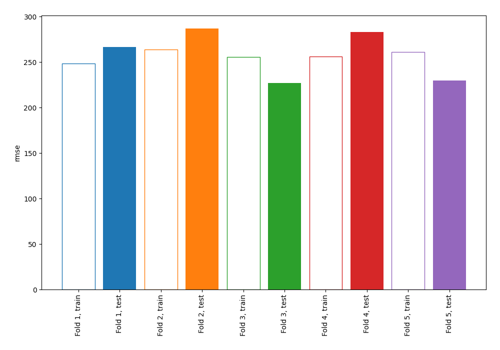
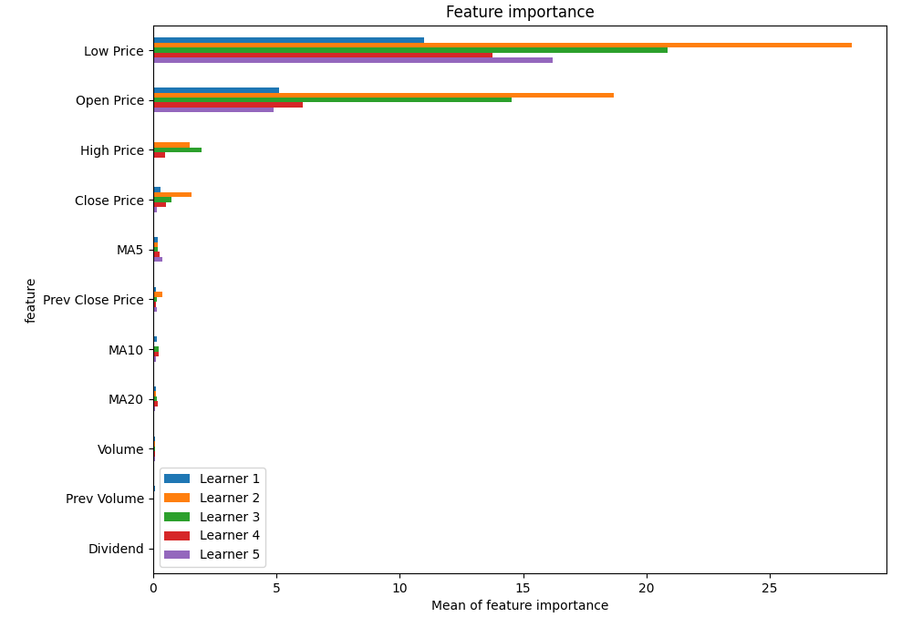
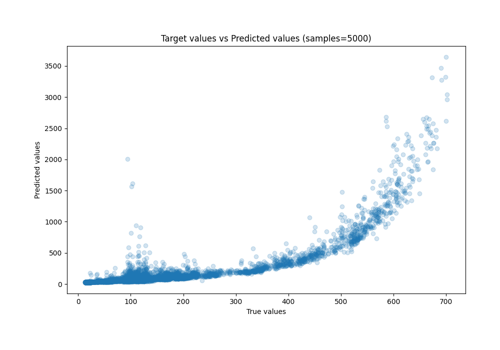
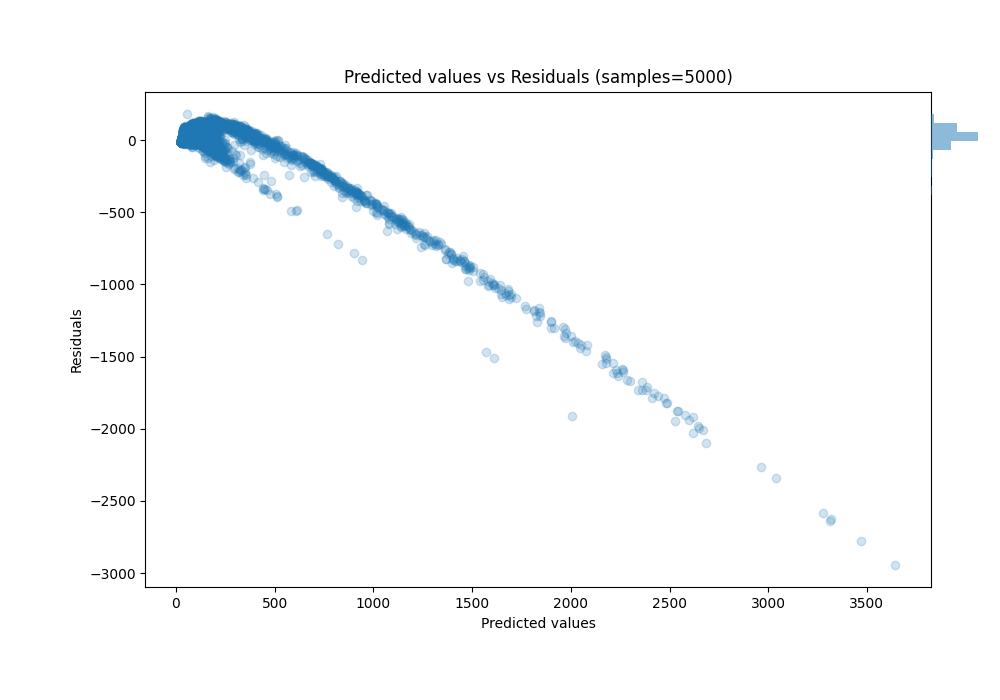

# Summary of 1_Linear

[<< Go back](../README.md)

## Linear Regression (Linear)
- **n_jobs**: -1
- **explain_level**: 1

## Validation
 - **validation_type**: kfold
 - **k_folds**: 5
 - **shuffle**: True

## Optimized metric
rmse

## Training time

20.5 seconds

### Metric details:
| Metric   |        Score |
|:---------|-------------:|
| MAE      |    98.2603   |
| MSE      | 67621        |
| RMSE     |   260.04     |
| R2       |    -1.61774  |
| MAPE     |     0.454851 |

## Learning curves

## Coefficients
| feature          |    Learner_1 |   Learner_2 |    Learner_3 |   Learner_4 |    Learner_5 |
|:-----------------|-------------:|------------:|-------------:|------------:|-------------:|
| Low Price        |  2.37463     |  3.61055    |  3.24198     |  2.57091    |  2.93393     |
| High Price       | -0.176859    |  0.847964   |  0.98878     |  0.489109   | -0.132984    |
| Prev Close Price |  0.220256    |  0.435285   |  0.269089    |  0.239486   |  0.27865     |
| MA10             |  0.256643    |  0.130188   |  0.314613    |  0.331607   |  0.257008    |
| Volume           |  0.176984    |  0.186859   |  0.18904     |  0.195659   |  0.196898    |
| Prev Volume      |  0.183164    |  0.170658   |  0.170497    |  0.165957   |  0.164135    |
| intercept        |  0.000513348 |  0.00049476 |  0.000189369 |  0.00018493 |  0.000458932 |
| Dividend         | -0.0645067   | -0.0707607  | -0.0314385   | -0.0250936  | -0.0589216   |
| MA20             | -0.261839    | -0.217269   | -0.300687    | -0.279481   | -0.21392     |
| MA5              | -0.335126    | -0.279424   | -0.339639    | -0.357502   | -0.437233    |
| Close Price      |  0.37397     | -0.82502    | -0.637104    | -0.492095   | -0.285912    |
| Open Price       | -1.64025     | -2.89623    | -2.73285     | -1.6917     | -1.59436     |

## Permutation-based Importance

## True vs Predicted

## Predicted vs Residuals

[<< Go back](../README.md)
