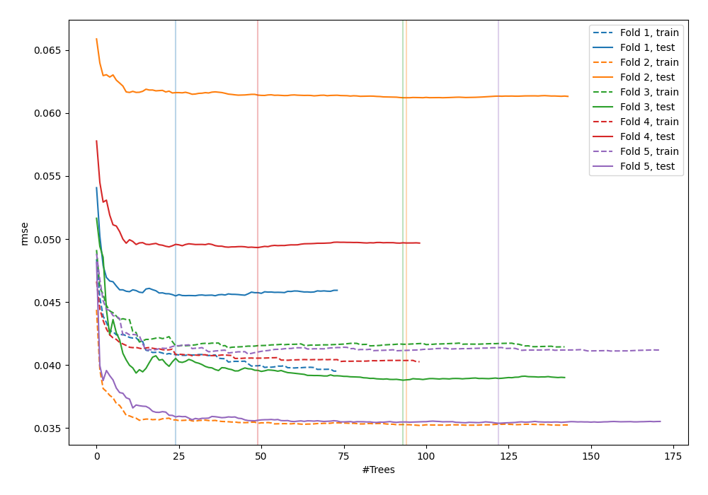
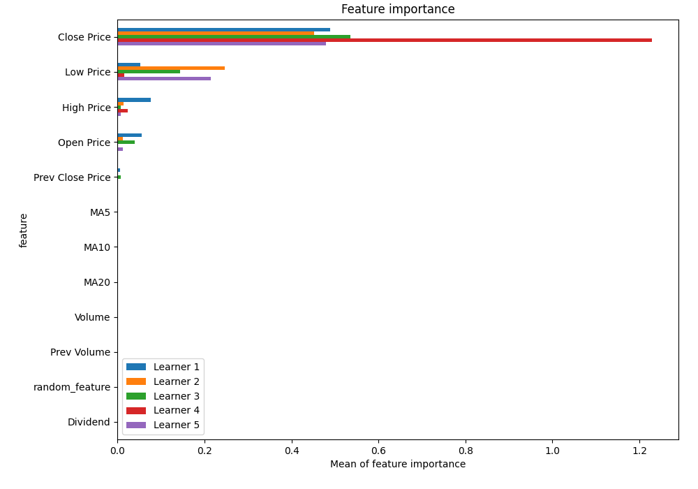
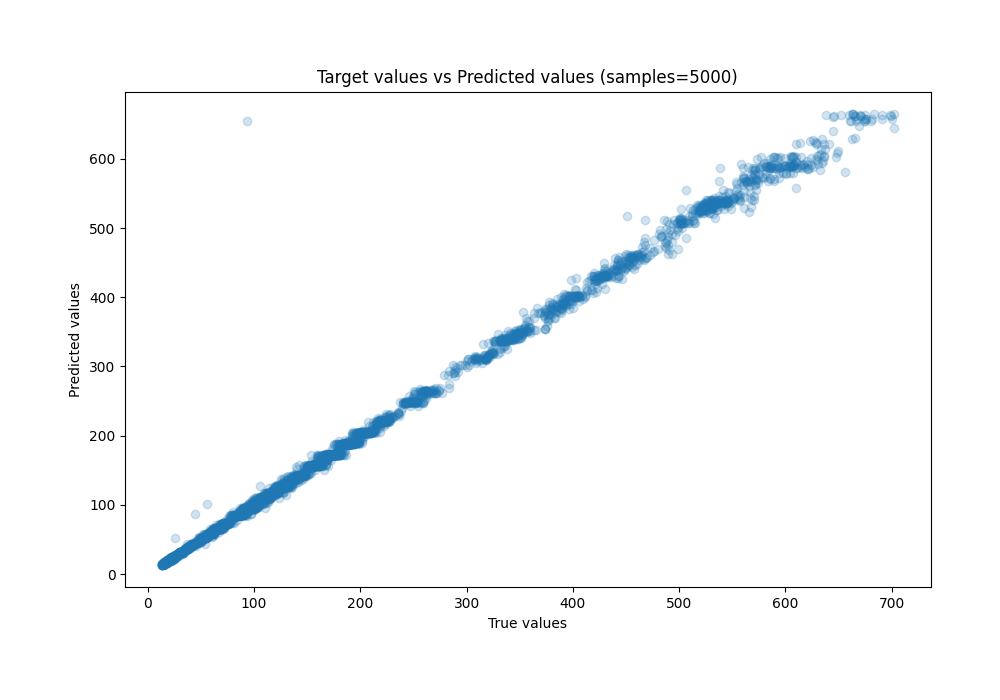
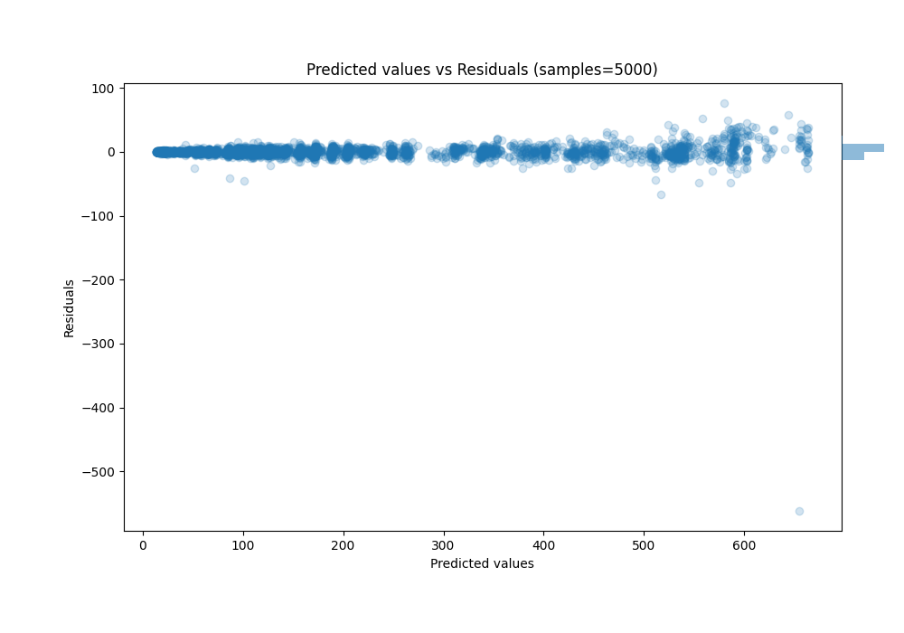

# Summary of 21_RandomForest_RandomFeature

[<< Go back](../README.md)

## Random Forest
- **n_jobs**: -1
- **criterion**: squared_error
- **max_features**: 1.0
- **min_samples_split**: 40
- **max_depth**: 6
- **eval_metric_name**: rmse
- **explain_level**: 1

## Validation
 - **validation_type**: kfold
 - **k_folds**: 5
 - **shuffle**: True

## Optimized metric
rmse

## Training time

44.7 seconds

### Metric details:
| Metric   |       Score |
|:---------|------------:|
| MAE      |   3.43655   |
| MSE      | 100.53      |
| RMSE     |  10.0265    |
| R2       |   0.996108  |
| MAPE     |   0.0230557 |

## Learning curves

## Permutation-based Importance

## True vs Predicted

## Predicted vs Residuals

[<< Go back](../README.md)
