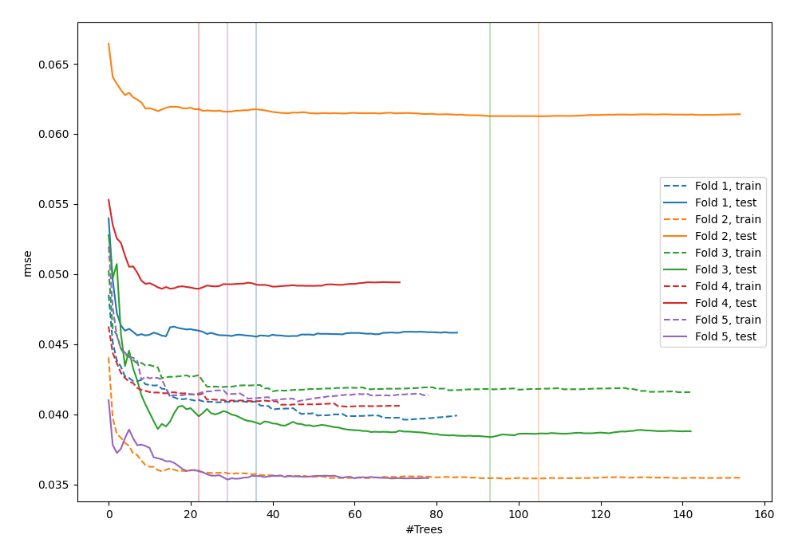
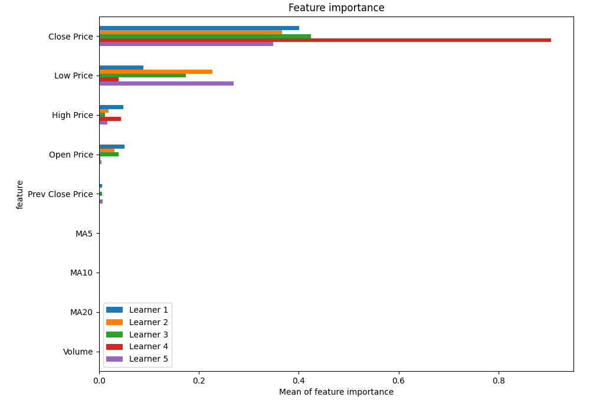
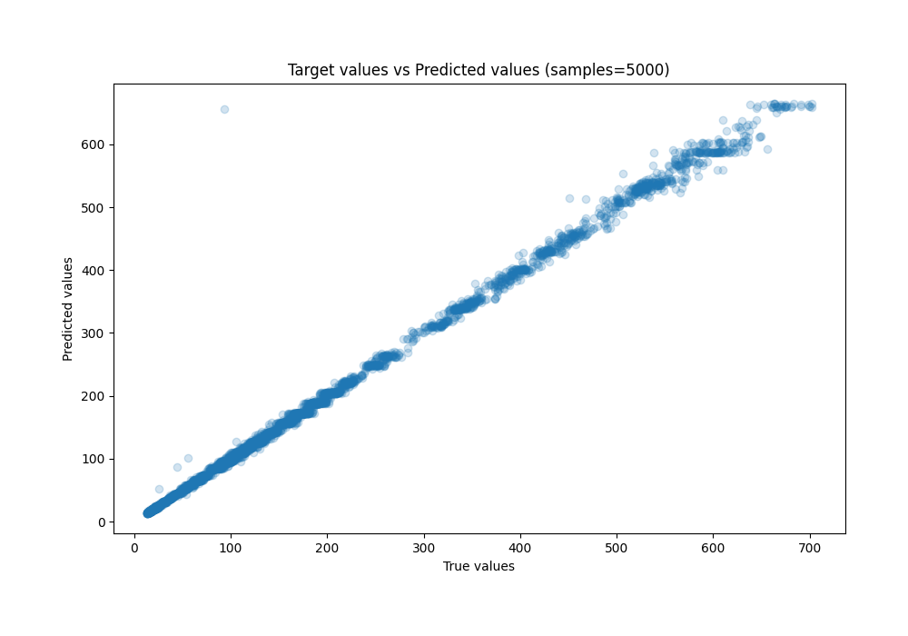
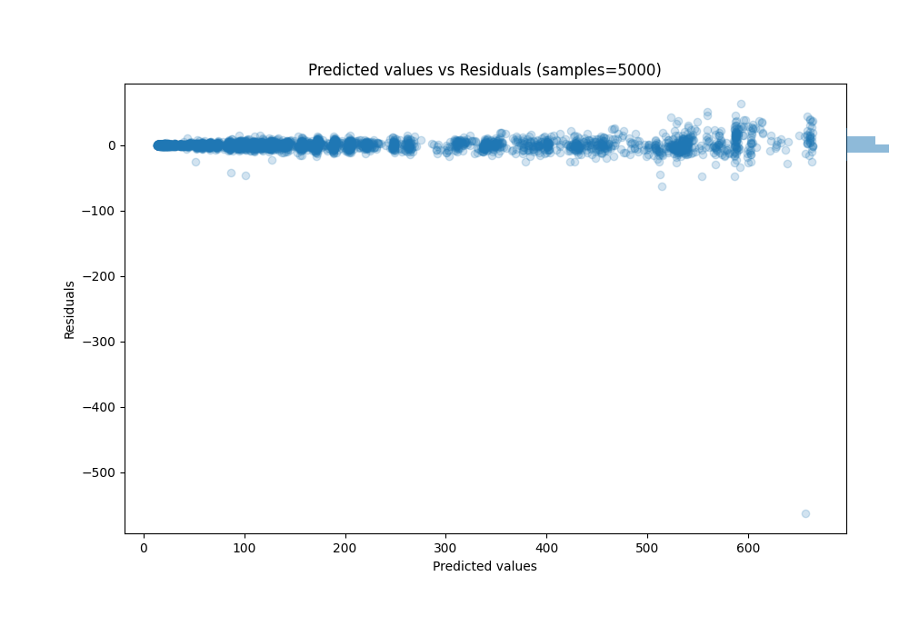

# Summary of 29_RandomForest_SelectedFeatures

[<< Go back](../README.md)

## Random Forest
- **n_jobs**: -1
- **criterion**: squared_error
- **max_features**: 0.9
- **min_samples_split**: 40
- **max_depth**: 6
- **eval_metric_name**: rmse
- **explain_level**: 1

## Validation
 - **validation_type**: kfold
 - **k_folds**: 5
 - **shuffle**: True

## Optimized metric
rmse

## Training time

28.8 seconds

### Metric details:
| Metric   |      Score |
|:---------|-----------:|
| MAE      |  3.39483   |
| MSE      | 98.6654    |
| RMSE     |  9.93305   |
| R2       |  0.99618   |
| MAPE     |  0.0229767 |

## Learning curves

## Permutation-based Importance

## True vs Predicted

## Predicted vs Residuals

[<< Go back](../README.md)
