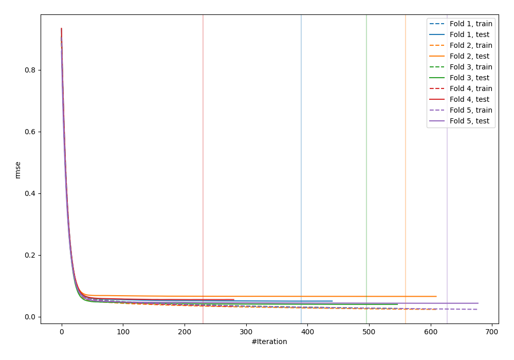
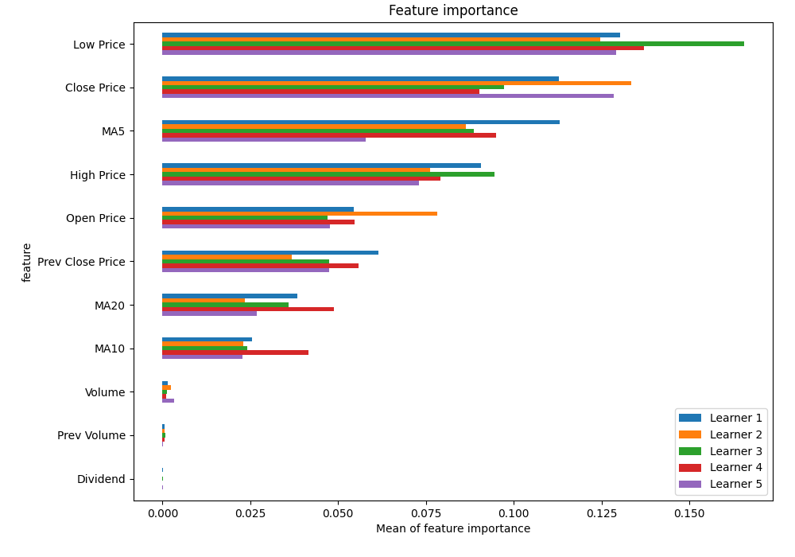
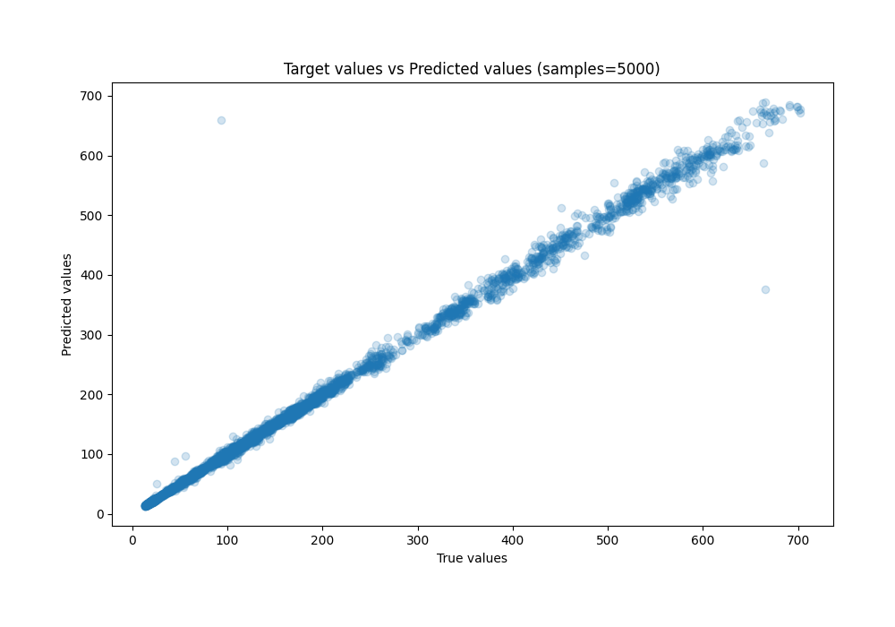
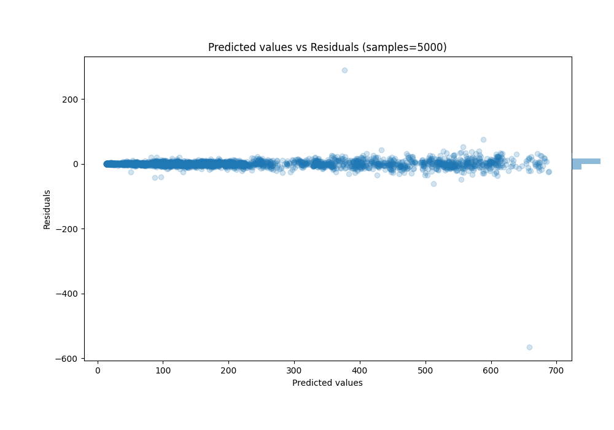

# Summary of 33_CatBoost

[<< Go back](../README.md)

## CatBoost
- **n_jobs**: -1
- **learning_rate**: 0.1
- **depth**: 6
- **rsm**: 1.0
- **loss_function**: RMSE
- **eval_metric**: RMSE
- **explain_level**: 1

## Validation
 - **validation_type**: kfold
 - **k_folds**: 5
 - **shuffle**: True

## Optimized metric
rmse

## Training time

19.1 seconds

### Metric details:
| Metric   |      Score |
|:---------|-----------:|
| MAE      |   3.79602  |
| MSE      | 120.242    |
| RMSE     |  10.9655   |
| R2       |   0.995345 |
| MAPE     |   0.025692 |

## Learning curves

## Permutation-based Importance

## True vs Predicted

## Predicted vs Residuals

[<< Go back](../README.md)
