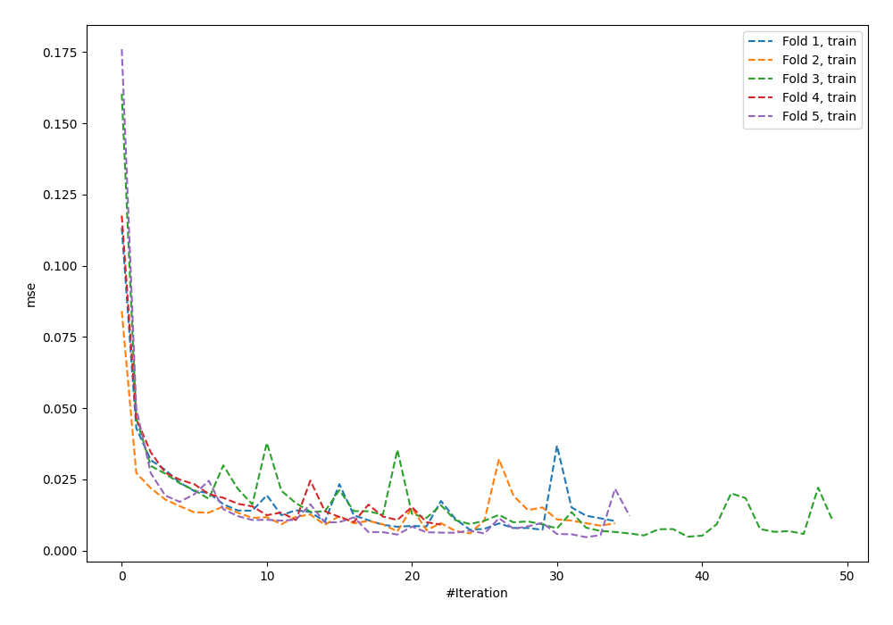
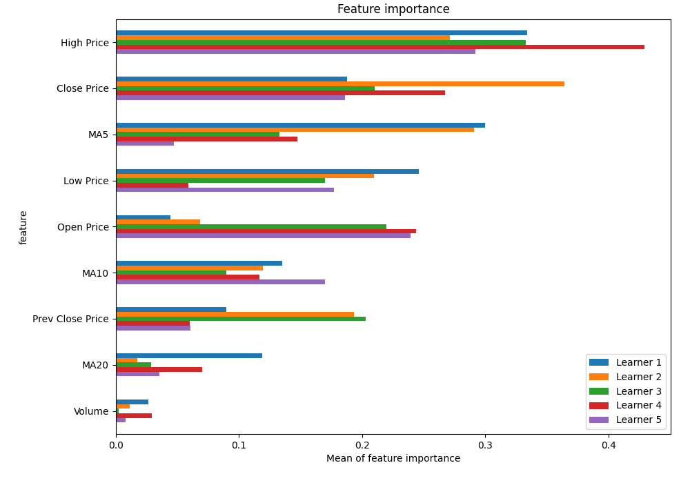
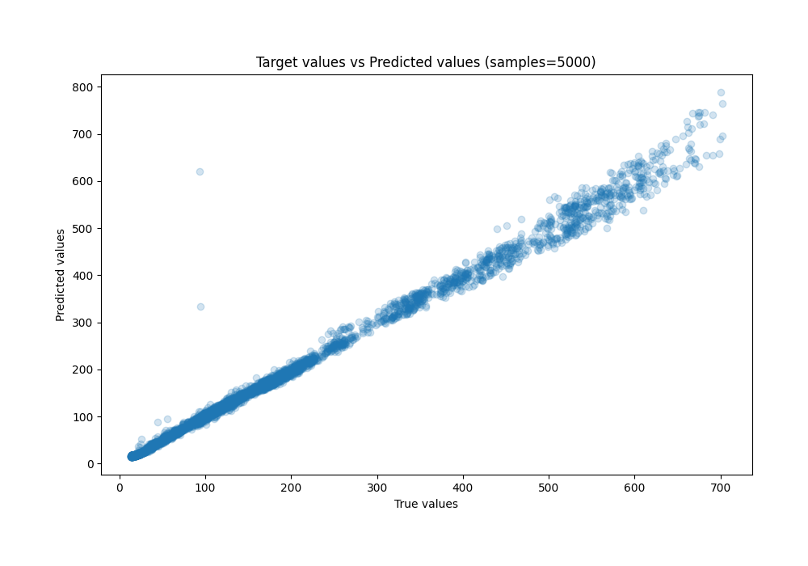
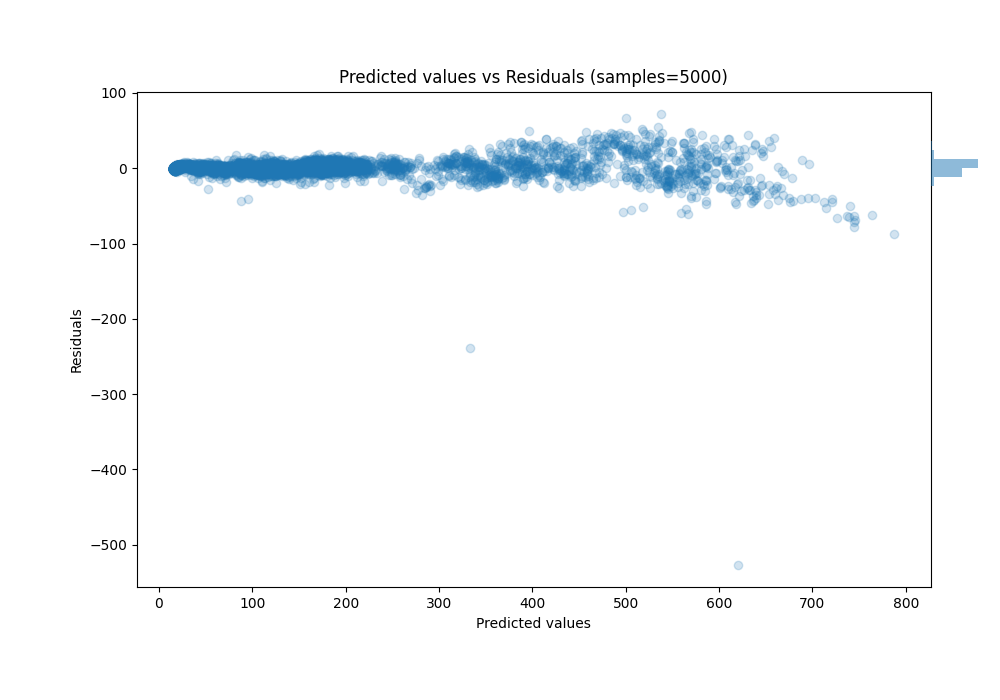

# Summary of 39_NeuralNetwork_SelectedFeatures

[<< Go back](../README.md)

## Neural Network
- **n_jobs**: -1
- **dense_1_size**: 64
- **dense_2_size**: 8
- **learning_rate**: 0.01
- **explain_level**: 1

## Validation
 - **validation_type**: kfold
 - **k_folds**: 5
 - **shuffle**: True

## Optimized metric
rmse

## Training time

3.2 seconds

### Metric details:
| Metric   |       Score |
|:---------|------------:|
| MAE      |   6.05352   |
| MSE      | 173.018     |
| RMSE     |  13.1536    |
| R2       |   0.993302  |
| MAPE     |   0.0476584 |

## Learning curves

## Permutation-based Importance

## True vs Predicted

## Predicted vs Residuals

[<< Go back](../README.md)
