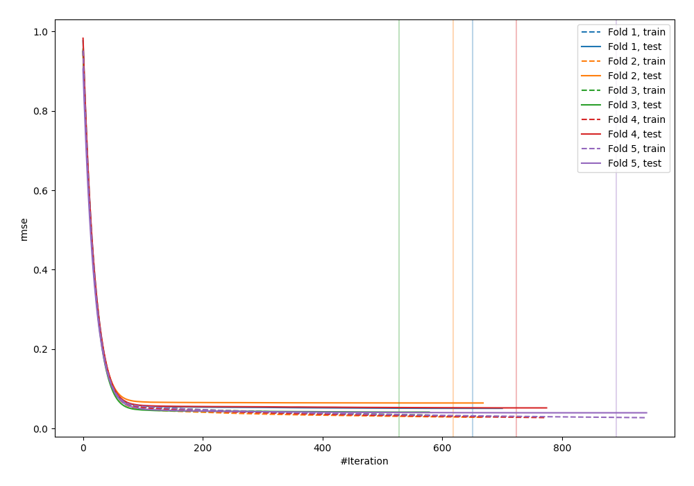
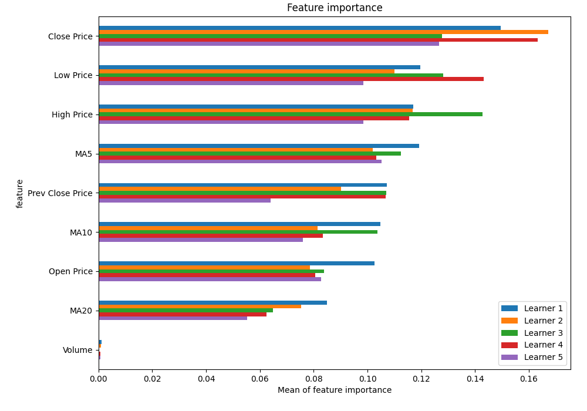
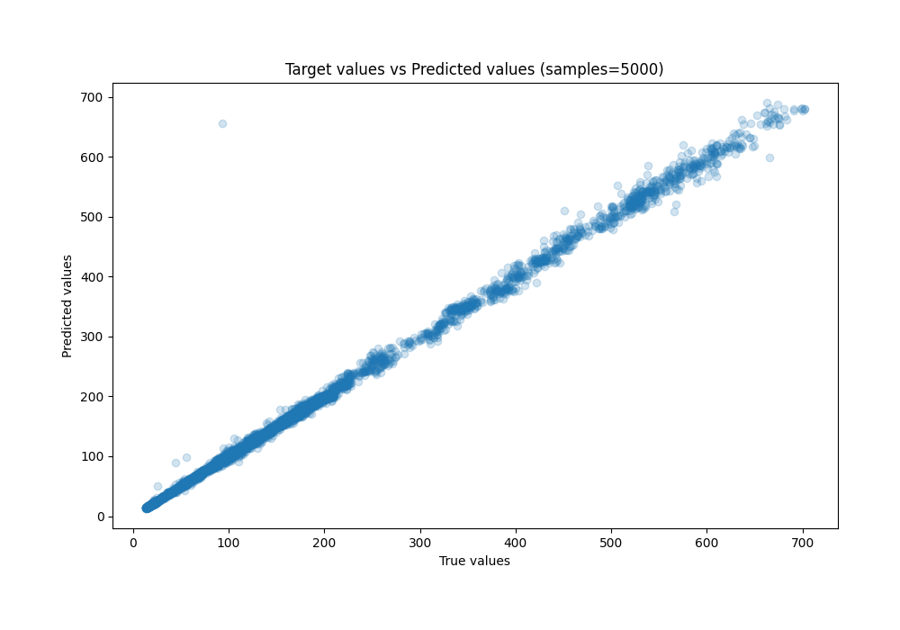
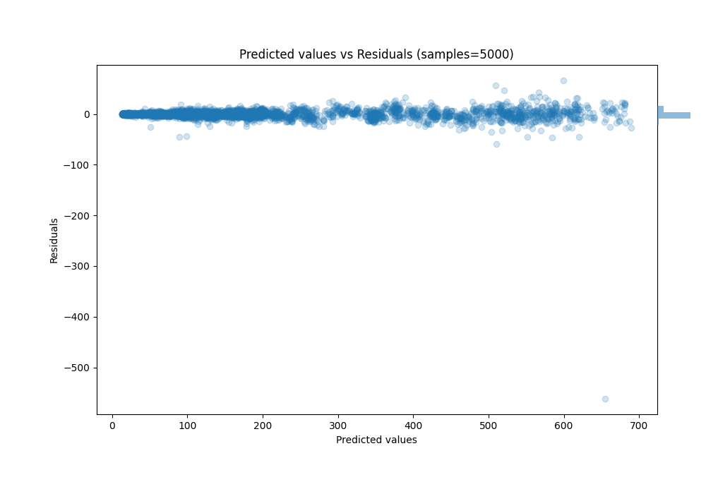

# Summary of 41_CatBoost_SelectedFeatures

[<< Go back](../README.md)

## CatBoost
- **n_jobs**: -1
- **learning_rate**: 0.05
- **depth**: 7
- **rsm**: 1.0
- **loss_function**: RMSE
- **eval_metric**: RMSE
- **explain_level**: 1

## Validation
 - **validation_type**: kfold
 - **k_folds**: 5
 - **shuffle**: True

## Optimized metric
rmse

## Training time

13.3 seconds

### Metric details:
| Metric   |      Score |
|:---------|-----------:|
| MAE      |  3.62745   |
| MSE      | 99.8396    |
| RMSE     |  9.99198   |
| R2       |  0.996135  |
| MAPE     |  0.0248238 |

## Learning curves

## Permutation-based Importance

## True vs Predicted

## Predicted vs Residuals

[<< Go back](../README.md)
