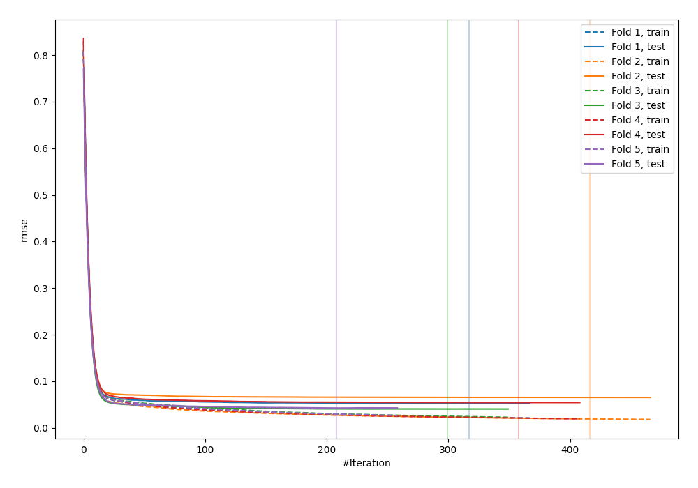
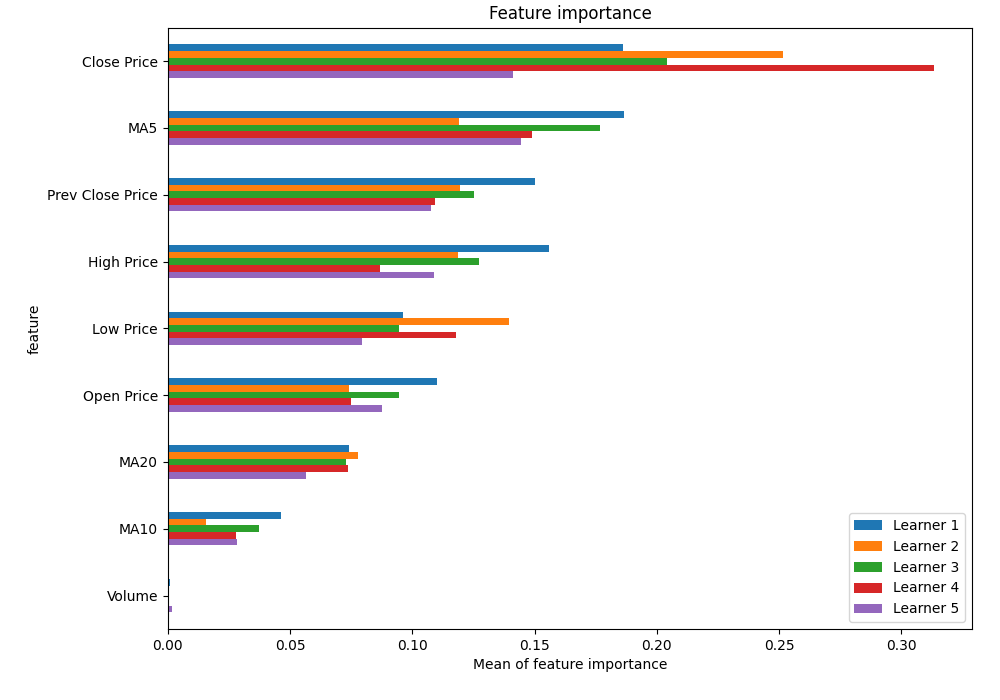
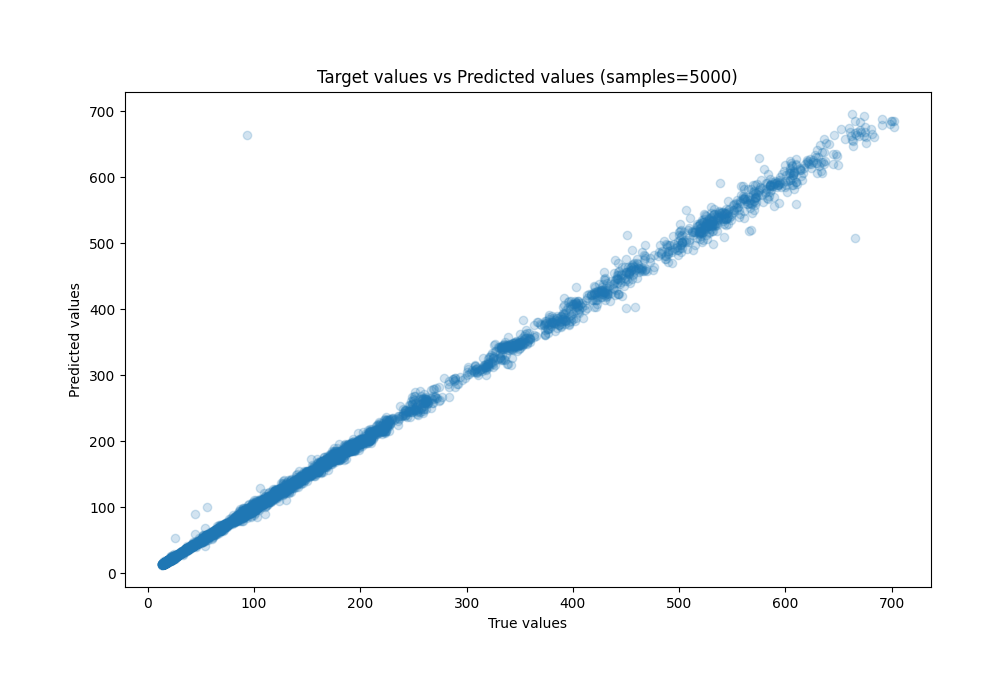
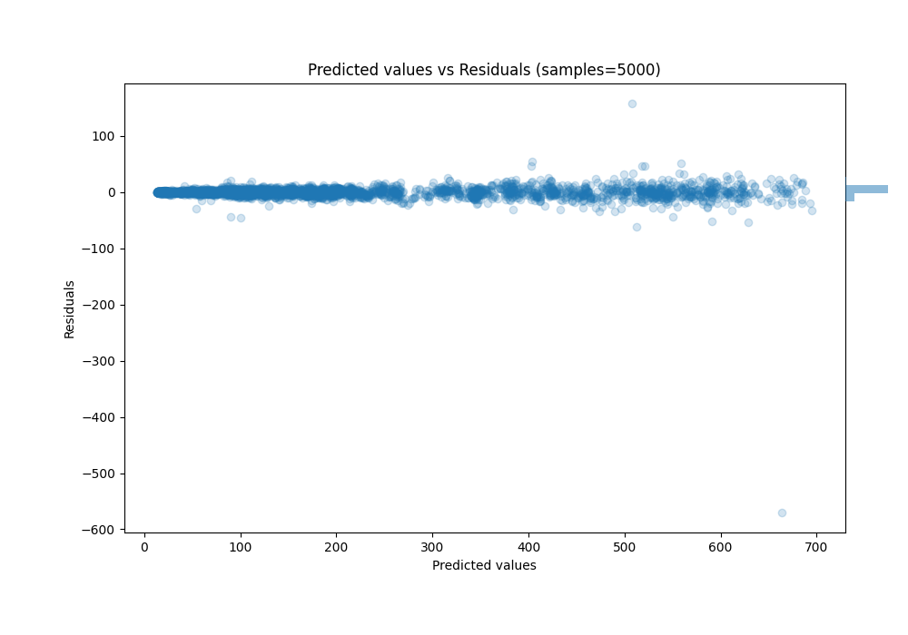

# Summary of 42_CatBoost_SelectedFeatures

[<< Go back](../README.md)

## CatBoost
- **n_jobs**: -1
- **learning_rate**: 0.2
- **depth**: 7
- **rsm**: 1.0
- **loss_function**: RMSE
- **eval_metric**: RMSE
- **explain_level**: 1

## Validation
 - **validation_type**: kfold
 - **k_folds**: 5
 - **shuffle**: True

## Optimized metric
rmse

## Training time

7.4 seconds

### Metric details:
| Metric   |       Score |
|:---------|------------:|
| MAE      |   3.47349   |
| MSE      | 103.97      |
| RMSE     |  10.1966    |
| R2       |   0.995975  |
| MAPE     |   0.0243038 |

## Learning curves

## Permutation-based Importance

## True vs Predicted

## Predicted vs Residuals

[<< Go back](../README.md)
