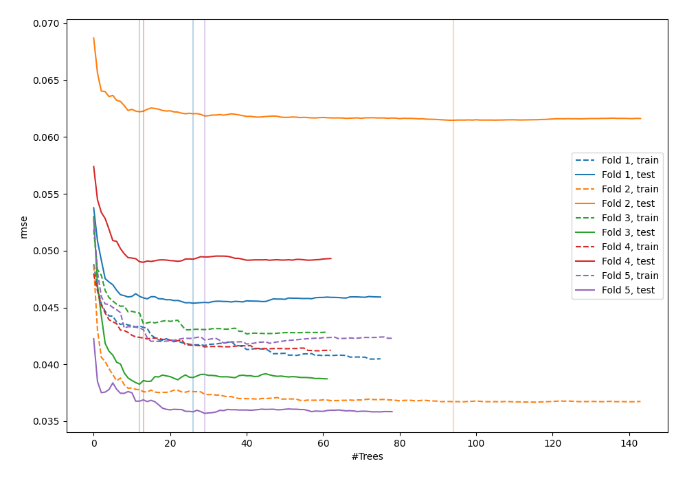
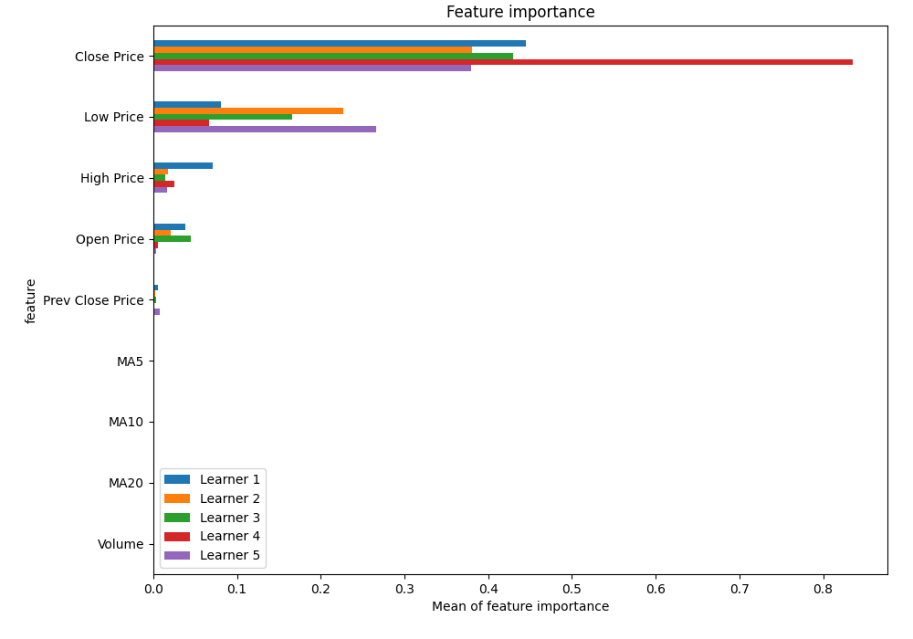
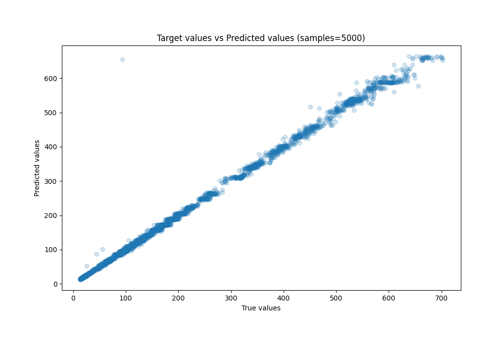
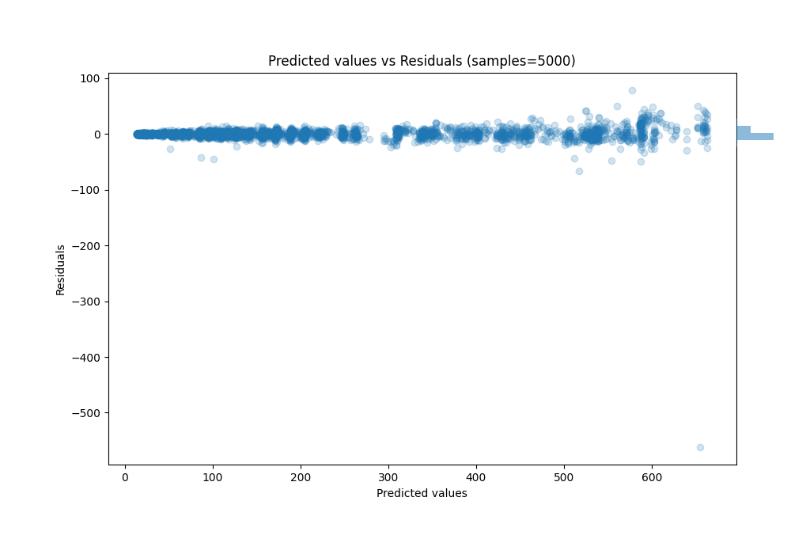

# Summary of 46_RandomForest_SelectedFeatures

[<< Go back](../README.md)

## Random Forest
- **n_jobs**: -1
- **criterion**: squared_error
- **max_features**: 0.9
- **min_samples_split**: 50
- **max_depth**: 6
- **eval_metric_name**: rmse
- **explain_level**: 1

## Validation
 - **validation_type**: kfold
 - **k_folds**: 5
 - **shuffle**: True

## Optimized metric
rmse

## Training time

5.0 seconds

### Metric details:
| Metric   |      Score |
|:---------|-----------:|
| MAE      |  3.47346   |
| MSE      | 99.9494    |
| RMSE     |  9.99747   |
| R2       |  0.996131  |
| MAPE     |  0.0233963 |

## Learning curves

## Permutation-based Importance

## True vs Predicted

## Predicted vs Residuals

[<< Go back](../README.md)
