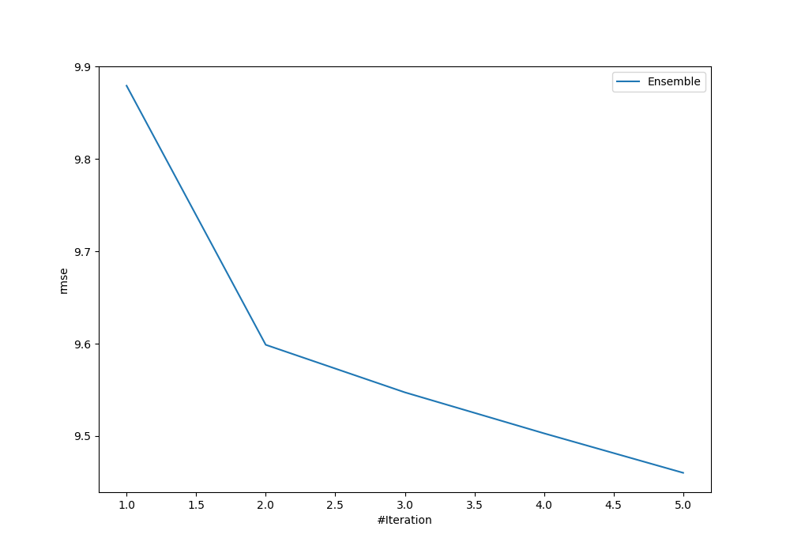
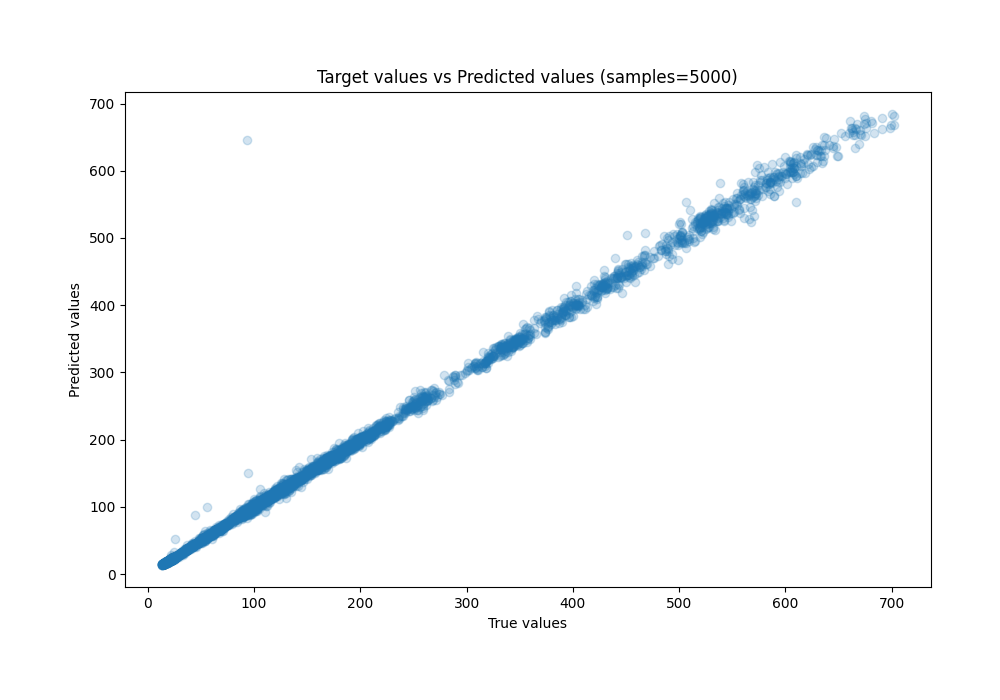
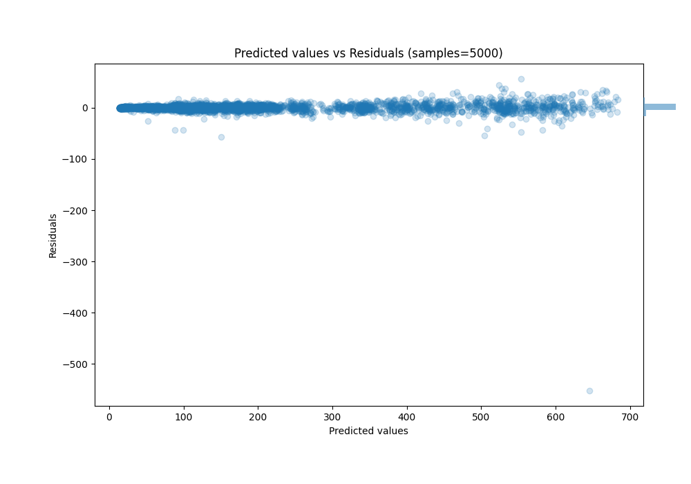

# Summary of Ensemble

[<< Go back](../README.md)

## Ensemble structure
| Model                             |   Weight |
|:----------------------------------|---------:|
| 17_CatBoost_SelectedFeatures      |        1 |
| 18_CatBoost                       |        1 |
| 35_Xgboost_SelectedFeatures       |        1 |
| 39_NeuralNetwork_SelectedFeatures |        1 |
| 45_RandomForest_SelectedFeatures  |        1 |

### Metric details:
| Metric   |      Score |
|:---------|-----------:|
| MAE      |  3.11522   |
| MSE      | 89.4962    |
| RMSE     |  9.46024   |
| R2       |  0.996535  |
| MAPE     |  0.0231021 |

## Learning curves

## True vs Predicted

## Predicted vs Residuals

[<< Go back](../README.md)
