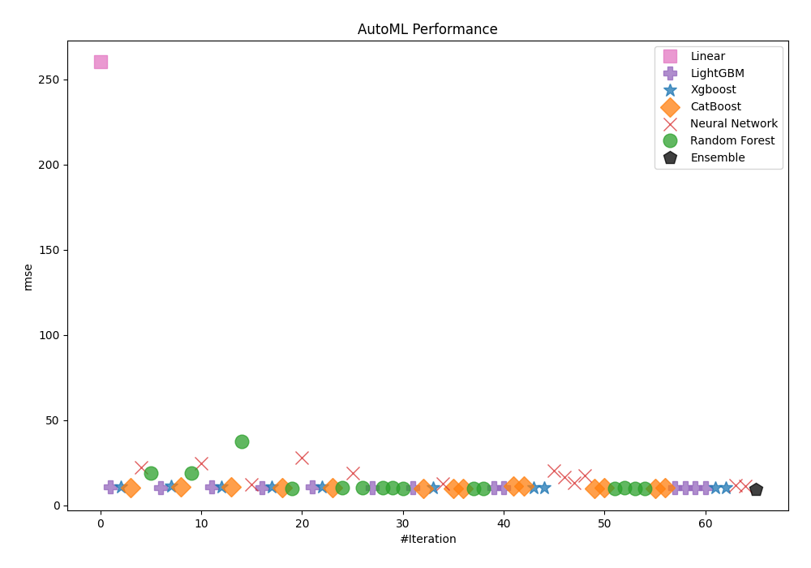
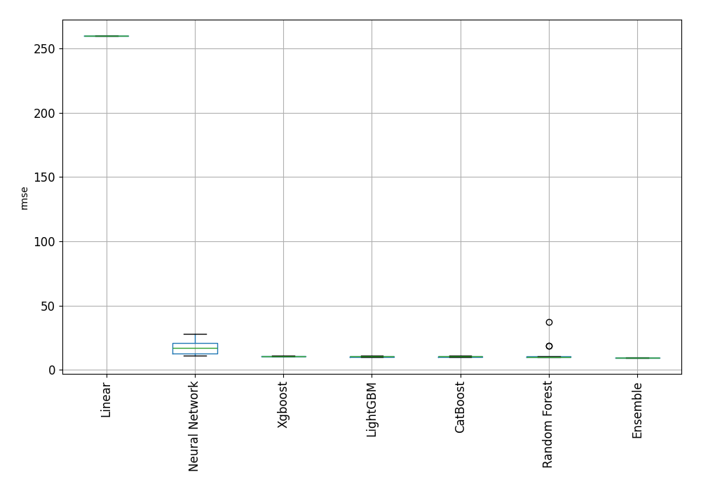
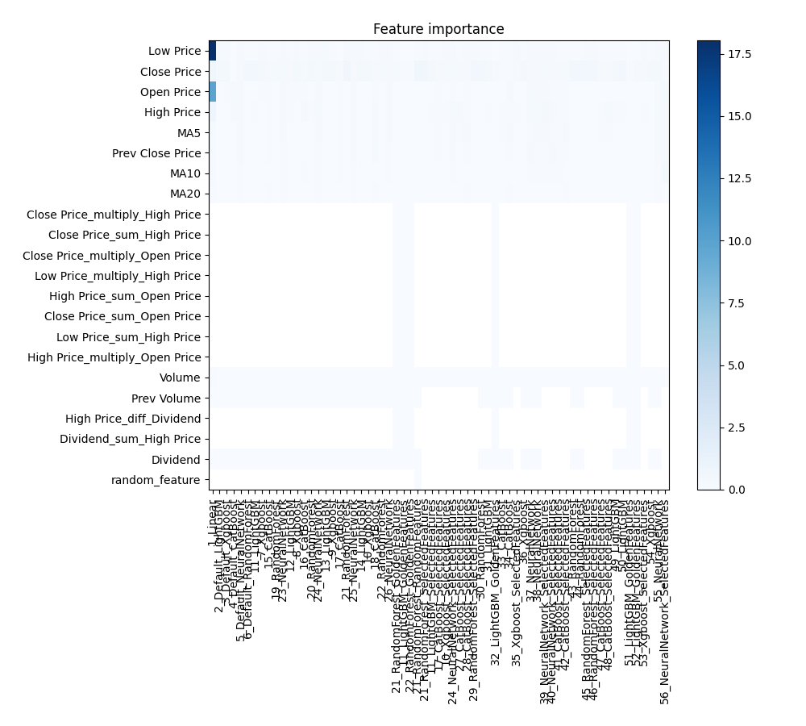
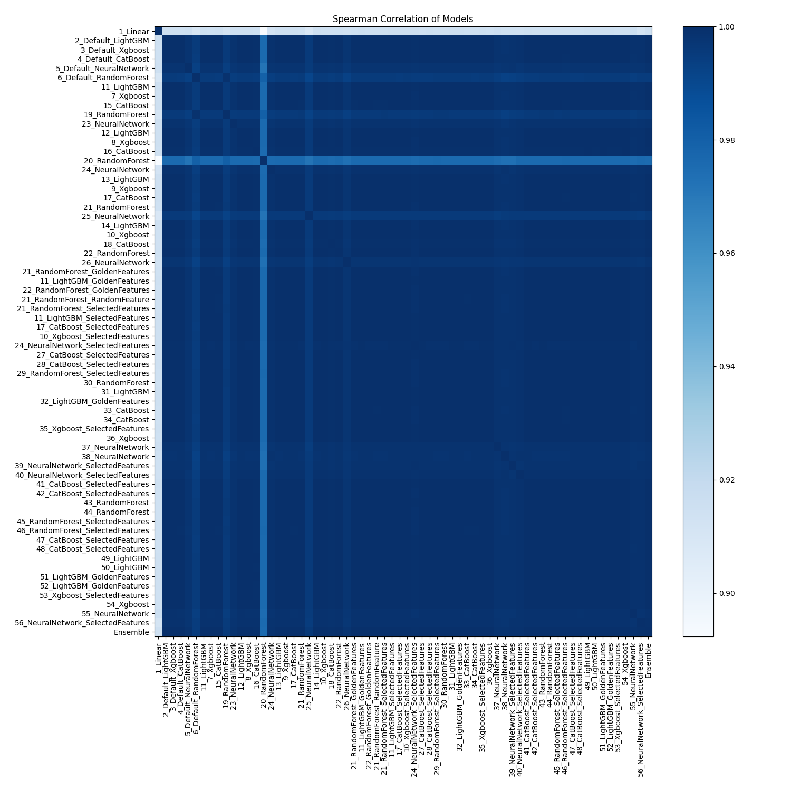

# AutoML Leaderboard

| Best model   | name                                                                             | model_type     | metric_type   |   metric_value |   train_time |   single_prediction_time |
|:-------------|:---------------------------------------------------------------------------------|:---------------|:--------------|---------------:|-------------:|-------------------------:|
|              | [1_Linear](1_Linear/README.md)                                                   | Linear         | rmse          |      260.04    |        22.54 |                   0.1943 |
|              | [2_Default_LightGBM](2_Default_LightGBM/README.md)                               | LightGBM       | rmse          |       10.5437  |        12.45 |                   0.0805 |
|              | [3_Default_Xgboost](3_Default_Xgboost/README.md)                                 | Xgboost        | rmse          |       10.7536  |        10.03 |                   0.1162 |
|              | [4_Default_CatBoost](4_Default_CatBoost/README.md)                               | CatBoost       | rmse          |       10.3175  |        18.43 |                   0.3575 |
|              | [5_Default_NeuralNetwork](5_Default_NeuralNetwork/README.md)                     | Neural Network | rmse          |       21.9423  |         9.64 |                   0.2416 |
|              | [6_Default_RandomForest](6_Default_RandomForest/README.md)                       | Random Forest  | rmse          |       18.8967  |         8.04 |                   0.1352 |
|              | [11_LightGBM](11_LightGBM/README.md)                                             | LightGBM       | rmse          |       10.1137  |         2.36 |                   0.0326 |
|              | [7_Xgboost](7_Xgboost/README.md)                                                 | Xgboost        | rmse          |       10.9737  |         3.31 |                   0.0517 |
|              | [15_CatBoost](15_CatBoost/README.md)                                             | CatBoost       | rmse          |       10.5058  |        41.86 |                   0.156  |
|              | [19_RandomForest](19_RandomForest/README.md)                                     | Random Forest  | rmse          |       18.8407  |        23.22 |                   0.3254 |
|              | [23_NeuralNetwork](23_NeuralNetwork/README.md)                                   | Neural Network | rmse          |       24.7405  |         9.65 |                   0.2522 |
|              | [12_LightGBM](12_LightGBM/README.md)                                             | LightGBM       | rmse          |       10.7146  |         7.24 |                   0.0815 |
|              | [8_Xgboost](8_Xgboost/README.md)                                                 | Xgboost        | rmse          |       10.6109  |         8.3  |                   0.0993 |
|              | [16_CatBoost](16_CatBoost/README.md)                                             | CatBoost       | rmse          |       10.4854  |        35.73 |                   0.1299 |
|              | [20_RandomForest](20_RandomForest/README.md)                                     | Random Forest  | rmse          |       37.1472  |        17.2  |                   0.2241 |
|              | [24_NeuralNetwork](24_NeuralNetwork/README.md)                                   | Neural Network | rmse          |       12.2002  |        10.52 |                   0.2131 |
|              | [13_LightGBM](13_LightGBM/README.md)                                             | LightGBM       | rmse          |       10.402   |        13.11 |                   0.0839 |
|              | [9_Xgboost](9_Xgboost/README.md)                                                 | Xgboost        | rmse          |       10.6144  |         7.03 |                   0.1359 |
|              | [17_CatBoost](17_CatBoost/README.md)                                             | CatBoost       | rmse          |       10.2708  |        34.52 |                   0.0909 |
|              | [21_RandomForest](21_RandomForest/README.md)                                     | Random Forest  | rmse          |        9.96548 |        22.69 |                   0.2353 |
|              | [25_NeuralNetwork](25_NeuralNetwork/README.md)                                   | Neural Network | rmse          |       27.9553  |        10.82 |                   0.2677 |
|              | [14_LightGBM](14_LightGBM/README.md)                                             | LightGBM       | rmse          |       10.5557  |        29.37 |                   0.0863 |
|              | [10_Xgboost](10_Xgboost/README.md)                                               | Xgboost        | rmse          |       10.5079  |         7.03 |                   0.1672 |
|              | [18_CatBoost](18_CatBoost/README.md)                                             | CatBoost       | rmse          |       10.3835  |        34.06 |                   0.124  |
|              | [22_RandomForest](22_RandomForest/README.md)                                     | Random Forest  | rmse          |       10.1885  |        21.95 |                   0.3932 |
|              | [26_NeuralNetwork](26_NeuralNetwork/README.md)                                   | Neural Network | rmse          |       18.9998  |        13.12 |                   0.291  |
|              | [21_RandomForest_GoldenFeatures](21_RandomForest_GoldenFeatures/README.md)       | Random Forest  | rmse          |       10.2207  |        70.49 |                   0.6548 |
|              | [11_LightGBM_GoldenFeatures](11_LightGBM_GoldenFeatures/README.md)               | LightGBM       | rmse          |       10.1593  |        19    |                   0.3156 |
|              | [22_RandomForest_GoldenFeatures](22_RandomForest_GoldenFeatures/README.md)       | Random Forest  | rmse          |       10.2518  |        52.19 |                   0.645  |
|              | [21_RandomForest_RandomFeature](21_RandomForest_RandomFeature/README.md)         | Random Forest  | rmse          |       10.0265  |        48.13 |                   0.4818 |
|              | [21_RandomForest_SelectedFeatures](21_RandomForest_SelectedFeatures/README.md)   | Random Forest  | rmse          |        9.95278 |        35.98 |                   0.3298 |
|              | [11_LightGBM_SelectedFeatures](11_LightGBM_SelectedFeatures/README.md)           | LightGBM       | rmse          |       10.1832  |        13.41 |                   0.1569 |
|              | [17_CatBoost_SelectedFeatures](17_CatBoost_SelectedFeatures/README.md)           | CatBoost       | rmse          |        9.90679 |        42.16 |                   0.0495 |
|              | [10_Xgboost_SelectedFeatures](10_Xgboost_SelectedFeatures/README.md)             | Xgboost        | rmse          |       10.4118  |         6    |                   0.046  |
|              | [24_NeuralNetwork_SelectedFeatures](24_NeuralNetwork_SelectedFeatures/README.md) | Neural Network | rmse          |       12.7304  |        18.2  |                   0.1874 |
|              | [27_CatBoost_SelectedFeatures](27_CatBoost_SelectedFeatures/README.md)           | CatBoost       | rmse          |        9.95084 |        13.67 |                   0.0394 |
|              | [28_CatBoost_SelectedFeatures](28_CatBoost_SelectedFeatures/README.md)           | CatBoost       | rmse          |        9.98515 |        34.42 |                   0.1209 |
|              | [29_RandomForest_SelectedFeatures](29_RandomForest_SelectedFeatures/README.md)   | Random Forest  | rmse          |        9.93305 |        31.25 |                   0.331  |
|              | [30_RandomForest](30_RandomForest/README.md)                                     | Random Forest  | rmse          |        9.91581 |        22.87 |                   0.3081 |
|              | [31_LightGBM](31_LightGBM/README.md)                                             | LightGBM       | rmse          |       10.235   |        14.9  |                   0.0805 |
|              | [32_LightGBM_GoldenFeatures](32_LightGBM_GoldenFeatures/README.md)               | LightGBM       | rmse          |       10.3084  |        12.02 |                   0.1436 |
|              | [33_CatBoost](33_CatBoost/README.md)                                             | CatBoost       | rmse          |       10.9655  |        21.66 |                   0.1599 |
|              | [34_CatBoost](34_CatBoost/README.md)                                             | CatBoost       | rmse          |       10.9915  |        37.74 |                   0.1076 |
|              | [35_Xgboost_SelectedFeatures](35_Xgboost_SelectedFeatures/README.md)             | Xgboost        | rmse          |       10.216   |        10.31 |                   0.1174 |
|              | [36_Xgboost](36_Xgboost/README.md)                                               | Xgboost        | rmse          |       10.3268  |        11.44 |                   0.0944 |
|              | [37_NeuralNetwork](37_NeuralNetwork/README.md)                                   | Neural Network | rmse          |       20.1765  |        15.78 |                   0.1814 |
|              | [38_NeuralNetwork](38_NeuralNetwork/README.md)                                   | Neural Network | rmse          |       16.5218  |        16    |                   0.3364 |
|              | [39_NeuralNetwork_SelectedFeatures](39_NeuralNetwork_SelectedFeatures/README.md) | Neural Network | rmse          |       13.1536  |         3.74 |                   0.0416 |
|              | [40_NeuralNetwork_SelectedFeatures](40_NeuralNetwork_SelectedFeatures/README.md) | Neural Network | rmse          |       17.3761  |         8.82 |                   0.0484 |
|              | [41_CatBoost_SelectedFeatures](41_CatBoost_SelectedFeatures/README.md)           | CatBoost       | rmse          |        9.99198 |        14.05 |                   0.048  |
|              | [42_CatBoost_SelectedFeatures](42_CatBoost_SelectedFeatures/README.md)           | CatBoost       | rmse          |       10.1966  |         8.02 |                   0.0249 |
|              | [43_RandomForest](43_RandomForest/README.md)                                     | Random Forest  | rmse          |        9.90759 |         6.34 |                   0.1399 |
|              | [44_RandomForest](44_RandomForest/README.md)                                     | Random Forest  | rmse          |       10.0262  |         6.02 |                   0.1798 |
|              | [45_RandomForest_SelectedFeatures](45_RandomForest_SelectedFeatures/README.md)   | Random Forest  | rmse          |        9.87916 |         6.25 |                   0.1541 |
|              | [46_RandomForest_SelectedFeatures](46_RandomForest_SelectedFeatures/README.md)   | Random Forest  | rmse          |        9.99747 |         5.62 |                   0.1557 |
|              | [47_CatBoost_SelectedFeatures](47_CatBoost_SelectedFeatures/README.md)           | CatBoost       | rmse          |        9.98672 |        11    |                   0.0245 |
|              | [48_CatBoost_SelectedFeatures](48_CatBoost_SelectedFeatures/README.md)           | CatBoost       | rmse          |       10.1742  |         6.34 |                   0.0353 |
|              | [49_LightGBM](49_LightGBM/README.md)                                             | LightGBM       | rmse          |       10.1068  |         3.23 |                   0.0247 |
|              | [50_LightGBM](50_LightGBM/README.md)                                             | LightGBM       | rmse          |       10.1938  |         3.23 |                   0.024  |
|              | [51_LightGBM_GoldenFeatures](51_LightGBM_GoldenFeatures/README.md)               | LightGBM       | rmse          |       10.1788  |         3.65 |                   0.0479 |
|              | [52_LightGBM_GoldenFeatures](52_LightGBM_GoldenFeatures/README.md)               | LightGBM       | rmse          |       10.1072  |         3.83 |                   0.0485 |
|              | [53_Xgboost_SelectedFeatures](53_Xgboost_SelectedFeatures/README.md)             | Xgboost        | rmse          |       10.2002  |         3.67 |                   0.0496 |
|              | [54_Xgboost](54_Xgboost/README.md)                                               | Xgboost        | rmse          |       10.3205  |         3.65 |                   0.0647 |
|              | [55_NeuralNetwork](55_NeuralNetwork/README.md)                                   | Neural Network | rmse          |       11.8738  |         4.39 |                   0.0432 |
|              | [56_NeuralNetwork_SelectedFeatures](56_NeuralNetwork_SelectedFeatures/README.md) | Neural Network | rmse          |       11.0301  |         4.31 |                   0.0575 |
| **the best** | [Ensemble](Ensemble/README.md)                                                   | Ensemble       | rmse          |        9.46024 |         0.39 |                   0.2711 |

### AutoML Performance

### AutoML Performance Boxplot

### Features Importance

### Spearman Correlation of Models

