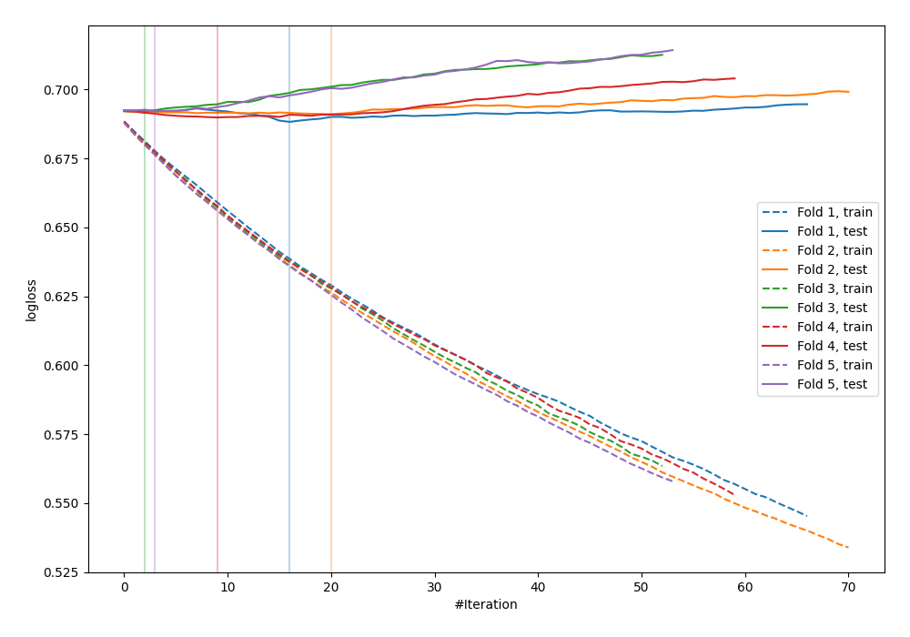
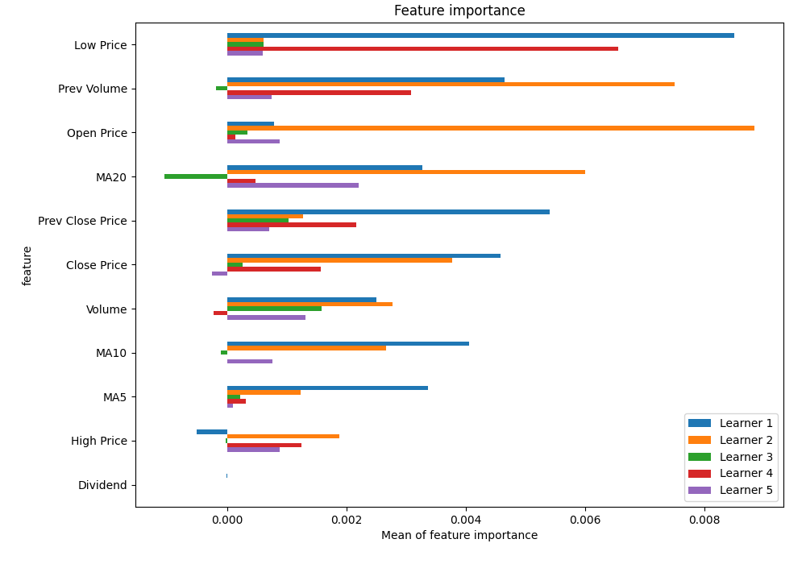
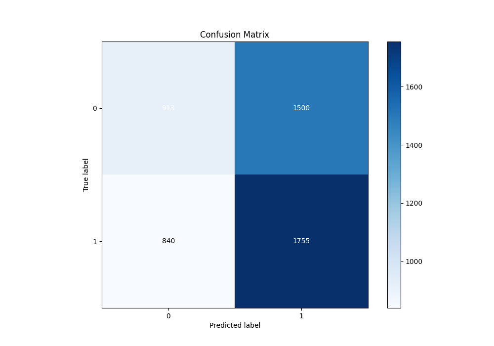
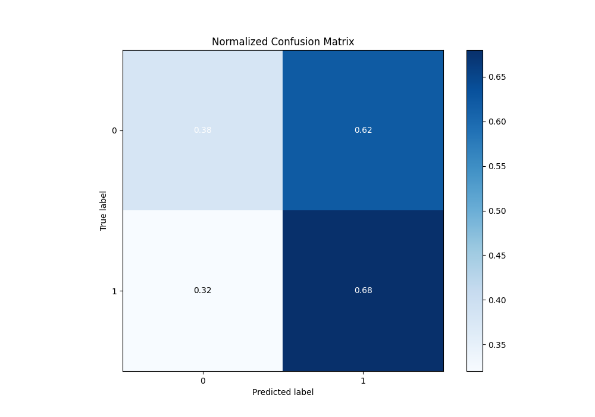
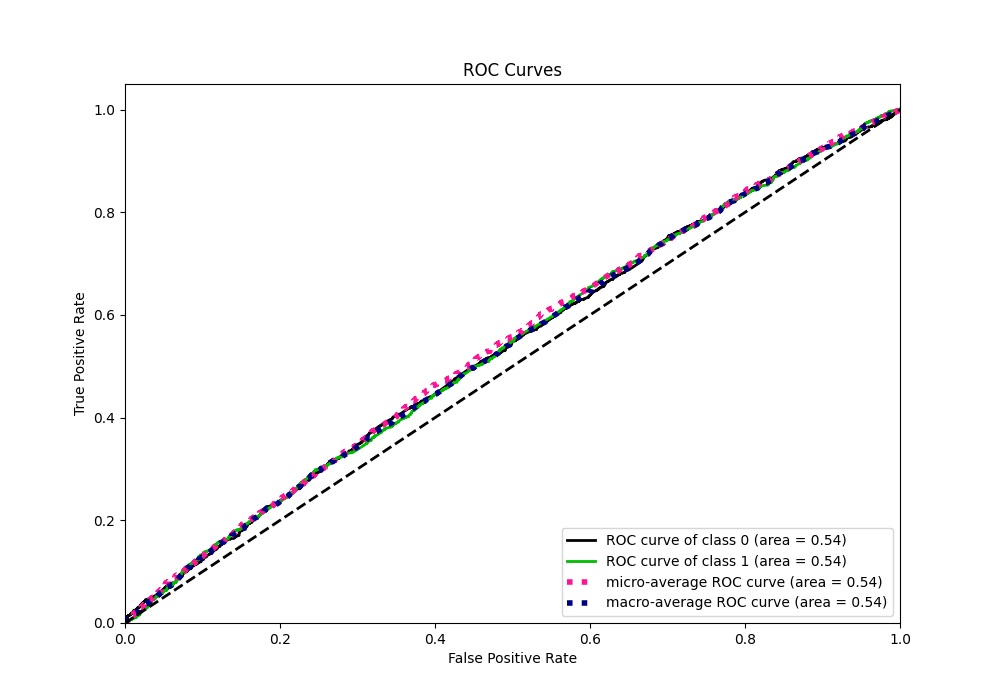
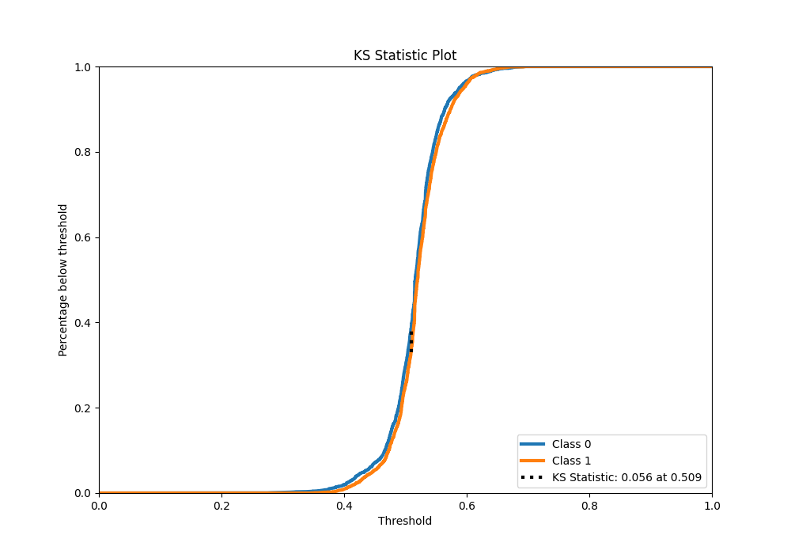
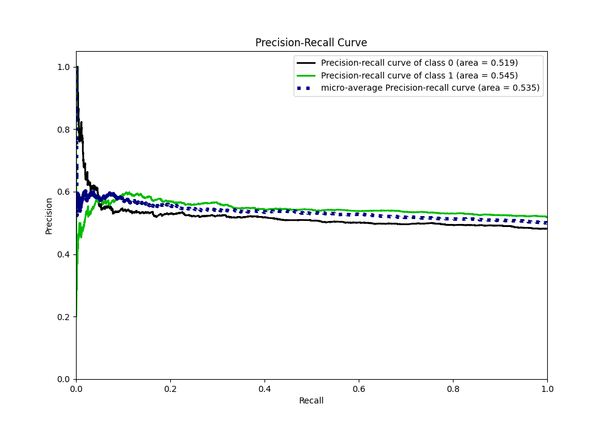
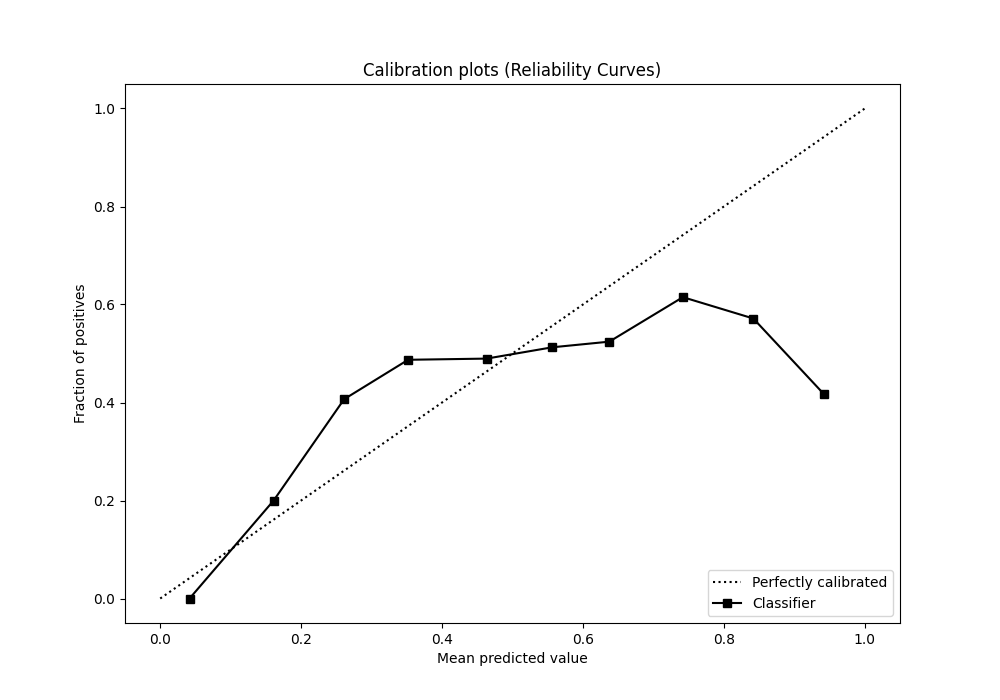
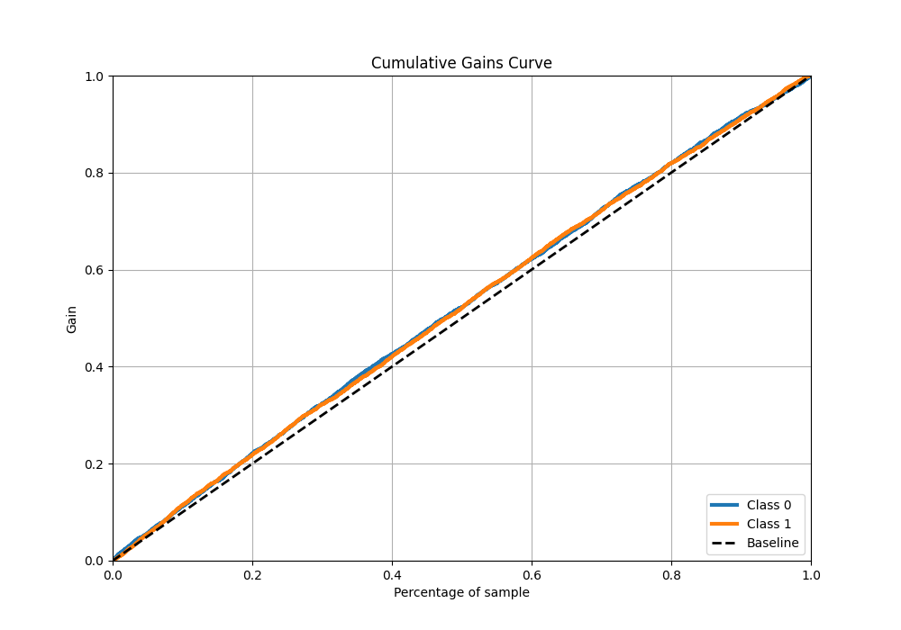
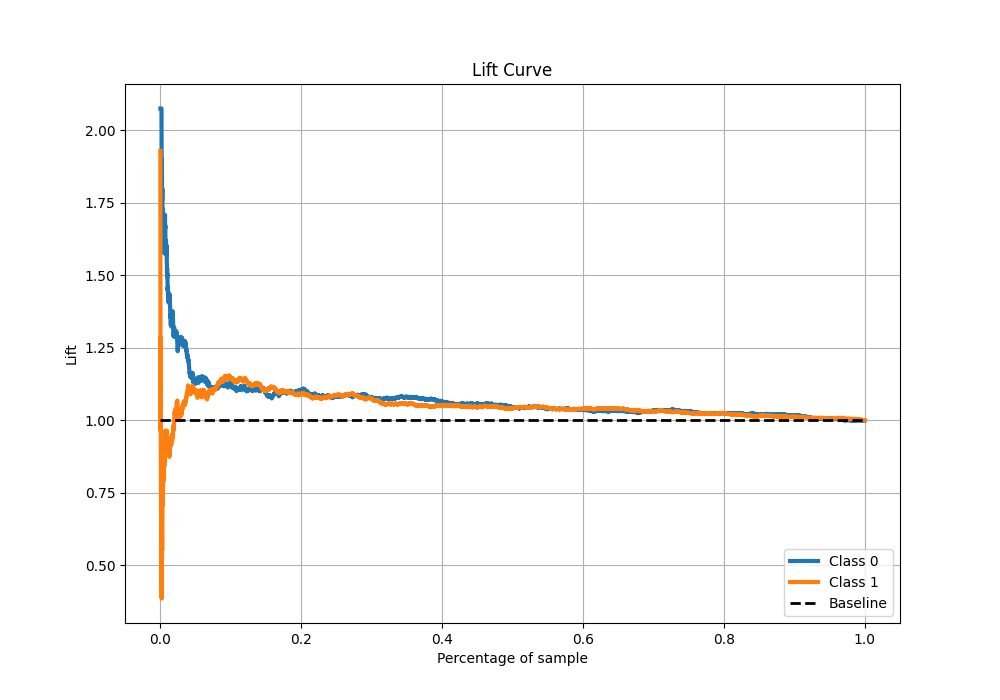

# Summary of 13_LightGBM

[<< Go back](../README.md)

## LightGBM
- **n_jobs**: -1
- **objective**: binary
- **num_leaves**: 63
- **learning_rate**: 0.05
- **feature_fraction**: 0.9
- **bagging_fraction**: 1.0
- **min_data_in_leaf**: 20
- **metric**: binary_logloss
- **custom_eval_metric_name**: None
- **explain_level**: 1

## Validation
 - **validation_type**: kfold
 - **k_folds**: 5
 - **shuffle**: True
 - **stratify**: True

## Optimized metric
logloss

## Training time

4.8 seconds

## Metric details
|           |     score |   threshold |
|:----------|----------:|------------:|
| logloss   | 0.690678  |  nan        |
| auc       | 0.535757  |  nan        |
| f1        | 0.683528  |    0.390269 |
| accuracy  | 0.532748  |    0.508771 |
| precision | 0.595186  |    0.572486 |
| recall    | 1         |    0.247923 |
| mcc       | 0.0583013 |    0.537634 |

## Metric details with threshold from accuracy metric
|           |    score |   threshold |
|:----------|---------:|------------:|
| logloss   | 0.690678 |  nan        |
| auc       | 0.535757 |  nan        |
| f1        | 0.6      |    0.508771 |
| accuracy  | 0.532748 |    0.508771 |
| precision | 0.539171 |    0.508771 |
| recall    | 0.676301 |    0.508771 |
| mcc       | 0.057268 |    0.508771 |

## Confusion matrix (at threshold=0.508771)
|              |   Predicted as 0 |   Predicted as 1 |
|:-------------|-----------------:|-----------------:|
| Labeled as 0 |              913 |             1500 |
| Labeled as 1 |              840 |             1755 |

## Learning curves

## Permutation-based Importance

## Confusion Matrix

## Normalized Confusion Matrix

## ROC Curve

## Kolmogorov-Smirnov Statistic

## Precision-Recall Curve

## Calibration Curve

## Cumulative Gains Curve

## Lift Curve

[<< Go back](../README.md)
