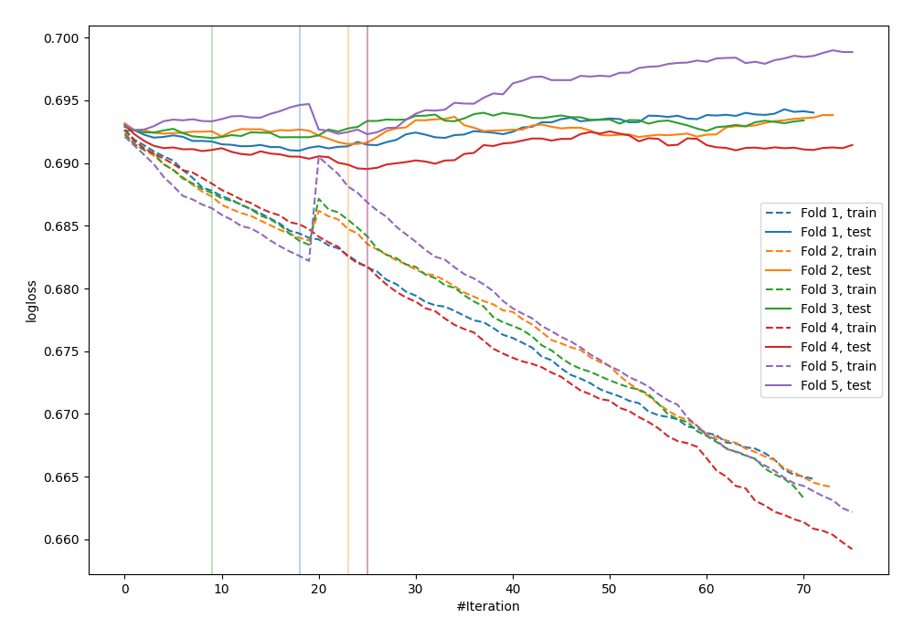
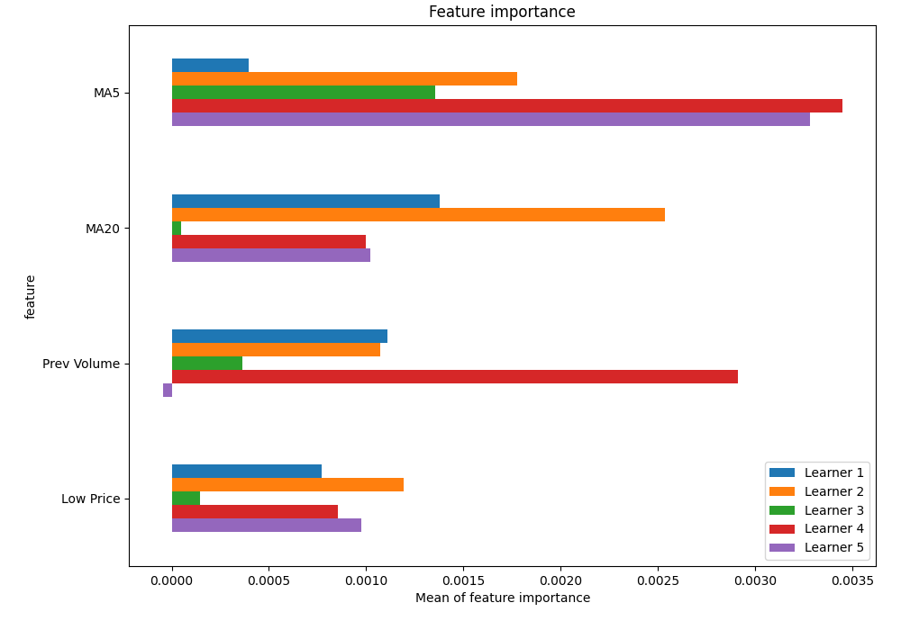
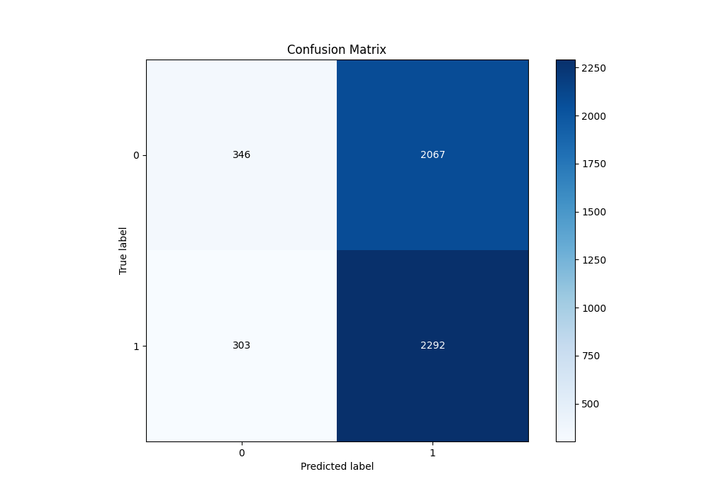
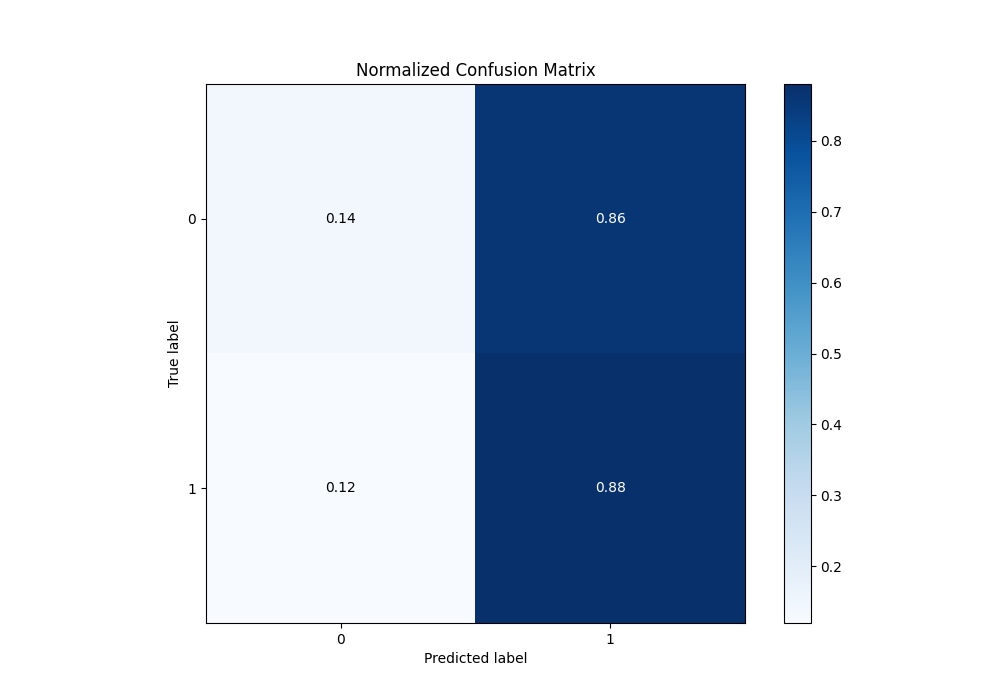
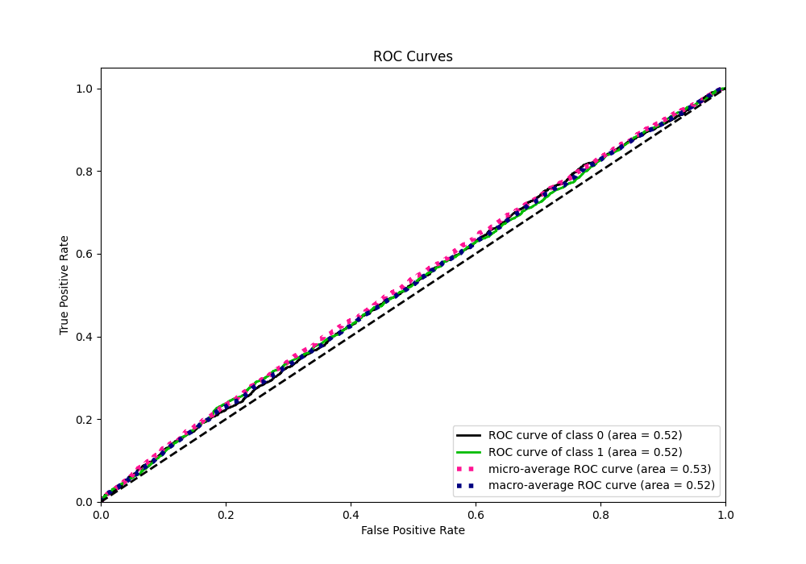
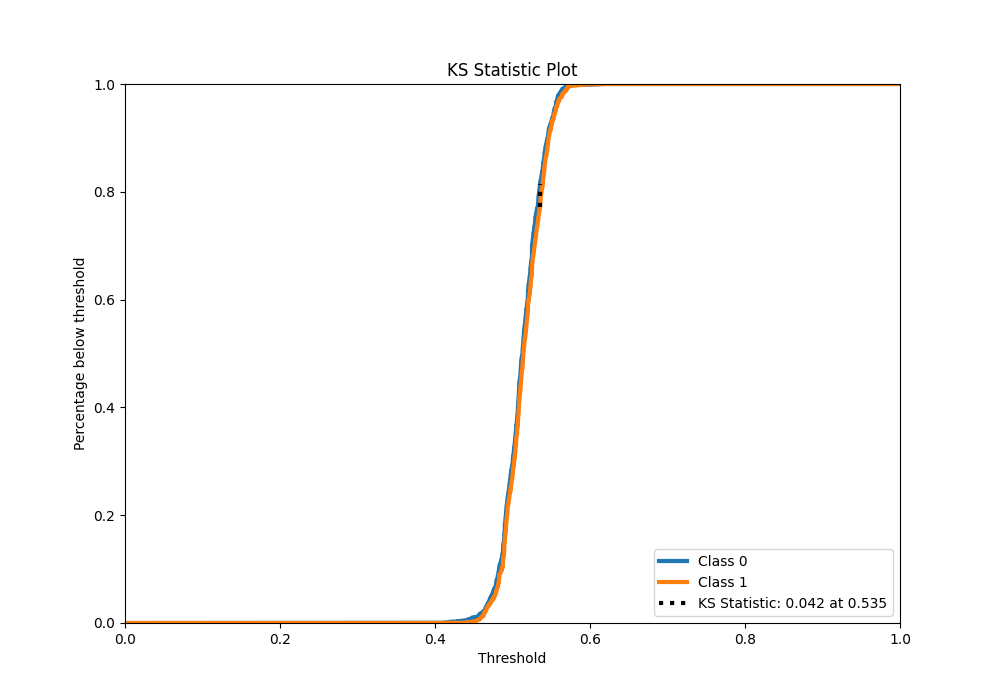
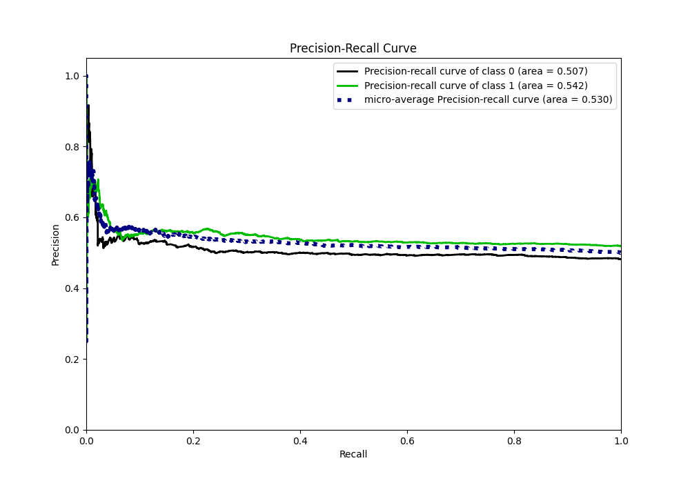
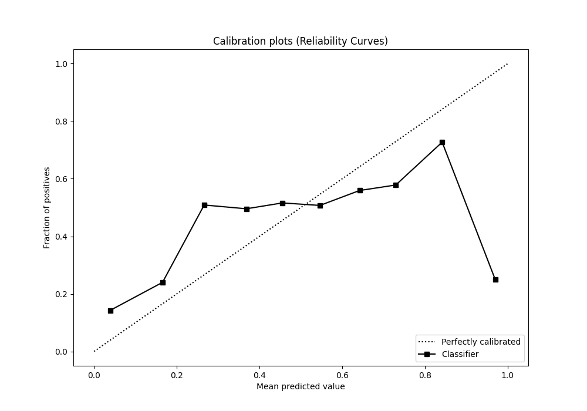
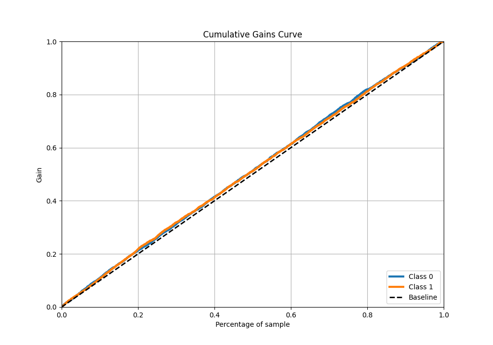
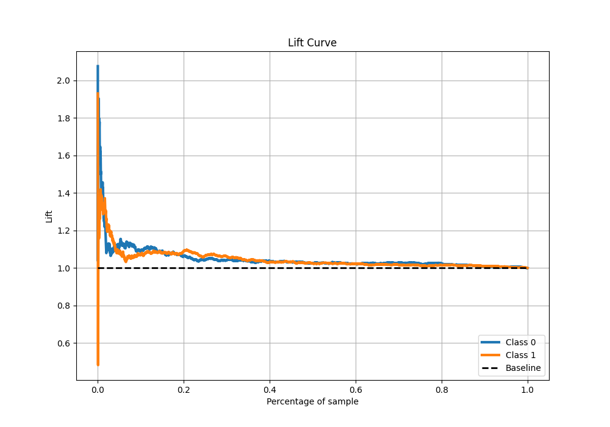

# Summary of 17_CatBoost_SelectedFeatures

[<< Go back](../README.md)

## CatBoost
- **n_jobs**: -1
- **learning_rate**: 0.1
- **depth**: 7
- **rsm**: 1.0
- **loss_function**: Logloss
- **eval_metric**: Logloss
- **explain_level**: 1

## Validation
 - **validation_type**: kfold
 - **k_folds**: 5
 - **shuffle**: True
 - **stratify**: True

## Optimized metric
logloss

## Training time

6.5 seconds

## Metric details
|           |     score |   threshold |
|:----------|----------:|------------:|
| logloss   | 0.691348  |  nan        |
| auc       | 0.524164  |  nan        |
| f1        | 0.682998  |    0.457059 |
| accuracy  | 0.526757  |    0.487773 |
| precision | 0.684211  |    0.566909 |
| recall    | 1         |    0.366277 |
| mcc       | 0.0502327 |    0.535311 |

## Metric details with threshold from accuracy metric
|           |     score |   threshold |
|:----------|----------:|------------:|
| logloss   | 0.691348  |  nan        |
| auc       | 0.524164  |  nan        |
| f1        | 0.659189  |    0.487773 |
| accuracy  | 0.526757  |    0.487773 |
| precision | 0.525809  |    0.487773 |
| recall    | 0.883237  |    0.487773 |
| mcc       | 0.0396144 |    0.487773 |

## Confusion matrix (at threshold=0.487773)
|              |   Predicted as 0 |   Predicted as 1 |
|:-------------|-----------------:|-----------------:|
| Labeled as 0 |              346 |             2067 |
| Labeled as 1 |              303 |             2292 |

## Learning curves

## Permutation-based Importance

## Confusion Matrix

## Normalized Confusion Matrix

## ROC Curve

## Kolmogorov-Smirnov Statistic

## Precision-Recall Curve

## Calibration Curve

## Cumulative Gains Curve

## Lift Curve

[<< Go back](../README.md)
