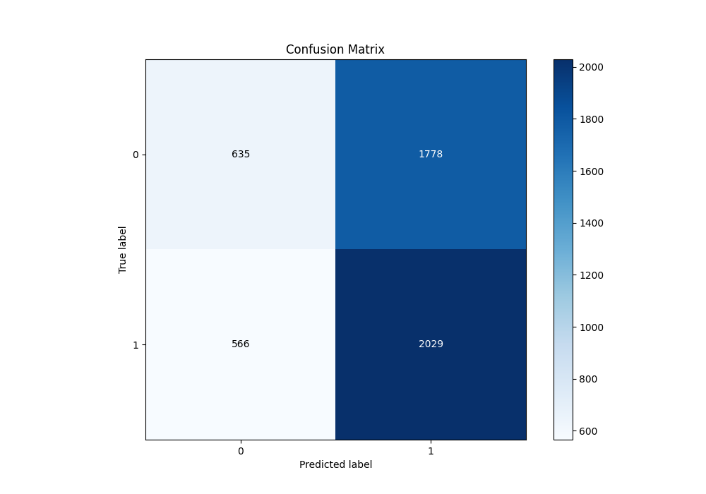

# Summary of 18_CatBoost

[<< Go back](../README.md)

## CatBoost
- **n_jobs**: -1
- **learning_rate**: 0.2
- **depth**: 8
- **rsm**: 1.0
- **loss_function**: Logloss
- **eval_metric**: Logloss
- **explain_level**: 1

## Validation
 - **validation_type**: kfold
 - **k_folds**: 5
 - **shuffle**: True
 - **stratify**: True

## Optimized metric
logloss

## Training time

6.9 seconds

## Metric details
|           |     score |   threshold |
|:----------|----------:|------------:|
| logloss   | 0.690945  |  nan        |
| auc       | 0.535992  |  nan        |
| f1        | 0.682625  |    0.217316 |
| accuracy  | 0.531949  |    0.492869 |
| precision | 0.626168  |    0.598408 |
| recall    | 1         |    0.217316 |
| mcc       | 0.0646539 |    0.524751 |

## Metric details with threshold from accuracy metric
|           |     score |   threshold |
|:----------|----------:|------------:|
| logloss   | 0.690945  |  nan        |
| auc       | 0.535992  |  nan        |
| f1        | 0.633864  |    0.492869 |
| accuracy  | 0.531949  |    0.492869 |
| precision | 0.532966  |    0.492869 |
| recall    | 0.781888  |    0.492869 |
| mcc       | 0.0527159 |    0.492869 |

## Confusion matrix (at threshold=0.492869)
|              |   Predicted as 0 |   Predicted as 1 |
|:-------------|-----------------:|-----------------:|
| Labeled as 0 |              635 |             1778 |
| Labeled as 1 |              566 |             2029 |

## Learning curves

## Permutation-based Importance

## Confusion Matrix

## Normalized Confusion Matrix

## ROC Curve

## Kolmogorov-Smirnov Statistic

## Precision-Recall Curve

## Calibration Curve

## Cumulative Gains Curve

## Lift Curve

[<< Go back](../README.md)
