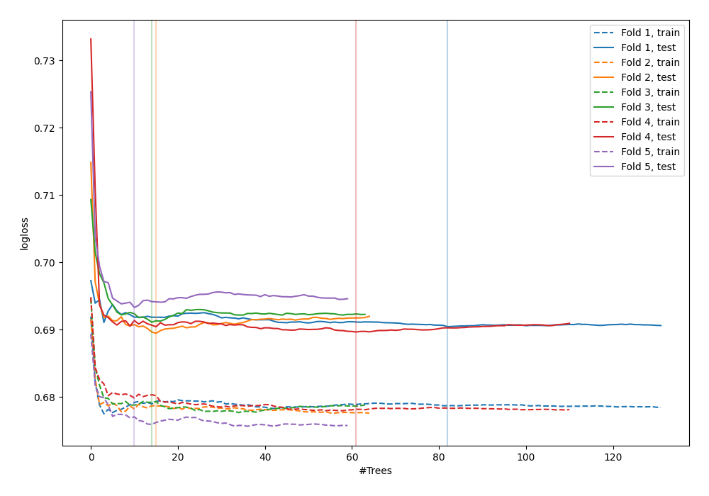
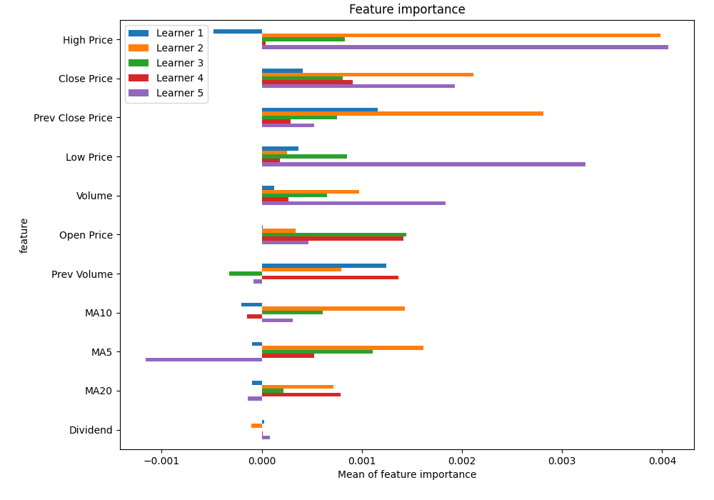
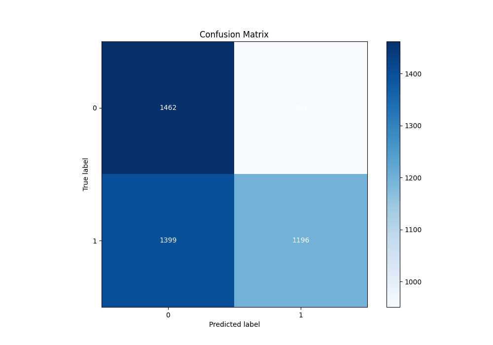
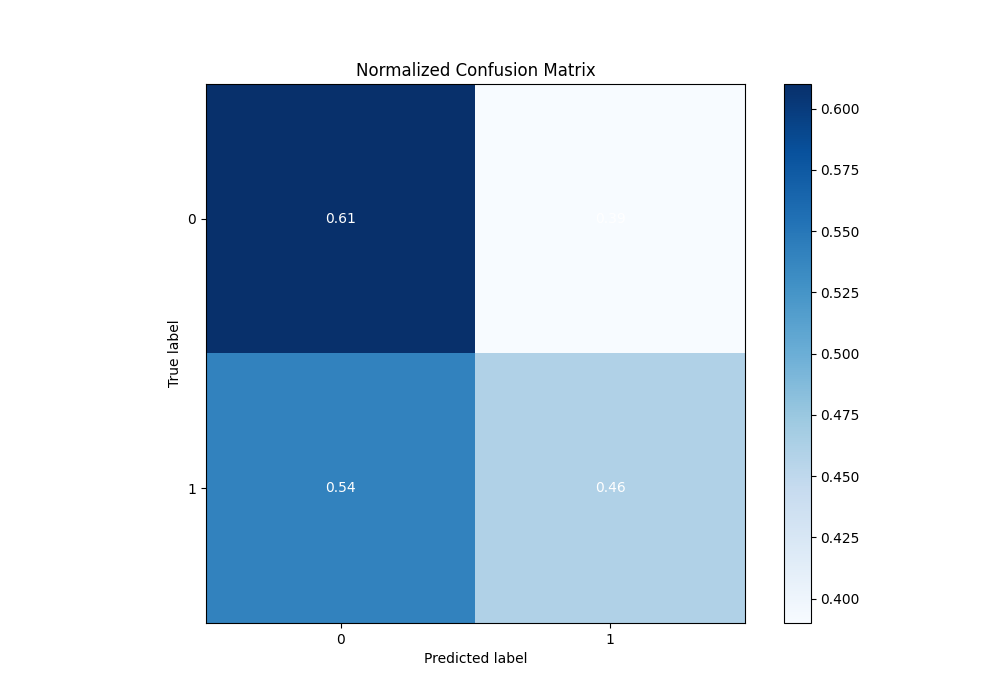
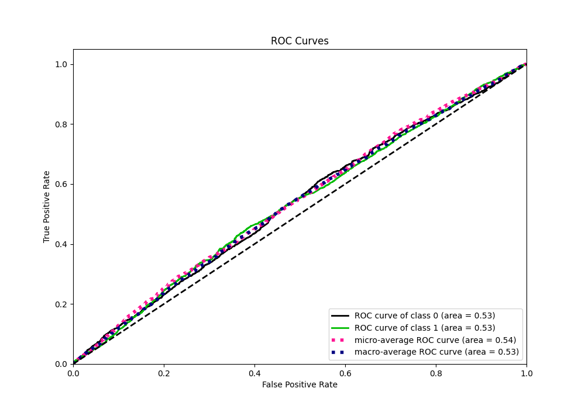
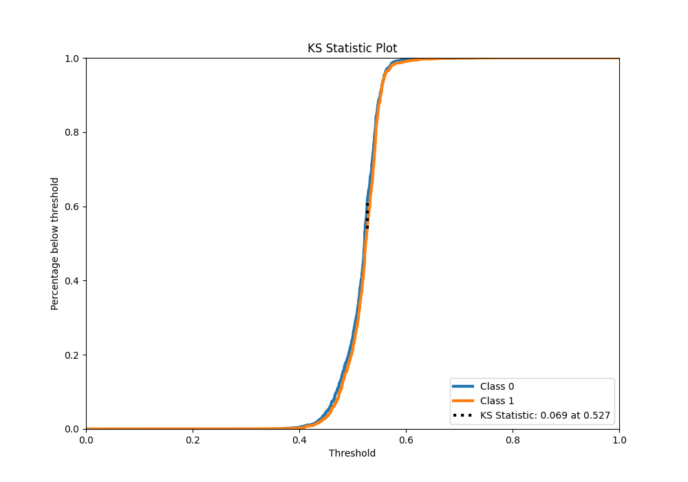
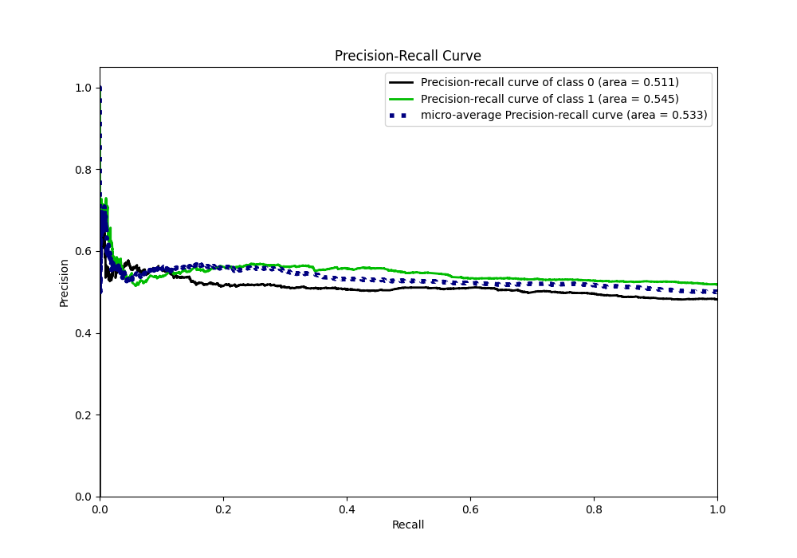
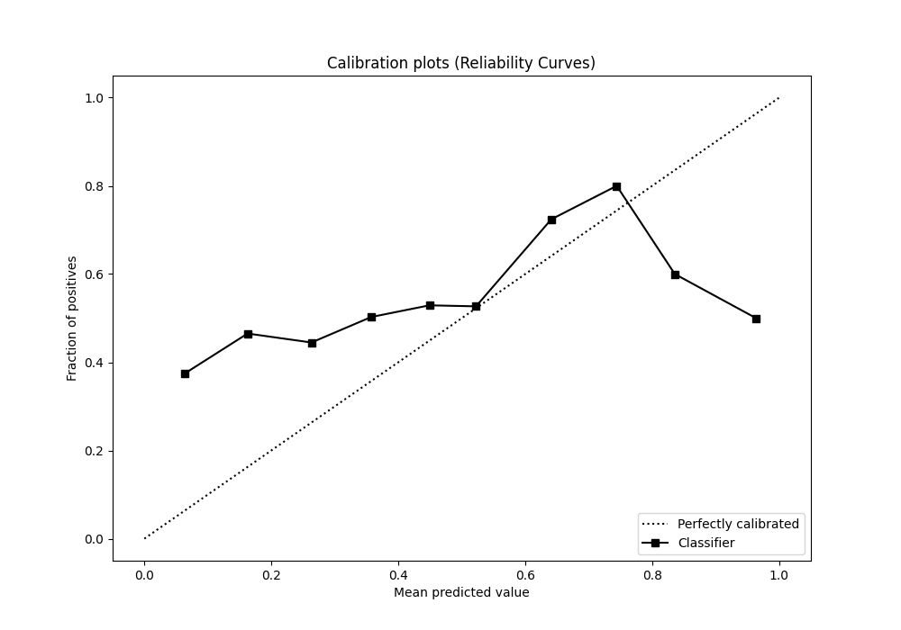
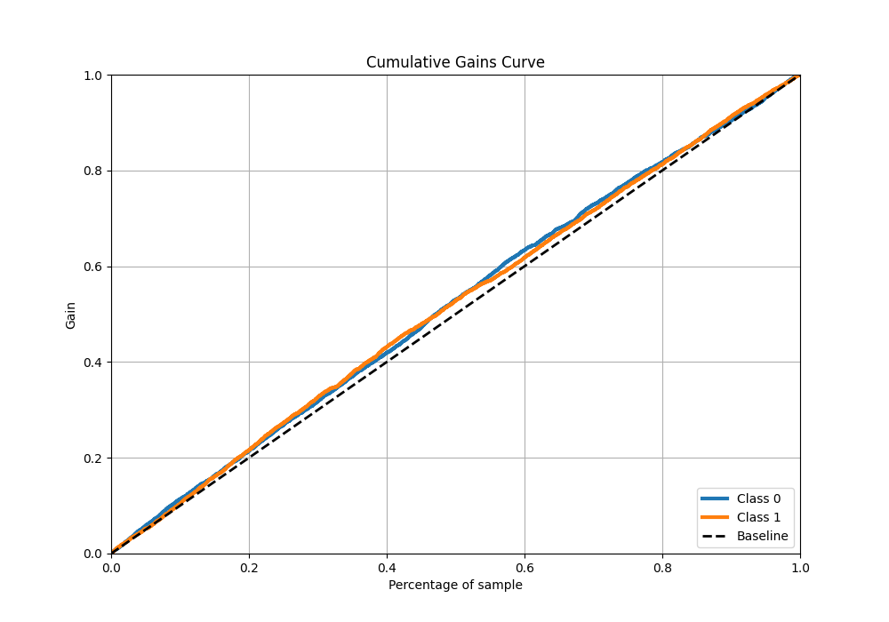
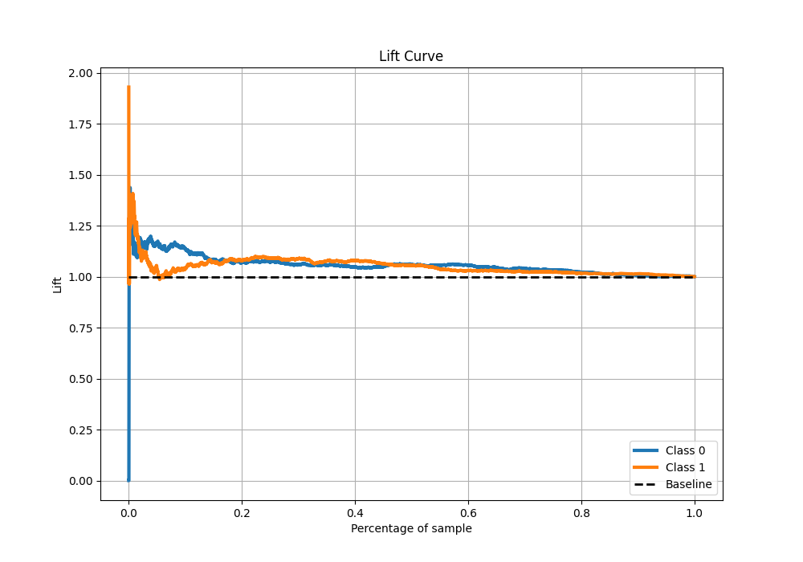

# Summary of 19_RandomForest

[<< Go back](../README.md)

## Random Forest
- **n_jobs**: -1
- **criterion**: gini
- **max_features**: 0.5
- **min_samples_split**: 20
- **max_depth**: 4
- **eval_metric_name**: logloss
- **explain_level**: 1

## Validation
 - **validation_type**: kfold
 - **k_folds**: 5
 - **shuffle**: True
 - **stratify**: True

## Optimized metric
logloss

## Training time

8.4 seconds

## Metric details
|           |     score |   threshold |
|:----------|----------:|------------:|
| logloss   | 0.690775  |  nan        |
| auc       | 0.534544  |  nan        |
| f1        | 0.682625  |    0.303509 |
| accuracy  | 0.530751  |    0.527106 |
| precision | 0.631579  |    0.584463 |
| recall    | 1         |    0.303509 |
| mcc       | 0.0681702 |    0.527571 |

## Metric details with threshold from accuracy metric
|           |     score |   threshold |
|:----------|----------:|------------:|
| logloss   | 0.690775  |  nan        |
| auc       | 0.534544  |  nan        |
| f1        | 0.504429  |    0.527106 |
| accuracy  | 0.530751  |    0.527106 |
| precision | 0.557056  |    0.527106 |
| recall    | 0.460886  |    0.527106 |
| mcc       | 0.0674157 |    0.527106 |

## Confusion matrix (at threshold=0.527106)
|              |   Predicted as 0 |   Predicted as 1 |
|:-------------|-----------------:|-----------------:|
| Labeled as 0 |             1462 |              951 |
| Labeled as 1 |             1399 |             1196 |

## Learning curves

## Permutation-based Importance

## Confusion Matrix

## Normalized Confusion Matrix

## ROC Curve

## Kolmogorov-Smirnov Statistic

## Precision-Recall Curve

## Calibration Curve

## Cumulative Gains Curve

## Lift Curve

[<< Go back](../README.md)
