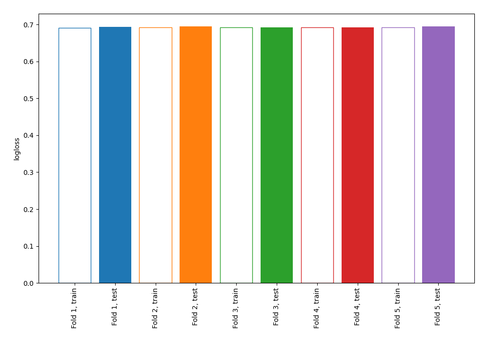
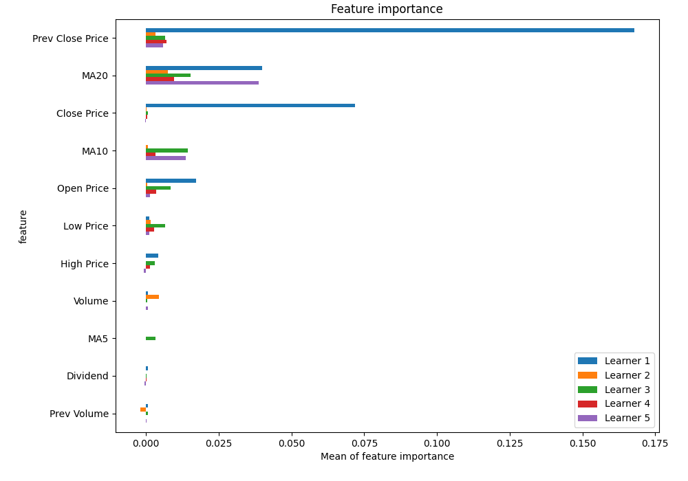

# Summary of 1_Linear

[<< Go back](../README.md)

## Logistic Regression (Linear)
- **n_jobs**: -1
- **explain_level**: 1

## Validation
 - **validation_type**: kfold
 - **k_folds**: 5
 - **shuffle**: True
 - **stratify**: True

## Optimized metric
logloss

## Training time

4.4 seconds

## Metric details
|           |     score |   threshold |
|:----------|----------:|------------:|
| logloss   | 0.693312  |  nan        |
| auc       | 0.502292  |  nan        |
| f1        | 0.682625  |    0.19088  |
| accuracy  | 0.518171  |    0.19088  |
| precision | 0.525125  |    0.518123 |
| recall    | 1         |    0.19088  |
| mcc       | 0.0171513 |    0.514063 |

## Metric details with threshold from accuracy metric
|           |    score |   threshold |
|:----------|---------:|------------:|
| logloss   | 0.693312 |   nan       |
| auc       | 0.502292 |   nan       |
| f1        | 0.682625 |     0.19088 |
| accuracy  | 0.518171 |     0.19088 |
| precision | 0.518171 |     0.19088 |
| recall    | 1        |     0.19088 |
| mcc       | 0        |     0.19088 |

## Confusion matrix (at threshold=0.19088)
|              |   Predicted as 0 |   Predicted as 1 |
|:-------------|-----------------:|-----------------:|
| Labeled as 0 |                0 |             2413 |
| Labeled as 1 |                0 |             2595 |

## Learning curves

## Coefficients
| feature          |   Learner_1 |    Learner_2 |   Learner_3 |   Learner_4 |   Learner_5 |
|:-----------------|------------:|-------------:|------------:|------------:|------------:|
| Prev Close Price |   0.863871  |  0.111225    |   0.154635  |  0.146951   |  0.217173   |
| Open Price       |   0.248623  |  0.0452463   |   0.18151   |  0.100008   |  0.145706   |
| Low Price        |   0.0587374 |  0.080424    |   0.158565  |  0.0852939  |  0.137943   |
| intercept        |   0.0763249 |  0.0769742   |   0.0747526 |  0.0733595  |  0.0761104  |
| Volume           |   0.0649106 |  0.0896109   |   0.0467306 |  0.0212381  |  0.0249431  |
| High Price       |  -0.139425  | -0.000407494 |   0.106201  |  0.0553921  |  0.063035   |
| MA5              |  -0.0275117 | -0.00186489  |  -0.126409  | -0.0406876  |  0.00411534 |
| Prev Volume      |  -0.0527911 | -0.111898    |  -0.0358194 | -0.00204447 | -0.0327028  |
| Close Price      |  -0.561285  | -0.0156827   |   0.0477553 |  0.0242419  |  0.0180615  |
| MA10             |  -0.0228874 | -0.0463598   |  -0.256104  | -0.140076   | -0.193079   |
| Dividend         |  -0.395206  | -0.284075    |  -0.0861326 | -0.169495   | -0.462015   |
| MA20             |  -0.413248  | -0.161251    |  -0.260917  | -0.221302   | -0.360664   |

## Permutation-based Importance

## Confusion Matrix

## Normalized Confusion Matrix

## ROC Curve

## Kolmogorov-Smirnov Statistic

## Precision-Recall Curve

## Calibration Curve

## Cumulative Gains Curve

## Lift Curve

[<< Go back](../README.md)
