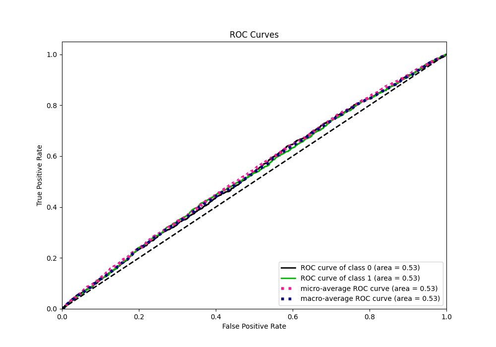

# Summary of 20_RandomForest

[<< Go back](../README.md)

## Random Forest
- **n_jobs**: -1
- **criterion**: gini
- **max_features**: 0.7
- **min_samples_split**: 30
- **max_depth**: 7
- **eval_metric_name**: logloss
- **explain_level**: 1

## Validation
 - **validation_type**: kfold
 - **k_folds**: 5
 - **shuffle**: True
 - **stratify**: True

## Optimized metric
logloss

## Training time

22.0 seconds

## Metric details
|           |     score |   threshold |
|:----------|----------:|------------:|
| logloss   | 0.692491  |  nan        |
| auc       | 0.528619  |  nan        |
| f1        | 0.682625  |    0.280874 |
| accuracy  | 0.527955  |    0.484913 |
| precision | 0.573248  |    0.592406 |
| recall    | 1         |    0.280874 |
| mcc       | 0.0548255 |    0.532719 |

## Metric details with threshold from accuracy metric
|           |     score |   threshold |
|:----------|----------:|------------:|
| logloss   | 0.692491  |  nan        |
| auc       | 0.528619  |  nan        |
| f1        | 0.639194  |    0.484913 |
| accuracy  | 0.527955  |    0.484913 |
| precision | 0.529189  |    0.484913 |
| recall    | 0.806936  |    0.484913 |
| mcc       | 0.0427854 |    0.484913 |

## Confusion matrix (at threshold=0.484913)
|              |   Predicted as 0 |   Predicted as 1 |
|:-------------|-----------------:|-----------------:|
| Labeled as 0 |              550 |             1863 |
| Labeled as 1 |              501 |             2094 |

## Learning curves

## Permutation-based Importance

## Confusion Matrix

## Normalized Confusion Matrix

## ROC Curve

## Kolmogorov-Smirnov Statistic

## Precision-Recall Curve

## Calibration Curve

## Cumulative Gains Curve

## Lift Curve

[<< Go back](../README.md)
