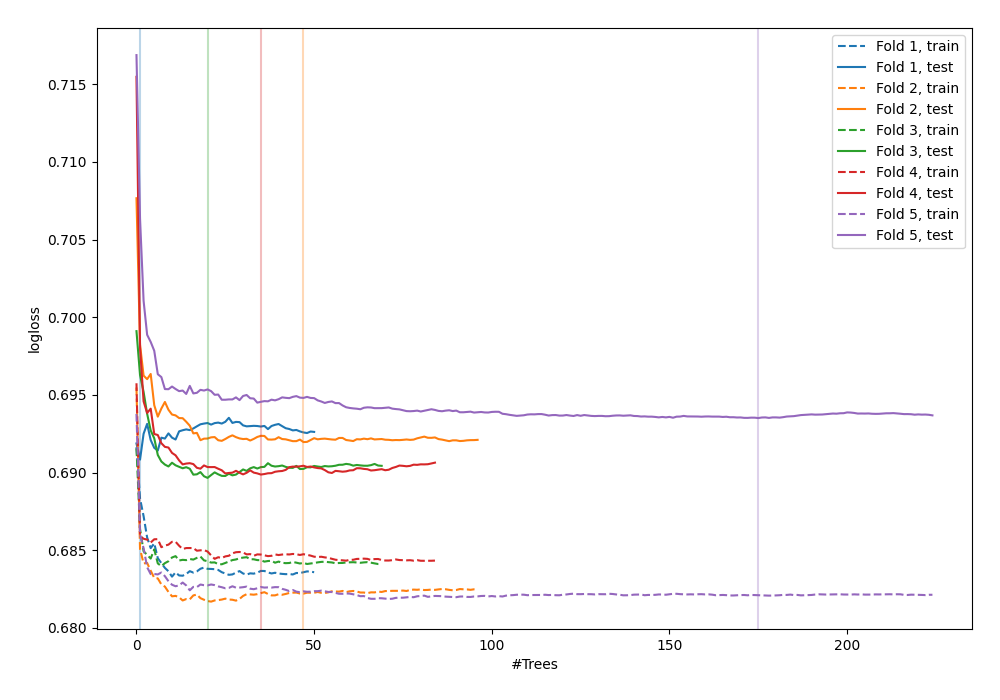
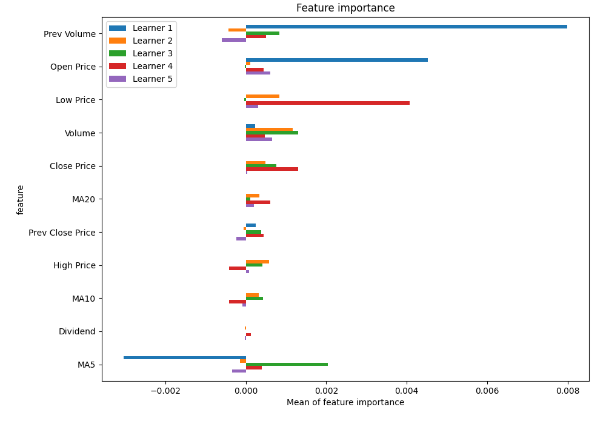
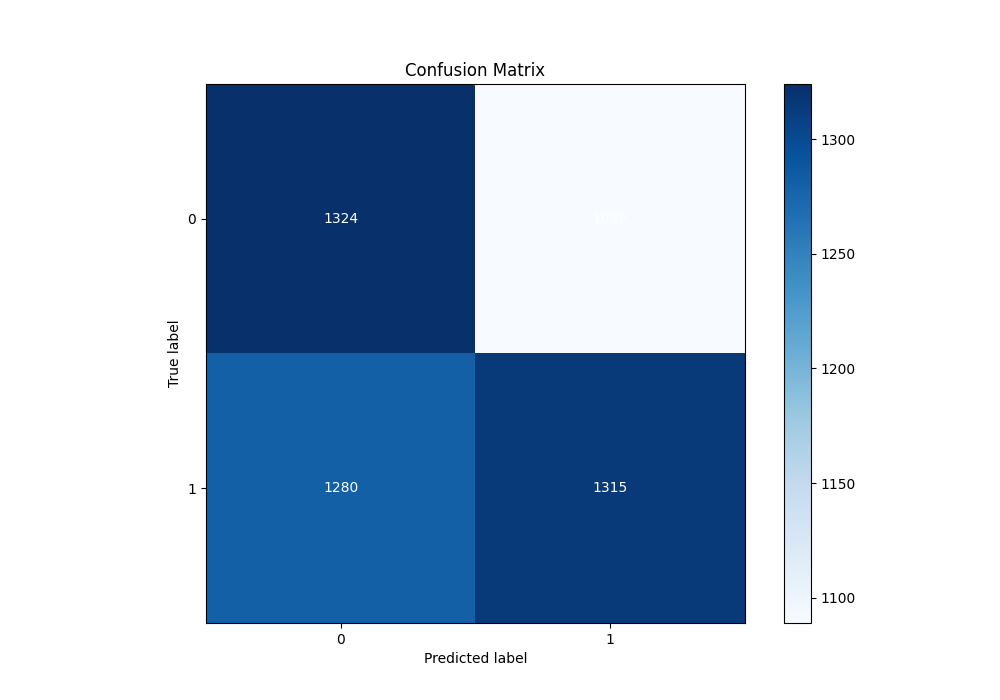
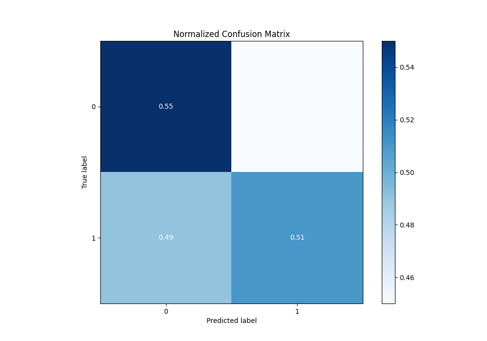
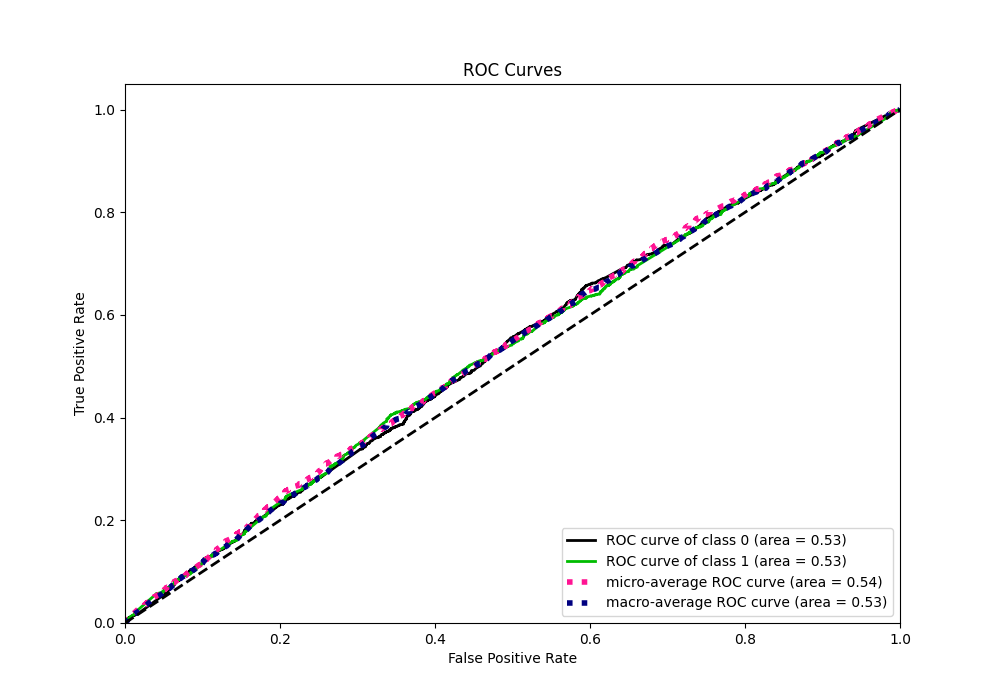
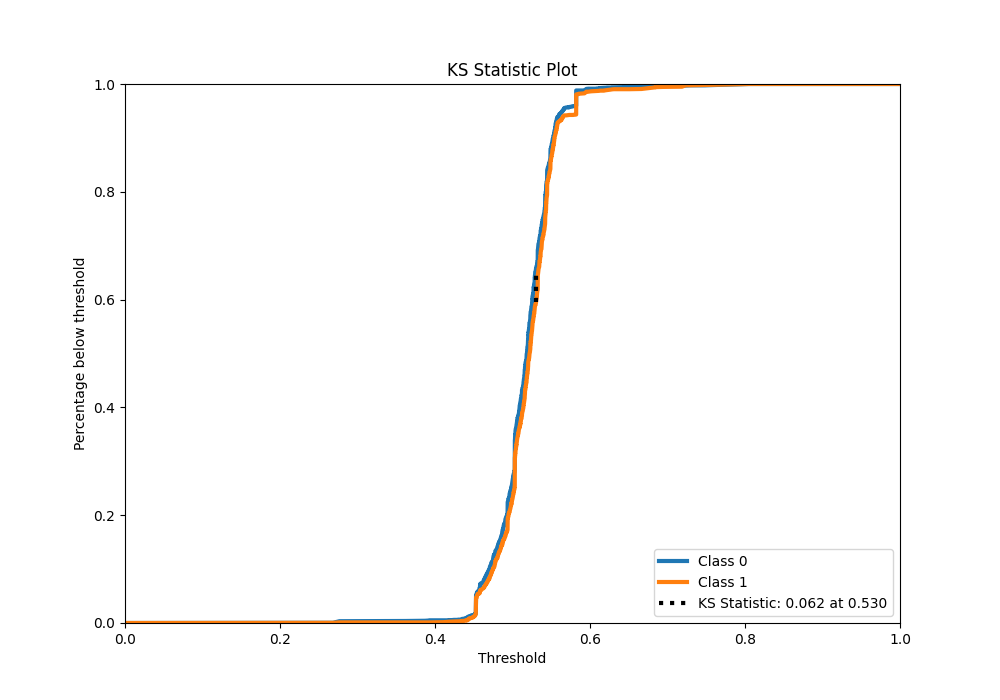
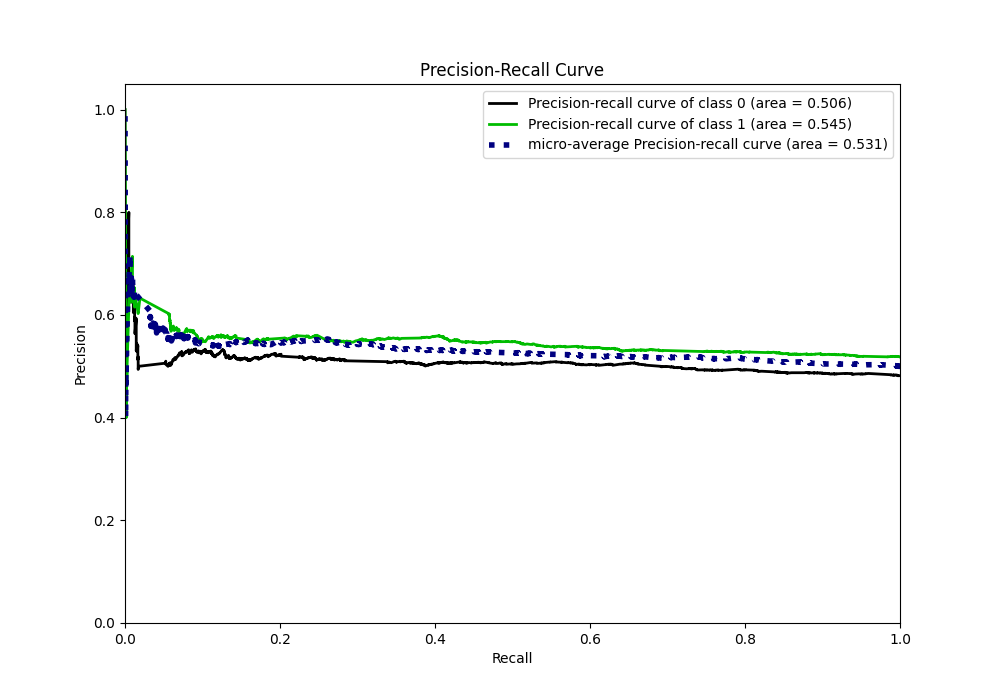
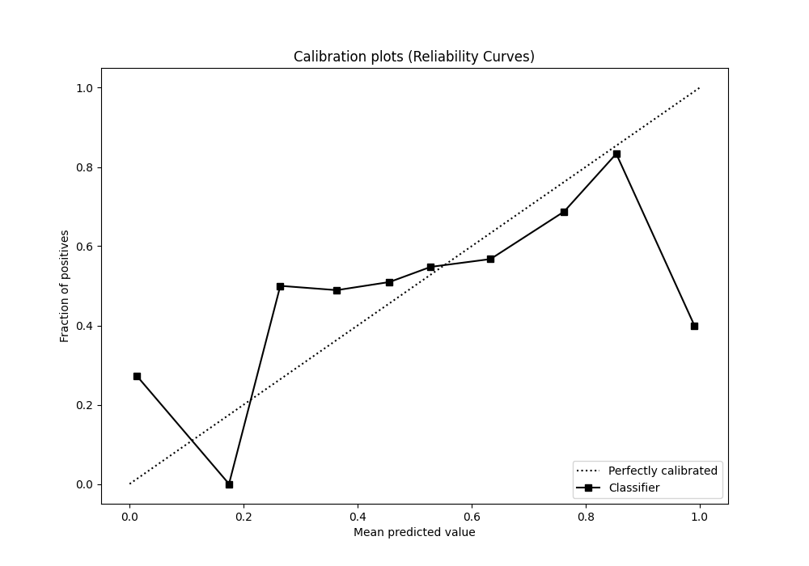
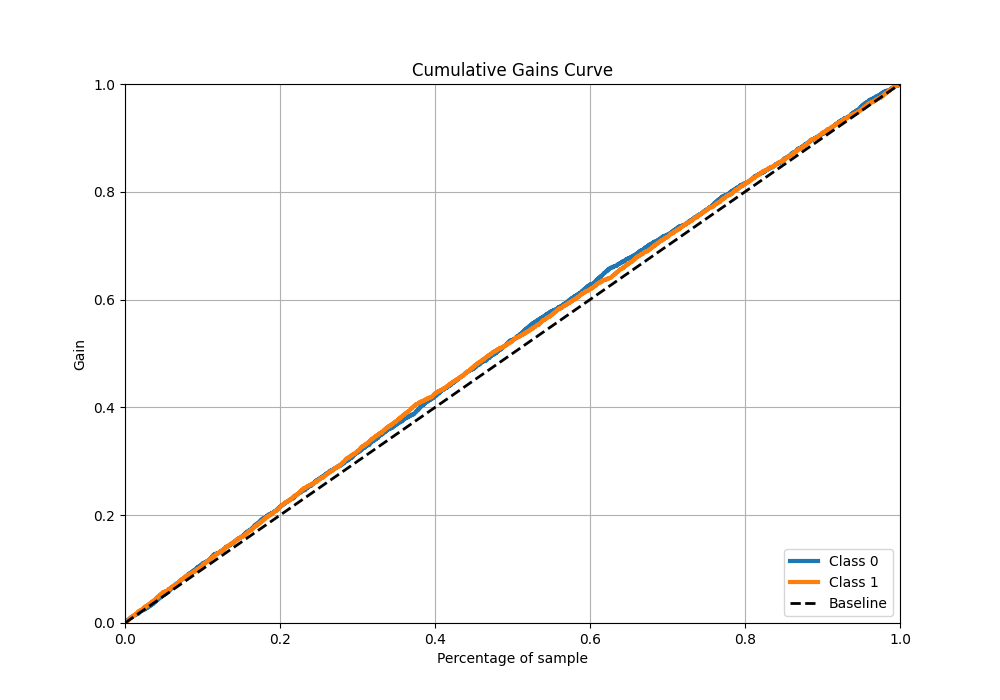
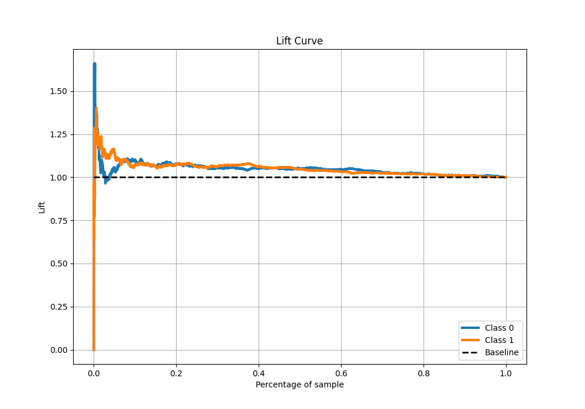

# Summary of 21_RandomForest

[<< Go back](../README.md)

## Random Forest
- **n_jobs**: -1
- **criterion**: gini
- **max_features**: 0.8
- **min_samples_split**: 40
- **max_depth**: 3
- **eval_metric_name**: logloss
- **explain_level**: 1

## Validation
 - **validation_type**: kfold
 - **k_folds**: 5
 - **shuffle**: True
 - **stratify**: True

## Optimized metric
logloss

## Training time

9.6 seconds

## Metric details
|           |     score |   threshold |
|:----------|----------:|------------:|
| logloss   | 0.691162  |  nan        |
| auc       | 0.531159  |  nan        |
| f1        | 0.682625  |    0.24161  |
| accuracy  | 0.526957  |    0.521568 |
| precision | 0.632911  |    0.58219  |
| recall    | 1         |    0.24161  |
| mcc       | 0.0615014 |    0.530664 |

## Metric details with threshold from accuracy metric
|           |     score |   threshold |
|:----------|----------:|------------:|
| logloss   | 0.691162  |  nan        |
| auc       | 0.531159  |  nan        |
| f1        | 0.526105  |    0.521568 |
| accuracy  | 0.526957  |    0.521568 |
| precision | 0.547005  |    0.521568 |
| recall    | 0.506744  |    0.521568 |
| mcc       | 0.0554459 |    0.521568 |

## Confusion matrix (at threshold=0.521568)
|              |   Predicted as 0 |   Predicted as 1 |
|:-------------|-----------------:|-----------------:|
| Labeled as 0 |             1324 |             1089 |
| Labeled as 1 |             1280 |             1315 |

## Learning curves

## Permutation-based Importance

## Confusion Matrix

## Normalized Confusion Matrix

## ROC Curve

## Kolmogorov-Smirnov Statistic

## Precision-Recall Curve

## Calibration Curve

## Cumulative Gains Curve

## Lift Curve

[<< Go back](../README.md)
