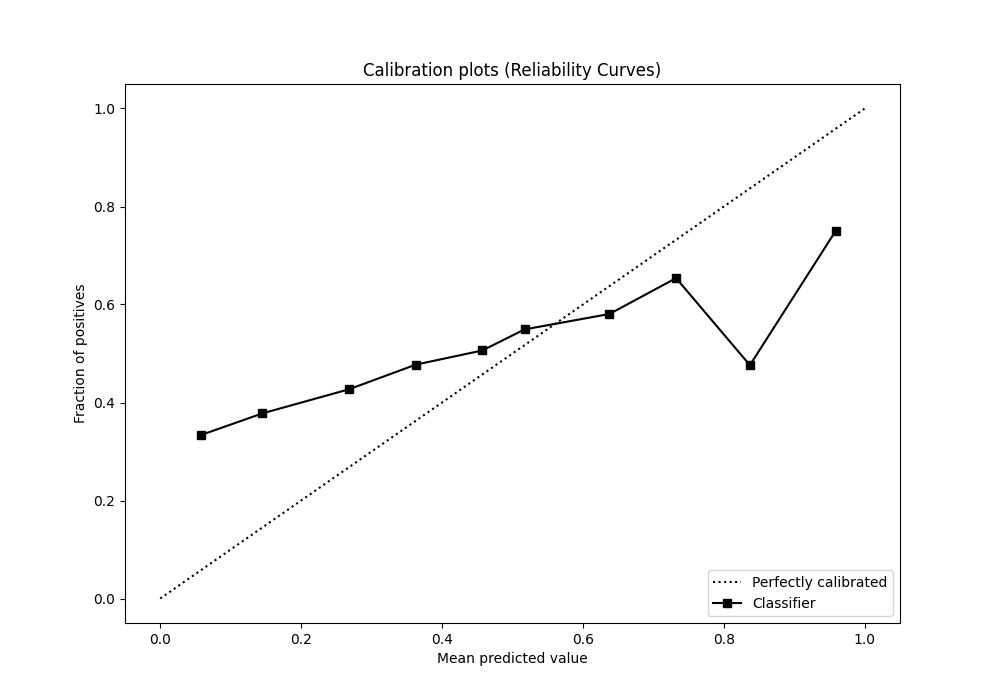

# Summary of 22_RandomForest

[<< Go back](../README.md)

## Random Forest
- **n_jobs**: -1
- **criterion**: entropy
- **max_features**: 0.6
- **min_samples_split**: 50
- **max_depth**: 6
- **eval_metric_name**: logloss
- **explain_level**: 1

## Validation
 - **validation_type**: kfold
 - **k_folds**: 5
 - **shuffle**: True
 - **stratify**: True

## Optimized metric
logloss

## Training time

8.4 seconds

## Metric details
|           |     score |   threshold |
|:----------|----------:|------------:|
| logloss   | 0.691506  |  nan        |
| auc       | 0.532796  |  nan        |
| f1        | 0.682625  |    0.21244  |
| accuracy  | 0.529553  |    0.479919 |
| precision | 0.590476  |    0.605081 |
| recall    | 1         |    0.21244  |
| mcc       | 0.0609557 |    0.534297 |

## Metric details with threshold from accuracy metric
|           |    score |   threshold |
|:----------|---------:|------------:|
| logloss   | 0.691506 |  nan        |
| auc       | 0.532796 |  nan        |
| f1        | 0.661105 |    0.479919 |
| accuracy  | 0.529553 |    0.479919 |
| precision | 0.527427 |    0.479919 |
| recall    | 0.885549 |    0.479919 |
| mcc       | 0.047924 |    0.479919 |

## Confusion matrix (at threshold=0.479919)
|              |   Predicted as 0 |   Predicted as 1 |
|:-------------|-----------------:|-----------------:|
| Labeled as 0 |              354 |             2059 |
| Labeled as 1 |              297 |             2298 |

## Learning curves

## Permutation-based Importance

## Confusion Matrix

## Normalized Confusion Matrix

## ROC Curve

## Kolmogorov-Smirnov Statistic

## Precision-Recall Curve

## Calibration Curve

## Cumulative Gains Curve

## Lift Curve

[<< Go back](../README.md)
