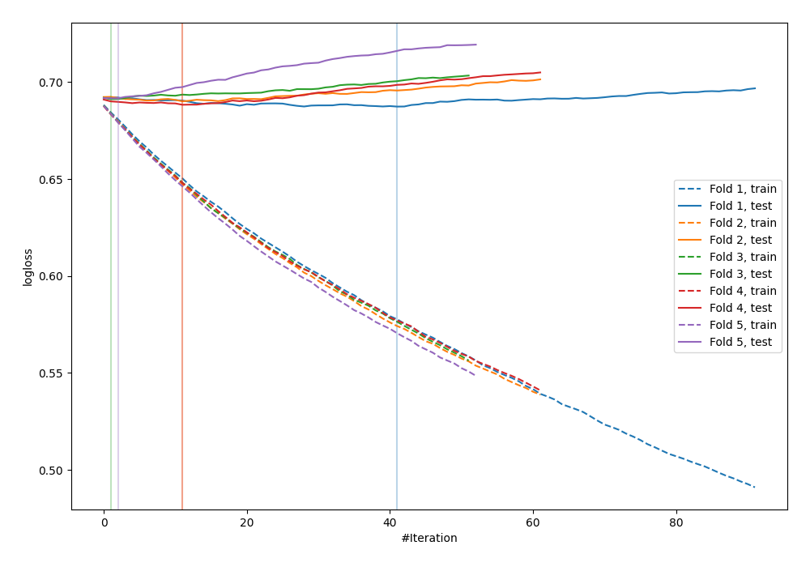
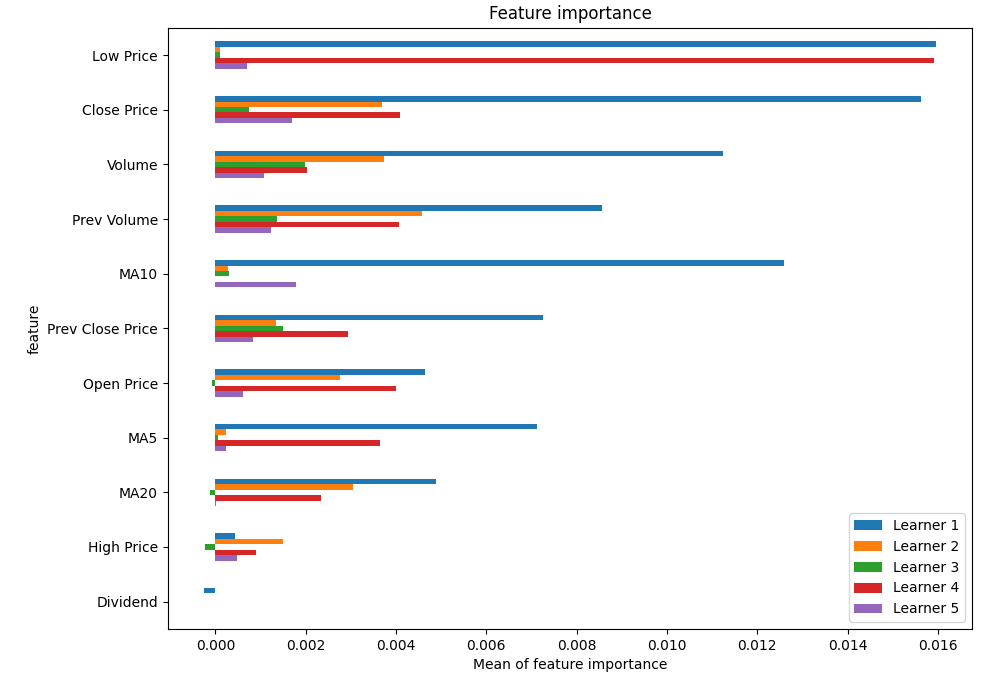
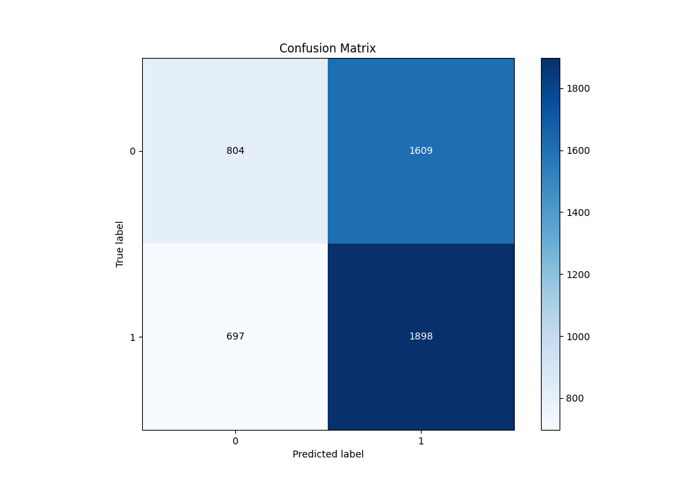
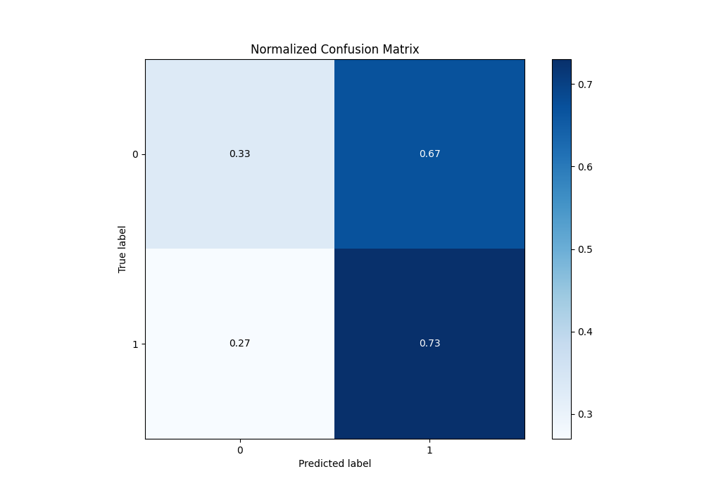
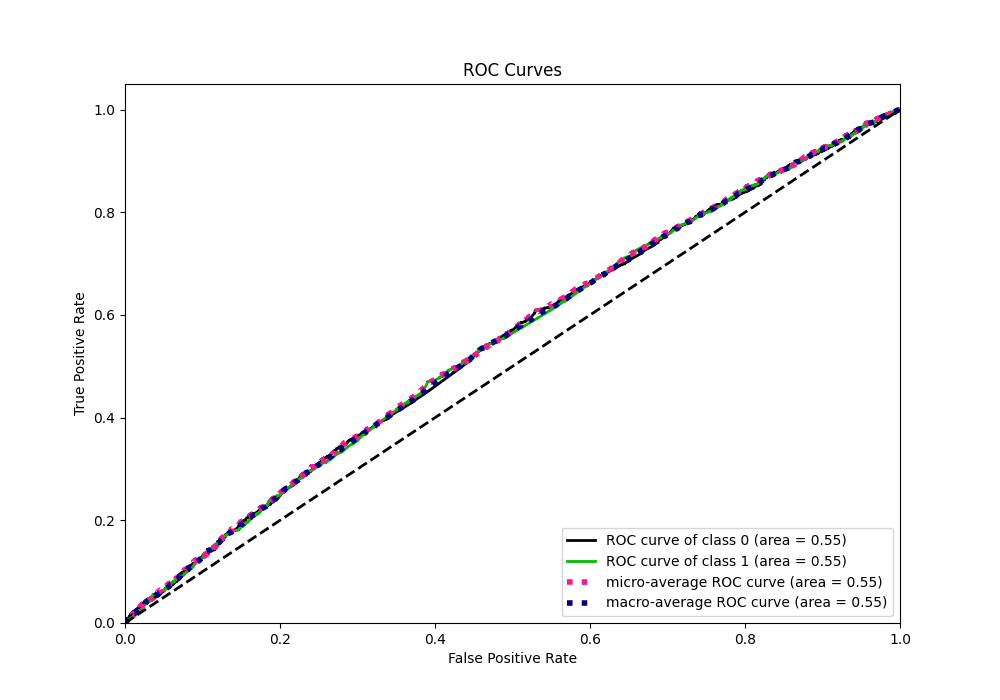
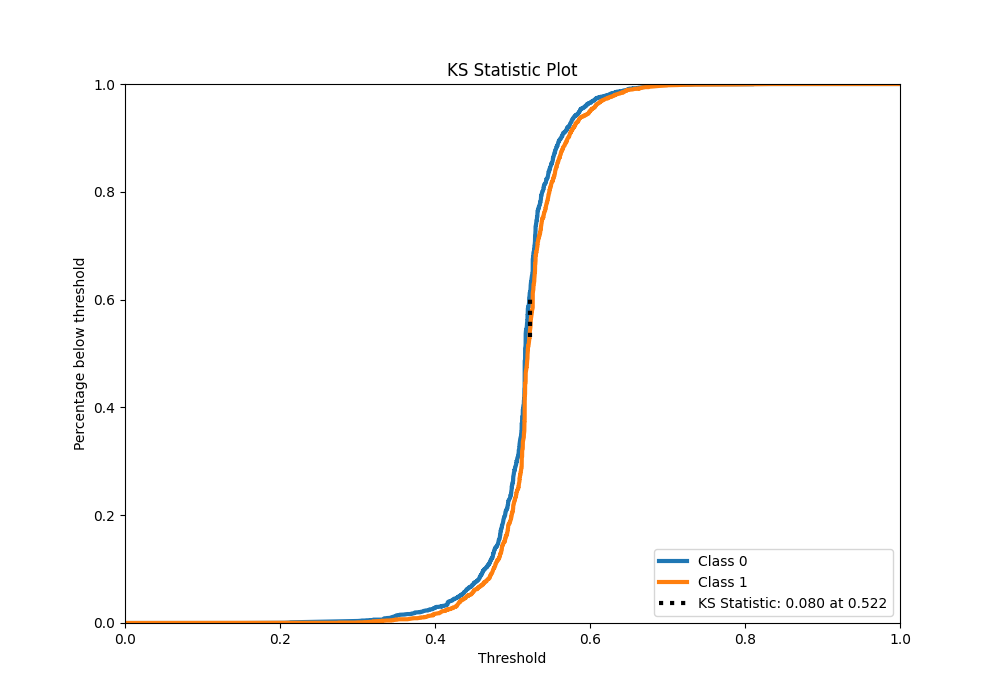
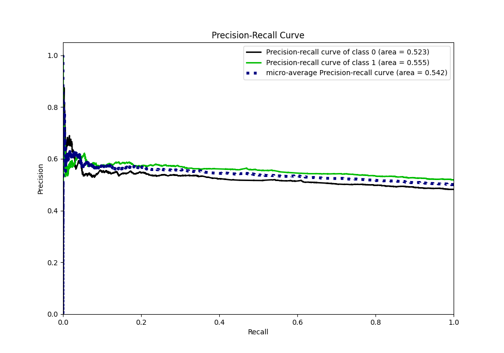
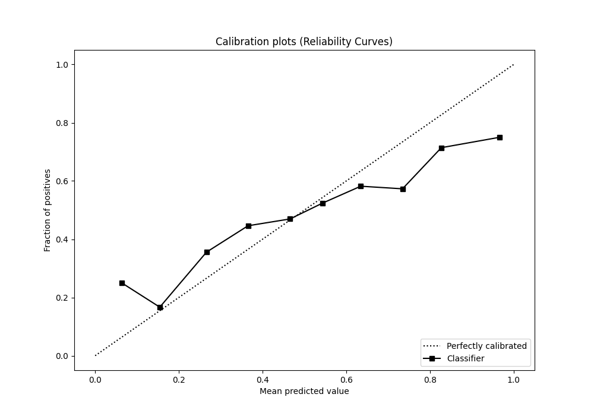
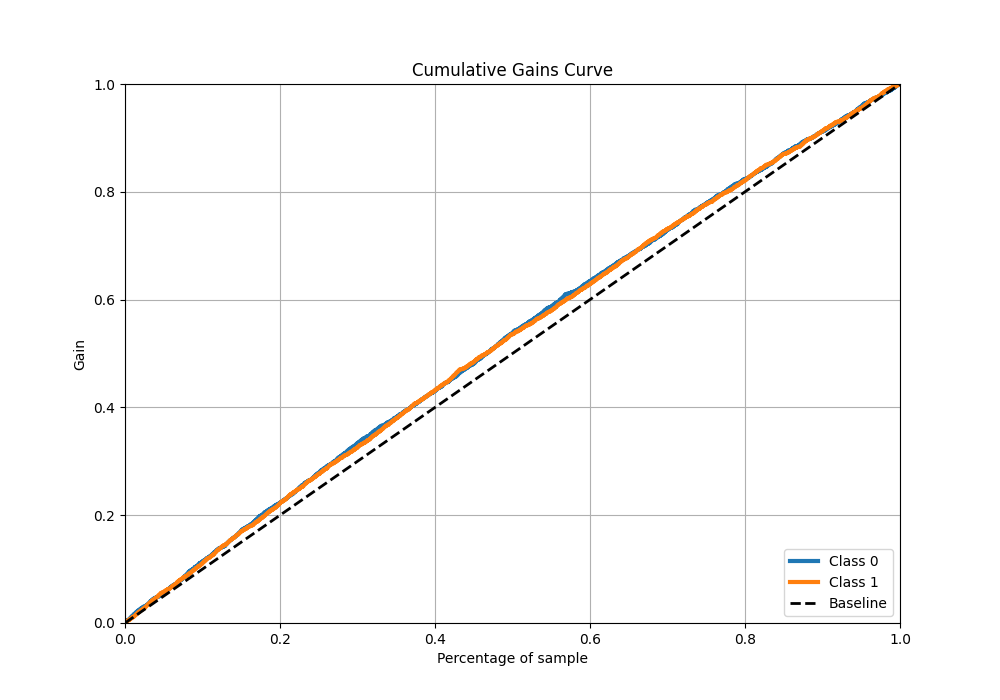
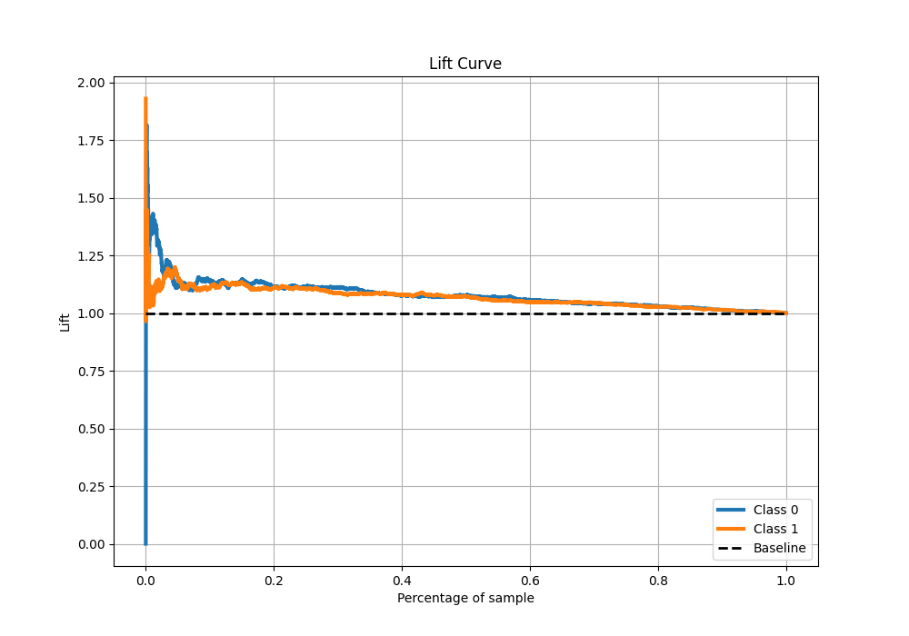

# Summary of 2_Default_LightGBM

[<< Go back](../README.md)

## LightGBM
- **n_jobs**: -1
- **objective**: binary
- **num_leaves**: 63
- **learning_rate**: 0.05
- **feature_fraction**: 0.9
- **bagging_fraction**: 0.9
- **min_data_in_leaf**: 10
- **metric**: binary_logloss
- **custom_eval_metric_name**: None
- **explain_level**: 1

## Validation
 - **validation_type**: kfold
 - **k_folds**: 5
 - **shuffle**: True
 - **stratify**: True

## Optimized metric
logloss

## Training time

4.1 seconds

## Metric details
|           |    score |   threshold |
|:----------|---------:|------------:|
| logloss   | 0.689724 |  nan        |
| auc       | 0.546733 |  nan        |
| f1        | 0.682733 |    0.351026 |
| accuracy  | 0.539537 |    0.509222 |
| precision | 0.605096 |    0.609834 |
| recall    | 1        |    0.137543 |
| mcc       | 0.079336 |    0.522165 |

## Metric details with threshold from accuracy metric
|           |     score |   threshold |
|:----------|----------:|------------:|
| logloss   | 0.689724  |  nan        |
| auc       | 0.546733  |  nan        |
| f1        | 0.622091  |    0.509222 |
| accuracy  | 0.539537  |    0.509222 |
| precision | 0.541203  |    0.509222 |
| recall    | 0.731407  |    0.509222 |
| mcc       | 0.0704585 |    0.509222 |

## Confusion matrix (at threshold=0.509222)
|              |   Predicted as 0 |   Predicted as 1 |
|:-------------|-----------------:|-----------------:|
| Labeled as 0 |              804 |             1609 |
| Labeled as 1 |              697 |             1898 |

## Learning curves

## Permutation-based Importance

## Confusion Matrix

## Normalized Confusion Matrix

## ROC Curve

## Kolmogorov-Smirnov Statistic

## Precision-Recall Curve

## Calibration Curve

## Cumulative Gains Curve

## Lift Curve

[<< Go back](../README.md)
