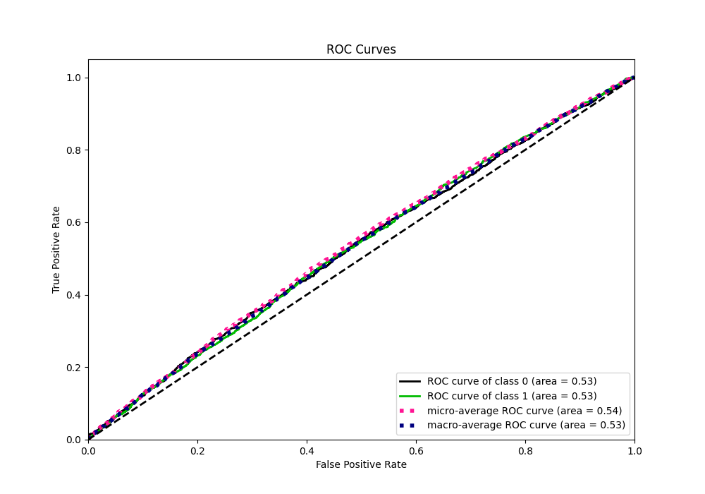

# Summary of 36_CatBoost

[<< Go back](../README.md)

## CatBoost
- **n_jobs**: -1
- **learning_rate**: 0.1
- **depth**: 6
- **rsm**: 1.0
- **loss_function**: Logloss
- **eval_metric**: Logloss
- **explain_level**: 1

## Validation
 - **validation_type**: kfold
 - **k_folds**: 5
 - **shuffle**: True
 - **stratify**: True

## Optimized metric
logloss

## Training time

7.3 seconds

## Metric details
|           |     score |   threshold |
|:----------|----------:|------------:|
| logloss   | 0.690637  |  nan        |
| auc       | 0.53274   |  nan        |
| f1        | 0.684057  |    0.443355 |
| accuracy  | 0.53155   |    0.49569  |
| precision | 0.596491  |    0.573666 |
| recall    | 1         |    0.287021 |
| mcc       | 0.0574235 |    0.443355 |

## Metric details with threshold from accuracy metric
|           |     score |   threshold |
|:----------|----------:|------------:|
| logloss   | 0.690637  |   nan       |
| auc       | 0.53274   |   nan       |
| f1        | 0.641941  |     0.49569 |
| accuracy  | 0.53155   |     0.49569 |
| precision | 0.531463  |     0.49569 |
| recall    | 0.810405  |     0.49569 |
| mcc       | 0.0516177 |     0.49569 |

## Confusion matrix (at threshold=0.49569)
|              |   Predicted as 0 |   Predicted as 1 |
|:-------------|-----------------:|-----------------:|
| Labeled as 0 |              559 |             1854 |
| Labeled as 1 |              492 |             2103 |

## Learning curves

## Permutation-based Importance

## Confusion Matrix

## Normalized Confusion Matrix

## ROC Curve

## Kolmogorov-Smirnov Statistic

## Precision-Recall Curve

## Calibration Curve

## Cumulative Gains Curve

## Lift Curve

[<< Go back](../README.md)
