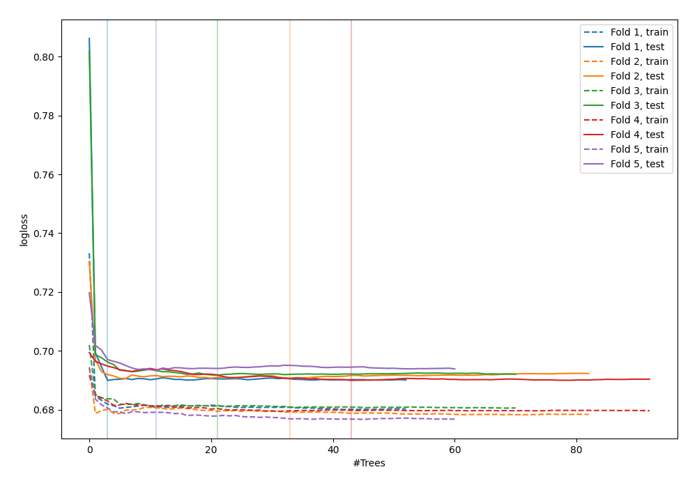
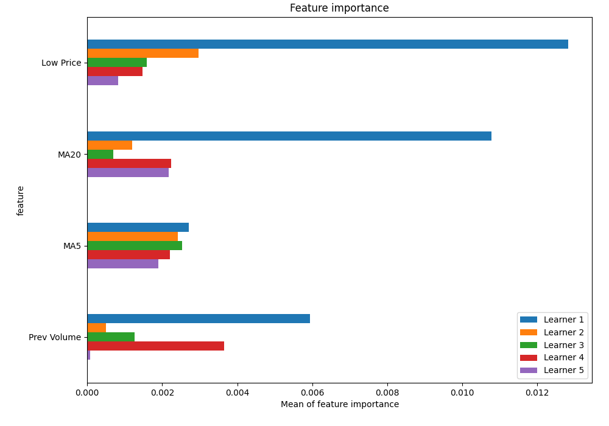
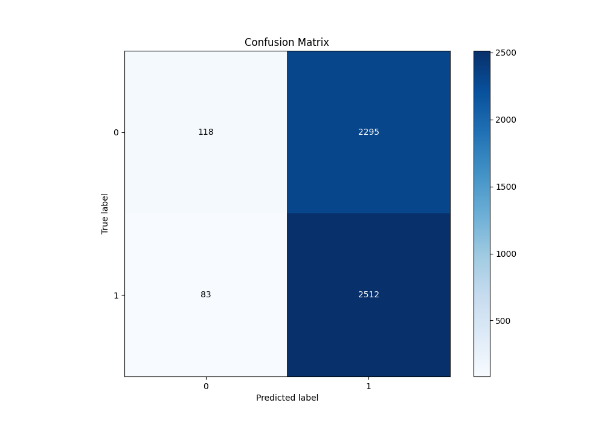
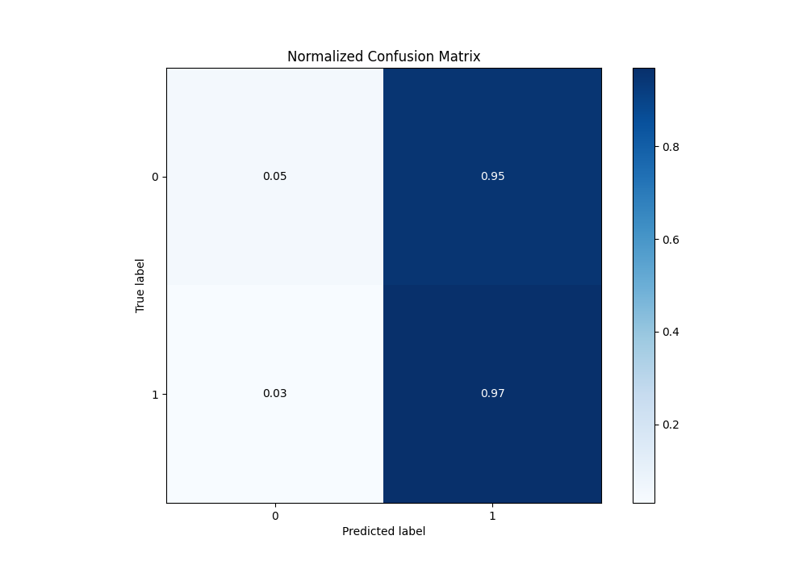
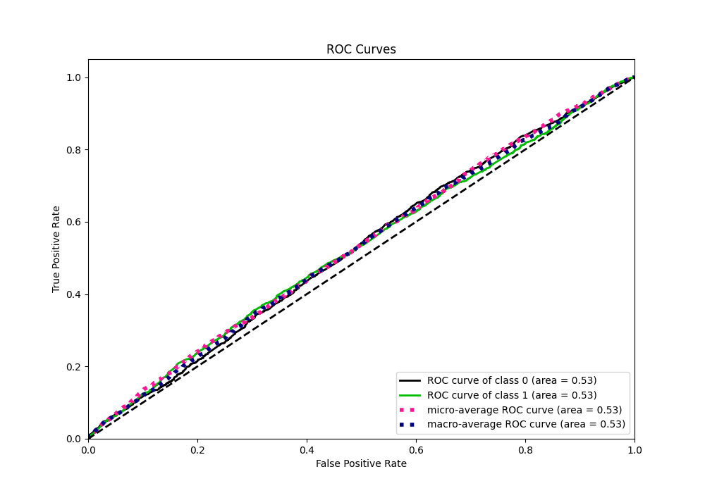
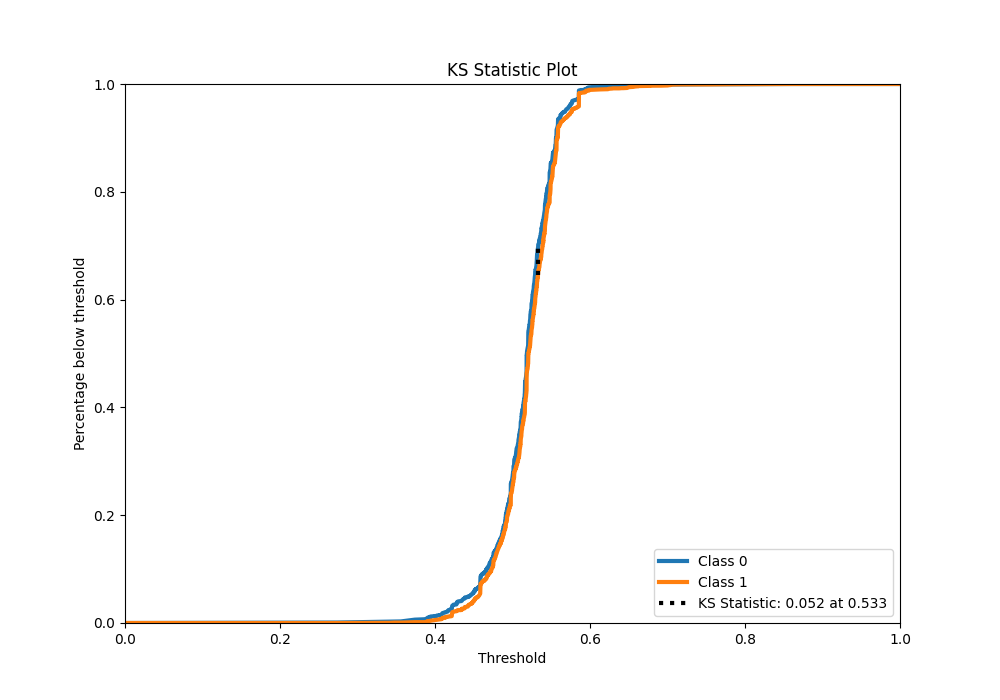
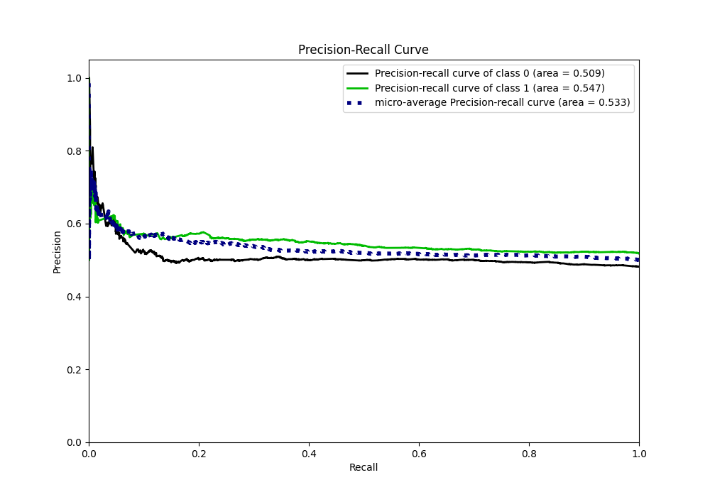
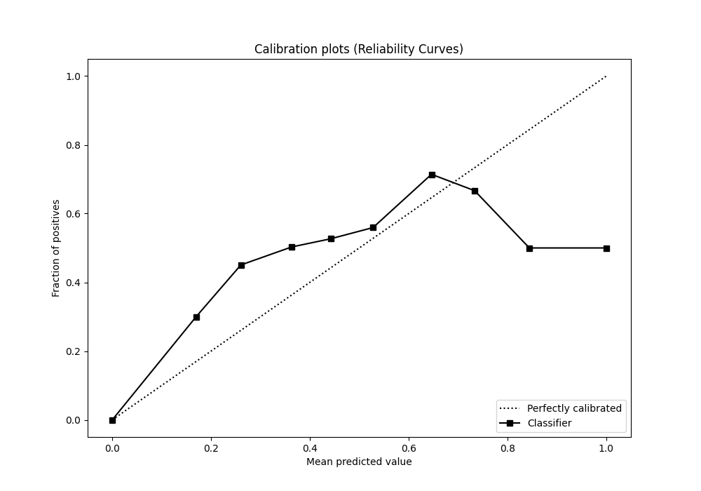
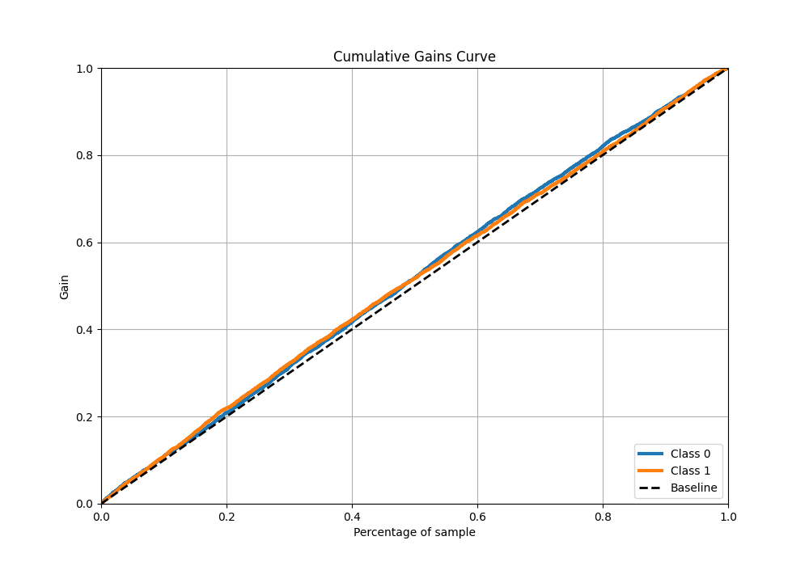
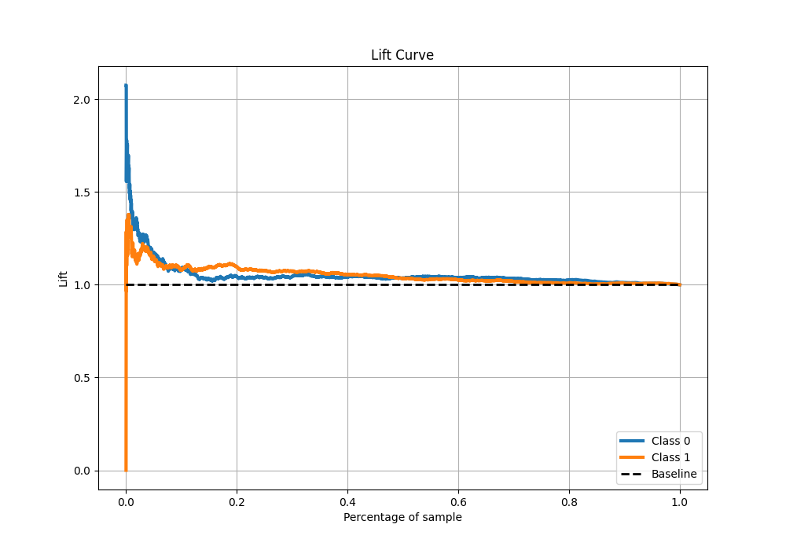

# Summary of 39_RandomForest_SelectedFeatures

[<< Go back](../README.md)

## Random Forest
- **n_jobs**: -1
- **criterion**: gini
- **max_features**: 0.6
- **min_samples_split**: 20
- **max_depth**: 4
- **eval_metric_name**: logloss
- **explain_level**: 1

## Validation
 - **validation_type**: kfold
 - **k_folds**: 5
 - **shuffle**: True
 - **stratify**: True

## Optimized metric
logloss

## Training time

8.4 seconds

## Metric details
|           |     score |   threshold |
|:----------|----------:|------------:|
| logloss   | 0.691125  |  nan        |
| auc       | 0.528399  |  nan        |
| f1        | 0.682733  |    0.405937 |
| accuracy  | 0.52516   |    0.442886 |
| precision | 0.61194   |    0.576954 |
| recall    | 1         |    0.245877 |
| mcc       | 0.0563735 |    0.547931 |

## Metric details with threshold from accuracy metric
|           |     score |   threshold |
|:----------|----------:|------------:|
| logloss   | 0.691125  |  nan        |
| auc       | 0.528399  |  nan        |
| f1        | 0.678735  |    0.442886 |
| accuracy  | 0.52516   |    0.442886 |
| precision | 0.522571  |    0.442886 |
| recall    | 0.968015  |    0.442886 |
| mcc       | 0.0430666 |    0.442886 |

## Confusion matrix (at threshold=0.442886)
|              |   Predicted as 0 |   Predicted as 1 |
|:-------------|-----------------:|-----------------:|
| Labeled as 0 |              118 |             2295 |
| Labeled as 1 |               83 |             2512 |

## Learning curves

## Permutation-based Importance

## Confusion Matrix

## Normalized Confusion Matrix

## ROC Curve

## Kolmogorov-Smirnov Statistic

## Precision-Recall Curve

## Calibration Curve

## Cumulative Gains Curve

## Lift Curve

[<< Go back](../README.md)
