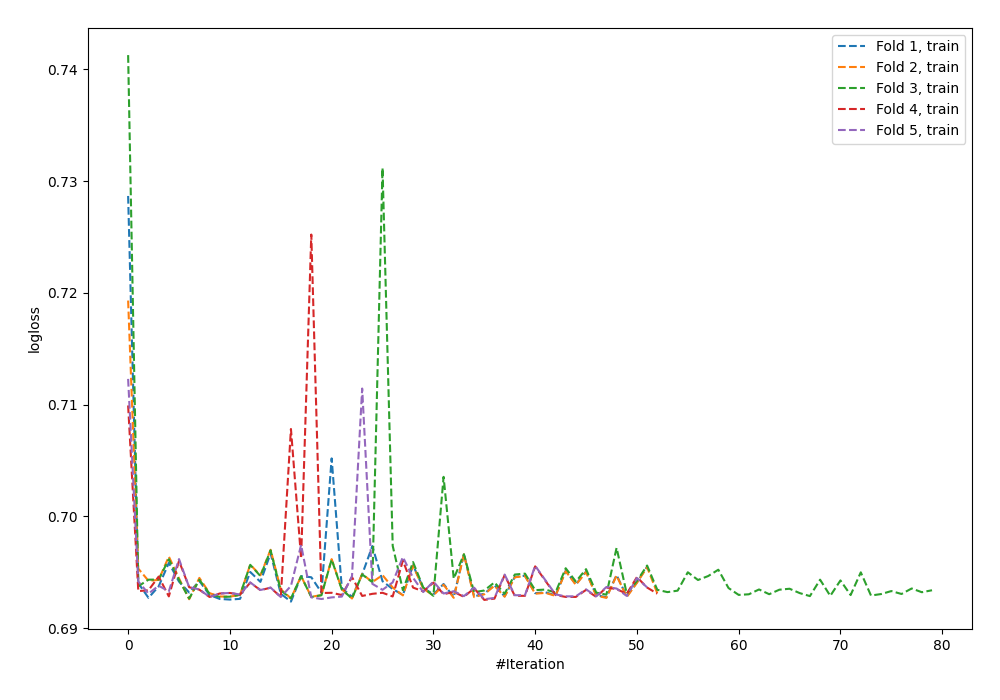
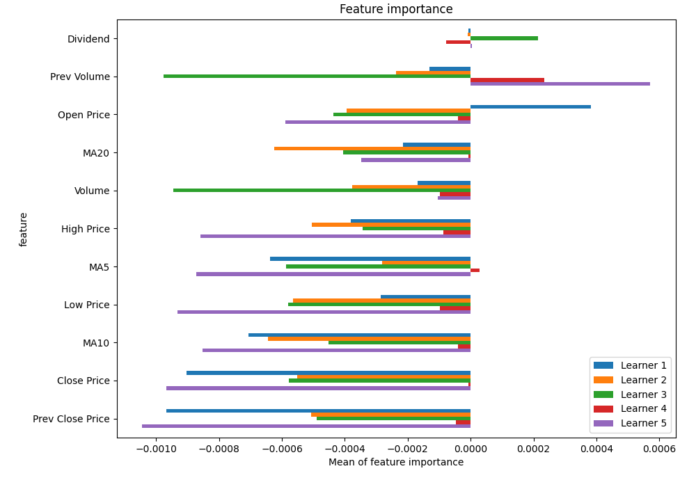
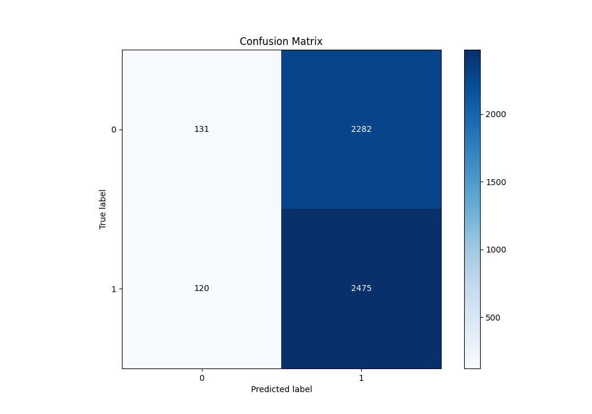
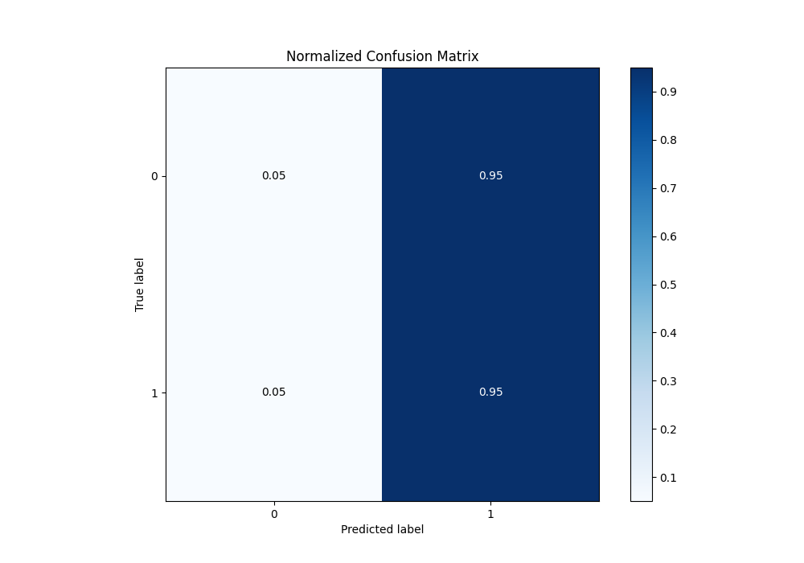
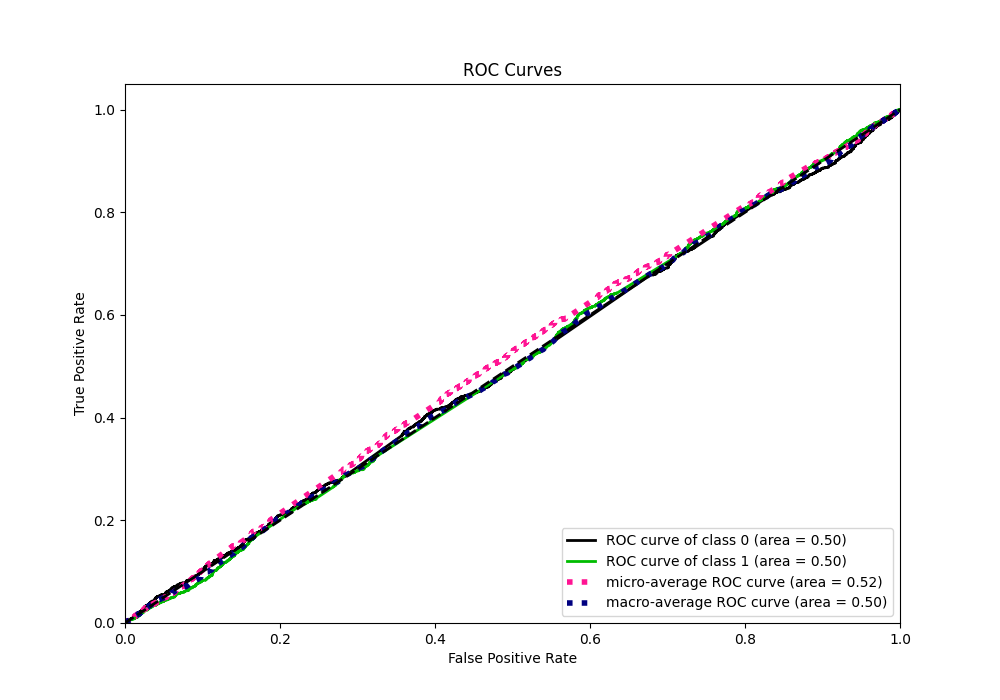
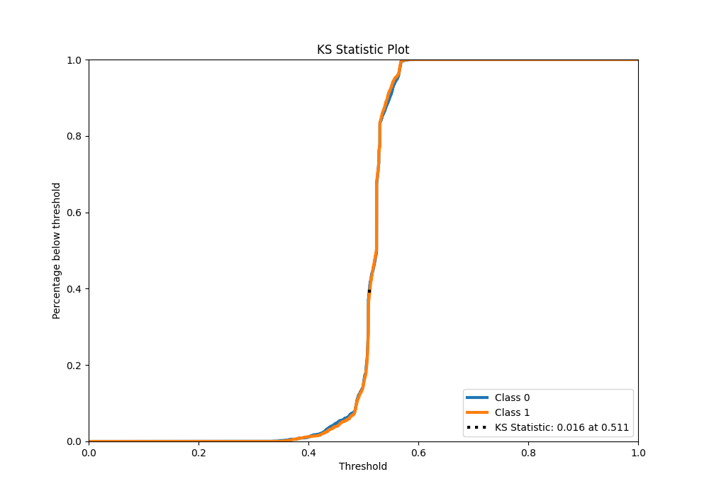
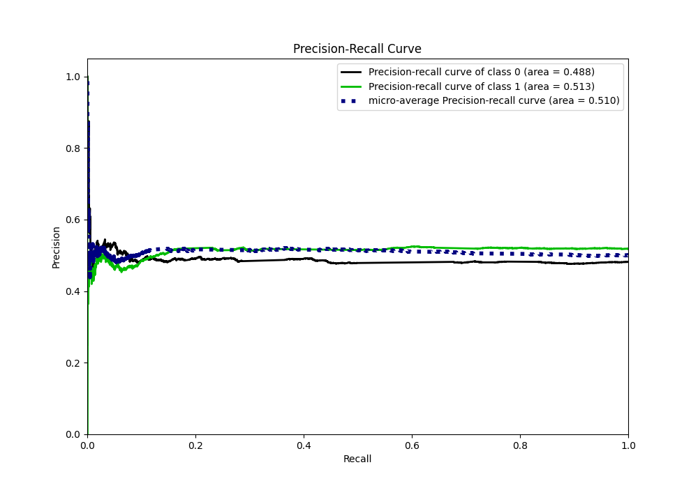
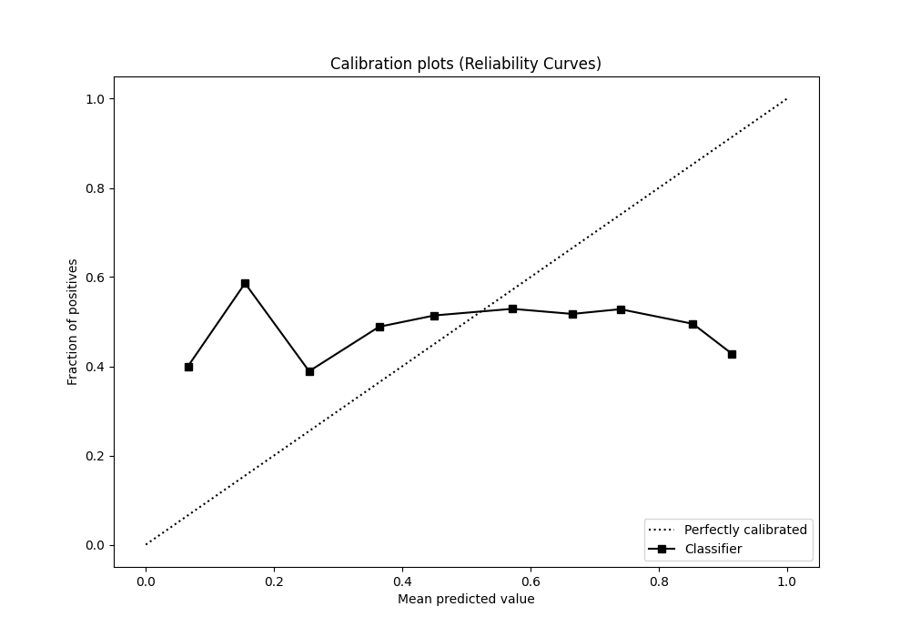
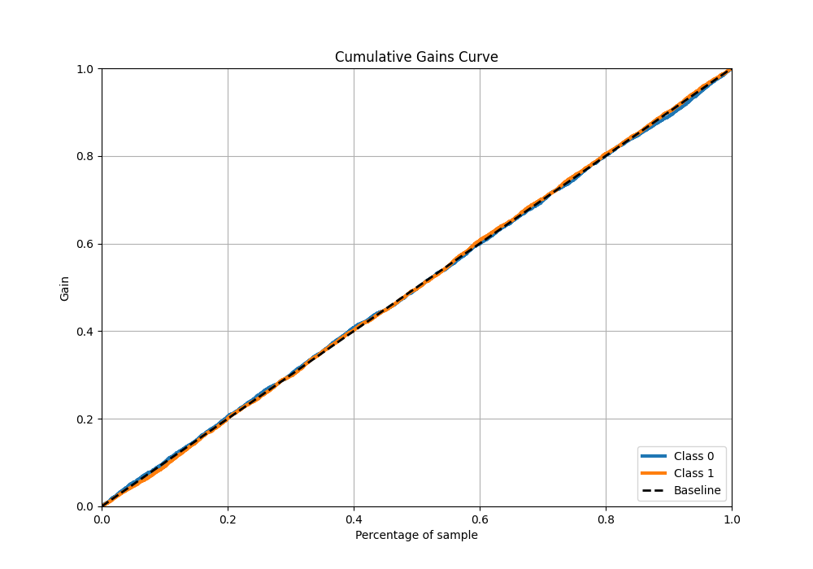
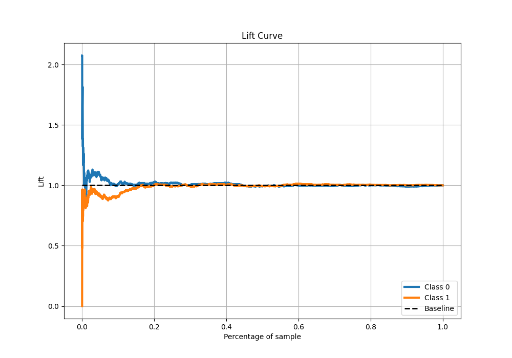

# Summary of 41_NeuralNetwork

[<< Go back](../README.md)

## Neural Network
- **n_jobs**: -1
- **dense_1_size**: 64
- **dense_2_size**: 16
- **learning_rate**: 0.08
- **explain_level**: 1

## Validation
 - **validation_type**: kfold
 - **k_folds**: 5
 - **shuffle**: True
 - **stratify**: True

## Optimized metric
logloss

## Training time

8.3 seconds

## Metric details
|           |     score |   threshold |
|:----------|----------:|------------:|
| logloss   | 0.694123  |  nan        |
| auc       | 0.500061  |  nan        |
| f1        | 0.682625  |    0.301056 |
| accuracy  | 0.520367  |    0.457272 |
| precision | 0.524443  |    0.511593 |
| recall    | 1         |    0.301056 |
| mcc       | 0.0184268 |    0.457272 |

## Metric details with threshold from accuracy metric
|           |     score |   threshold |
|:----------|----------:|------------:|
| logloss   | 0.694123  |  nan        |
| auc       | 0.500061  |  nan        |
| f1        | 0.673286  |    0.457272 |
| accuracy  | 0.520367  |    0.457272 |
| precision | 0.520286  |    0.457272 |
| recall    | 0.953757  |    0.457272 |
| mcc       | 0.0184268 |    0.457272 |

## Confusion matrix (at threshold=0.457272)
|              |   Predicted as 0 |   Predicted as 1 |
|:-------------|-----------------:|-----------------:|
| Labeled as 0 |              131 |             2282 |
| Labeled as 1 |              120 |             2475 |

## Learning curves

## Permutation-based Importance

## Confusion Matrix

## Normalized Confusion Matrix

## ROC Curve

## Kolmogorov-Smirnov Statistic

## Precision-Recall Curve

## Calibration Curve

## Cumulative Gains Curve

## Lift Curve

[<< Go back](../README.md)
