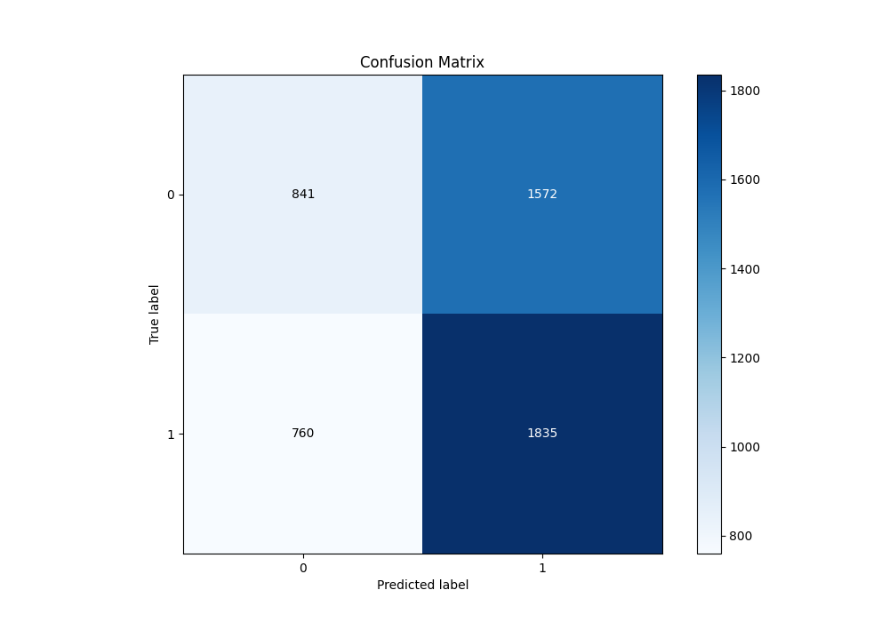

# Summary of 42_LightGBM

[<< Go back](../README.md)

## LightGBM
- **n_jobs**: -1
- **objective**: binary
- **num_leaves**: 95
- **learning_rate**: 0.05
- **feature_fraction**: 0.9
- **bagging_fraction**: 1.0
- **min_data_in_leaf**: 10
- **metric**: binary_logloss
- **custom_eval_metric_name**: None
- **explain_level**: 1

## Validation
 - **validation_type**: kfold
 - **k_folds**: 5
 - **shuffle**: True
 - **stratify**: True

## Optimized metric
logloss

## Training time

6.5 seconds

## Metric details
|           |    score |   threshold |
|:----------|---------:|------------:|
| logloss   | 0.689684 |  nan        |
| auc       | 0.54224  |  nan        |
| f1        | 0.682998 |    0.389593 |
| accuracy  | 0.534345 |    0.509613 |
| precision | 0.66879  |    0.601907 |
| recall    | 1        |    0.25783  |
| mcc       | 0.067413 |    0.518974 |

## Metric details with threshold from accuracy metric
|           |     score |   threshold |
|:----------|----------:|------------:|
| logloss   | 0.689684  |  nan        |
| auc       | 0.54224   |  nan        |
| f1        | 0.611463  |    0.509613 |
| accuracy  | 0.534345  |    0.509613 |
| precision | 0.538597  |    0.509613 |
| recall    | 0.707129  |    0.509613 |
| mcc       | 0.0596338 |    0.509613 |

## Confusion matrix (at threshold=0.509613)
|              |   Predicted as 0 |   Predicted as 1 |
|:-------------|-----------------:|-----------------:|
| Labeled as 0 |              841 |             1572 |
| Labeled as 1 |              760 |             1835 |

## Learning curves

## Permutation-based Importance

## Confusion Matrix

## Normalized Confusion Matrix

## ROC Curve

## Kolmogorov-Smirnov Statistic

## Precision-Recall Curve

## Calibration Curve

## Cumulative Gains Curve

## Lift Curve

[<< Go back](../README.md)
