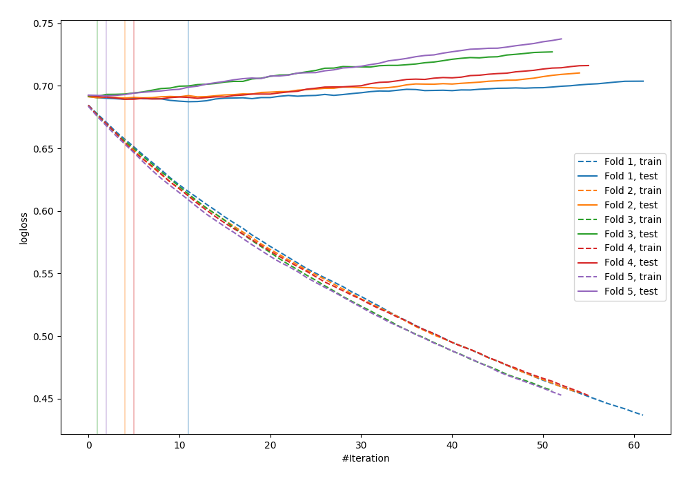
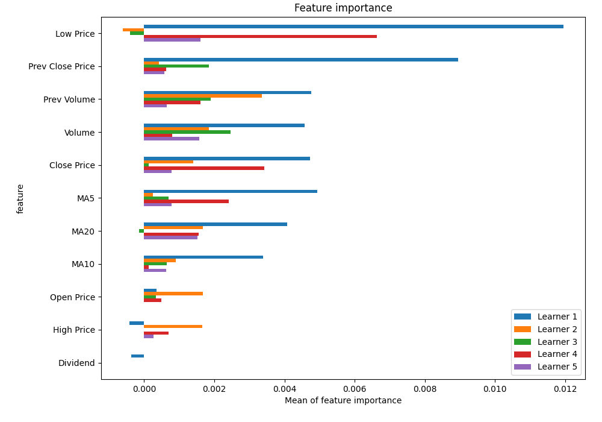
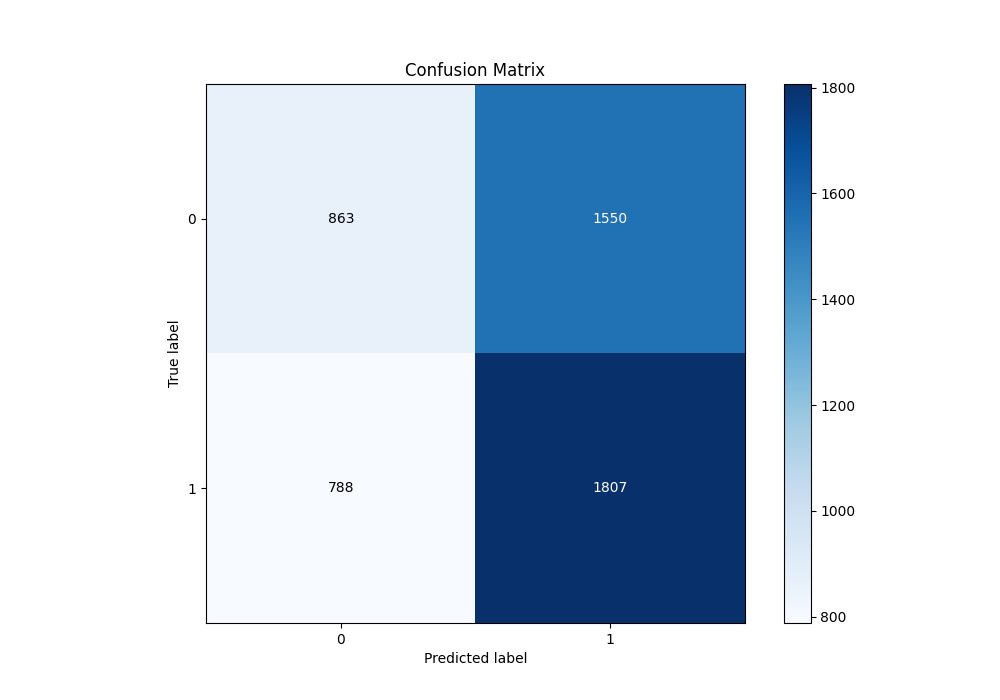
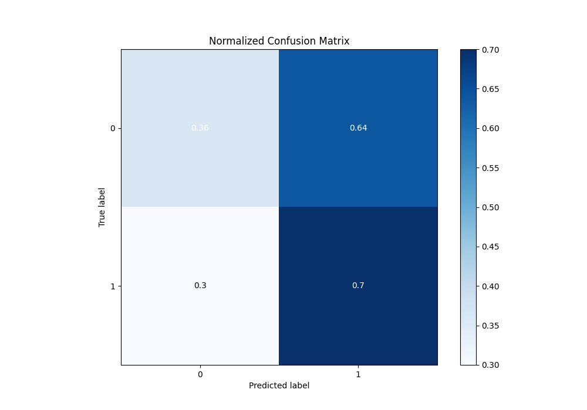
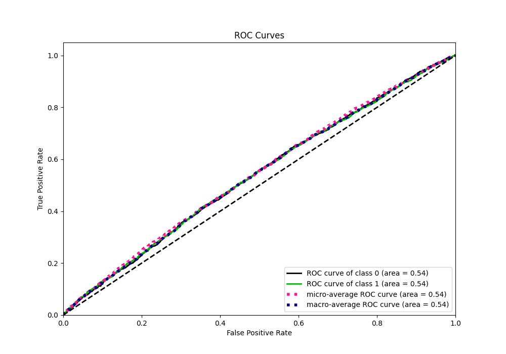
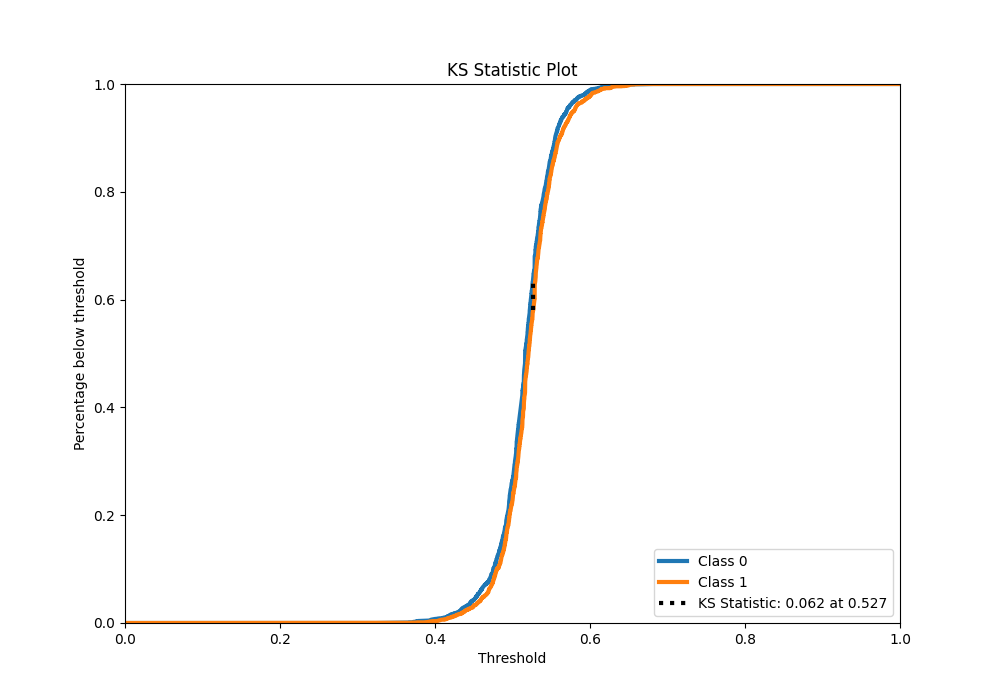
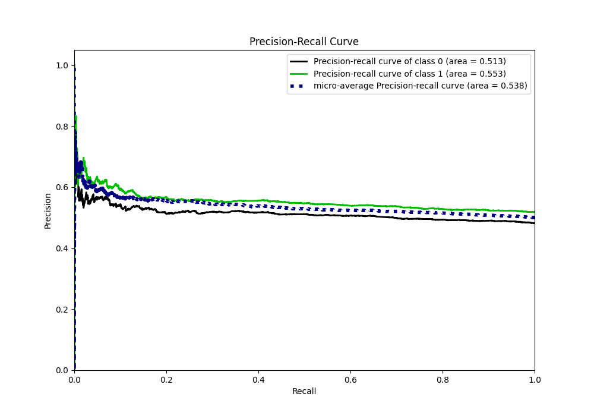
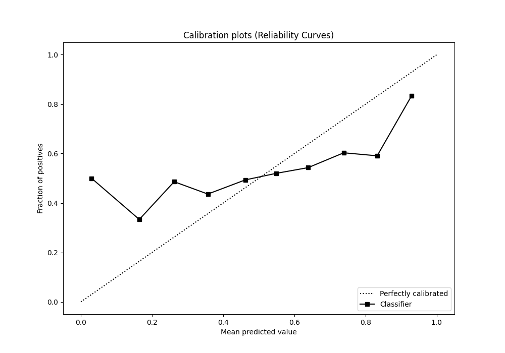
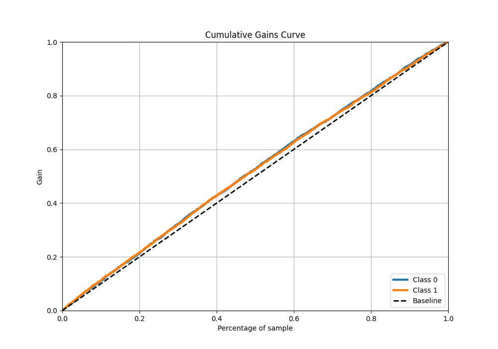
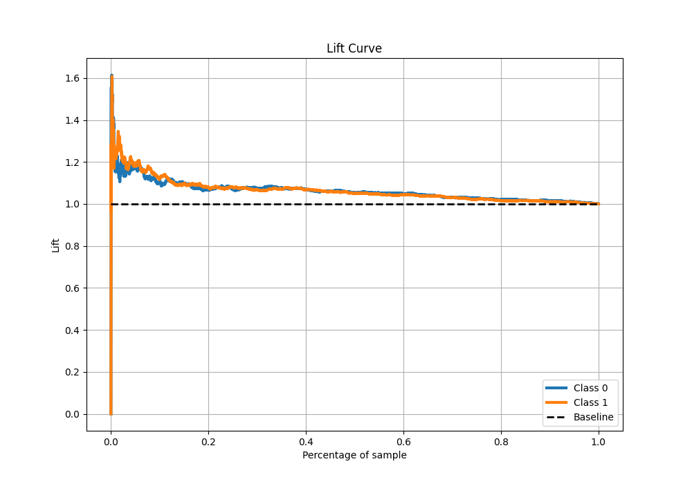

# Summary of 43_LightGBM

[<< Go back](../README.md)

## LightGBM
- **n_jobs**: -1
- **objective**: binary
- **num_leaves**: 127
- **learning_rate**: 0.05
- **feature_fraction**: 0.9
- **bagging_fraction**: 1.0
- **min_data_in_leaf**: 10
- **metric**: binary_logloss
- **custom_eval_metric_name**: None
- **explain_level**: 1

## Validation
 - **validation_type**: kfold
 - **k_folds**: 5
 - **shuffle**: True
 - **stratify**: True

## Optimized metric
logloss

## Training time

6.6 seconds

## Metric details
|           |     score |   threshold |
|:----------|----------:|------------:|
| logloss   | 0.690107  |  nan        |
| auc       | 0.537318  |  nan        |
| f1        | 0.682625  |    0.29202  |
| accuracy  | 0.533147  |    0.507104 |
| precision | 0.649123  |    0.6091   |
| recall    | 1         |    0.29202  |
| mcc       | 0.0621968 |    0.526731 |

## Metric details with threshold from accuracy metric
|           |     score |   threshold |
|:----------|----------:|------------:|
| logloss   | 0.690107  |  nan        |
| auc       | 0.537318  |  nan        |
| f1        | 0.607191  |    0.507104 |
| accuracy  | 0.533147  |    0.507104 |
| precision | 0.538278  |    0.507104 |
| recall    | 0.696339  |    0.507104 |
| mcc       | 0.0573816 |    0.507104 |

## Confusion matrix (at threshold=0.507104)
|              |   Predicted as 0 |   Predicted as 1 |
|:-------------|-----------------:|-----------------:|
| Labeled as 0 |              863 |             1550 |
| Labeled as 1 |              788 |             1807 |

## Learning curves

## Permutation-based Importance

## Confusion Matrix

## Normalized Confusion Matrix

## ROC Curve

## Kolmogorov-Smirnov Statistic

## Precision-Recall Curve

## Calibration Curve

## Cumulative Gains Curve

## Lift Curve

[<< Go back](../README.md)
