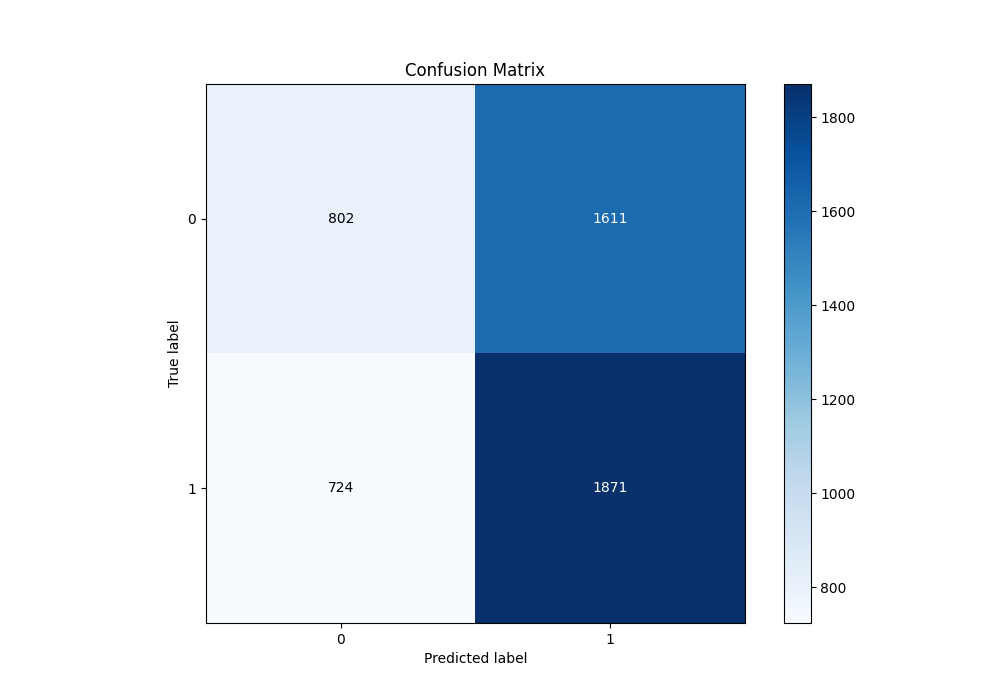

# Summary of 45_Xgboost

[<< Go back](../README.md)

## Extreme Gradient Boosting (Xgboost)
- **n_jobs**: -1
- **objective**: binary:logistic
- **eta**: 0.05
- **max_depth**: 8
- **min_child_weight**: 10
- **subsample**: 1.0
- **colsample_bytree**: 1.0
- **eval_metric**: logloss
- **explain_level**: 1

## Validation
 - **validation_type**: kfold
 - **k_folds**: 5
 - **shuffle**: True
 - **stratify**: True

## Optimized metric
logloss

## Training time

6.1 seconds

## Metric details
|           |     score |   threshold |
|:----------|----------:|------------:|
| logloss   | 0.690189  |  nan        |
| auc       | 0.53759   |  nan        |
| f1        | 0.682625  |    0.314071 |
| accuracy  | 0.533746  |    0.510604 |
| precision | 0.606452  |    0.587647 |
| recall    | 1         |    0.314071 |
| mcc       | 0.0608048 |    0.524601 |

## Metric details with threshold from accuracy metric
|           |     score |   threshold |
|:----------|----------:|------------:|
| logloss   | 0.690189  |  nan        |
| auc       | 0.53759   |  nan        |
| f1        | 0.615764  |    0.510604 |
| accuracy  | 0.533746  |    0.510604 |
| precision | 0.537335  |    0.510604 |
| recall    | 0.721002  |    0.510604 |
| mcc       | 0.0579347 |    0.510604 |

## Confusion matrix (at threshold=0.510604)
|              |   Predicted as 0 |   Predicted as 1 |
|:-------------|-----------------:|-----------------:|
| Labeled as 0 |              802 |             1611 |
| Labeled as 1 |              724 |             1871 |

## Learning curves

## Permutation-based Importance

## Confusion Matrix

## Normalized Confusion Matrix

## ROC Curve

## Kolmogorov-Smirnov Statistic

## Precision-Recall Curve

## Calibration Curve

## Cumulative Gains Curve

## Lift Curve

[<< Go back](../README.md)
