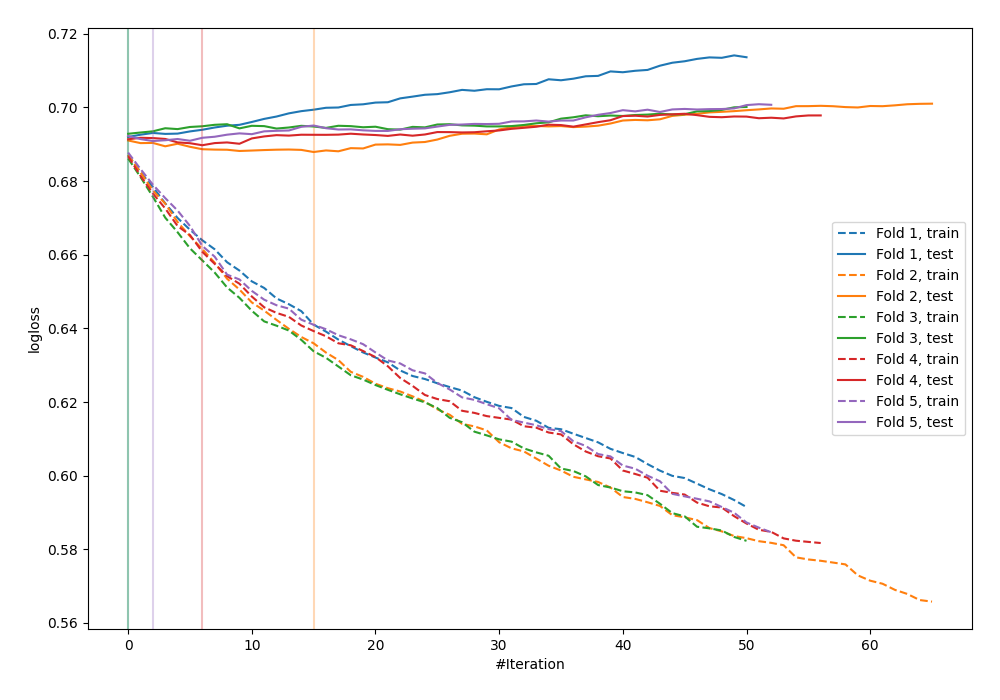
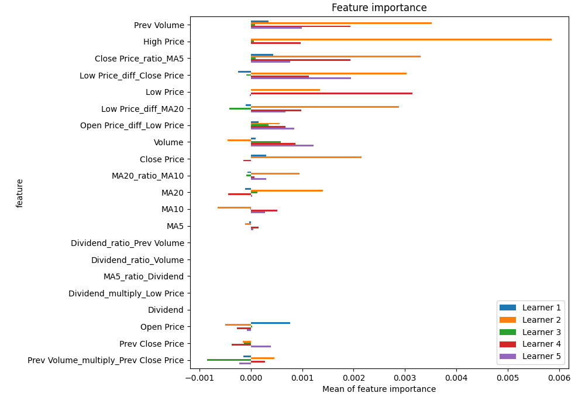
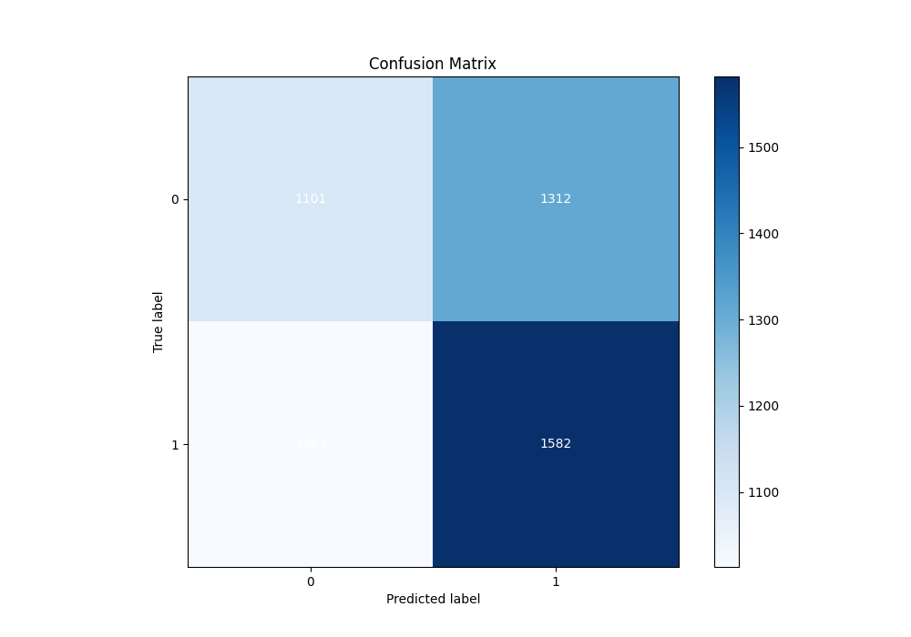
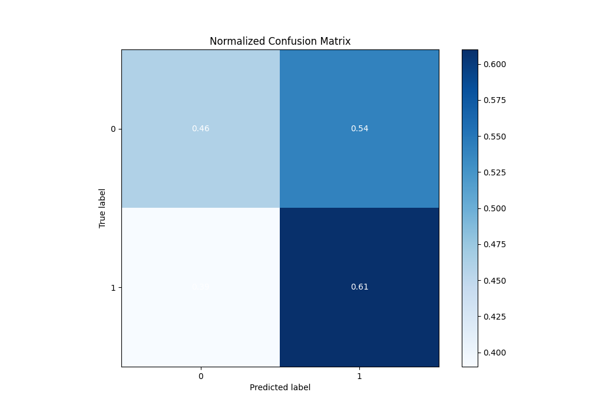
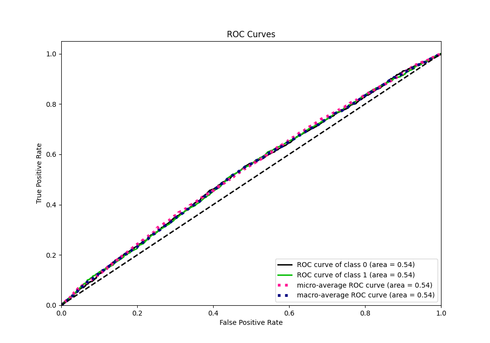
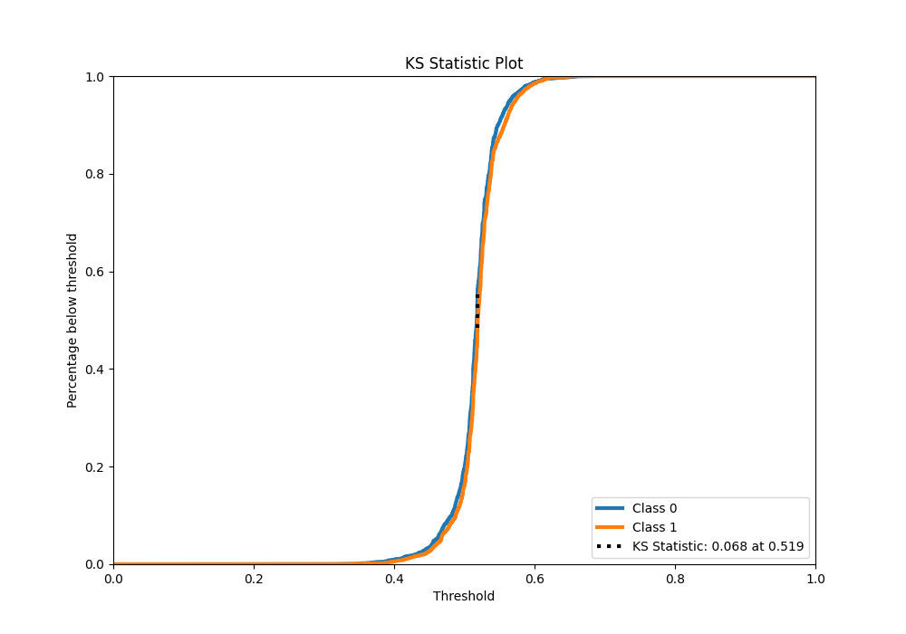
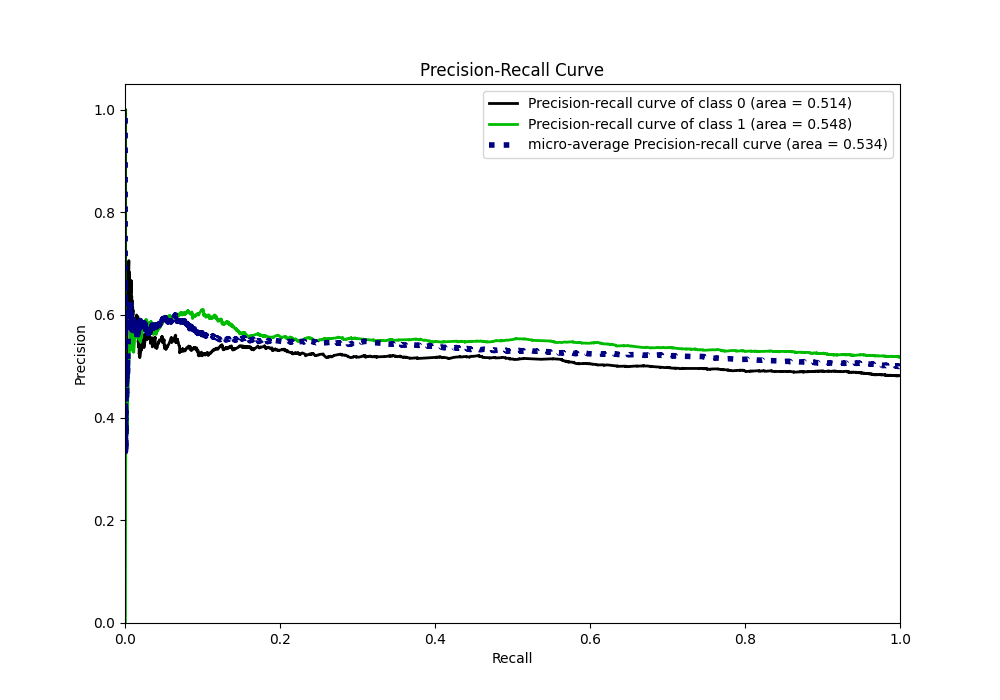
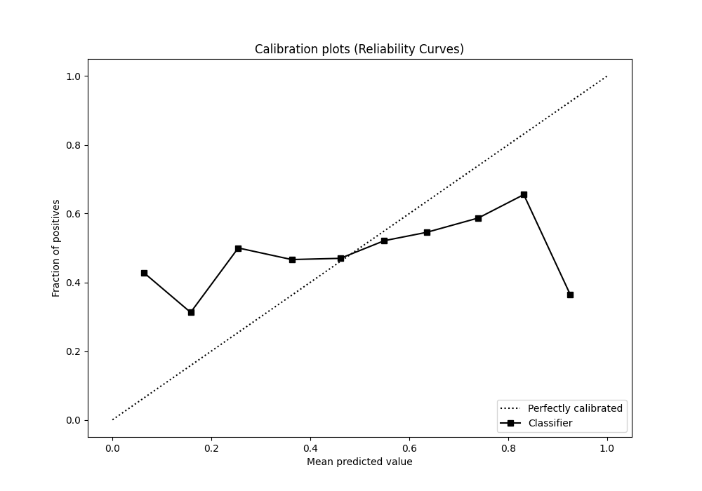
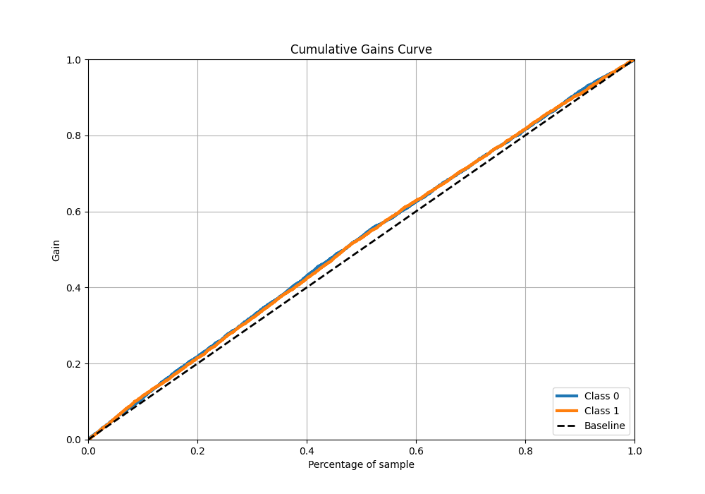
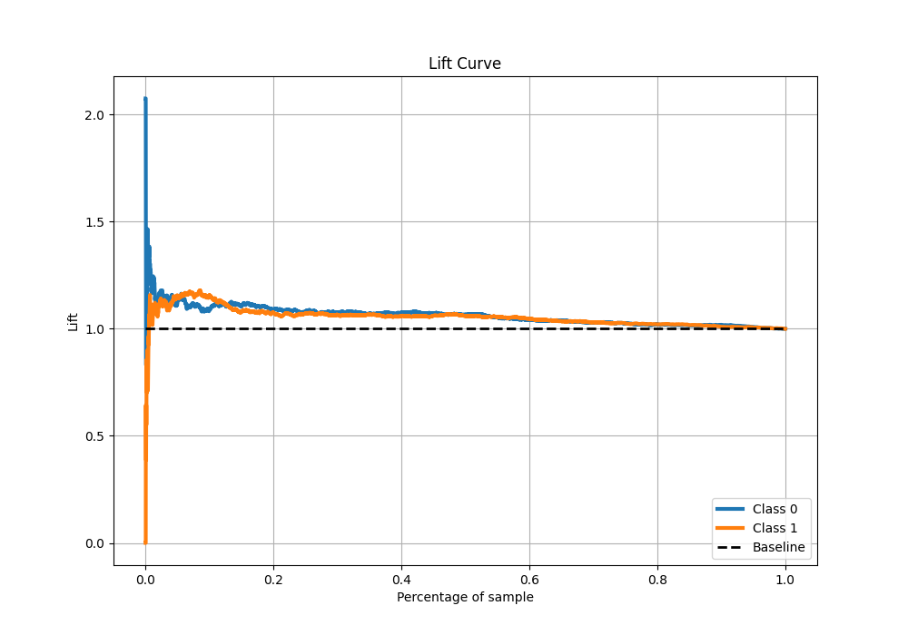

# Summary of 47_Xgboost_GoldenFeatures

[<< Go back](../README.md)

## Extreme Gradient Boosting (Xgboost)
- **n_jobs**: -1
- **objective**: binary:logistic
- **eta**: 0.075
- **max_depth**: 8
- **min_child_weight**: 10
- **subsample**: 1.0
- **colsample_bytree**: 1.0
- **eval_metric**: logloss
- **explain_level**: 1

## Validation
 - **validation_type**: kfold
 - **k_folds**: 5
 - **shuffle**: True
 - **stratify**: True

## Optimized metric
logloss

## Training time

7.4 seconds

## Metric details
|           |     score |   threshold |
|:----------|----------:|------------:|
| logloss   | 0.690679  |  nan        |
| auc       | 0.537552  |  nan        |
| f1        | 0.682625  |    0.283539 |
| accuracy  | 0.535743  |    0.515087 |
| precision | 0.605114  |    0.561759 |
| recall    | 1         |    0.283539 |
| mcc       | 0.0679956 |    0.518706 |

## Metric details with threshold from accuracy metric
|           |     score |   threshold |
|:----------|----------:|------------:|
| logloss   | 0.690679  |  nan        |
| auc       | 0.537552  |  nan        |
| f1        | 0.576426  |    0.515087 |
| accuracy  | 0.535743  |    0.515087 |
| precision | 0.546648  |    0.515087 |
| recall    | 0.609634  |    0.515087 |
| mcc       | 0.0666826 |    0.515087 |

## Confusion matrix (at threshold=0.515087)
|              |   Predicted as 0 |   Predicted as 1 |
|:-------------|-----------------:|-----------------:|
| Labeled as 0 |             1101 |             1312 |
| Labeled as 1 |             1013 |             1582 |

## Learning curves

## Permutation-based Importance

## Confusion Matrix

## Normalized Confusion Matrix

## ROC Curve

## Kolmogorov-Smirnov Statistic

## Precision-Recall Curve

## Calibration Curve

## Cumulative Gains Curve

## Lift Curve

[<< Go back](../README.md)
