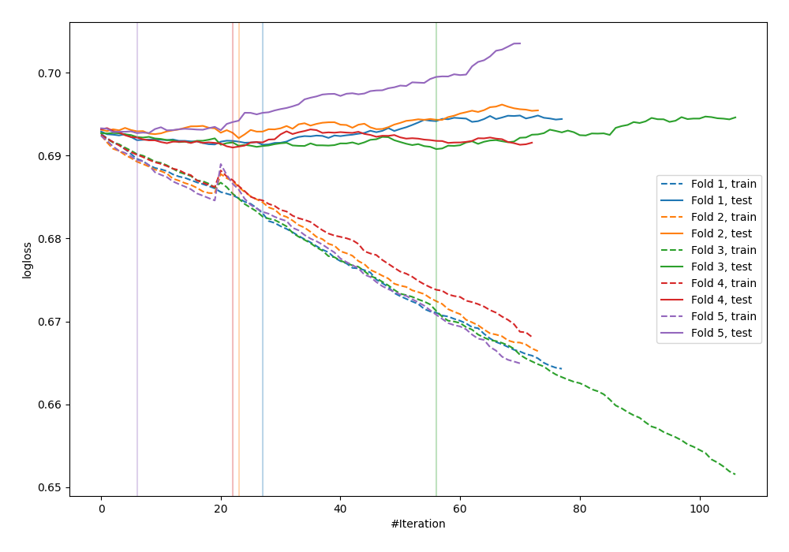

# Summary of 48_CatBoost

[<< Go back](../README.md)

## CatBoost
- **n_jobs**: -1
- **learning_rate**: 0.1
- **depth**: 6
- **rsm**: 0.9
- **loss_function**: Logloss
- **eval_metric**: Logloss
- **explain_level**: 1

## Validation
 - **validation_type**: kfold
 - **k_folds**: 5
 - **shuffle**: True
 - **stratify**: True

## Optimized metric
logloss

## Training time

7.6 seconds

## Metric details
|           |     score |   threshold |
|:----------|----------:|------------:|
| logloss   | 0.691642  |  nan        |
| auc       | 0.525138  |  nan        |
| f1        | 0.682625  |    0.270406 |
| accuracy  | 0.527955  |    0.494879 |
| precision | 0.575492  |    0.55093  |
| recall    | 1         |    0.270406 |
| mcc       | 0.0467897 |    0.528822 |

## Metric details with threshold from accuracy metric
|           |     score |   threshold |
|:----------|----------:|------------:|
| logloss   | 0.691642  |  nan        |
| auc       | 0.525138  |  nan        |
| f1        | 0.641927  |    0.494879 |
| accuracy  | 0.527955  |    0.494879 |
| precision | 0.528825  |    0.494879 |
| recall    | 0.81657   |    0.494879 |
| mcc       | 0.0426587 |    0.494879 |

## Confusion matrix (at threshold=0.494879)
|              |   Predicted as 0 |   Predicted as 1 |
|:-------------|-----------------:|-----------------:|
| Labeled as 0 |              525 |             1888 |
| Labeled as 1 |              476 |             2119 |

## Learning curves

## Permutation-based Importance

## Confusion Matrix

## Normalized Confusion Matrix

## ROC Curve

## Kolmogorov-Smirnov Statistic

## Precision-Recall Curve

## Calibration Curve

## Cumulative Gains Curve

## Lift Curve

[<< Go back](../README.md)
