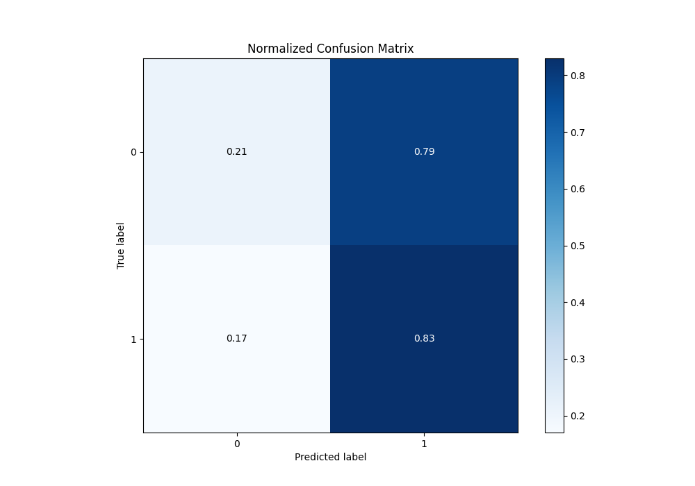
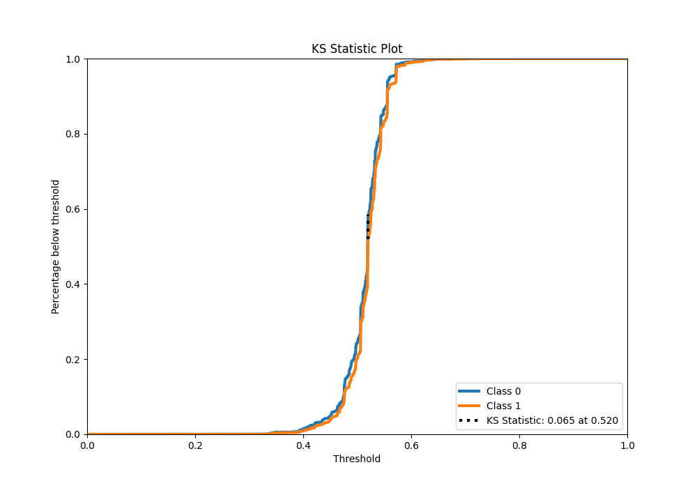

# Summary of 49_RandomForest

[<< Go back](../README.md)

## Random Forest
- **n_jobs**: -1
- **criterion**: gini
- **max_features**: 0.5
- **min_samples_split**: 20
- **max_depth**: 3
- **eval_metric_name**: logloss
- **explain_level**: 1

## Validation
 - **validation_type**: kfold
 - **k_folds**: 5
 - **shuffle**: True
 - **stratify**: True

## Optimized metric
logloss

## Training time

9.1 seconds

## Metric details
|           |     score |   threshold |
|:----------|----------:|------------:|
| logloss   | 0.690442  |  nan        |
| auc       | 0.537972  |  nan        |
| f1        | 0.682625  |    0.290688 |
| accuracy  | 0.532149  |    0.495919 |
| precision | 0.617647  |    0.572317 |
| recall    | 1         |    0.290688 |
| mcc       | 0.0650987 |    0.520084 |

## Metric details with threshold from accuracy metric
|           |     score |   threshold |
|:----------|----------:|------------:|
| logloss   | 0.690442  |  nan        |
| auc       | 0.537972  |  nan        |
| f1        | 0.647616  |    0.495919 |
| accuracy  | 0.532149  |    0.495919 |
| precision | 0.53108   |    0.495919 |
| recall    | 0.829672  |    0.495919 |
| mcc       | 0.0532591 |    0.495919 |

## Confusion matrix (at threshold=0.495919)
|              |   Predicted as 0 |   Predicted as 1 |
|:-------------|-----------------:|-----------------:|
| Labeled as 0 |              512 |             1901 |
| Labeled as 1 |              442 |             2153 |

## Learning curves

## Permutation-based Importance

## Confusion Matrix

## Normalized Confusion Matrix

## ROC Curve

## Kolmogorov-Smirnov Statistic

## Precision-Recall Curve

## Calibration Curve

## Cumulative Gains Curve

## Lift Curve

[<< Go back](../README.md)
