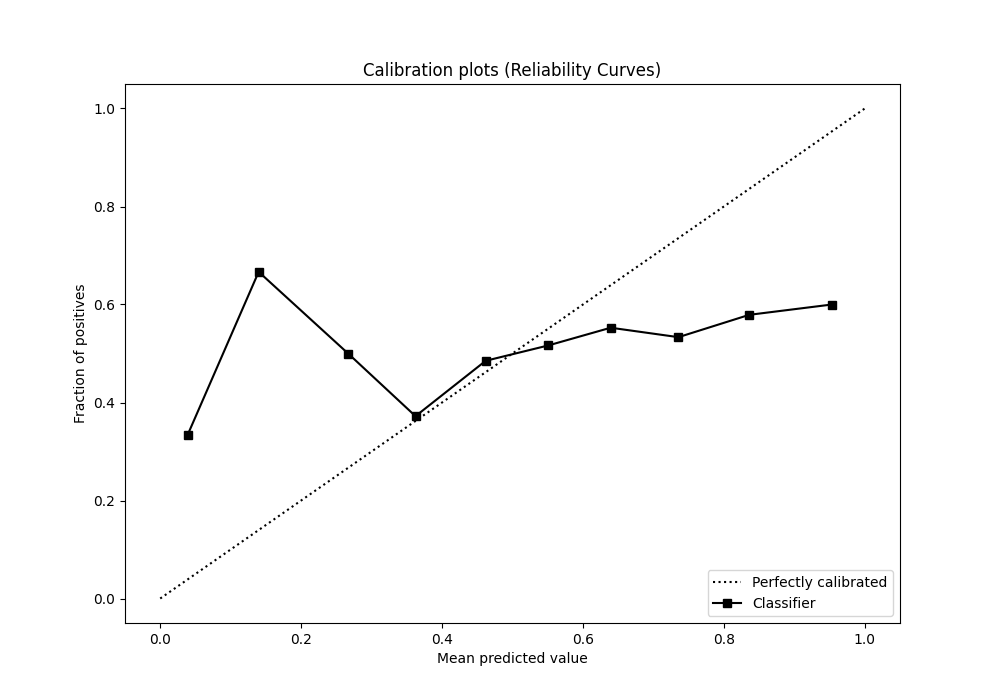

# Summary of 4_Default_CatBoost

[<< Go back](../README.md)

## CatBoost
- **n_jobs**: -1
- **learning_rate**: 0.1
- **depth**: 6
- **rsm**: 1
- **loss_function**: Logloss
- **eval_metric**: Logloss
- **explain_level**: 1

## Validation
 - **validation_type**: kfold
 - **k_folds**: 5
 - **shuffle**: True
 - **stratify**: True

## Optimized metric
logloss

## Training time

5.4 seconds

## Metric details
|           |     score |   threshold |
|:----------|----------:|------------:|
| logloss   | 0.691116  |  nan        |
| auc       | 0.529893  |  nan        |
| f1        | 0.682625  |    0.285461 |
| accuracy  | 0.529952  |    0.493449 |
| precision | 0.578947  |    0.589117 |
| recall    | 1         |    0.285461 |
| mcc       | 0.0493137 |    0.531955 |

## Metric details with threshold from accuracy metric
|           |     score |   threshold |
|:----------|----------:|------------:|
| logloss   | 0.691116  |  nan        |
| auc       | 0.529893  |  nan        |
| f1        | 0.646121  |    0.493449 |
| accuracy  | 0.529952  |    0.493449 |
| precision | 0.529702  |    0.493449 |
| recall    | 0.828131  |    0.493449 |
| mcc       | 0.0476639 |    0.493449 |

## Confusion matrix (at threshold=0.493449)
|              |   Predicted as 0 |   Predicted as 1 |
|:-------------|-----------------:|-----------------:|
| Labeled as 0 |              505 |             1908 |
| Labeled as 1 |              446 |             2149 |

## Learning curves

## Permutation-based Importance

## Confusion Matrix

## Normalized Confusion Matrix

## ROC Curve

## Kolmogorov-Smirnov Statistic

## Precision-Recall Curve

## Calibration Curve

## Cumulative Gains Curve

## Lift Curve

[<< Go back](../README.md)
