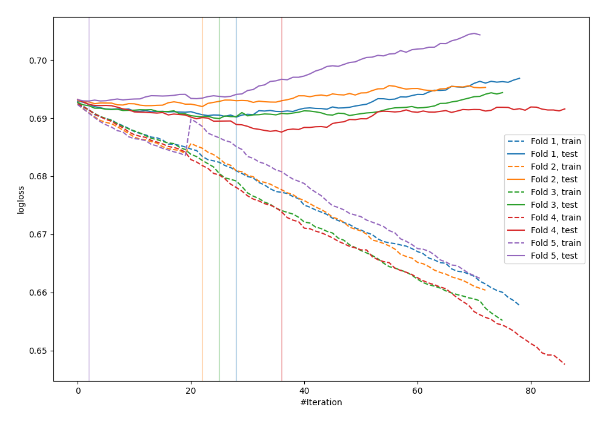
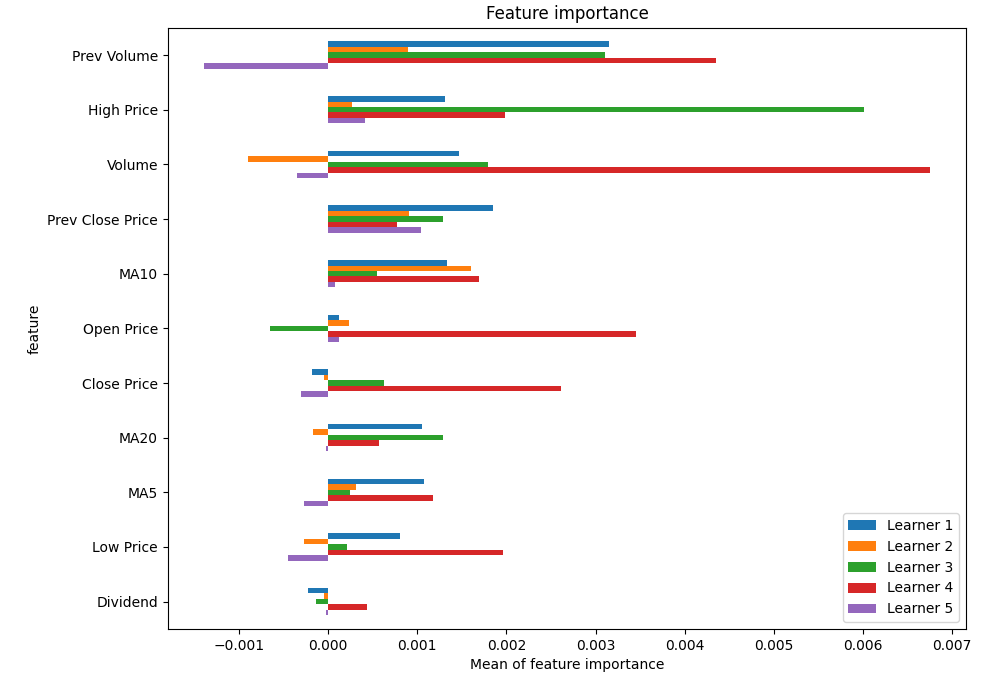
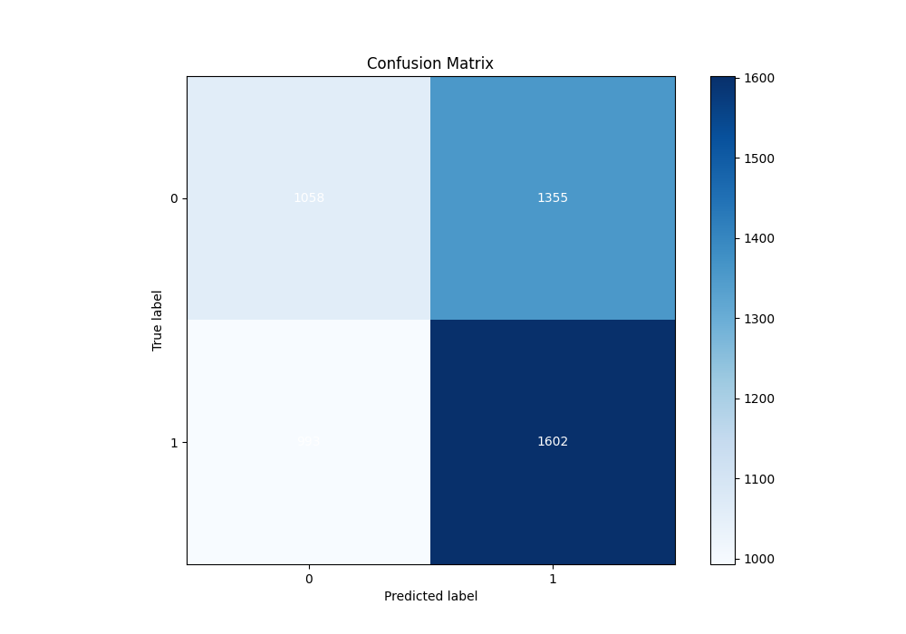
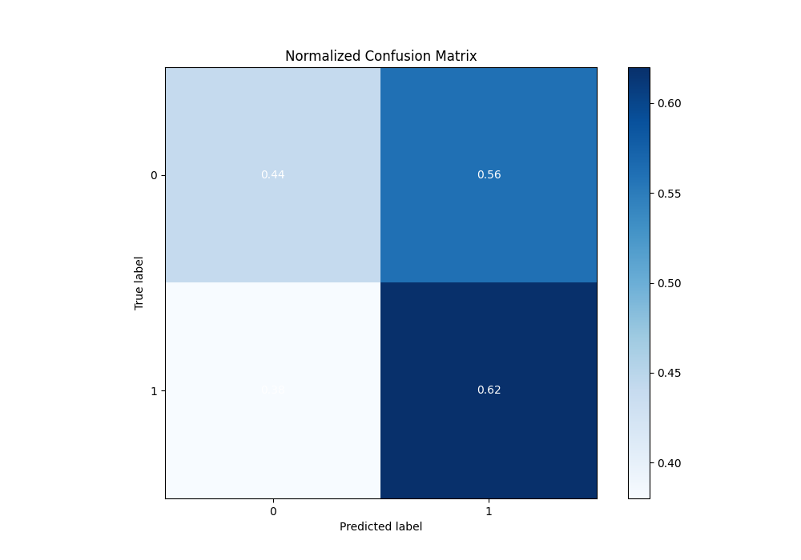
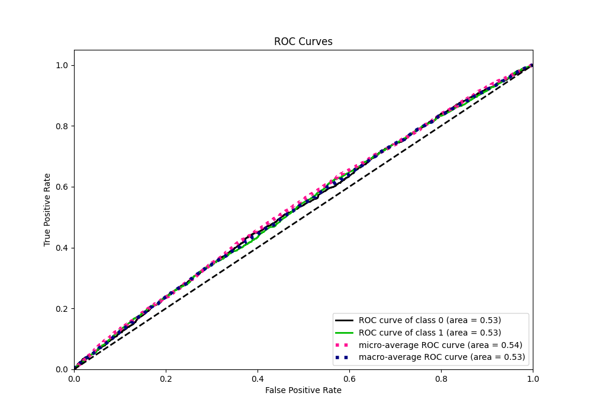
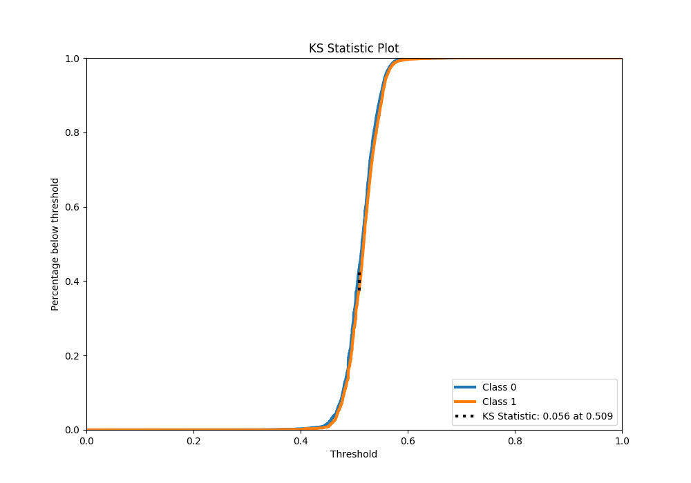
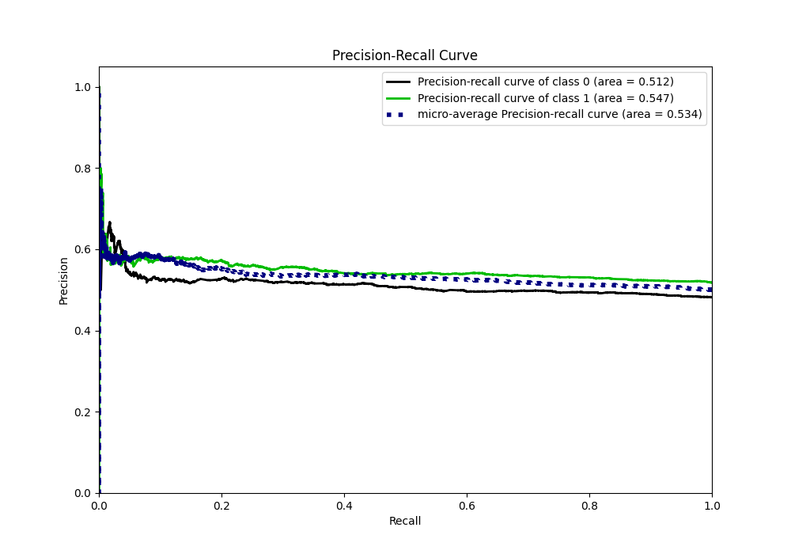
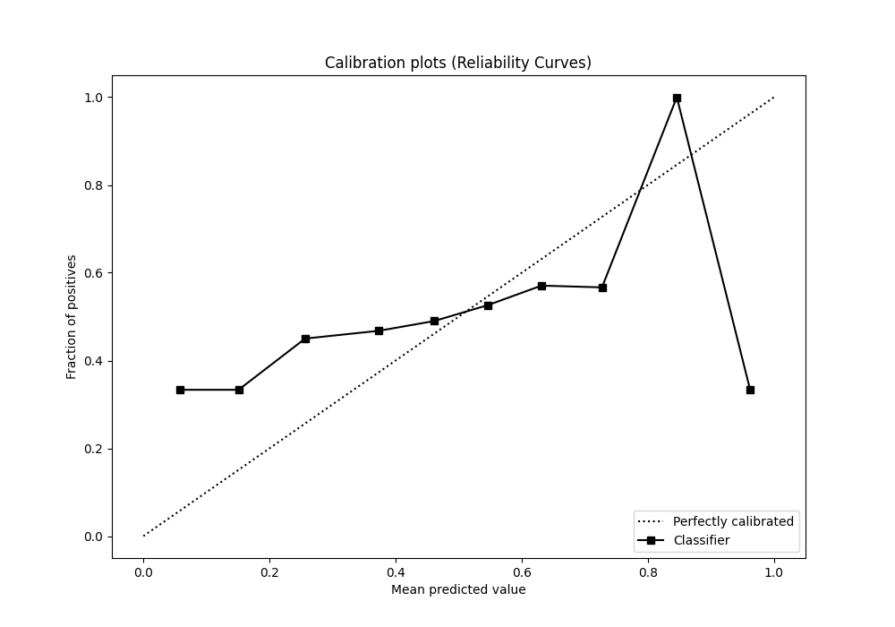
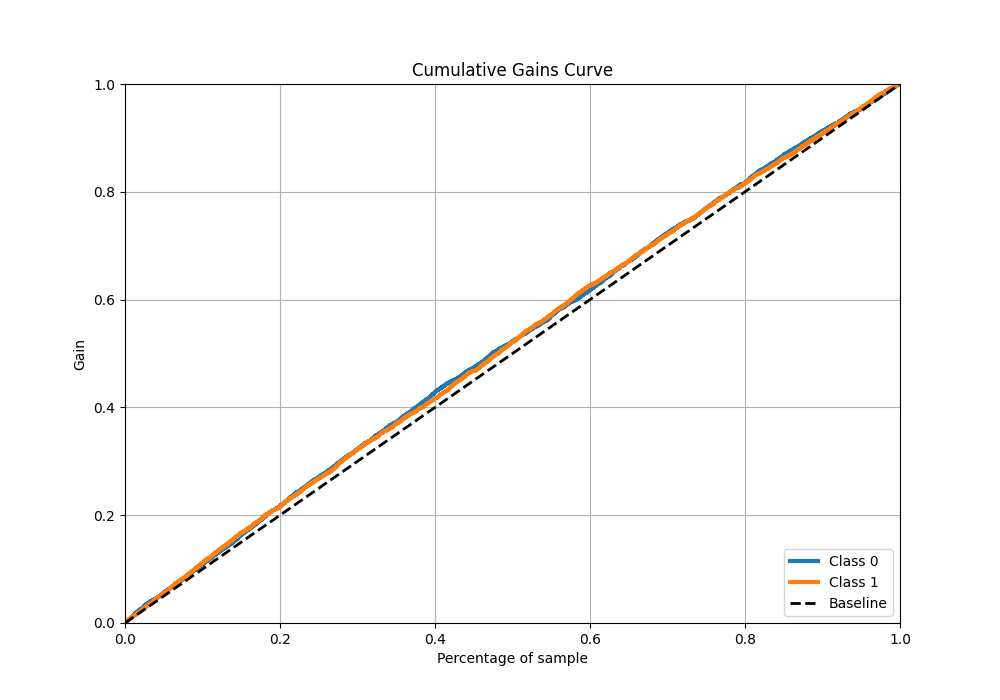
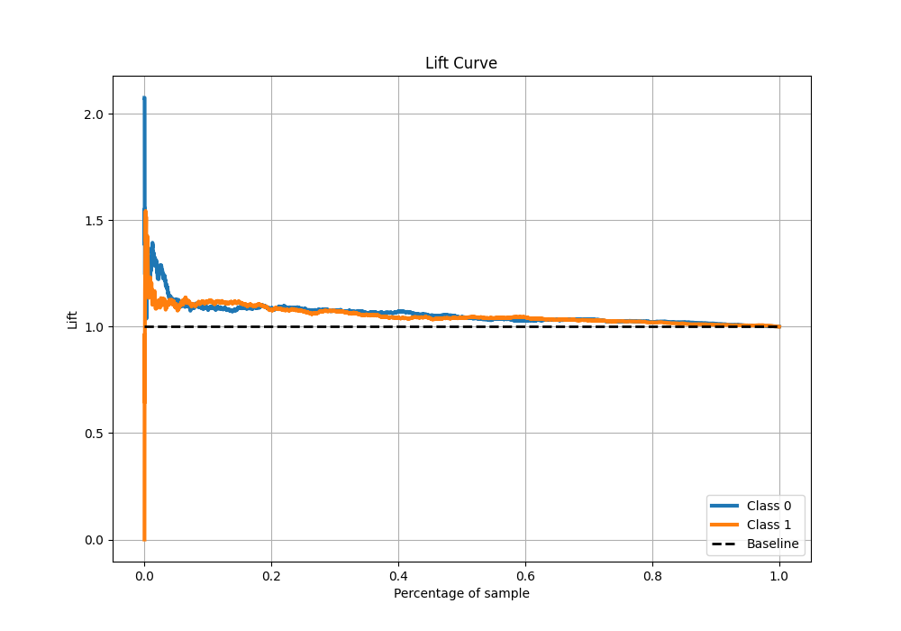

# Summary of 51_CatBoost

[<< Go back](../README.md)

## CatBoost
- **n_jobs**: -1
- **learning_rate**: 0.1
- **depth**: 7
- **rsm**: 0.9
- **loss_function**: Logloss
- **eval_metric**: Logloss
- **explain_level**: 1

## Validation
 - **validation_type**: kfold
 - **k_folds**: 5
 - **shuffle**: True
 - **stratify**: True

## Optimized metric
logloss

## Training time

29.5 seconds

## Metric details
|           |     score |   threshold |
|:----------|----------:|------------:|
| logloss   | 0.690607  |  nan        |
| auc       | 0.533298  |  nan        |
| f1        | 0.682625  |    0.289987 |
| accuracy  | 0.53115   |    0.50983  |
| precision | 0.614035  |    0.575168 |
| recall    | 1         |    0.289987 |
| mcc       | 0.0566981 |    0.50983  |

## Metric details with threshold from accuracy metric
|           |     score |   threshold |
|:----------|----------:|------------:|
| logloss   | 0.690607  |   nan       |
| auc       | 0.533298  |   nan       |
| f1        | 0.577089  |     0.50983 |
| accuracy  | 0.53115   |     0.50983 |
| precision | 0.541765  |     0.50983 |
| recall    | 0.617341  |     0.50983 |
| mcc       | 0.0566981 |     0.50983 |

## Confusion matrix (at threshold=0.50983)
|              |   Predicted as 0 |   Predicted as 1 |
|:-------------|-----------------:|-----------------:|
| Labeled as 0 |             1058 |             1355 |
| Labeled as 1 |              993 |             1602 |

## Learning curves

## Permutation-based Importance

## Confusion Matrix

## Normalized Confusion Matrix

## ROC Curve

## Kolmogorov-Smirnov Statistic

## Precision-Recall Curve

## Calibration Curve

## Cumulative Gains Curve

## Lift Curve

[<< Go back](../README.md)
