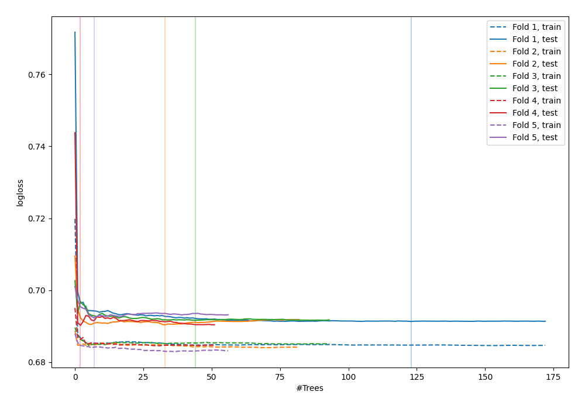
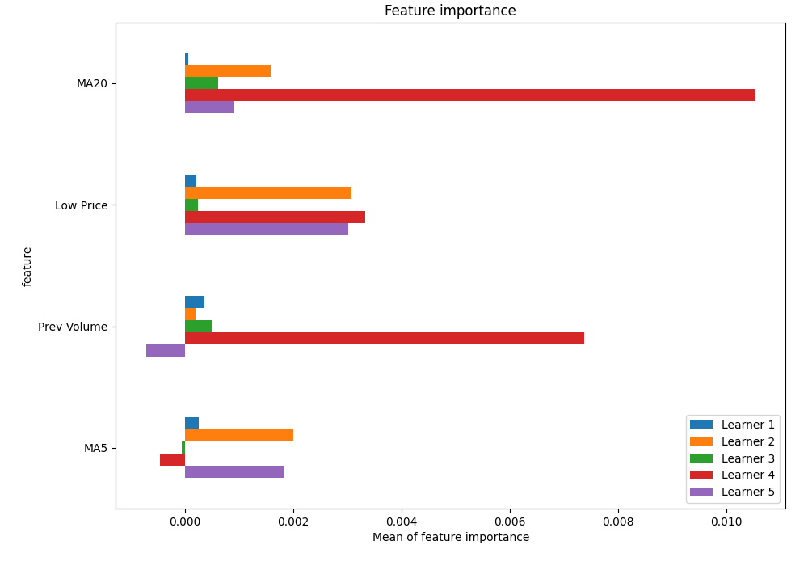
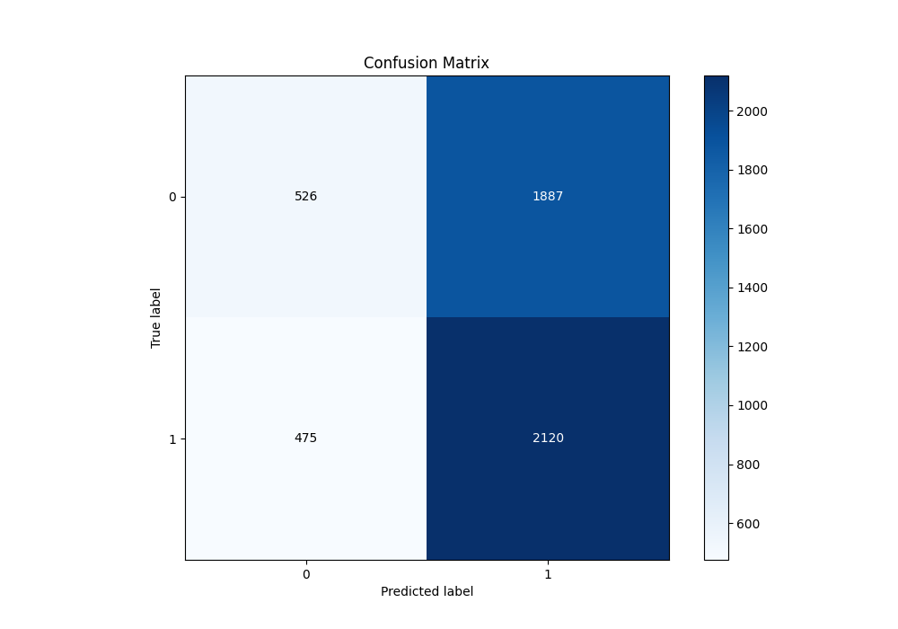
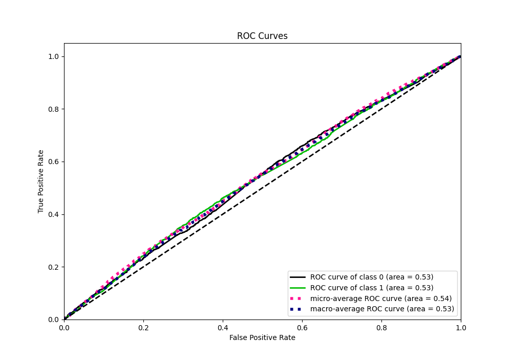
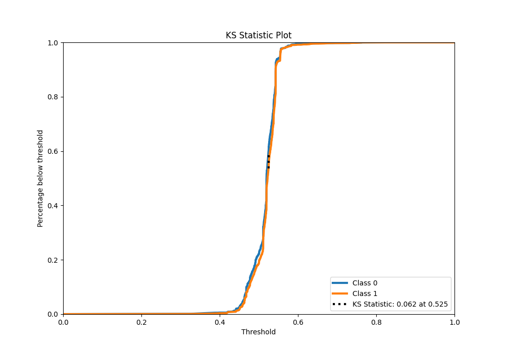
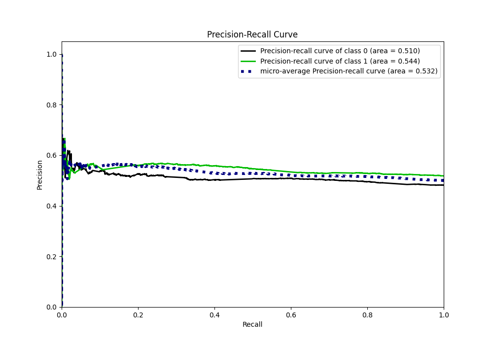
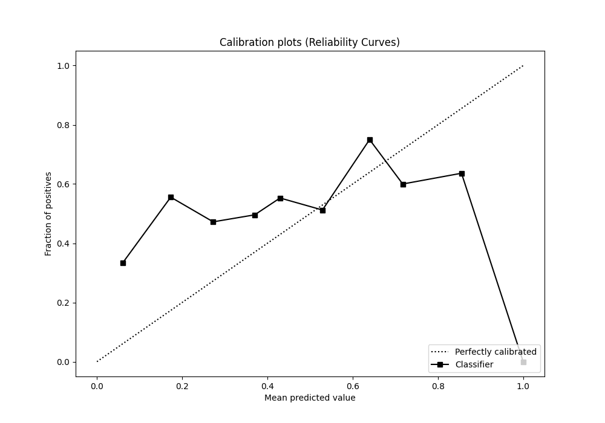
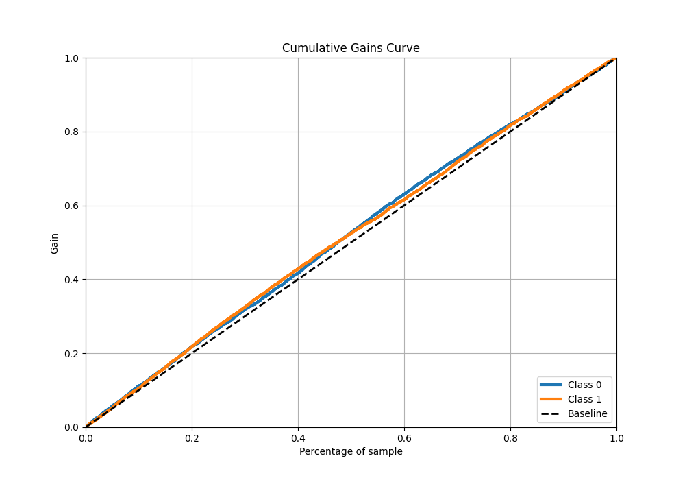
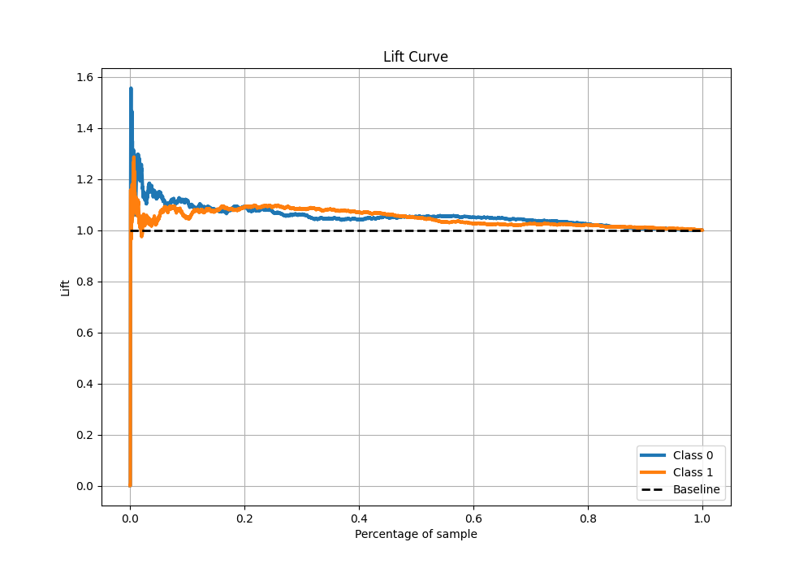

# Summary of 52_RandomForest_SelectedFeatures

[<< Go back](../README.md)

## Random Forest
- **n_jobs**: -1
- **criterion**: gini
- **max_features**: 0.6
- **min_samples_split**: 20
- **max_depth**: 3
- **eval_metric_name**: logloss
- **explain_level**: 1

## Validation
 - **validation_type**: kfold
 - **k_folds**: 5
 - **shuffle**: True
 - **stratify**: True

## Optimized metric
logloss

## Training time

38.8 seconds

## Metric details
|           |     score |   threshold |
|:----------|----------:|------------:|
| logloss   | 0.691158  |  nan        |
| auc       | 0.53362   |  nan        |
| f1        | 0.682625  |    0.293555 |
| accuracy  | 0.528355  |    0.498416 |
| precision | 0.567789  |    0.539731 |
| recall    | 1         |    0.293555 |
| mcc       | 0.0624465 |    0.531405 |

## Metric details with threshold from accuracy metric
|           |    score |   threshold |
|:----------|---------:|------------:|
| logloss   | 0.691158 |  nan        |
| auc       | 0.53362  |  nan        |
| f1        | 0.64223  |    0.498416 |
| accuracy  | 0.528355 |    0.498416 |
| precision | 0.529074 |    0.498416 |
| recall    | 0.816956 |    0.498416 |
| mcc       | 0.043658 |    0.498416 |

## Confusion matrix (at threshold=0.498416)
|              |   Predicted as 0 |   Predicted as 1 |
|:-------------|-----------------:|-----------------:|
| Labeled as 0 |              526 |             1887 |
| Labeled as 1 |              475 |             2120 |

## Learning curves

## Permutation-based Importance

## Confusion Matrix

## Normalized Confusion Matrix

## ROC Curve

## Kolmogorov-Smirnov Statistic

## Precision-Recall Curve

## Calibration Curve

## Cumulative Gains Curve

## Lift Curve

[<< Go back](../README.md)
