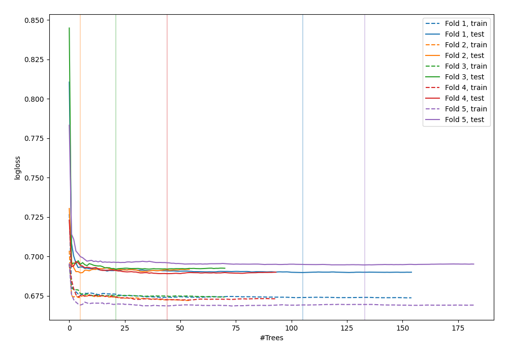
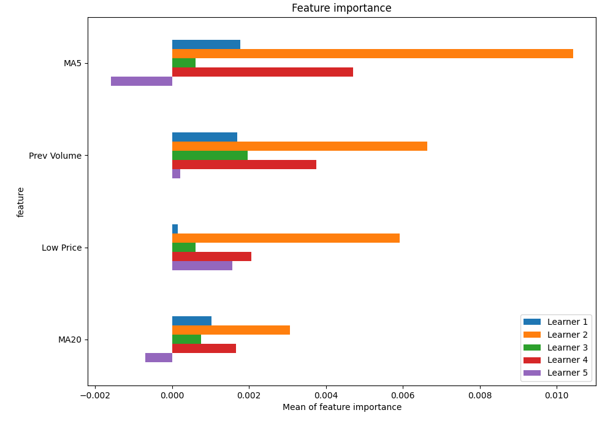
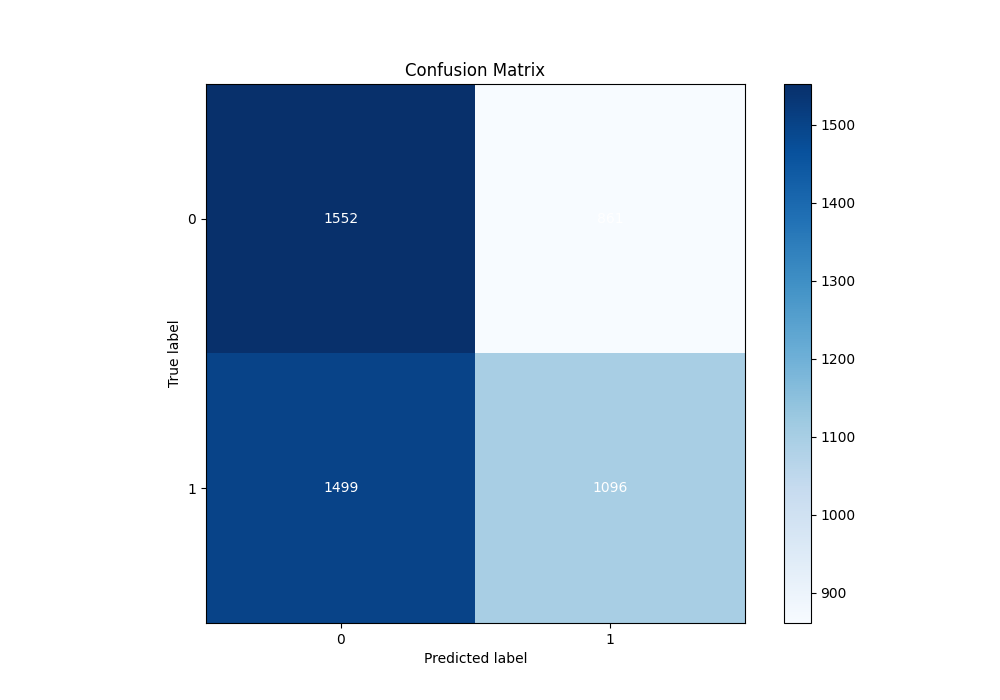
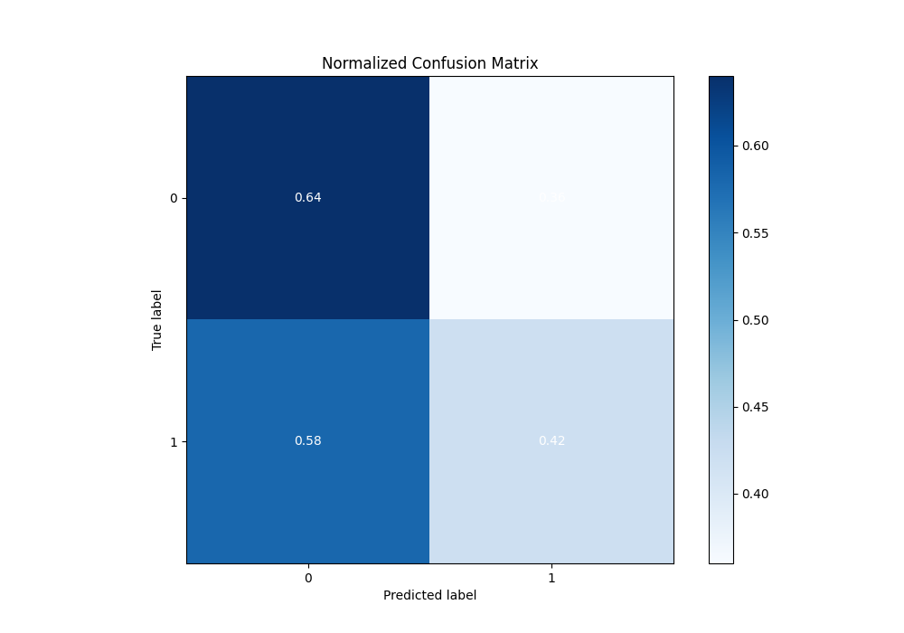
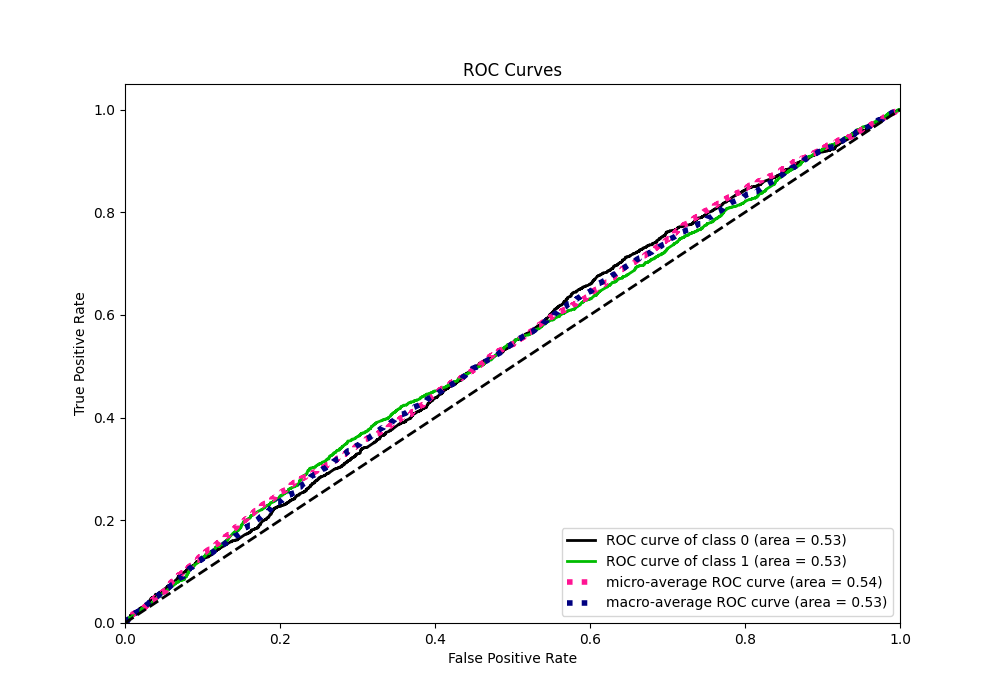
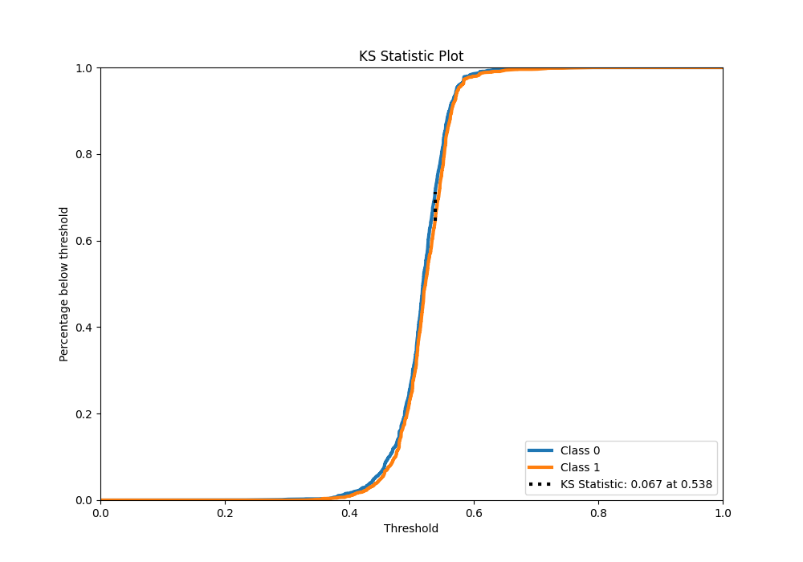
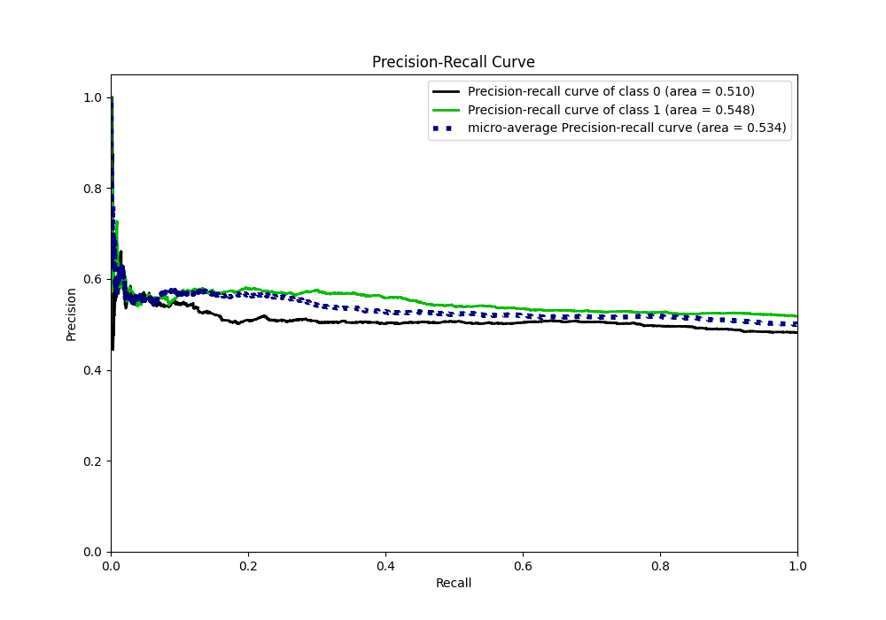
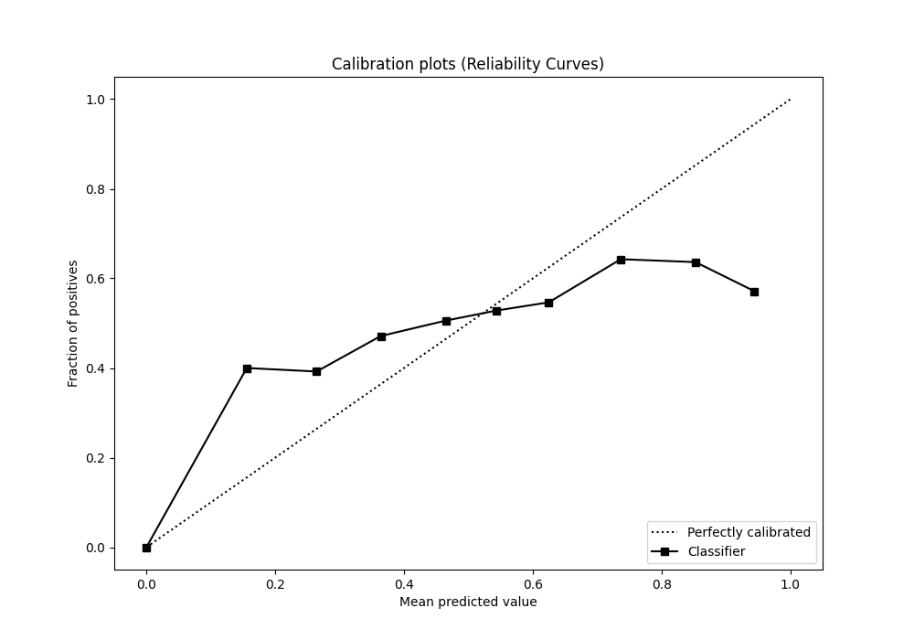
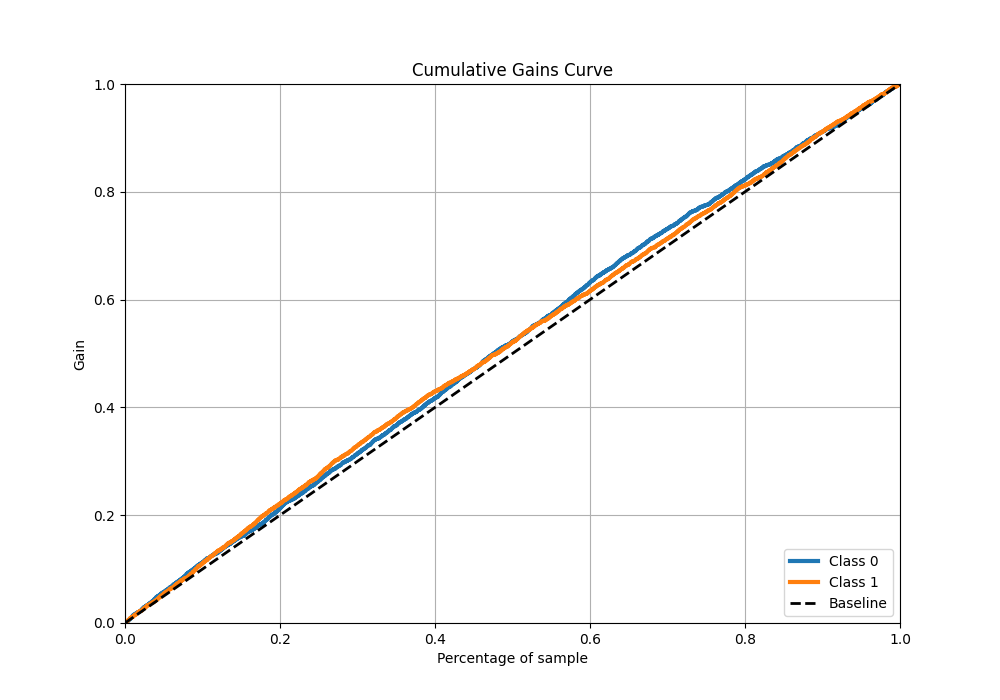
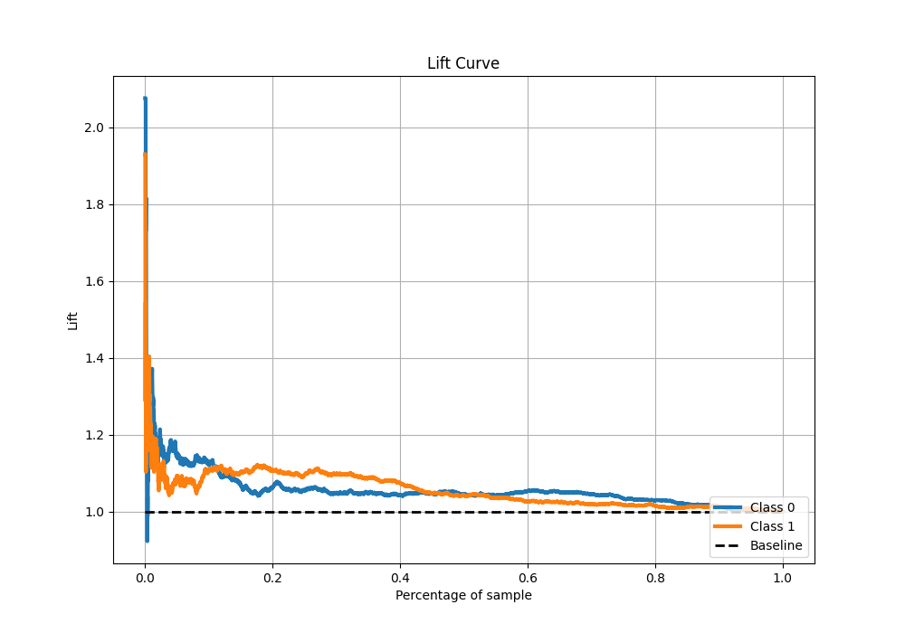

# Summary of 53_RandomForest_SelectedFeatures

[<< Go back](../README.md)

## Random Forest
- **n_jobs**: -1
- **criterion**: gini
- **max_features**: 0.6
- **min_samples_split**: 20
- **max_depth**: 5
- **eval_metric_name**: logloss
- **explain_level**: 1

## Validation
 - **validation_type**: kfold
 - **k_folds**: 5
 - **shuffle**: True
 - **stratify**: True

## Optimized metric
logloss

## Training time

38.4 seconds

## Metric details
|           |    score |   threshold |
|:----------|---------:|------------:|
| logloss   | 0.690944 |  nan        |
| auc       | 0.533985 |  nan        |
| f1        | 0.682625 |    0.208841 |
| accuracy  | 0.528754 |    0.531016 |
| precision | 0.596491 |    0.612672 |
| recall    | 1        |    0.208841 |
| mcc       | 0.070889 |    0.543226 |

## Metric details with threshold from accuracy metric
|           |    score |   threshold |
|:----------|---------:|------------:|
| logloss   | 0.690944 |  nan        |
| auc       | 0.533985 |  nan        |
| f1        | 0.481547 |    0.531016 |
| accuracy  | 0.528754 |    0.531016 |
| precision | 0.560041 |    0.531016 |
| recall    | 0.422351 |    0.531016 |
| mcc       | 0.067111 |    0.531016 |

## Confusion matrix (at threshold=0.531016)
|              |   Predicted as 0 |   Predicted as 1 |
|:-------------|-----------------:|-----------------:|
| Labeled as 0 |             1552 |              861 |
| Labeled as 1 |             1499 |             1096 |

## Learning curves

## Permutation-based Importance

## Confusion Matrix

## Normalized Confusion Matrix

## ROC Curve

## Kolmogorov-Smirnov Statistic

## Precision-Recall Curve

## Calibration Curve

## Cumulative Gains Curve

## Lift Curve

[<< Go back](../README.md)
