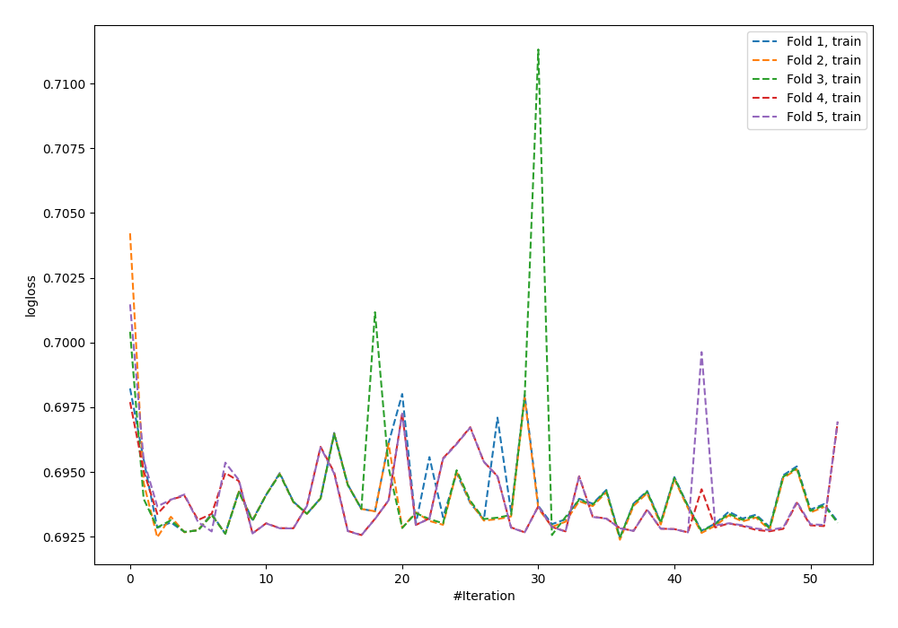
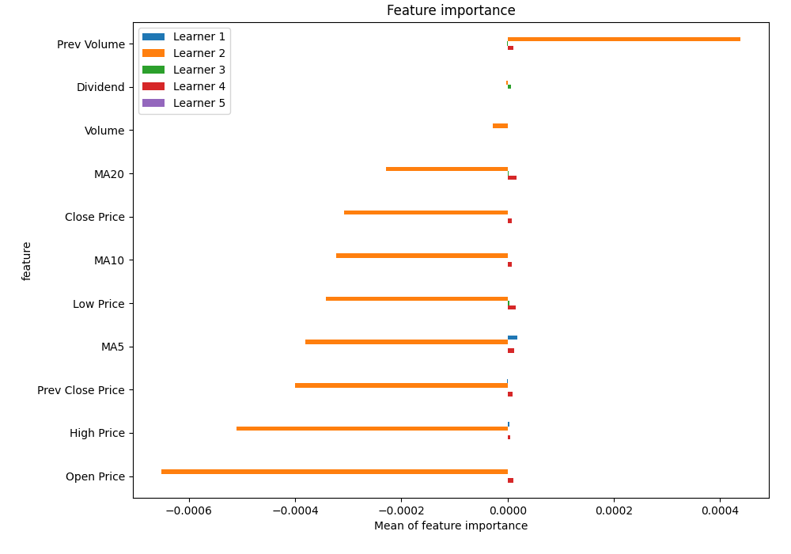
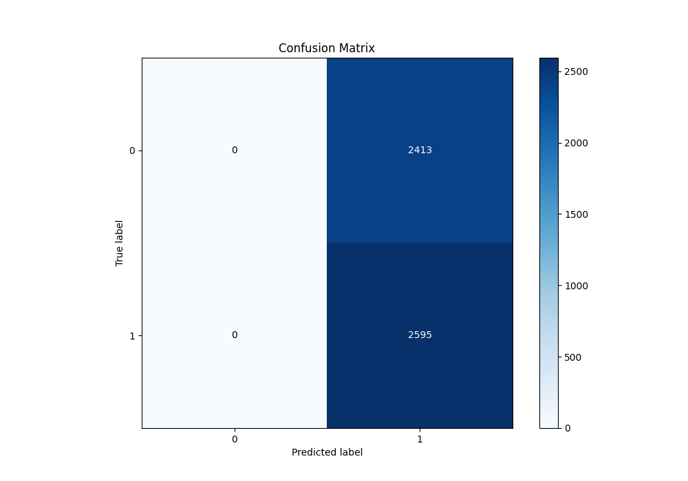
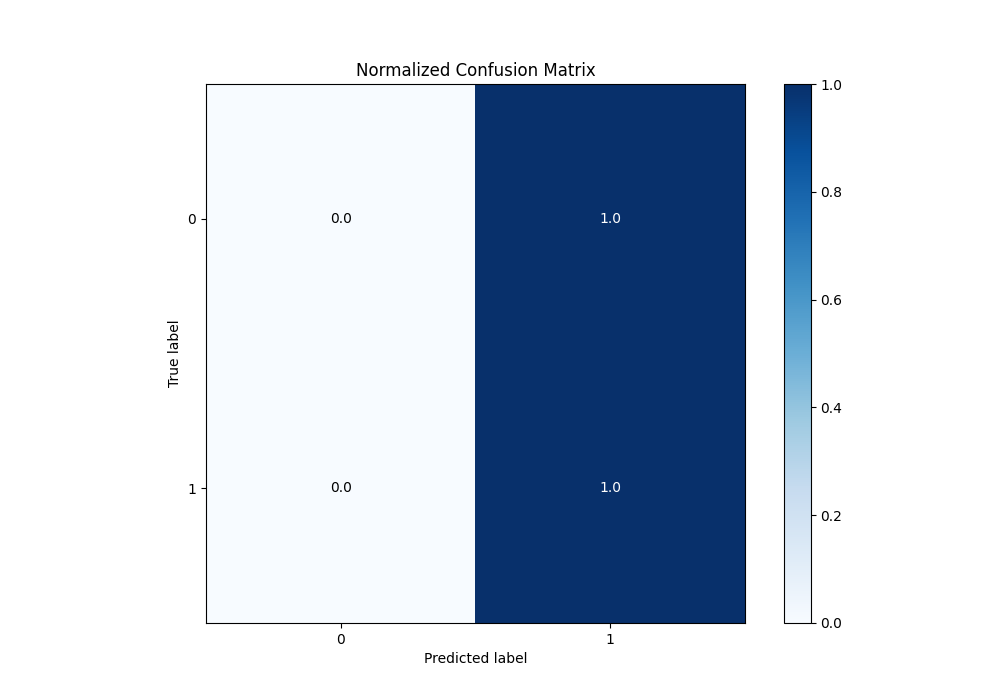
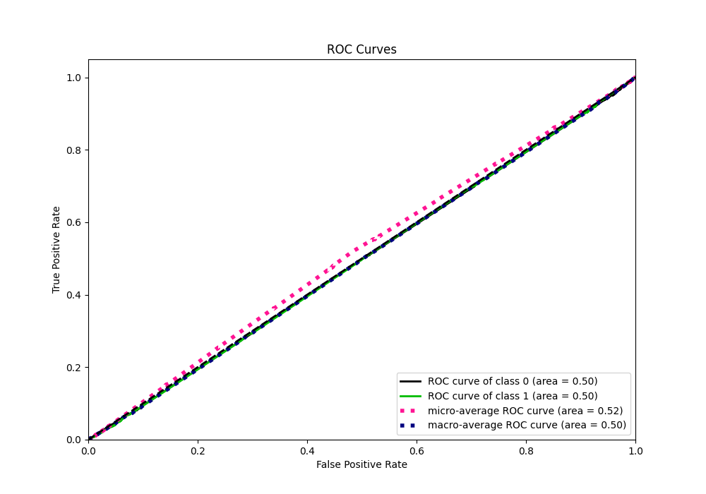
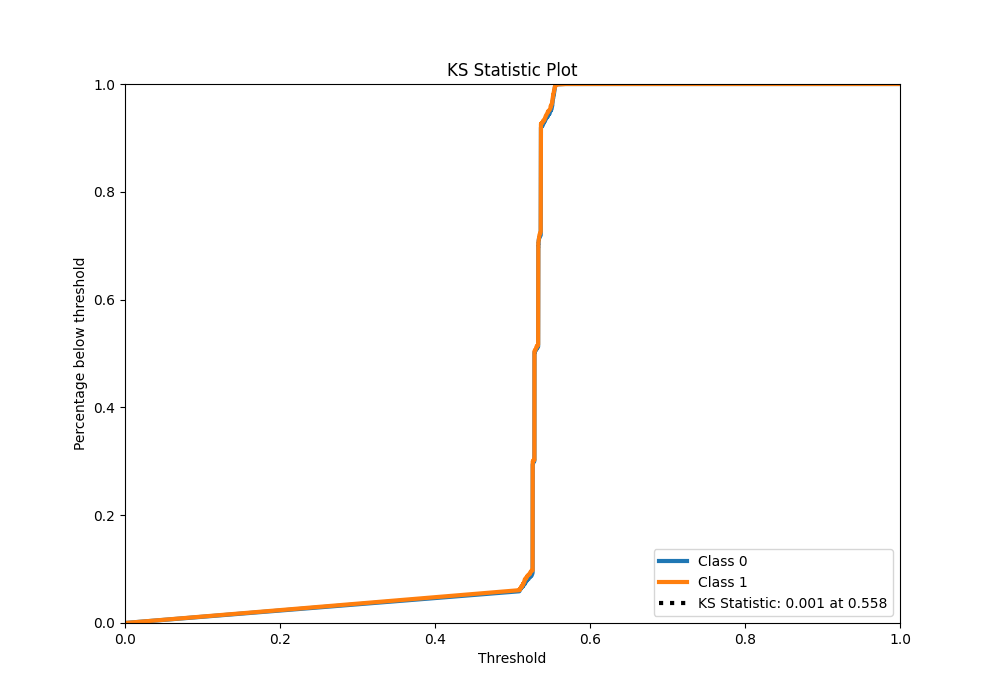
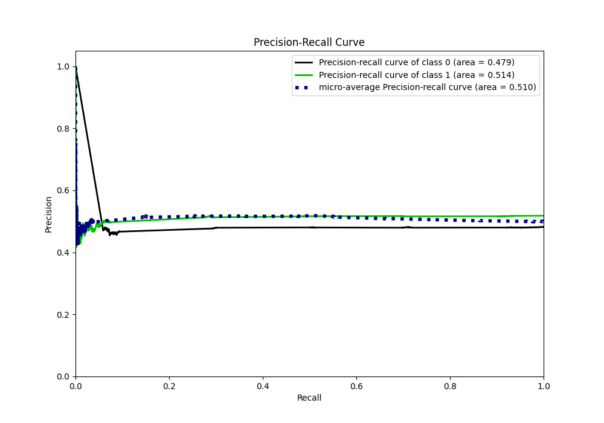
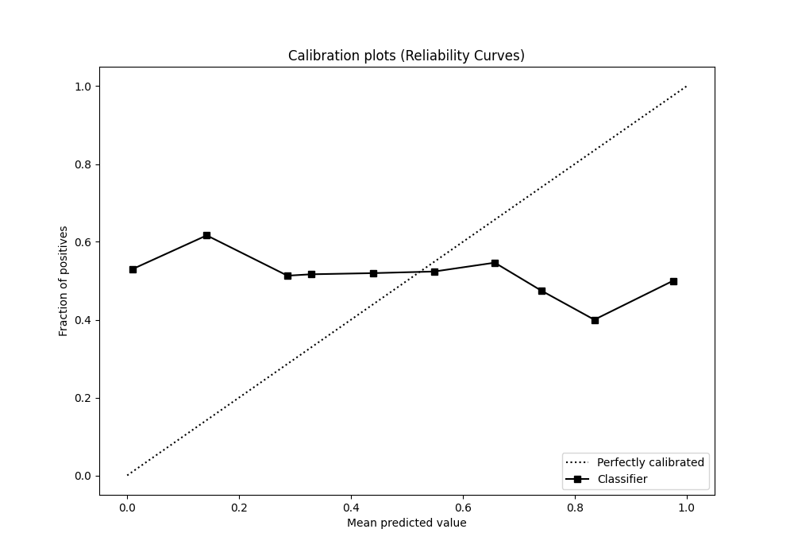
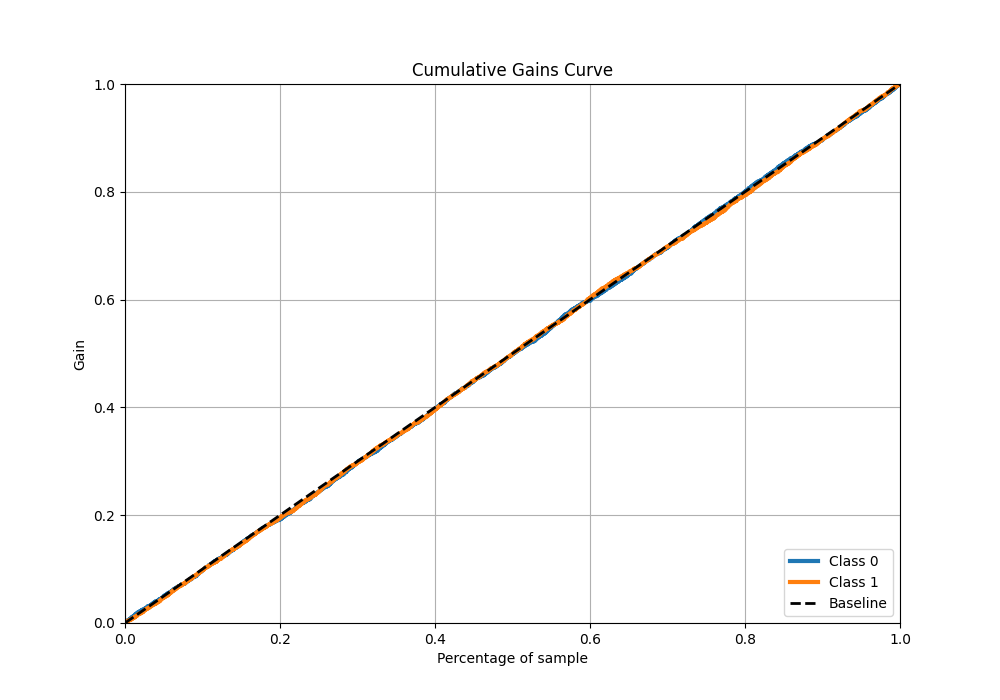
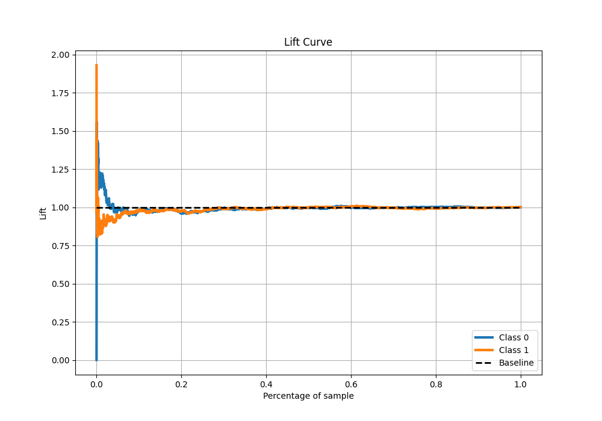

# Summary of 55_NeuralNetwork

[<< Go back](../README.md)

## Neural Network
- **n_jobs**: -1
- **dense_1_size**: 32
- **dense_2_size**: 8
- **learning_rate**: 0.08
- **explain_level**: 1

## Validation
 - **validation_type**: kfold
 - **k_folds**: 5
 - **shuffle**: True
 - **stratify**: True

## Optimized metric
logloss

## Training time

33.1 seconds

## Metric details
|           |    score |   threshold |
|:----------|---------:|------------:|
| logloss   | 0.693179 |   nan       |
| auc       | 0.495375 |   nan       |
| f1        | 0.682625 |     0.45789 |
| accuracy  | 0.518171 |     0.45789 |
| precision | 0.518171 |     0.45789 |
| recall    | 1        |     0.45789 |
| mcc       | 0        |     0.45789 |

## Metric details with threshold from accuracy metric
|           |    score |   threshold |
|:----------|---------:|------------:|
| logloss   | 0.693179 |   nan       |
| auc       | 0.495375 |   nan       |
| f1        | 0.682625 |     0.45789 |
| accuracy  | 0.518171 |     0.45789 |
| precision | 0.518171 |     0.45789 |
| recall    | 1        |     0.45789 |
| mcc       | 0        |     0.45789 |

## Confusion matrix (at threshold=0.45789)
|              |   Predicted as 0 |   Predicted as 1 |
|:-------------|-----------------:|-----------------:|
| Labeled as 0 |                0 |             2413 |
| Labeled as 1 |                0 |             2595 |

## Learning curves

## Permutation-based Importance

## Confusion Matrix

## Normalized Confusion Matrix

## ROC Curve

## Kolmogorov-Smirnov Statistic

## Precision-Recall Curve

## Calibration Curve

## Cumulative Gains Curve

## Lift Curve

[<< Go back](../README.md)
