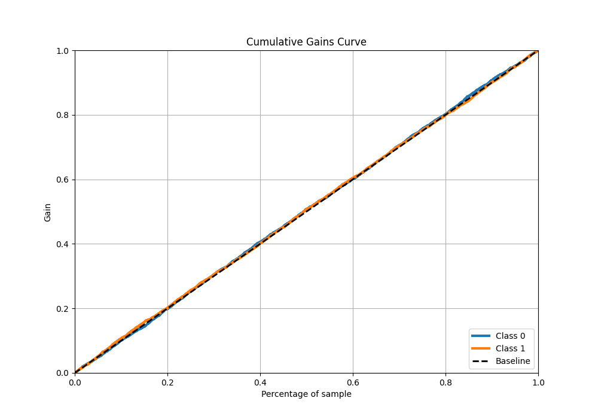

# Summary of 56_NeuralNetwork

[<< Go back](../README.md)

## Neural Network
- **n_jobs**: -1
- **dense_1_size**: 32
- **dense_2_size**: 16
- **learning_rate**: 0.01
- **explain_level**: 1

## Validation
 - **validation_type**: kfold
 - **k_folds**: 5
 - **shuffle**: True
 - **stratify**: True

## Optimized metric
logloss

## Training time

37.3 seconds

## Metric details
|           |     score |   threshold |
|:----------|----------:|------------:|
| logloss   | 0.694046  |  nan        |
| auc       | 0.504969  |  nan        |
| f1        | 0.682625  |    0.149481 |
| accuracy  | 0.51877   |    0.459935 |
| precision | 0.561404  |    0.582732 |
| recall    | 1         |    0.149481 |
| mcc       | 0.0255225 |    0.550737 |

## Metric details with threshold from accuracy metric
|           |      score |   threshold |
|:----------|-----------:|------------:|
| logloss   | 0.694046   |  nan        |
| auc       | 0.504969   |  nan        |
| f1        | 0.678752   |    0.459935 |
| accuracy  | 0.51877    |    0.459935 |
| precision | 0.518851   |    0.459935 |
| recall    | 0.981118   |    0.459935 |
| mcc       | 0.00948153 |    0.459935 |

## Confusion matrix (at threshold=0.459935)
|              |   Predicted as 0 |   Predicted as 1 |
|:-------------|-----------------:|-----------------:|
| Labeled as 0 |               52 |             2361 |
| Labeled as 1 |               49 |             2546 |

## Learning curves

## Permutation-based Importance

## Confusion Matrix

## Normalized Confusion Matrix

## ROC Curve

## Kolmogorov-Smirnov Statistic

## Precision-Recall Curve

## Calibration Curve

## Cumulative Gains Curve

## Lift Curve

[<< Go back](../README.md)
