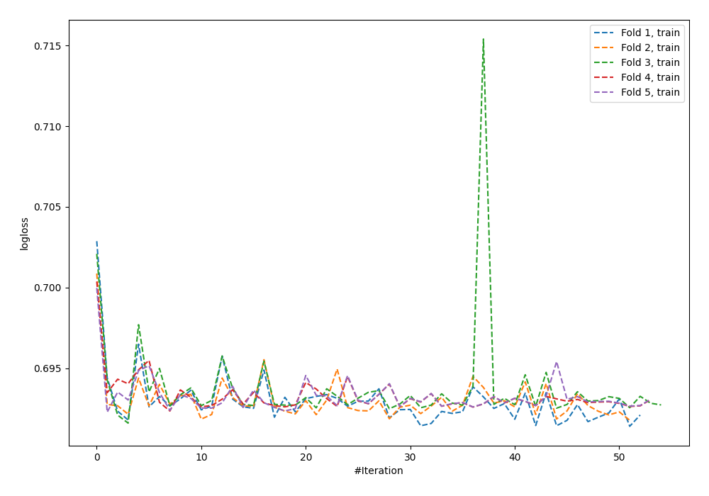
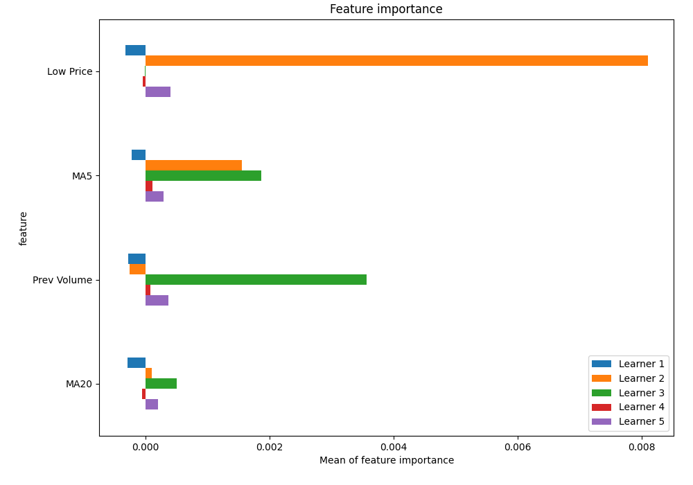
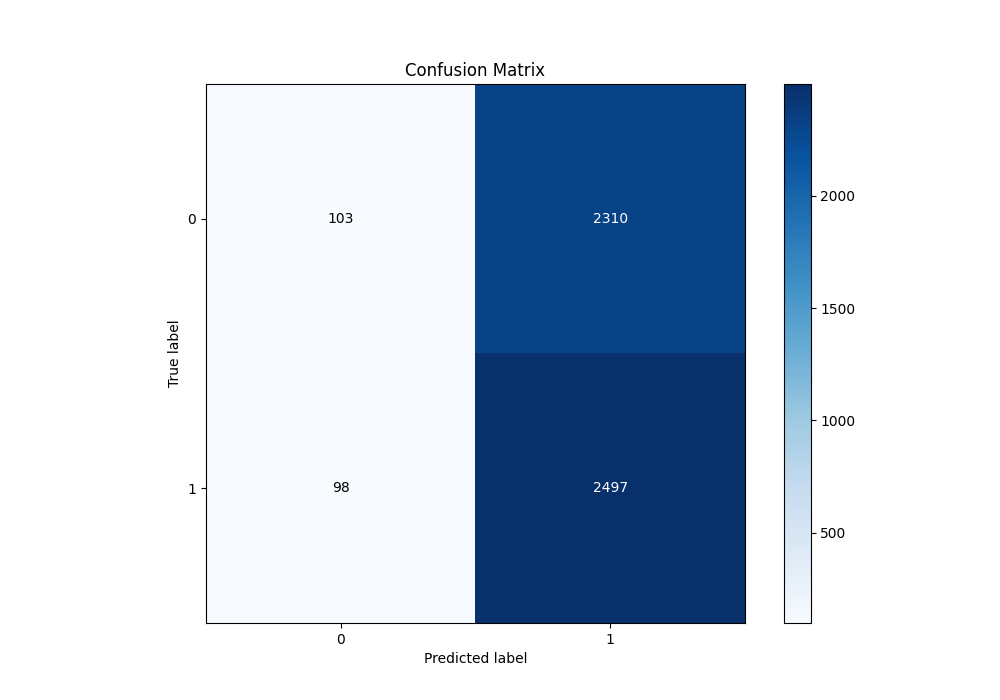
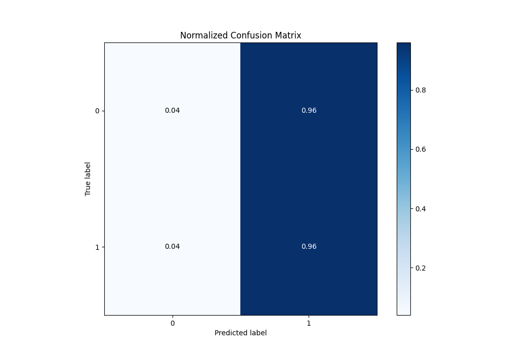
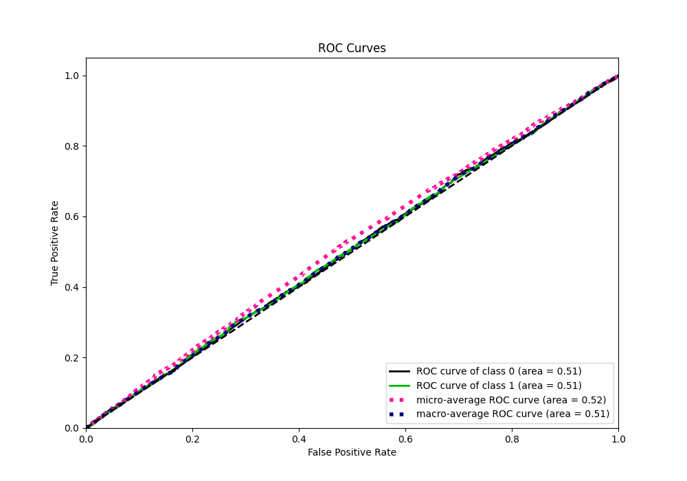
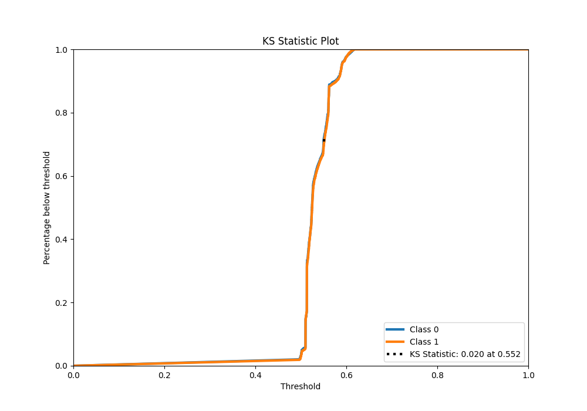
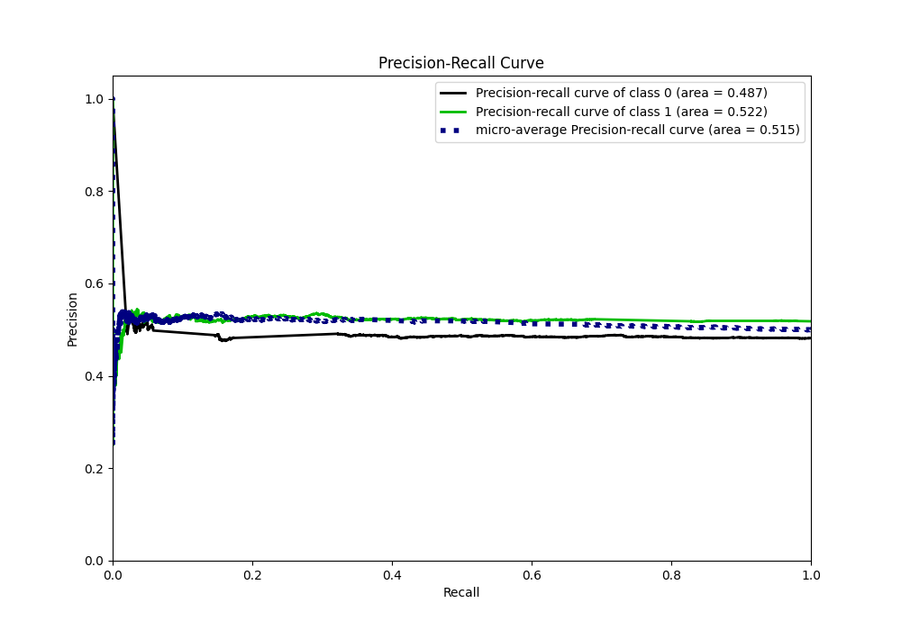
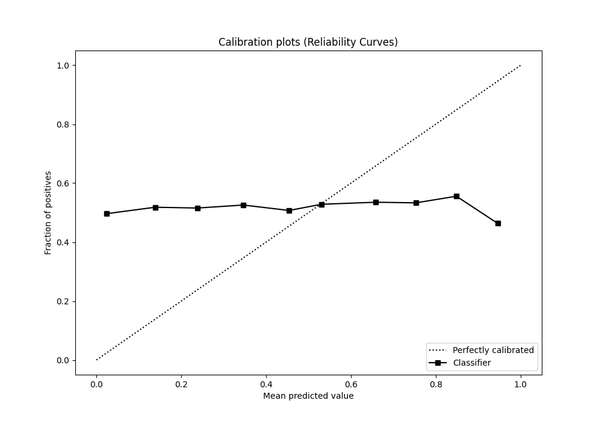
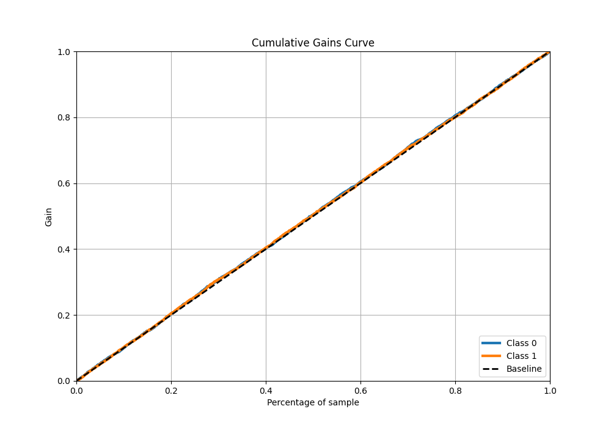
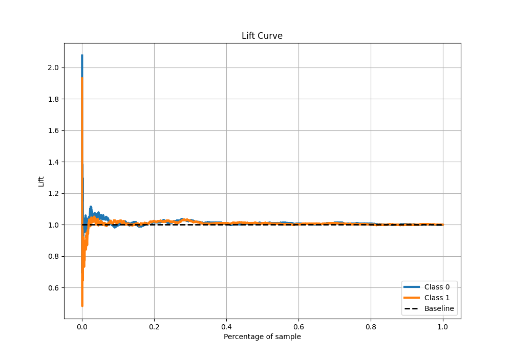

# Summary of 5_Default_NeuralNetwork_SelectedFeatures

[<< Go back](../README.md)

## Neural Network
- **n_jobs**: -1
- **dense_1_size**: 32
- **dense_2_size**: 16
- **learning_rate**: 0.05
- **explain_level**: 1

## Validation
 - **validation_type**: kfold
 - **k_folds**: 5
 - **shuffle**: True
 - **stratify**: True

## Optimized metric
logloss

## Training time

6.7 seconds

## Metric details
|           |     score |   threshold |
|:----------|----------:|------------:|
| logloss   | 0.694025  |  nan        |
| auc       | 0.505809  |  nan        |
| f1        | 0.682625  |    0.447151 |
| accuracy  | 0.519169  |    0.501484 |
| precision | 0.536232  |    0.592043 |
| recall    | 1         |    0.447151 |
| mcc       | 0.0211385 |    0.550646 |

## Metric details with threshold from accuracy metric
|           |     score |   threshold |
|:----------|----------:|------------:|
| logloss   | 0.694025  |  nan        |
| auc       | 0.505809  |  nan        |
| f1        | 0.674683  |    0.501484 |
| accuracy  | 0.519169  |    0.501484 |
| precision | 0.519451  |    0.501484 |
| recall    | 0.962235  |    0.501484 |
| mcc       | 0.0125263 |    0.501484 |

## Confusion matrix (at threshold=0.501484)
|              |   Predicted as 0 |   Predicted as 1 |
|:-------------|-----------------:|-----------------:|
| Labeled as 0 |              103 |             2310 |
| Labeled as 1 |               98 |             2497 |

## Learning curves

## Permutation-based Importance

## Confusion Matrix

## Normalized Confusion Matrix

## ROC Curve

## Kolmogorov-Smirnov Statistic

## Precision-Recall Curve

## Calibration Curve

## Cumulative Gains Curve

## Lift Curve

[<< Go back](../README.md)
