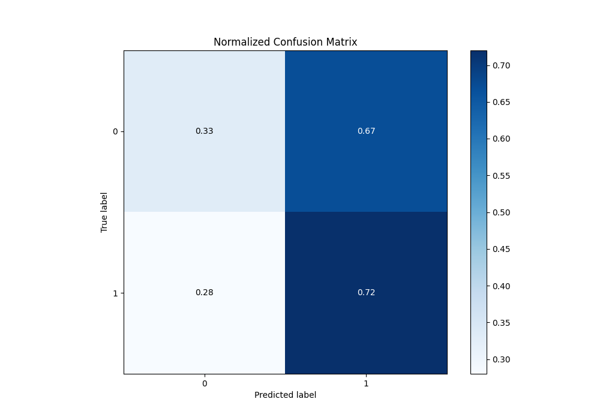
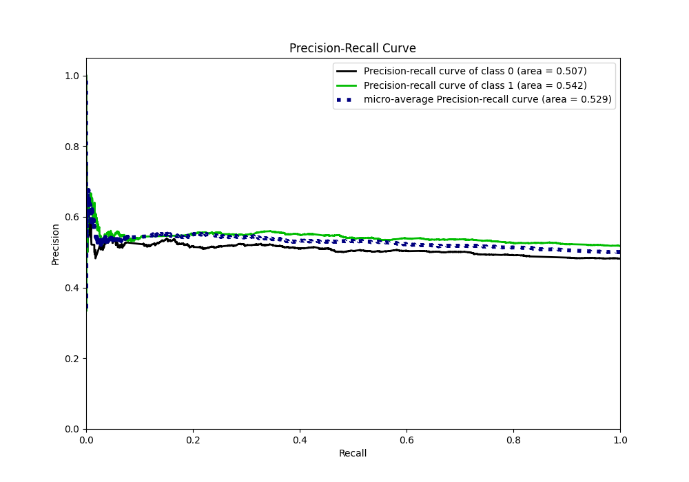

# Summary of 6_Default_RandomForest

[<< Go back](../README.md)

## Random Forest
- **n_jobs**: -1
- **criterion**: gini
- **max_features**: 0.9
- **min_samples_split**: 30
- **max_depth**: 4
- **eval_metric_name**: logloss
- **explain_level**: 1

## Validation
 - **validation_type**: kfold
 - **k_folds**: 5
 - **shuffle**: True
 - **stratify**: True

## Optimized metric
logloss

## Training time

8.3 seconds

## Metric details
|           |     score |   threshold |
|:----------|----------:|------------:|
| logloss   | 0.691615  |  nan        |
| auc       | 0.531551  |  nan        |
| f1        | 0.682625  |    0.251071 |
| accuracy  | 0.532149  |    0.502163 |
| precision | 0.596491  |    0.62638  |
| recall    | 1         |    0.251071 |
| mcc       | 0.0573595 |    0.540441 |

## Metric details with threshold from accuracy metric
|           |     score |   threshold |
|:----------|----------:|------------:|
| logloss   | 0.691615  |  nan        |
| auc       | 0.531551  |  nan        |
| f1        | 0.615839  |    0.502163 |
| accuracy  | 0.532149  |    0.502163 |
| precision | 0.535959  |    0.502163 |
| recall    | 0.723699  |    0.502163 |
| mcc       | 0.0543378 |    0.502163 |

## Confusion matrix (at threshold=0.502163)
|              |   Predicted as 0 |   Predicted as 1 |
|:-------------|-----------------:|-----------------:|
| Labeled as 0 |              787 |             1626 |
| Labeled as 1 |              717 |             1878 |

## Learning curves

## Permutation-based Importance

## Confusion Matrix

## Normalized Confusion Matrix

## ROC Curve

## Kolmogorov-Smirnov Statistic

## Precision-Recall Curve

## Calibration Curve

## Cumulative Gains Curve

## Lift Curve

[<< Go back](../README.md)
