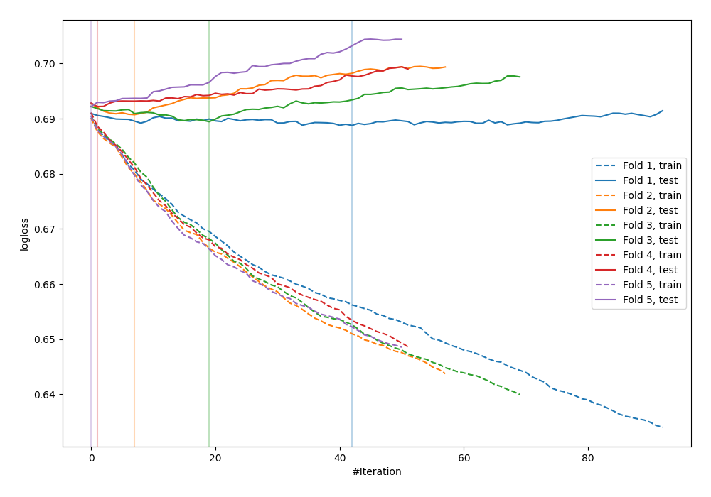
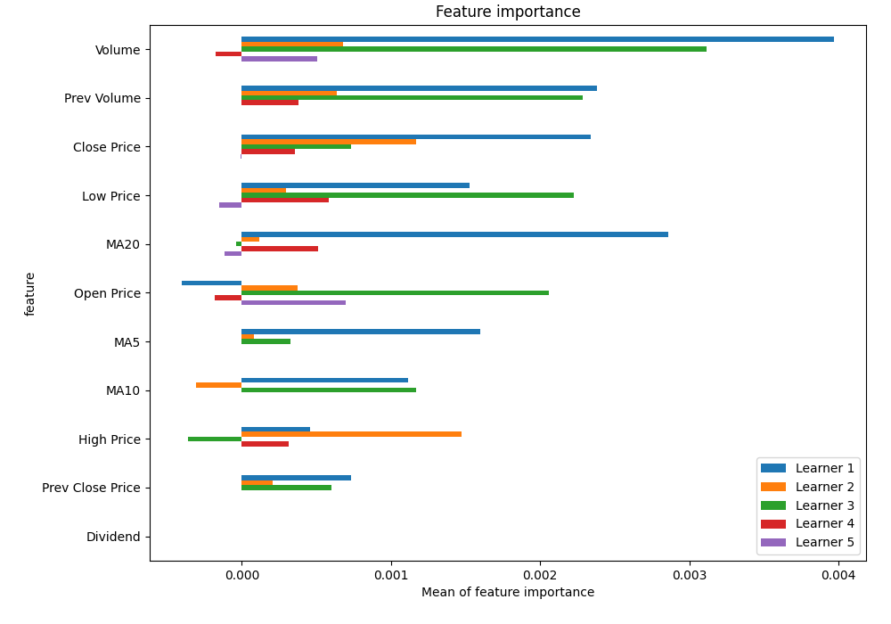
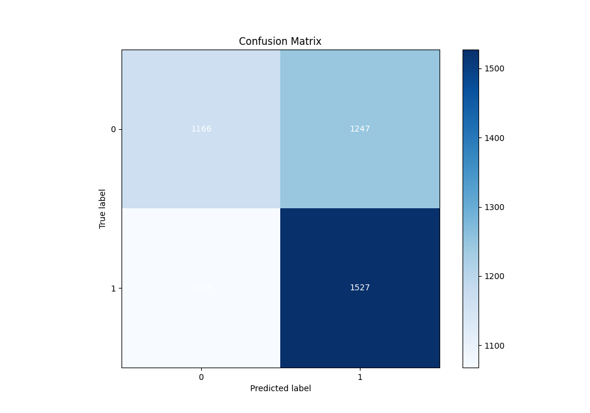
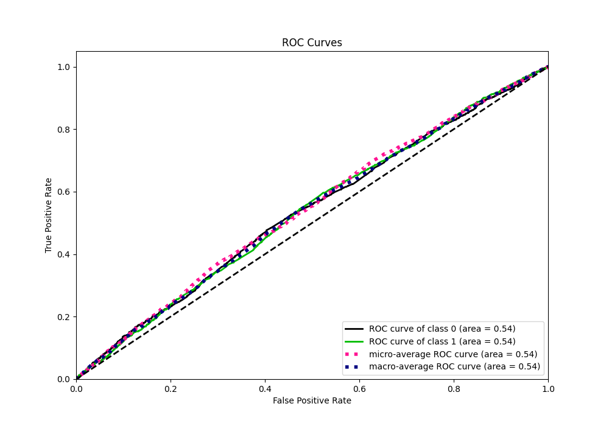
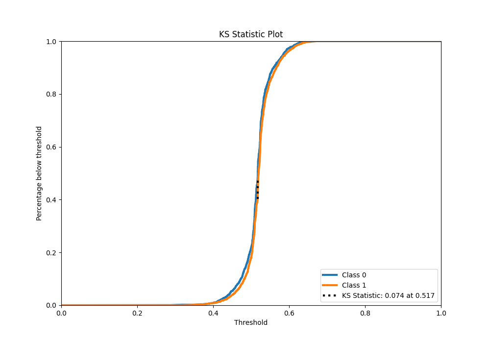
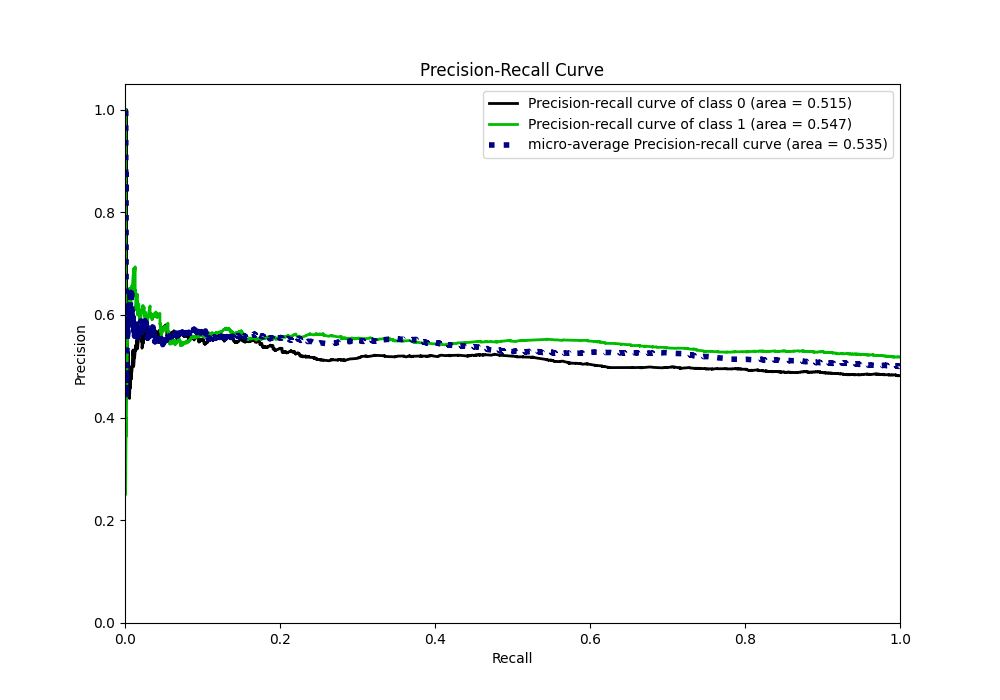
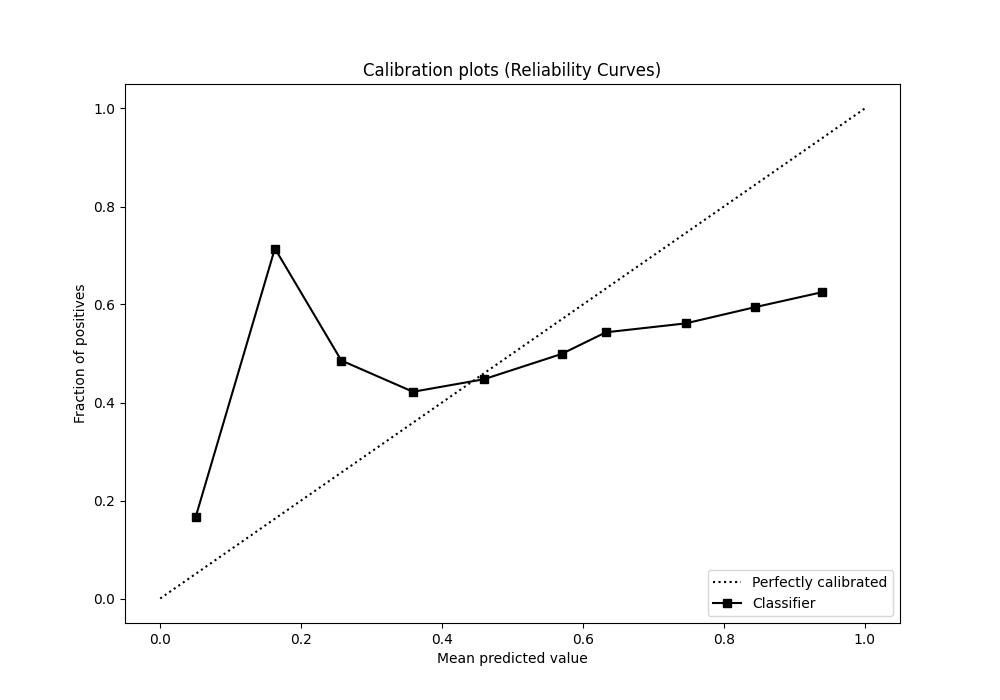
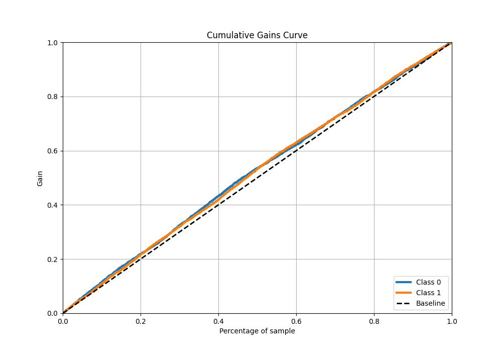
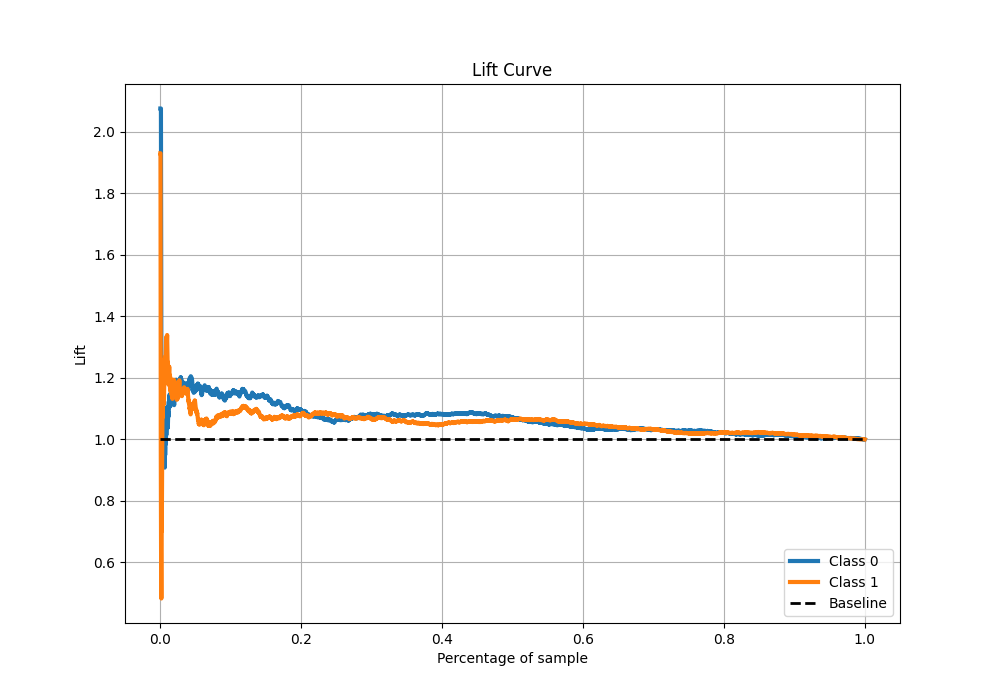

# Summary of 9_Xgboost

[<< Go back](../README.md)

## Extreme Gradient Boosting (Xgboost)
- **n_jobs**: -1
- **objective**: binary:logistic
- **eta**: 0.1
- **max_depth**: 7
- **min_child_weight**: 25
- **subsample**: 0.9
- **colsample_bytree**: 0.6
- **eval_metric**: logloss
- **explain_level**: 1

## Validation
 - **validation_type**: kfold
 - **k_folds**: 5
 - **shuffle**: True
 - **stratify**: True

## Optimized metric
logloss

## Training time

6.9 seconds

## Metric details
|           |     score |   threshold |
|:----------|----------:|------------:|
| logloss   | 0.69067   |  nan        |
| auc       | 0.537723  |  nan        |
| f1        | 0.682625  |    0.259483 |
| accuracy  | 0.53774   |    0.517102 |
| precision | 0.631579  |    0.62292  |
| recall    | 1         |    0.259483 |
| mcc       | 0.0720278 |    0.517102 |

## Metric details with threshold from accuracy metric
|           |     score |   threshold |
|:----------|----------:|------------:|
| logloss   | 0.69067   |  nan        |
| auc       | 0.537723  |  nan        |
| f1        | 0.568821  |    0.517102 |
| accuracy  | 0.53774   |    0.517102 |
| precision | 0.550469  |    0.517102 |
| recall    | 0.588439  |    0.517102 |
| mcc       | 0.0720278 |    0.517102 |

## Confusion matrix (at threshold=0.517102)
|              |   Predicted as 0 |   Predicted as 1 |
|:-------------|-----------------:|-----------------:|
| Labeled as 0 |             1166 |             1247 |
| Labeled as 1 |             1068 |             1527 |

## Learning curves

## Permutation-based Importance

## Confusion Matrix

## Normalized Confusion Matrix

## ROC Curve

## Kolmogorov-Smirnov Statistic

## Precision-Recall Curve

## Calibration Curve

## Cumulative Gains Curve

## Lift Curve

[<< Go back](../README.md)
