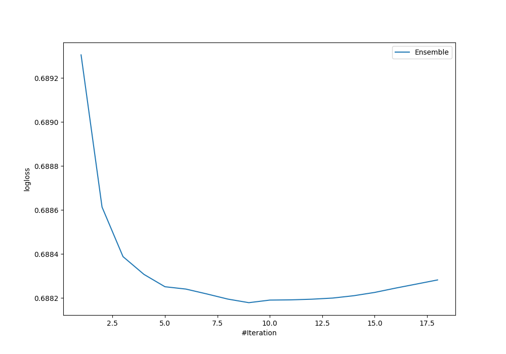
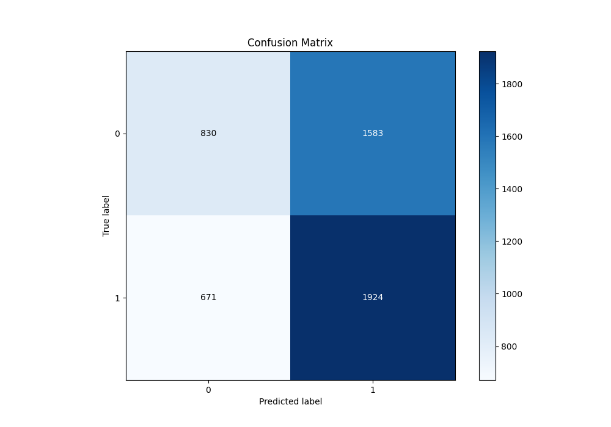
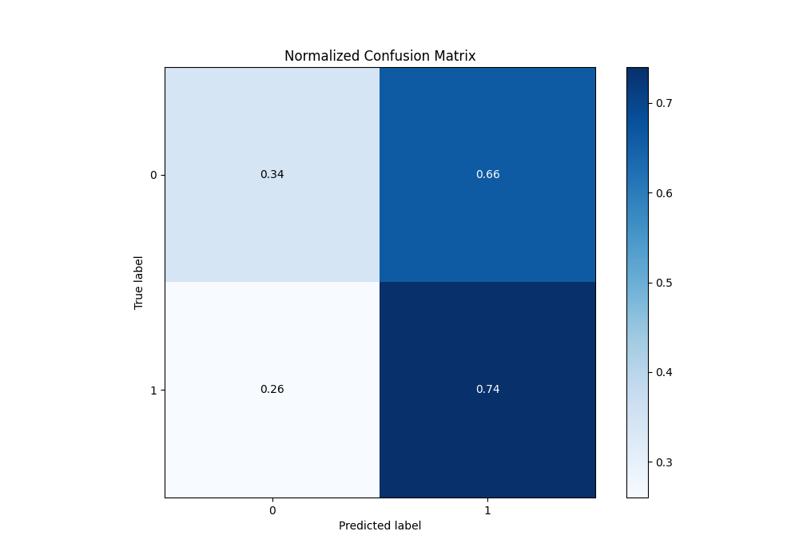
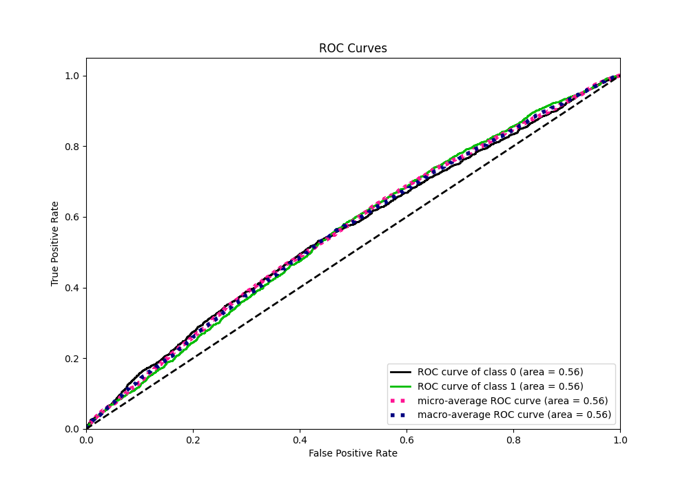
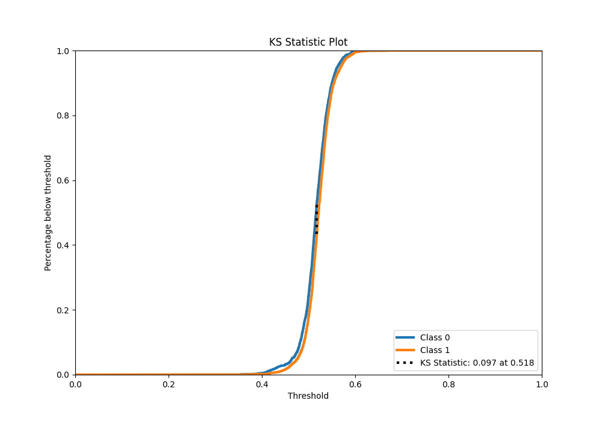
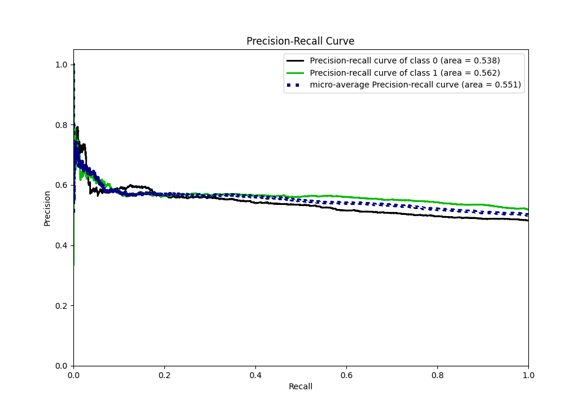
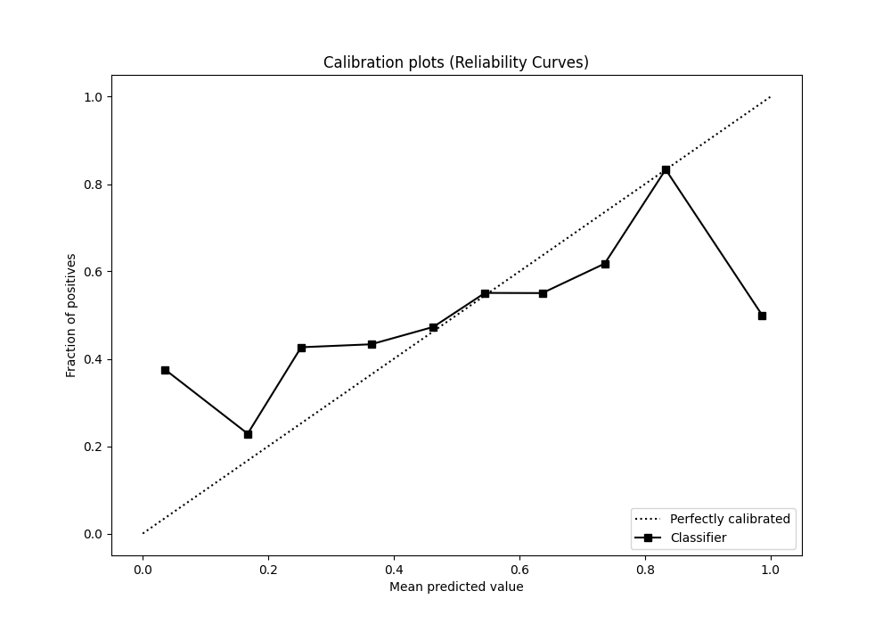
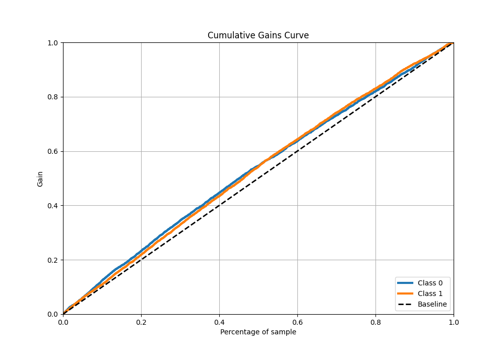
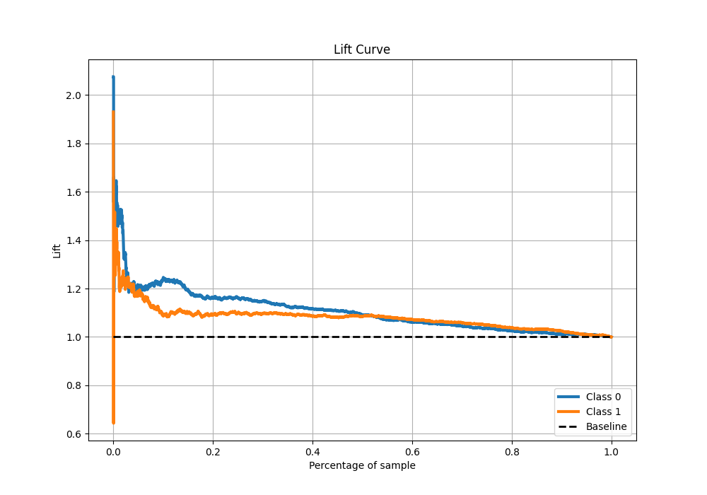

# Summary of Ensemble

[<< Go back](../README.md)

## Ensemble structure
| Model                     |   Weight |
|:--------------------------|---------:|
| 10_Xgboost                |        1 |
| 14_LightGBM               |        2 |
| 22_RandomForest           |        1 |
| 2_Default_LightGBM        |        2 |
| 32_Xgboost_GoldenFeatures |        1 |
| 7_Xgboost                 |        1 |
| 7_Xgboost_GoldenFeatures  |        1 |

## Metric details
|           |     score |   threshold |
|:----------|----------:|------------:|
| logloss   | 0.688178  |  nan        |
| auc       | 0.557564  |  nan        |
| f1        | 0.683263  |    0.420962 |
| accuracy  | 0.54992   |    0.507458 |
| precision | 0.666667  |    0.590889 |
| recall    | 1         |    0.318587 |
| mcc       | 0.0948726 |    0.516622 |

## Metric details with threshold from accuracy metric
|           |     score |   threshold |
|:----------|----------:|------------:|
| logloss   | 0.688178  |  nan        |
| auc       | 0.557564  |  nan        |
| f1        | 0.630613  |    0.507458 |
| accuracy  | 0.54992   |    0.507458 |
| precision | 0.548617  |    0.507458 |
| recall    | 0.741426  |    0.507458 |
| mcc       | 0.0931379 |    0.507458 |

## Confusion matrix (at threshold=0.507458)
|              |   Predicted as 0 |   Predicted as 1 |
|:-------------|-----------------:|-----------------:|
| Labeled as 0 |              830 |             1583 |
| Labeled as 1 |              671 |             1924 |

## Learning curves

## Confusion Matrix

## Normalized Confusion Matrix

## ROC Curve

## Kolmogorov-Smirnov Statistic

## Precision-Recall Curve

## Calibration Curve

## Cumulative Gains Curve

## Lift Curve

[<< Go back](../README.md)
