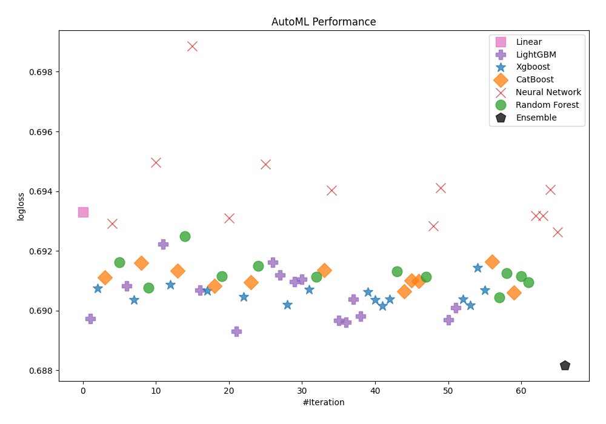
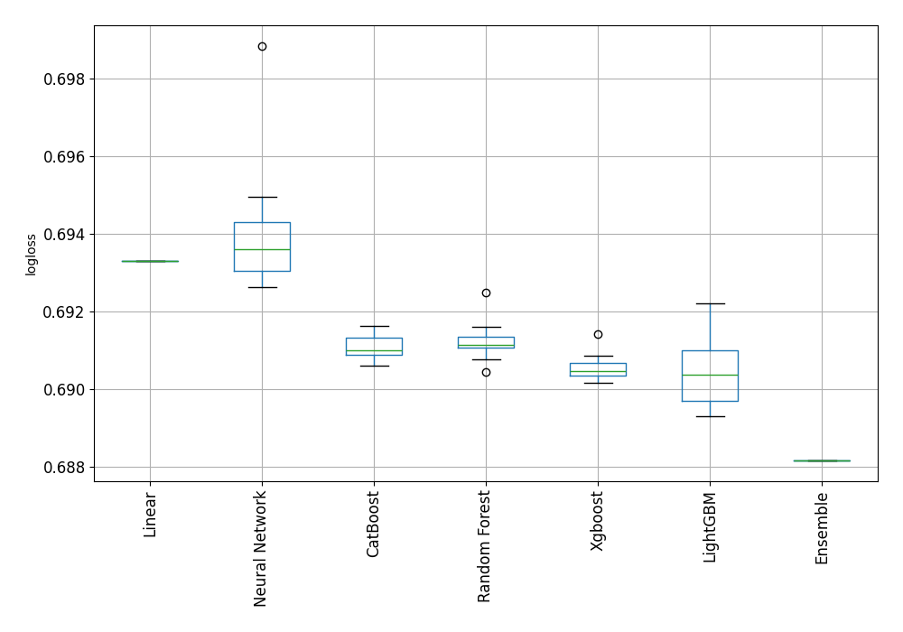
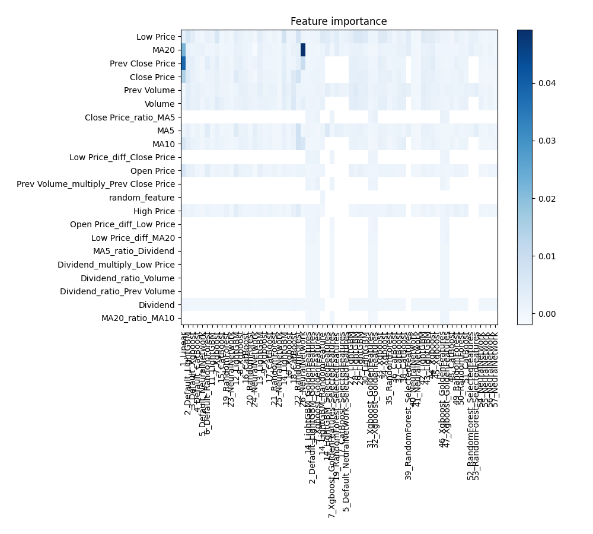
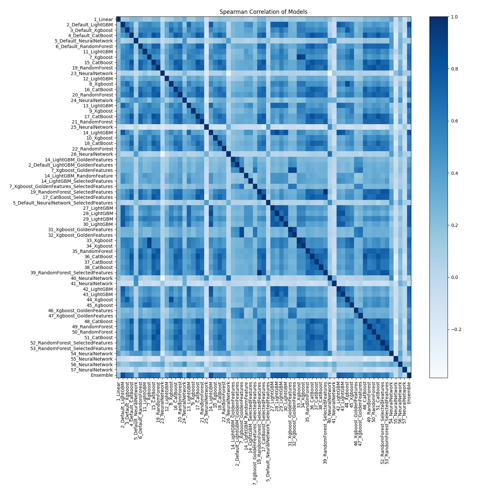

# AutoML Leaderboard

| Best model   | name                                                                                             | model_type     | metric_type   |   metric_value |   train_time |   single_prediction_time |
|:-------------|:-------------------------------------------------------------------------------------------------|:---------------|:--------------|---------------:|-------------:|-------------------------:|
|              | [1_Linear](1_Linear/README.md)                                                                   | Linear         | logloss       |       0.693312 |         5.3  |                   0.0408 |
|              | [2_Default_LightGBM](2_Default_LightGBM/README.md)                                               | LightGBM       | logloss       |       0.689724 |         5.11 |                   0.0155 |
|              | [3_Default_Xgboost](3_Default_Xgboost/README.md)                                                 | Xgboost        | logloss       |       0.69075  |         5.31 |                   0.0394 |
|              | [4_Default_CatBoost](4_Default_CatBoost/README.md)                                               | CatBoost       | logloss       |       0.691116 |         6.43 |                   0.0401 |
|              | [5_Default_NeuralNetwork](5_Default_NeuralNetwork/README.md)                                     | Neural Network | logloss       |       0.692914 |         6.8  |                   0.0413 |
|              | [6_Default_RandomForest](6_Default_RandomForest/README.md)                                       | Random Forest  | logloss       |       0.691615 |         9.32 |                   0.1203 |
|              | [11_LightGBM](11_LightGBM/README.md)                                                             | LightGBM       | logloss       |       0.690819 |         5.43 |                   0.0171 |
|              | [7_Xgboost](7_Xgboost/README.md)                                                                 | Xgboost        | logloss       |       0.690369 |         5.56 |                   0.0405 |
|              | [15_CatBoost](15_CatBoost/README.md)                                                             | CatBoost       | logloss       |       0.691595 |         7.93 |                   0.0165 |
|              | [19_RandomForest](19_RandomForest/README.md)                                                     | Random Forest  | logloss       |       0.690775 |         9.45 |                   0.1249 |
|              | [23_NeuralNetwork](23_NeuralNetwork/README.md)                                                   | Neural Network | logloss       |       0.694969 |         6.88 |                   0.0591 |
|              | [12_LightGBM](12_LightGBM/README.md)                                                             | LightGBM       | logloss       |       0.692225 |         5.73 |                   0.0087 |
|              | [8_Xgboost](8_Xgboost/README.md)                                                                 | Xgboost        | logloss       |       0.690863 |         6.04 |                   0.033  |
|              | [16_CatBoost](16_CatBoost/README.md)                                                             | CatBoost       | logloss       |       0.691342 |        16.37 |                   0.1032 |
|              | [20_RandomForest](20_RandomForest/README.md)                                                     | Random Forest  | logloss       |       0.692491 |        23    |                   0.1484 |
|              | [24_NeuralNetwork](24_NeuralNetwork/README.md)                                                   | Neural Network | logloss       |       0.698852 |         9.16 |                   0.0409 |
|              | [13_LightGBM](13_LightGBM/README.md)                                                             | LightGBM       | logloss       |       0.690678 |         5.94 |                   0.0106 |
|              | [9_Xgboost](9_Xgboost/README.md)                                                                 | Xgboost        | logloss       |       0.69067  |         8.28 |                   0.0486 |
|              | [17_CatBoost](17_CatBoost/README.md)                                                             | CatBoost       | logloss       |       0.69083  |         7.48 |                   0.0164 |
|              | [21_RandomForest](21_RandomForest/README.md)                                                     | Random Forest  | logloss       |       0.691162 |        10.59 |                   0.1338 |
|              | [25_NeuralNetwork](25_NeuralNetwork/README.md)                                                   | Neural Network | logloss       |       0.693105 |        10.31 |                   0.0315 |
| **the best** | [14_LightGBM](14_LightGBM/README.md)                                                             | LightGBM       | logloss       |       0.689306 |         6.21 |                   0.0075 |
|              | [10_Xgboost](10_Xgboost/README.md)                                                               | Xgboost        | logloss       |       0.690467 |         6.14 |                   0.0404 |
|              | [18_CatBoost](18_CatBoost/README.md)                                                             | CatBoost       | logloss       |       0.690945 |         7.87 |                   0.04   |
|              | [22_RandomForest](22_RandomForest/README.md)                                                     | Random Forest  | logloss       |       0.691506 |         9.33 |                   0.114  |
|              | [26_NeuralNetwork](26_NeuralNetwork/README.md)                                                   | Neural Network | logloss       |       0.694902 |         8.13 |                   0.0413 |
|              | [14_LightGBM_GoldenFeatures](14_LightGBM_GoldenFeatures/README.md)                               | LightGBM       | logloss       |       0.691627 |         7.06 |                   0.0336 |
|              | [2_Default_LightGBM_GoldenFeatures](2_Default_LightGBM_GoldenFeatures/README.md)                 | LightGBM       | logloss       |       0.691184 |         6.43 |                   0.0319 |
|              | [7_Xgboost_GoldenFeatures](7_Xgboost_GoldenFeatures/README.md)                                   | Xgboost        | logloss       |       0.690203 |         7.15 |                   0.0655 |
|              | [14_LightGBM_RandomFeature](14_LightGBM_RandomFeature/README.md)                                 | LightGBM       | logloss       |       0.690977 |         6.42 |                   0.017  |
|              | [14_LightGBM_SelectedFeatures](14_LightGBM_SelectedFeatures/README.md)                           | LightGBM       | logloss       |       0.69106  |         6.14 |                   0.0165 |
|              | [7_Xgboost_GoldenFeatures_SelectedFeatures](7_Xgboost_GoldenFeatures_SelectedFeatures/README.md) | Xgboost        | logloss       |       0.69071  |         6.59 |                   0.0745 |
|              | [19_RandomForest_SelectedFeatures](19_RandomForest_SelectedFeatures/README.md)                   | Random Forest  | logloss       |       0.691125 |         8.93 |                   0.1582 |
|              | [17_CatBoost_SelectedFeatures](17_CatBoost_SelectedFeatures/README.md)                           | CatBoost       | logloss       |       0.691348 |         7.42 |                   0.0081 |
|              | [5_Default_NeuralNetwork_SelectedFeatures](5_Default_NeuralNetwork_SelectedFeatures/README.md)   | Neural Network | logloss       |       0.694025 |         7.61 |                   0.0232 |
|              | [27_LightGBM](27_LightGBM/README.md)                                                             | LightGBM       | logloss       |       0.689671 |         6.39 |                   0.0163 |
|              | [28_LightGBM](28_LightGBM/README.md)                                                             | LightGBM       | logloss       |       0.689612 |         6.79 |                   0.0088 |
|              | [29_LightGBM](29_LightGBM/README.md)                                                             | LightGBM       | logloss       |       0.690382 |         6.53 |                   0.0123 |
|              | [30_LightGBM](30_LightGBM/README.md)                                                             | LightGBM       | logloss       |       0.689818 |         7.08 |                   0.0168 |
|              | [31_Xgboost_GoldenFeatures](31_Xgboost_GoldenFeatures/README.md)                                 | Xgboost        | logloss       |       0.690634 |         7.45 |                   0.0591 |
|              | [32_Xgboost_GoldenFeatures](32_Xgboost_GoldenFeatures/README.md)                                 | Xgboost        | logloss       |       0.690367 |         8.26 |                   0.0585 |
|              | [33_Xgboost](33_Xgboost/README.md)                                                               | Xgboost        | logloss       |       0.690168 |         7.16 |                   0.0377 |
|              | [34_Xgboost](34_Xgboost/README.md)                                                               | Xgboost        | logloss       |       0.690387 |         6.59 |                   0.034  |
|              | [35_RandomForest](35_RandomForest/README.md)                                                     | Random Forest  | logloss       |       0.691316 |        10.43 |                   0.1095 |
|              | [36_CatBoost](36_CatBoost/README.md)                                                             | CatBoost       | logloss       |       0.690637 |         8.51 |                   0.021  |
|              | [37_CatBoost](37_CatBoost/README.md)                                                             | CatBoost       | logloss       |       0.691004 |         8.43 |                   0.02   |
|              | [38_CatBoost](38_CatBoost/README.md)                                                             | CatBoost       | logloss       |       0.690999 |         9.92 |                   0.0191 |
|              | [39_RandomForest_SelectedFeatures](39_RandomForest_SelectedFeatures/README.md)                   | Random Forest  | logloss       |       0.691125 |         9.23 |                   0.0954 |
|              | [40_NeuralNetwork](40_NeuralNetwork/README.md)                                                   | Neural Network | logloss       |       0.692839 |         8.58 |                   0.0372 |
|              | [41_NeuralNetwork](41_NeuralNetwork/README.md)                                                   | Neural Network | logloss       |       0.694123 |         9.14 |                   0.0301 |
|              | [42_LightGBM](42_LightGBM/README.md)                                                             | LightGBM       | logloss       |       0.689684 |         7.43 |                   0.0136 |
|              | [43_LightGBM](43_LightGBM/README.md)                                                             | LightGBM       | logloss       |       0.690107 |         7.32 |                   0.012  |
|              | [44_Xgboost](44_Xgboost/README.md)                                                               | Xgboost        | logloss       |       0.69038  |         7.2  |                   0.028  |
|              | [45_Xgboost](45_Xgboost/README.md)                                                               | Xgboost        | logloss       |       0.690189 |         6.93 |                   0.0283 |
|              | [46_Xgboost_GoldenFeatures](46_Xgboost_GoldenFeatures/README.md)                                 | Xgboost        | logloss       |       0.691435 |         7.92 |                   0.054  |
|              | [47_Xgboost_GoldenFeatures](47_Xgboost_GoldenFeatures/README.md)                                 | Xgboost        | logloss       |       0.690679 |         8.46 |                   0.0655 |
|              | [48_CatBoost](48_CatBoost/README.md)                                                             | CatBoost       | logloss       |       0.691642 |         8.55 |                   0.0182 |
|              | [49_RandomForest](49_RandomForest/README.md)                                                     | Random Forest  | logloss       |       0.690442 |        10.11 |                   0.1127 |
|              | [50_RandomForest](50_RandomForest/README.md)                                                     | Random Forest  | logloss       |       0.691245 |        15.02 |                   0.1139 |
|              | [51_CatBoost](51_CatBoost/README.md)                                                             | CatBoost       | logloss       |       0.690607 |        34.33 |                   0.1094 |
|              | [52_RandomForest_SelectedFeatures](52_RandomForest_SelectedFeatures/README.md)                   | Random Forest  | logloss       |       0.691158 |        43.25 |                   0.3012 |
|              | [53_RandomForest_SelectedFeatures](53_RandomForest_SelectedFeatures/README.md)                   | Random Forest  | logloss       |       0.690944 |        42.8  |                   0.3004 |
|              | [54_NeuralNetwork](54_NeuralNetwork/README.md)                                                   | Neural Network | logloss       |       0.693185 |        40.6  |                   0.2656 |
|              | [55_NeuralNetwork](55_NeuralNetwork/README.md)                                                   | Neural Network | logloss       |       0.693179 |        37.44 |                   0.3281 |
|              | [56_NeuralNetwork](56_NeuralNetwork/README.md)                                                   | Neural Network | logloss       |       0.694046 |        41.68 |                   0.219  |
|              | [57_NeuralNetwork](57_NeuralNetwork/README.md)                                                   | Neural Network | logloss       |       0.692637 |        38.65 |                   0.2505 |
|              | [Ensemble](Ensemble/README.md)                                                                   | Ensemble       | logloss       |       0.688178 |        30.91 |                   1.1437 |

### AutoML Performance

### AutoML Performance Boxplot

### Features Importance

### Spearman Correlation of Models

