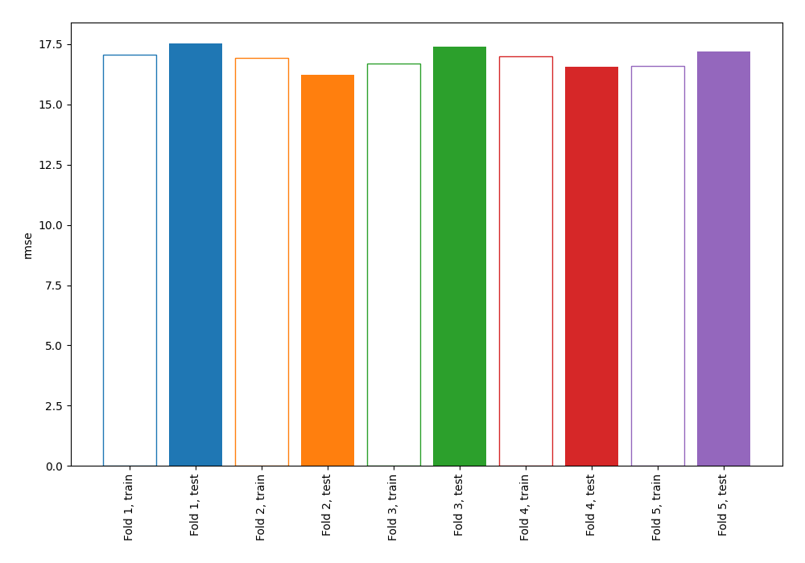
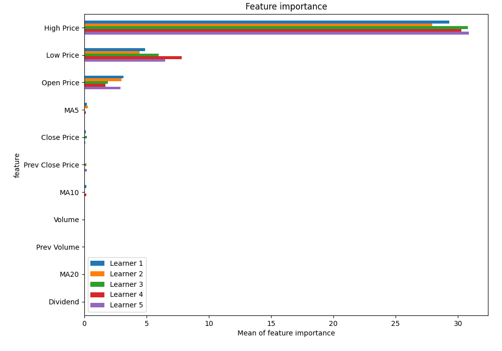
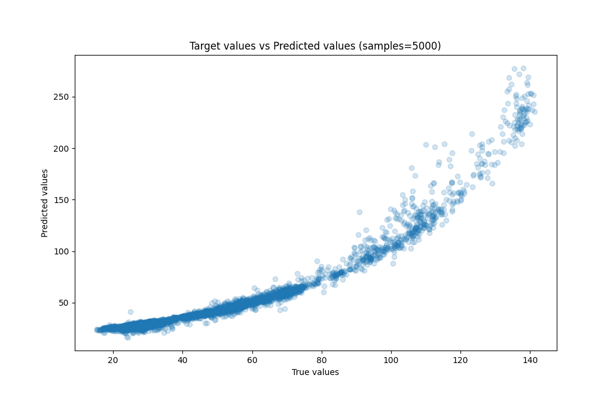
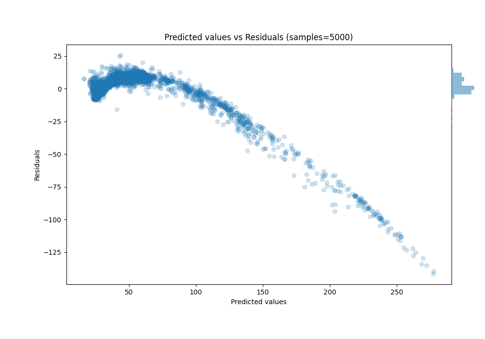

# Summary of 1_Linear

[<< Go back](../README.md)

## Linear Regression (Linear)
- **n_jobs**: -1
- **explain_level**: 1

## Validation
 - **validation_type**: kfold
 - **k_folds**: 5
 - **shuffle**: True

## Optimized metric
rmse

## Training time

3.6 seconds

### Metric details:
| Metric   |      Score |
|:---------|-----------:|
| MAE      |   7.60331  |
| MSE      | 288.63     |
| RMSE     |  16.9891   |
| R2       |   0.621808 |
| MAPE     |   0.122864 |

## Learning curves

## Coefficients
| feature          |    Learner_1 |    Learner_2 |    Learner_3 |    Learner_4 |    Learner_5 |
|:-----------------|-------------:|-------------:|-------------:|-------------:|-------------:|
| High Price       |  3.73951     |  3.80995     |  3.94638     |  3.7742      |  3.94307     |
| Dividend         |  0.103759    | -0.0109876   |  0.0976286   |  0.0627498   |  0.0931033   |
| MA10             |  0.301383    |  0.145878    |  0.143967    | -0.266769    | -0.0524538   |
| Prev Close Price |  0.154171    |  0.0976627   | -0.28874     | -0.094297    |  0.312021    |
| MA20             | -0.0367031   |  0.0721637   | -0.0882653   |  0.0843706   |  0.0399846   |
| intercept        | -0.000367276 |  3.25293e-05 | -0.000357273 | -0.000217675 | -0.000321575 |
| Prev Volume      | -0.0850623   | -0.0890301   | -0.0906643   | -0.0884892   | -0.0805307   |
| MA5              | -0.315637    | -0.371608    |  0.12597     |  0.253295    | -0.160587    |
| Volume           | -0.102551    | -0.106437    | -0.110395    | -0.107835    | -0.113075    |
| Close Price      | -0.261286    | -0.157765    | -0.308275    | -0.0984888   | -0.213169    |
| Open Price       | -1.21708     | -1.24702     | -0.971245    | -0.892508    | -1.21659     |
| Low Price        | -1.52019     | -1.51297     | -1.72487     | -1.92296     | -1.81325     |

## Permutation-based Importance

## True vs Predicted

## Predicted vs Residuals

[<< Go back](../README.md)
