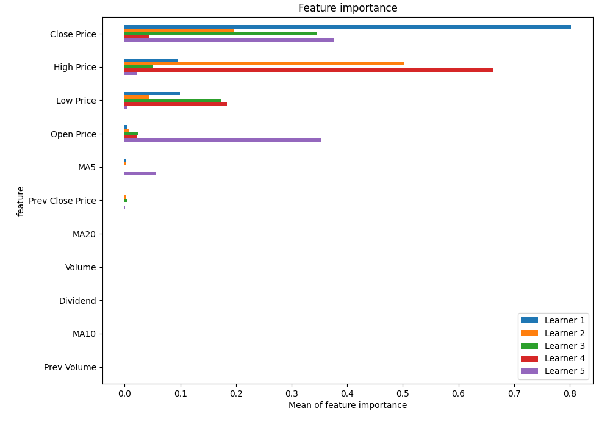

# Summary of 20_RandomForest

[<< Go back](../README.md)

## Random Forest
- **n_jobs**: -1
- **criterion**: squared_error
- **max_features**: 0.7
- **min_samples_split**: 50
- **max_depth**: 3
- **eval_metric_name**: rmse
- **explain_level**: 1

## Validation
 - **validation_type**: kfold
 - **k_folds**: 5
 - **shuffle**: True

## Optimized metric
rmse

## Training time

14.8 seconds

### Metric details:
| Metric   |      Score |
|:---------|-----------:|
| MAE      |  2.82126   |
| MSE      | 20.18      |
| RMSE     |  4.49222   |
| R2       |  0.973558  |
| MAPE     |  0.0519834 |

## Learning curves

## Permutation-based Importance

## True vs Predicted

## Predicted vs Residuals

[<< Go back](../README.md)
