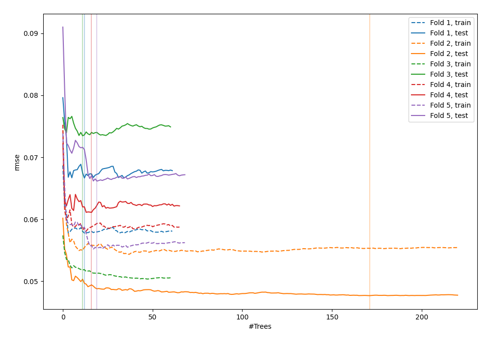
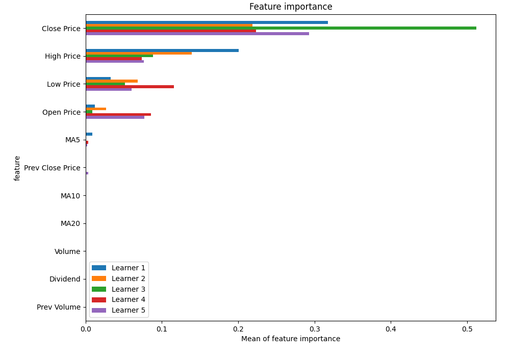
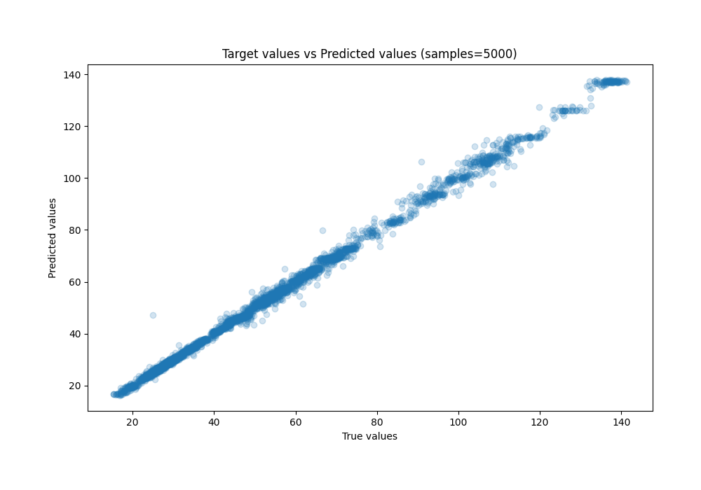
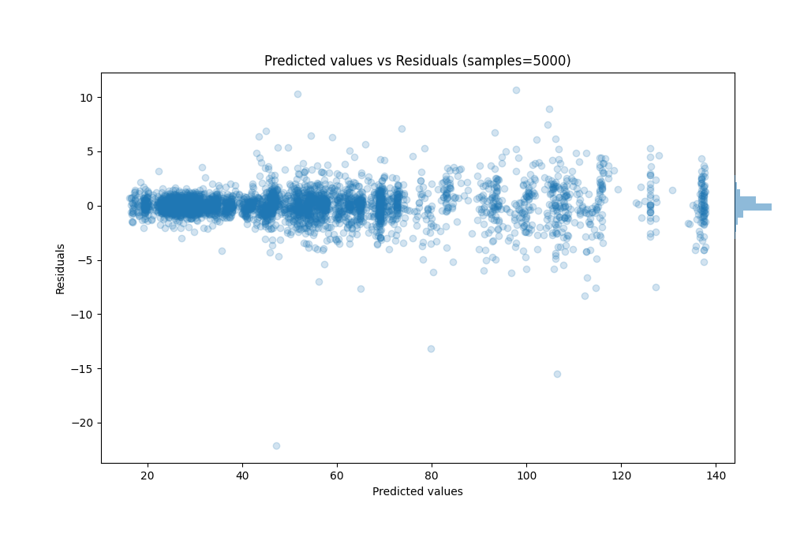

# Summary of 22_RandomForest

[<< Go back](../README.md)

## Random Forest
- **n_jobs**: -1
- **criterion**: squared_error
- **max_features**: 0.6
- **min_samples_split**: 50
- **max_depth**: 6
- **eval_metric_name**: rmse
- **explain_level**: 1

## Validation
 - **validation_type**: kfold
 - **k_folds**: 5
 - **shuffle**: True

## Optimized metric
rmse

## Training time

22.6 seconds

### Metric details:
| Metric   |     Score |
|:---------|----------:|
| MAE      | 0.713167  |
| MSE      | 1.56497   |
| RMSE     | 1.25099   |
| R2       | 0.997949  |
| MAPE     | 0.0145968 |

## Learning curves

## Permutation-based Importance

## True vs Predicted

## Predicted vs Residuals

[<< Go back](../README.md)
