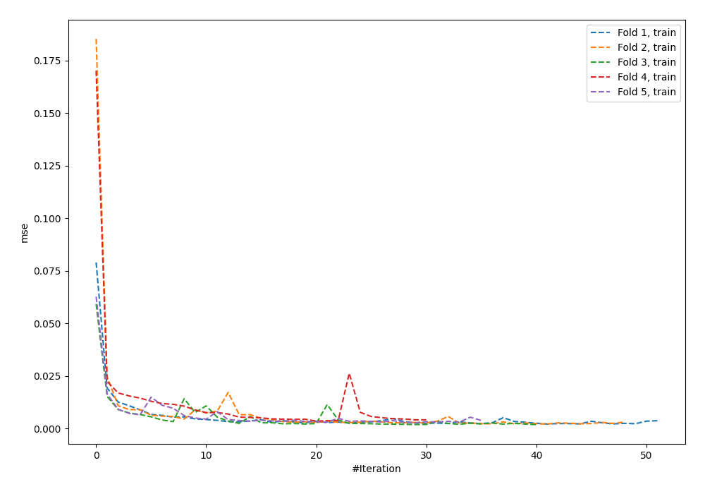
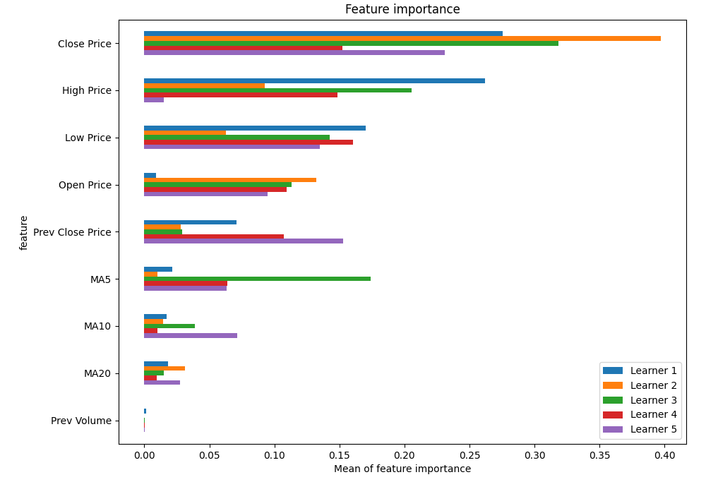
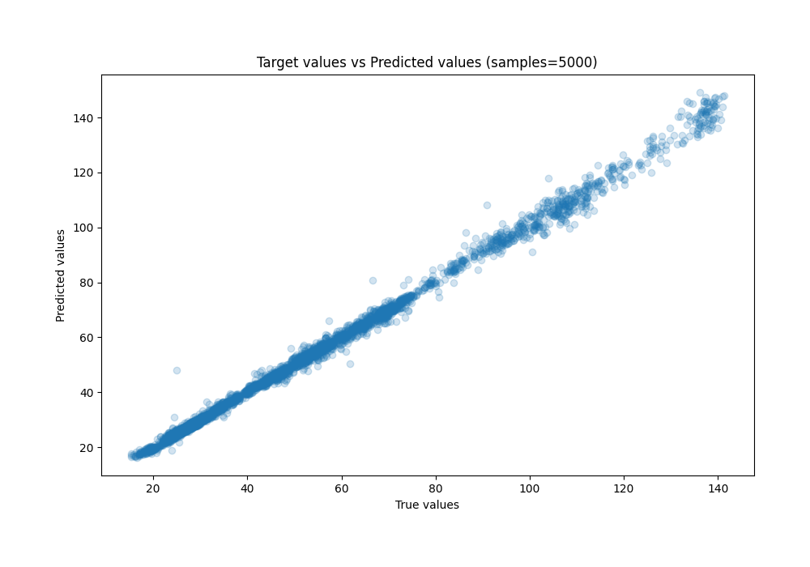
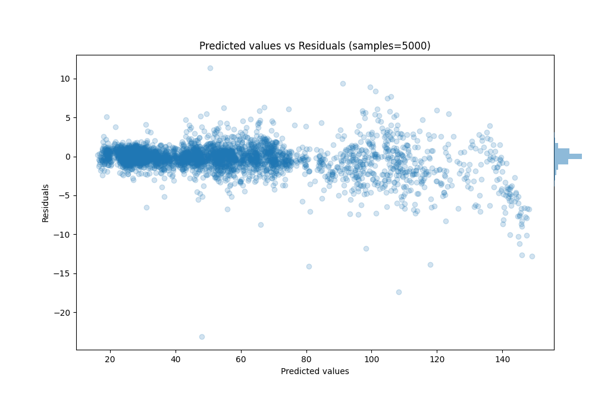

# Summary of 35_NeuralNetwork_SelectedFeatures

[<< Go back](../README.md)

## Neural Network
- **n_jobs**: -1
- **dense_1_size**: 64
- **dense_2_size**: 8
- **learning_rate**: 0.01
- **explain_level**: 1

## Validation
 - **validation_type**: kfold
 - **k_folds**: 5
 - **shuffle**: True

## Optimized metric
rmse

## Training time

13.4 seconds

### Metric details:
| Metric   |     Score |
|:---------|----------:|
| MAE      | 0.91413   |
| MSE      | 2.56896   |
| RMSE     | 1.6028    |
| R2       | 0.996634  |
| MAPE     | 0.0185931 |

## Learning curves

## Permutation-based Importance

## True vs Predicted

## Predicted vs Residuals

[<< Go back](../README.md)
