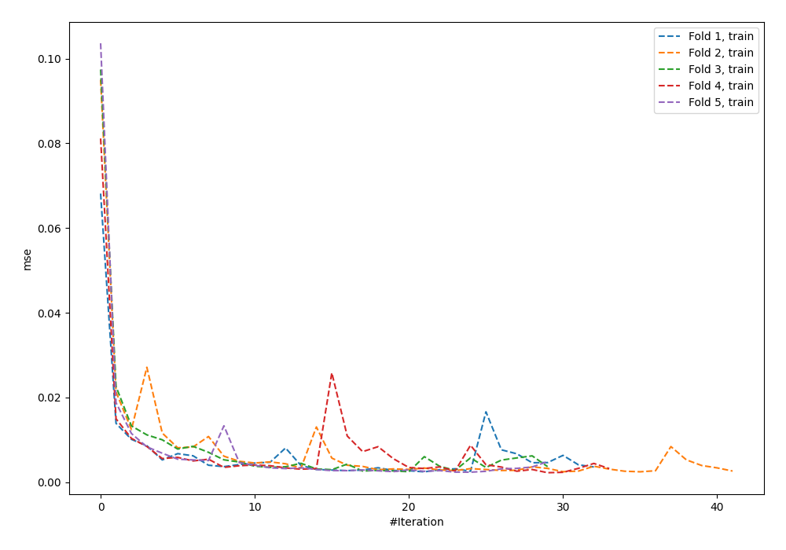
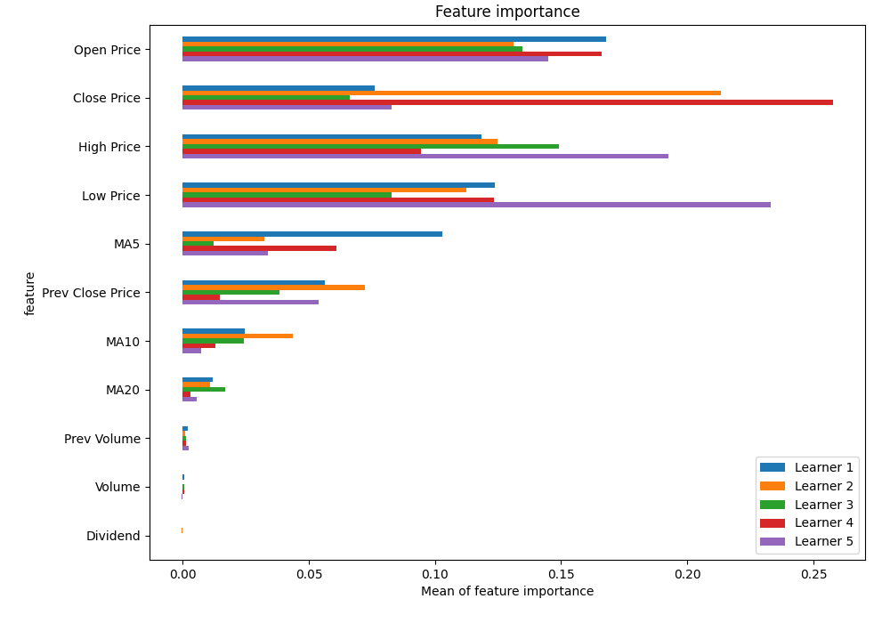
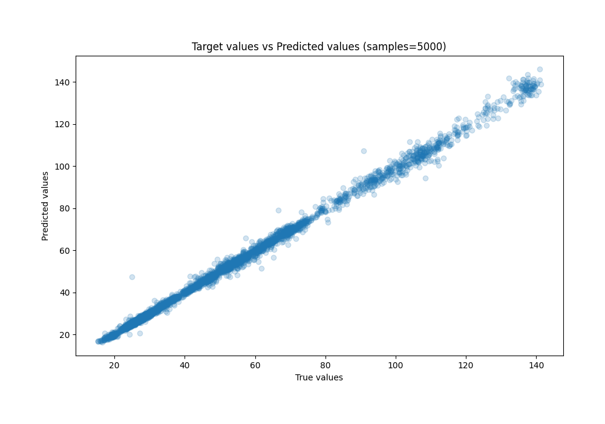
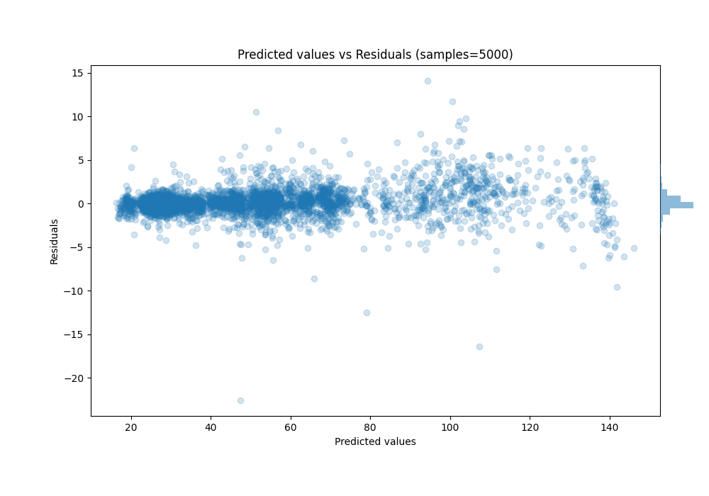

# Summary of 42_NeuralNetwork

[<< Go back](../README.md)

## Neural Network
- **n_jobs**: -1
- **dense_1_size**: 64
- **dense_2_size**: 32
- **learning_rate**: 0.01
- **explain_level**: 1

## Validation
 - **validation_type**: kfold
 - **k_folds**: 5
 - **shuffle**: True

## Optimized metric
rmse

## Training time

16.7 seconds

### Metric details:
| Metric   |     Score |
|:---------|----------:|
| MAE      | 0.848084  |
| MSE      | 2.09255   |
| RMSE     | 1.44656   |
| R2       | 0.997258  |
| MAPE     | 0.0176371 |

## Learning curves

## Permutation-based Importance

## True vs Predicted

## Predicted vs Residuals

[<< Go back](../README.md)
