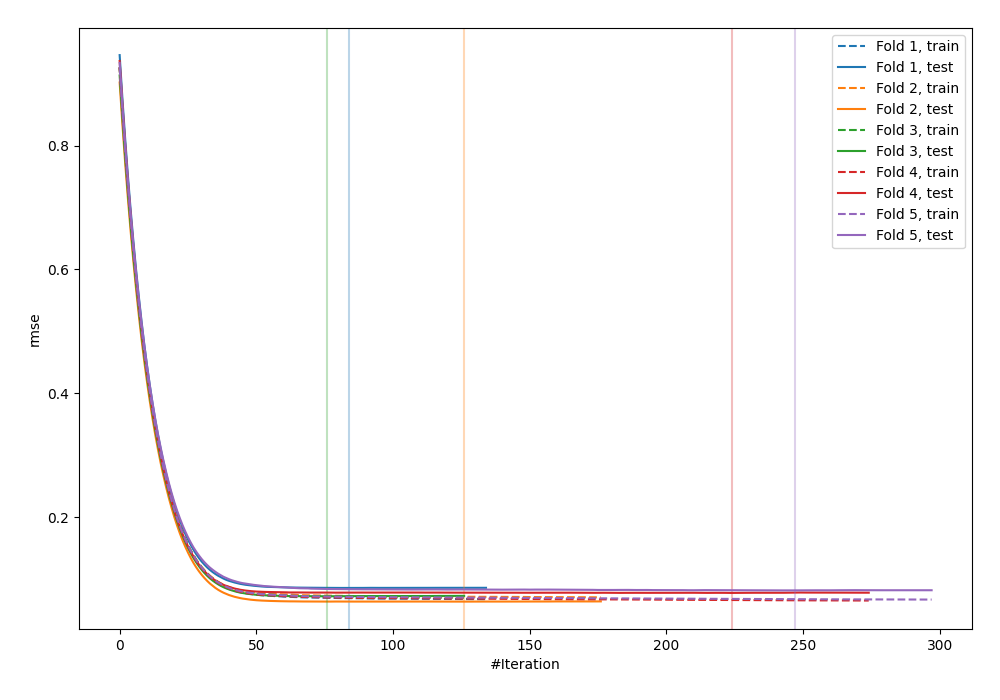
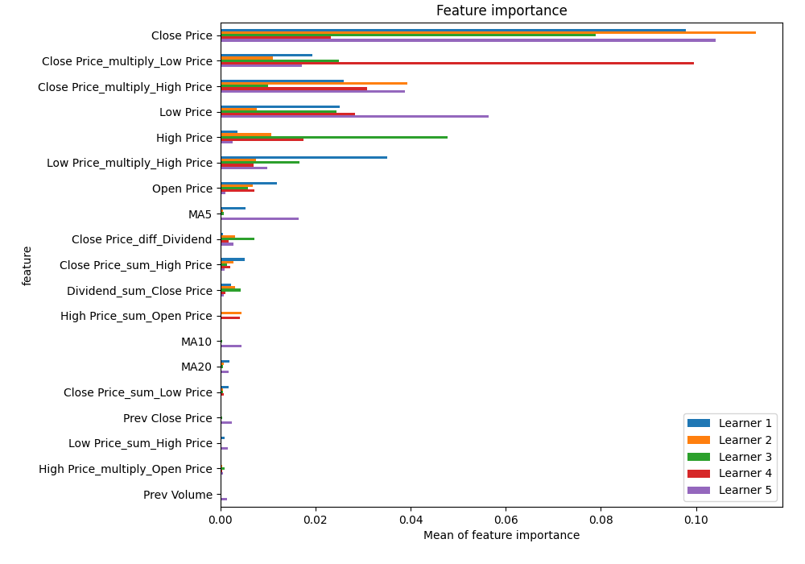
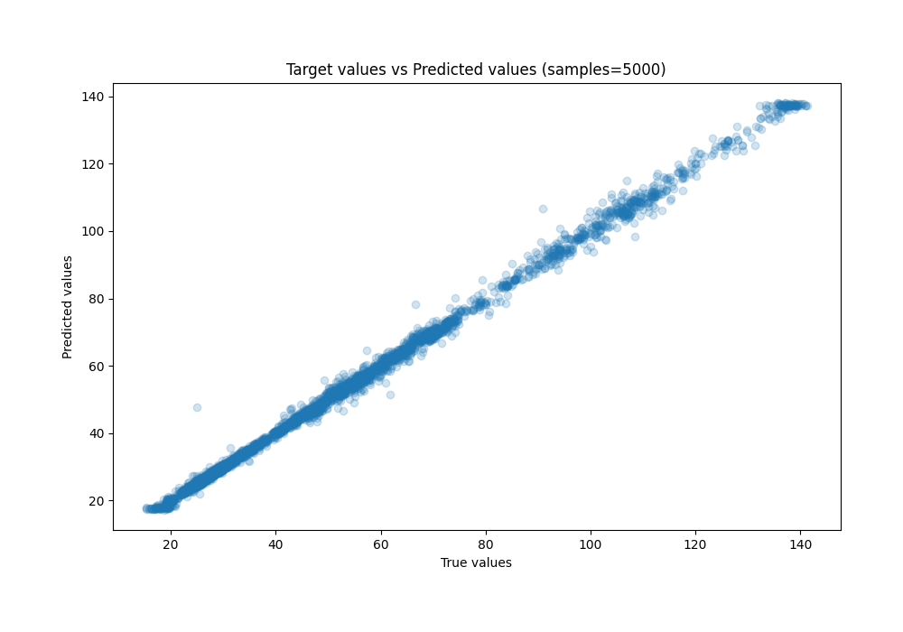
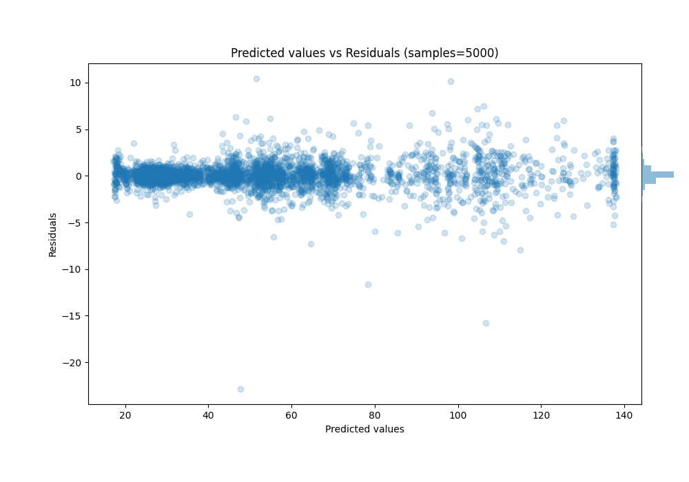

# Summary of 48_Xgboost_GoldenFeatures_SelectedFeatures

[<< Go back](../README.md)

## Extreme Gradient Boosting (Xgboost)
- **n_jobs**: -1
- **objective**: reg:squarederror
- **eta**: 0.075
- **max_depth**: 7
- **min_child_weight**: 50
- **subsample**: 0.9
- **colsample_bytree**: 0.6
- **eval_metric**: rmse
- **explain_level**: 1

## Validation
 - **validation_type**: kfold
 - **k_folds**: 5
 - **shuffle**: True

## Optimized metric
rmse

## Training time

15.0 seconds

### Metric details:
| Metric   |     Score |
|:---------|----------:|
| MAE      | 0.683692  |
| MSE      | 1.43953   |
| RMSE     | 1.1998    |
| R2       | 0.998114  |
| MAPE     | 0.0144489 |

## Learning curves

## Permutation-based Importance

## True vs Predicted

## Predicted vs Residuals

[<< Go back](../README.md)
