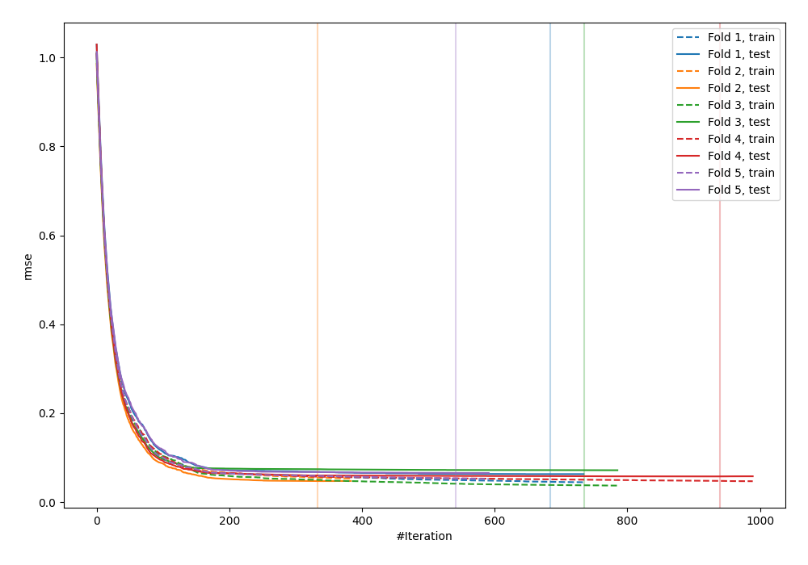
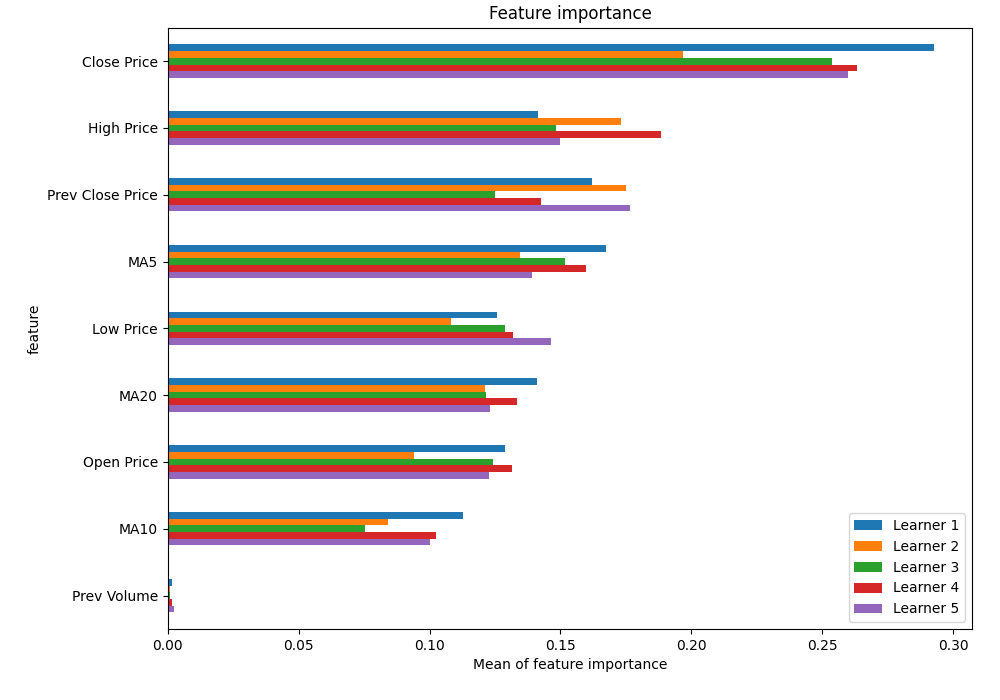
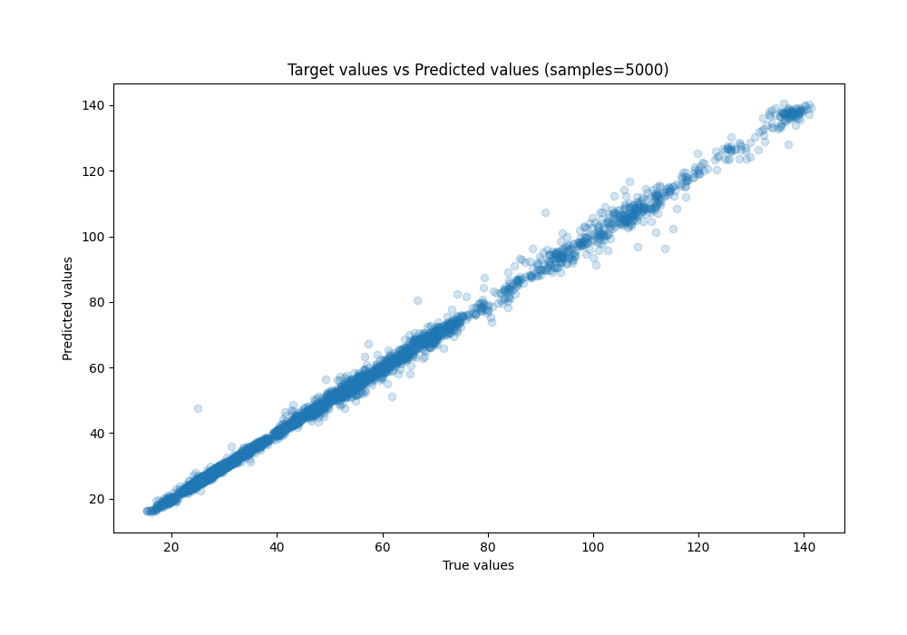
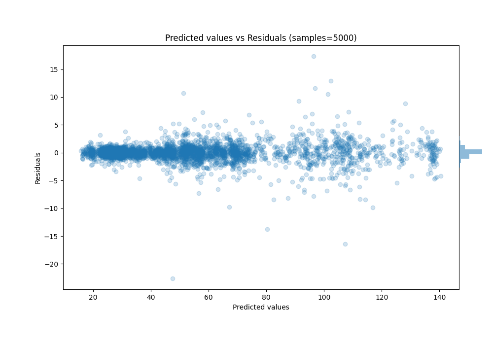

# Summary of 57_CatBoost_SelectedFeatures

[<< Go back](../README.md)

## CatBoost
- **n_jobs**: -1
- **learning_rate**: 0.05
- **depth**: 8
- **rsm**: 0.8
- **loss_function**: MAE
- **eval_metric**: RMSE
- **explain_level**: 1

## Validation
 - **validation_type**: kfold
 - **k_folds**: 5
 - **shuffle**: True

## Optimized metric
rmse

## Training time

92.6 seconds

### Metric details:
| Metric   |     Score |
|:---------|----------:|
| MAE      | 0.738238  |
| MSE      | 1.82351   |
| RMSE     | 1.35037   |
| R2       | 0.997611  |
| MAPE     | 0.0151019 |

## Learning curves

## Permutation-based Importance

## True vs Predicted

## Predicted vs Residuals

[<< Go back](../README.md)
