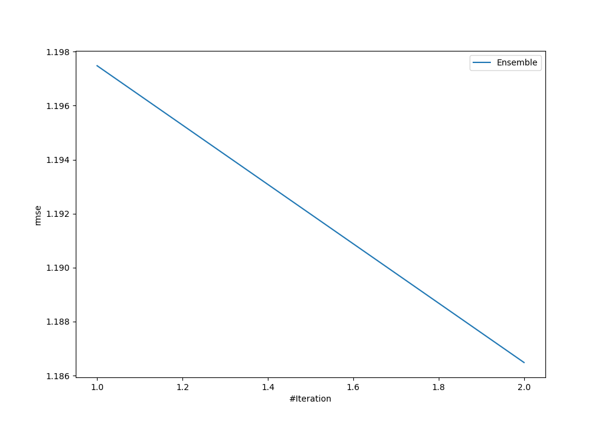
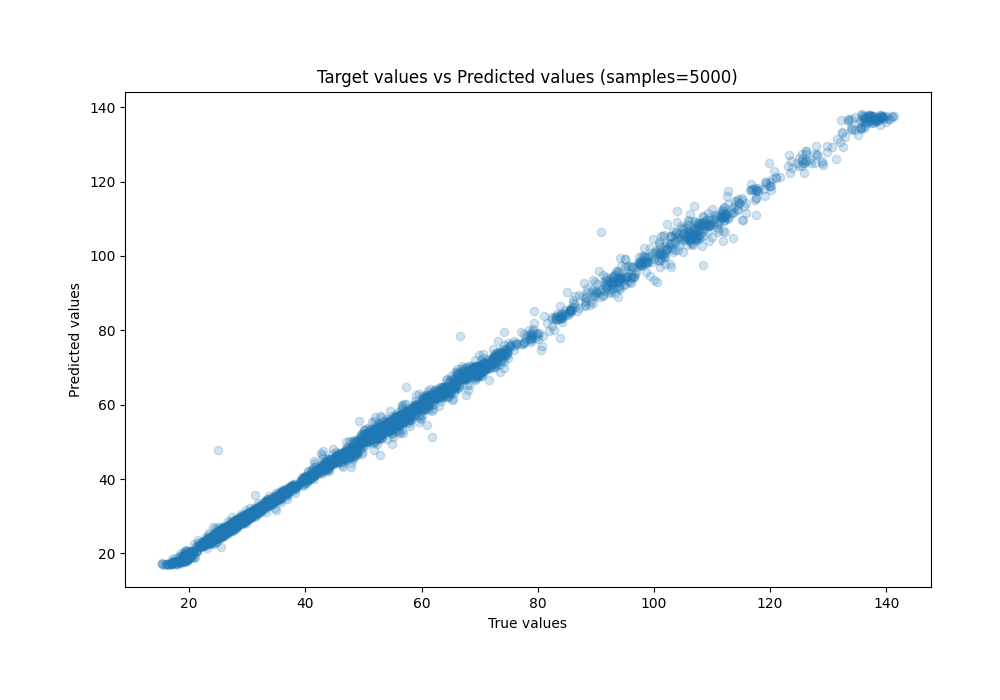
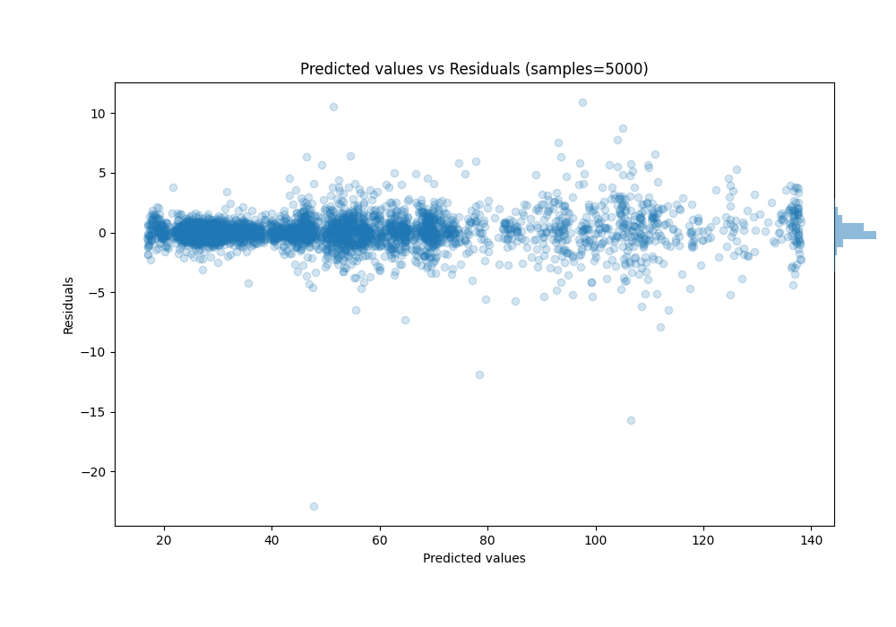

# Summary of Ensemble

[<< Go back](../README.md)

## Ensemble structure
| Model                                     |   Weight |
|:------------------------------------------|---------:|
| 11_LightGBM                               |        1 |
| 9_Xgboost_GoldenFeatures_SelectedFeatures |        1 |

### Metric details:
| Metric   |     Score |
|:---------|----------:|
| MAE      | 0.668819  |
| MSE      | 1.40775   |
| RMSE     | 1.18649   |
| R2       | 0.998155  |
| MAPE     | 0.0139965 |

## Learning curves

## True vs Predicted

## Predicted vs Residuals

[<< Go back](../README.md)
