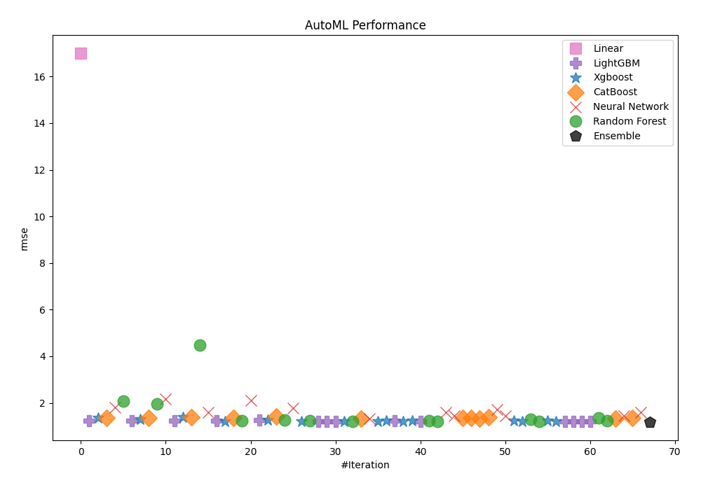
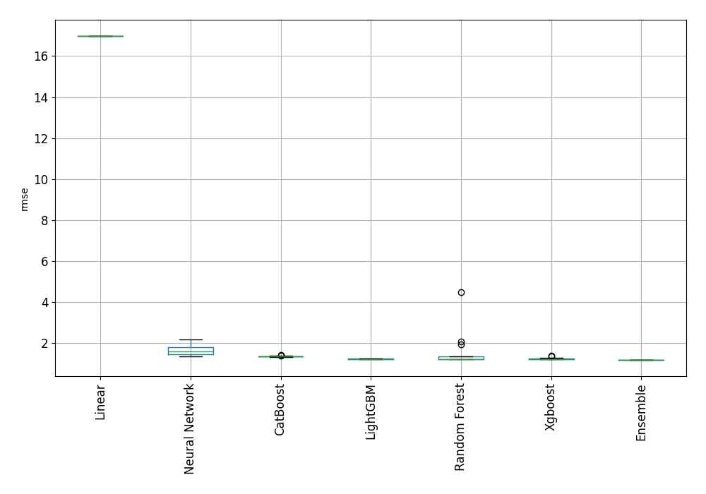
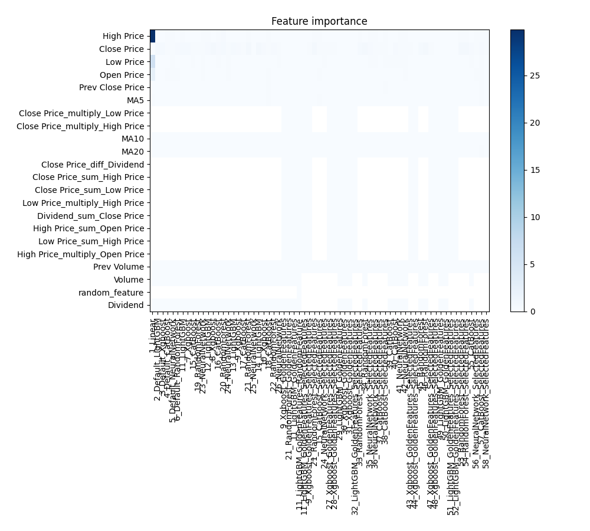
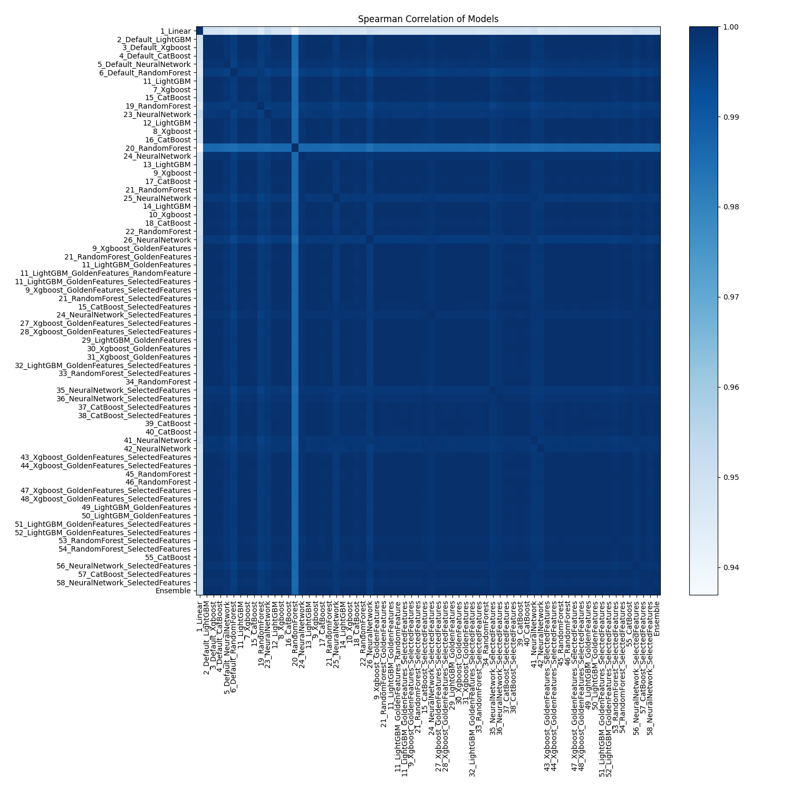

# AutoML Leaderboard

| Best model   | name                                                                                                 | model_type     | metric_type   |   metric_value |   train_time |   single_prediction_time |
|:-------------|:-----------------------------------------------------------------------------------------------------|:---------------|:--------------|---------------:|-------------:|-------------------------:|
|              | [1_Linear](1_Linear/README.md)                                                                       | Linear         | rmse          |       16.9891  |         5.13 |                   0.0477 |
|              | [2_Default_LightGBM](2_Default_LightGBM/README.md)                                                   | LightGBM       | rmse          |        1.24778 |        29.26 |                   0.125  |
|              | [3_Default_Xgboost](3_Default_Xgboost/README.md)                                                     | Xgboost        | rmse          |        1.3601  |        10.58 |                   0.1875 |
|              | [4_Default_CatBoost](4_Default_CatBoost/README.md)                                                   | CatBoost       | rmse          |        1.34864 |        33.09 |                   0.1567 |
|              | [5_Default_NeuralNetwork](5_Default_NeuralNetwork/README.md)                                         | Neural Network | rmse          |        1.80736 |        13.2  |                   0.2812 |
|              | [6_Default_RandomForest](6_Default_RandomForest/README.md)                                           | Random Forest  | rmse          |        2.08176 |        18.5  |                   0.3344 |
|              | [11_LightGBM](11_LightGBM/README.md)                                                                 | LightGBM       | rmse          |        1.22311 |        14.38 |                   0.1406 |
|              | [7_Xgboost](7_Xgboost/README.md)                                                                     | Xgboost        | rmse          |        1.28319 |        12.84 |                   0.1719 |
|              | [15_CatBoost](15_CatBoost/README.md)                                                                 | CatBoost       | rmse          |        1.34695 |       134.6  |                   0.1412 |
|              | [19_RandomForest](19_RandomForest/README.md)                                                         | Random Forest  | rmse          |        1.95175 |        21.33 |                   0.3618 |
|              | [23_NeuralNetwork](23_NeuralNetwork/README.md)                                                       | Neural Network | rmse          |        2.17171 |        12.71 |                   0.3286 |
|              | [12_LightGBM](12_LightGBM/README.md)                                                                 | LightGBM       | rmse          |        1.24648 |        13.02 |                   0.125  |
|              | [8_Xgboost](8_Xgboost/README.md)                                                                     | Xgboost        | rmse          |        1.39526 |        12.37 |                   0.2031 |
|              | [16_CatBoost](16_CatBoost/README.md)                                                                 | CatBoost       | rmse          |        1.39254 |        66.65 |                   0.1571 |
|              | [20_RandomForest](20_RandomForest/README.md)                                                         | Random Forest  | rmse          |        4.49222 |        17.65 |                   0.3467 |
|              | [24_NeuralNetwork](24_NeuralNetwork/README.md)                                                       | Neural Network | rmse          |        1.58283 |        15.16 |                   0.3443 |
|              | [13_LightGBM](13_LightGBM/README.md)                                                                 | LightGBM       | rmse          |        1.23957 |        20.88 |                   0.125  |
|              | [9_Xgboost](9_Xgboost/README.md)                                                                     | Xgboost        | rmse          |        1.21666 |        10.98 |                   0.1722 |
|              | [17_CatBoost](17_CatBoost/README.md)                                                                 | CatBoost       | rmse          |        1.34737 |        44.22 |                   0.1719 |
|              | [21_RandomForest](21_RandomForest/README.md)                                                         | Random Forest  | rmse          |        1.22277 |        34.98 |                   0.4097 |
|              | [25_NeuralNetwork](25_NeuralNetwork/README.md)                                                       | Neural Network | rmse          |        2.11851 |        21.45 |                   0.1876 |
|              | [14_LightGBM](14_LightGBM/README.md)                                                                 | LightGBM       | rmse          |        1.25859 |        34.53 |                   0.125  |
|              | [10_Xgboost](10_Xgboost/README.md)                                                                   | Xgboost        | rmse          |        1.27994 |        11.79 |                   0.1875 |
|              | [18_CatBoost](18_CatBoost/README.md)                                                                 | CatBoost       | rmse          |        1.40526 |        44.06 |                   0.1562 |
|              | [22_RandomForest](22_RandomForest/README.md)                                                         | Random Forest  | rmse          |        1.25099 |        25.3  |                   0.3933 |
|              | [26_NeuralNetwork](26_NeuralNetwork/README.md)                                                       | Neural Network | rmse          |        1.7817  |        12.74 |                   0.2813 |
|              | [9_Xgboost_GoldenFeatures](9_Xgboost_GoldenFeatures/README.md)                                       | Xgboost        | rmse          |        1.20649 |        15.09 |                   0.3464 |
|              | [21_RandomForest_GoldenFeatures](21_RandomForest_GoldenFeatures/README.md)                           | Random Forest  | rmse          |        1.22372 |        40.18 |                   0.5172 |
|              | [11_LightGBM_GoldenFeatures](11_LightGBM_GoldenFeatures/README.md)                                   | LightGBM       | rmse          |        1.20472 |        18.55 |                   0.2511 |
|              | [11_LightGBM_GoldenFeatures_RandomFeature](11_LightGBM_GoldenFeatures_RandomFeature/README.md)       | LightGBM       | rmse          |        1.20634 |        15.05 |                   0.2505 |
|              | [11_LightGBM_GoldenFeatures_SelectedFeatures](11_LightGBM_GoldenFeatures_SelectedFeatures/README.md) | LightGBM       | rmse          |        1.21336 |        17.71 |                   0.25   |
|              | [9_Xgboost_GoldenFeatures_SelectedFeatures](9_Xgboost_GoldenFeatures_SelectedFeatures/README.md)     | Xgboost        | rmse          |        1.19748 |        15.07 |                   0.3443 |
|              | [21_RandomForest_SelectedFeatures](21_RandomForest_SelectedFeatures/README.md)                       | Random Forest  | rmse          |        1.21984 |        29.35 |                   0.3616 |
|              | [15_CatBoost_SelectedFeatures](15_CatBoost_SelectedFeatures/README.md)                               | CatBoost       | rmse          |        1.33987 |        26.77 |                   0.0312 |
|              | [24_NeuralNetwork_SelectedFeatures](24_NeuralNetwork_SelectedFeatures/README.md)                     | Neural Network | rmse          |        1.33667 |         2.92 |                   0.0312 |
|              | [27_Xgboost_GoldenFeatures_SelectedFeatures](27_Xgboost_GoldenFeatures_SelectedFeatures/README.md)   | Xgboost        | rmse          |        1.20463 |         3.72 |                   0.0469 |
|              | [28_Xgboost_GoldenFeatures_SelectedFeatures](28_Xgboost_GoldenFeatures_SelectedFeatures/README.md)   | Xgboost        | rmse          |        1.22922 |         4.98 |                   0.0625 |
|              | [29_LightGBM_GoldenFeatures](29_LightGBM_GoldenFeatures/README.md)                                   | LightGBM       | rmse          |        1.2222  |        20.14 |                   0.2191 |
|              | [30_Xgboost_GoldenFeatures](30_Xgboost_GoldenFeatures/README.md)                                     | Xgboost        | rmse          |        1.20865 |        15.87 |                   0.3131 |
|              | [31_Xgboost_GoldenFeatures](31_Xgboost_GoldenFeatures/README.md)                                     | Xgboost        | rmse          |        1.23634 |        13.33 |                   0.2812 |
|              | [32_LightGBM_GoldenFeatures_SelectedFeatures](32_LightGBM_GoldenFeatures_SelectedFeatures/README.md) | LightGBM       | rmse          |        1.20821 |        23.6  |                   0.2506 |
|              | [33_RandomForest_SelectedFeatures](33_RandomForest_SelectedFeatures/README.md)                       | Random Forest  | rmse          |        1.22936 |        27.01 |                   0.417  |
|              | [34_RandomForest](34_RandomForest/README.md)                                                         | Random Forest  | rmse          |        1.20266 |        31.11 |                   0.361  |
|              | [35_NeuralNetwork_SelectedFeatures](35_NeuralNetwork_SelectedFeatures/README.md)                     | Neural Network | rmse          |        1.6028  |        15.82 |                   0.2969 |
|              | [36_NeuralNetwork_SelectedFeatures](36_NeuralNetwork_SelectedFeatures/README.md)                     | Neural Network | rmse          |        1.4426  |        22.54 |                   0.3281 |
|              | [37_CatBoost_SelectedFeatures](37_CatBoost_SelectedFeatures/README.md)                               | CatBoost       | rmse          |        1.34869 |        61.12 |                   0.1563 |
|              | [38_CatBoost_SelectedFeatures](38_CatBoost_SelectedFeatures/README.md)                               | CatBoost       | rmse          |        1.34102 |       140.55 |                   0.1564 |
|              | [39_CatBoost](39_CatBoost/README.md)                                                                 | CatBoost       | rmse          |        1.32152 |        64.63 |                   0.103  |
|              | [40_CatBoost](40_CatBoost/README.md)                                                                 | CatBoost       | rmse          |        1.37993 |       148.18 |                   0.033  |
|              | [41_NeuralNetwork](41_NeuralNetwork/README.md)                                                       | Neural Network | rmse          |        1.71512 |        12.88 |                   0.295  |
|              | [42_NeuralNetwork](42_NeuralNetwork/README.md)                                                       | Neural Network | rmse          |        1.44656 |        19.36 |                   0.3132 |
|              | [43_Xgboost_GoldenFeatures_SelectedFeatures](43_Xgboost_GoldenFeatures_SelectedFeatures/README.md)   | Xgboost        | rmse          |        1.23171 |        15.07 |                   0.3012 |
|              | [44_Xgboost_GoldenFeatures_SelectedFeatures](44_Xgboost_GoldenFeatures_SelectedFeatures/README.md)   | Xgboost        | rmse          |        1.19884 |        15.58 |                   0.3129 |
|              | [45_RandomForest](45_RandomForest/README.md)                                                         | Random Forest  | rmse          |        1.29434 |        34.05 |                   0.4432 |
|              | [46_RandomForest](46_RandomForest/README.md)                                                         | Random Forest  | rmse          |        1.20425 |        33.5  |                   0.402  |
|              | [47_Xgboost_GoldenFeatures_SelectedFeatures](47_Xgboost_GoldenFeatures_SelectedFeatures/README.md)   | Xgboost        | rmse          |        1.23548 |        16.01 |                   0.3154 |
|              | [48_Xgboost_GoldenFeatures_SelectedFeatures](48_Xgboost_GoldenFeatures_SelectedFeatures/README.md)   | Xgboost        | rmse          |        1.1998  |        18.23 |                   0.2975 |
|              | [49_LightGBM_GoldenFeatures](49_LightGBM_GoldenFeatures/README.md)                                   | LightGBM       | rmse          |        1.21274 |        19.29 |                   0.2439 |
|              | [50_LightGBM_GoldenFeatures](50_LightGBM_GoldenFeatures/README.md)                                   | LightGBM       | rmse          |        1.21719 |        16.38 |                   0.2098 |
|              | [51_LightGBM_GoldenFeatures_SelectedFeatures](51_LightGBM_GoldenFeatures_SelectedFeatures/README.md) | LightGBM       | rmse          |        1.20541 |        22.89 |                   0.2529 |
|              | [52_LightGBM_GoldenFeatures_SelectedFeatures](52_LightGBM_GoldenFeatures_SelectedFeatures/README.md) | LightGBM       | rmse          |        1.20502 |        21.42 |                   0.2541 |
|              | [53_RandomForest_SelectedFeatures](53_RandomForest_SelectedFeatures/README.md)                       | Random Forest  | rmse          |        1.34231 |        29.67 |                   0.3797 |
|              | [54_RandomForest_SelectedFeatures](54_RandomForest_SelectedFeatures/README.md)                       | Random Forest  | rmse          |        1.2272  |        30.5  |                   0.3746 |
|              | [55_CatBoost](55_CatBoost/README.md)                                                                 | CatBoost       | rmse          |        1.33727 |        75.1  |                   0.127  |
|              | [56_NeuralNetwork_SelectedFeatures](56_NeuralNetwork_SelectedFeatures/README.md)                     | Neural Network | rmse          |        1.44719 |        16.7  |                   0.2993 |
|              | [57_CatBoost_SelectedFeatures](57_CatBoost_SelectedFeatures/README.md)                               | CatBoost       | rmse          |        1.35037 |        95.66 |                   0.1729 |
|              | [58_NeuralNetwork_SelectedFeatures](58_NeuralNetwork_SelectedFeatures/README.md)                     | Neural Network | rmse          |        1.58205 |        14.01 |                   0.2973 |
| **the best** | [Ensemble](Ensemble/README.md)                                                                       | Ensemble       | rmse          |        1.18649 |         0.76 |                   0.3899 |

### AutoML Performance

### AutoML Performance Boxplot

### Features Importance

### Spearman Correlation of Models

