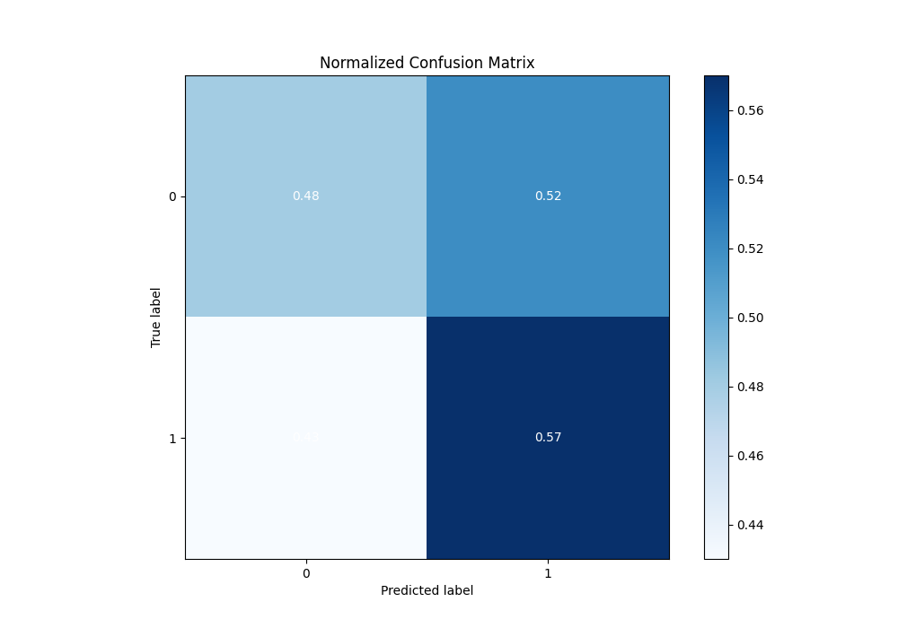

# Summary of 10_Xgboost

[<< Go back](../README.md)

## Extreme Gradient Boosting (Xgboost)
- **n_jobs**: -1
- **objective**: binary:logistic
- **eta**: 0.15
- **max_depth**: 8
- **min_child_weight**: 50
- **subsample**: 0.6
- **colsample_bytree**: 0.6
- **eval_metric**: logloss
- **explain_level**: 1

## Validation
 - **validation_type**: kfold
 - **k_folds**: 5
 - **shuffle**: True
 - **stratify**: True

## Optimized metric
logloss

## Training time

5.9 seconds

## Metric details
|           |     score |   threshold |
|:----------|----------:|------------:|
| logloss   | 0.691368  |  nan        |
| auc       | 0.531808  |  nan        |
| f1        | 0.670144  |    0.403327 |
| accuracy  | 0.526158  |    0.500189 |
| precision | 0.574879  |    0.561039 |
| recall    | 1         |    0.318862 |
| mcc       | 0.0563703 |    0.513671 |

## Metric details with threshold from accuracy metric
|           |     score |   threshold |
|:----------|----------:|------------:|
| logloss   | 0.691368  |  nan        |
| auc       | 0.531808  |  nan        |
| f1        | 0.548258  |    0.500189 |
| accuracy  | 0.526158  |    0.500189 |
| precision | 0.526701  |    0.500189 |
| recall    | 0.571655  |    0.500189 |
| mcc       | 0.0519868 |    0.500189 |

## Confusion matrix (at threshold=0.500189)
|              |   Predicted as 0 |   Predicted as 1 |
|:-------------|-----------------:|-----------------:|
| Labeled as 0 |             1195 |             1294 |
| Labeled as 1 |             1079 |             1440 |

## Learning curves

## Permutation-based Importance

## Confusion Matrix

## Normalized Confusion Matrix

## ROC Curve

## Kolmogorov-Smirnov Statistic

## Precision-Recall Curve

## Calibration Curve

## Cumulative Gains Curve

## Lift Curve

[<< Go back](../README.md)
