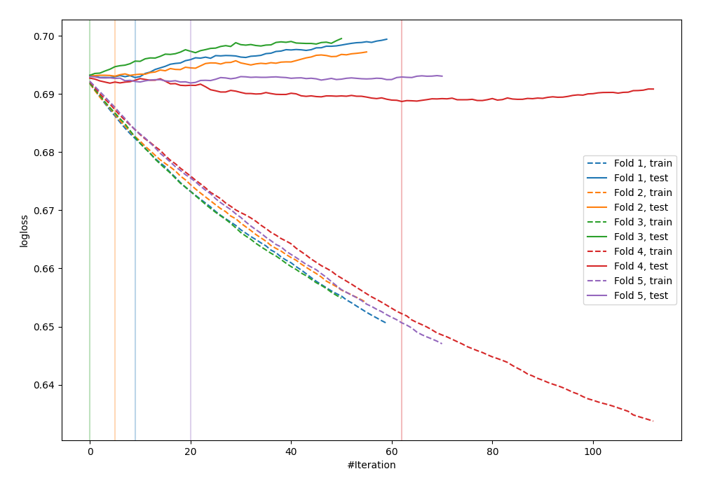
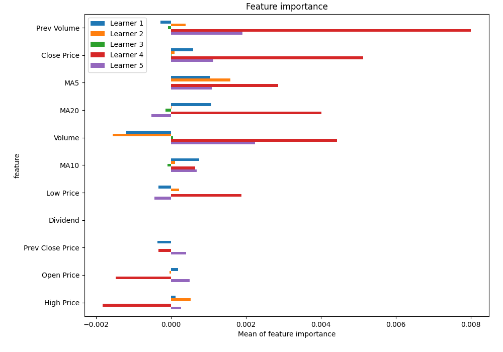
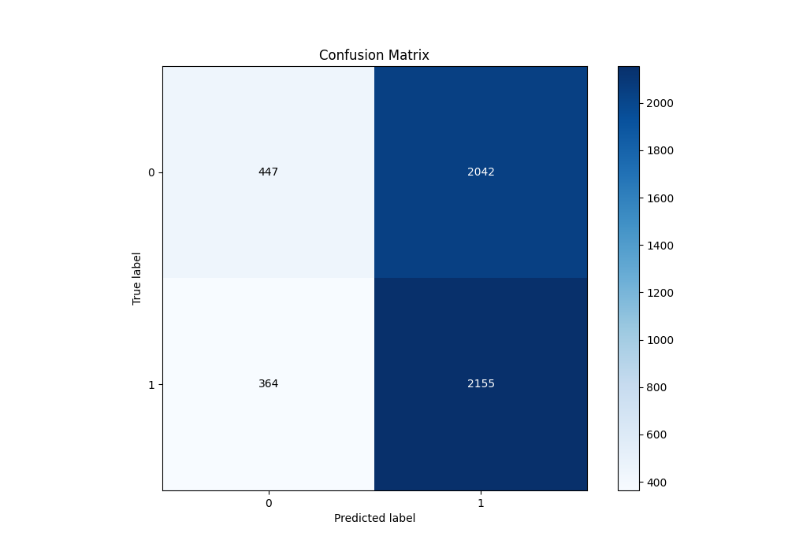
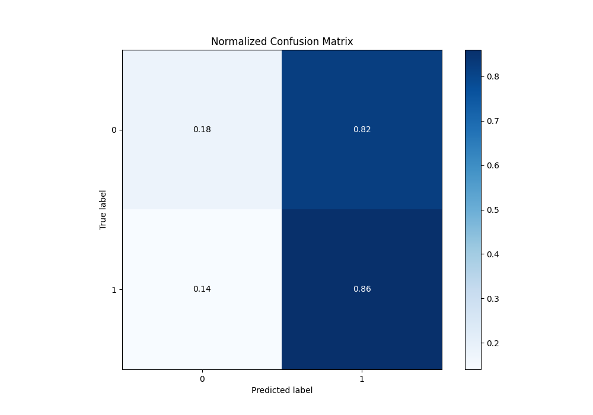
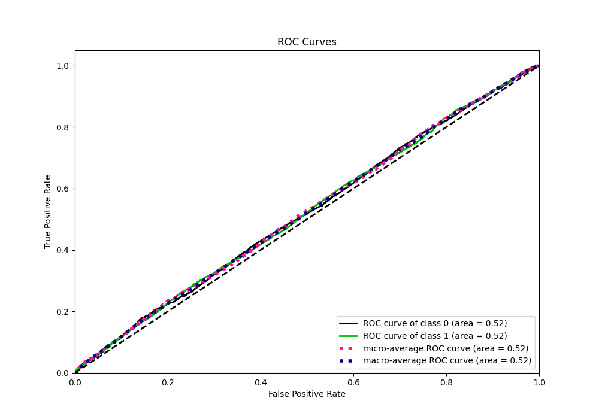
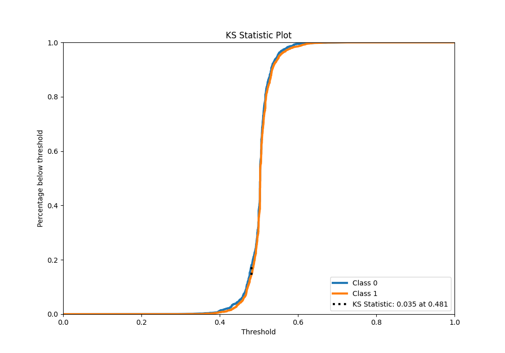
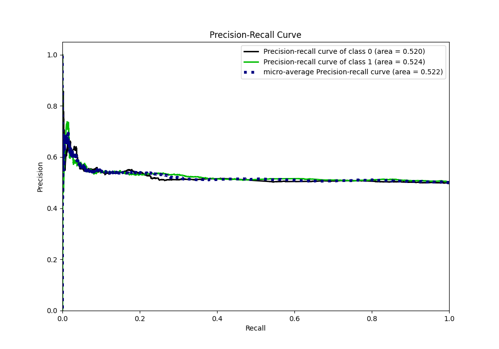
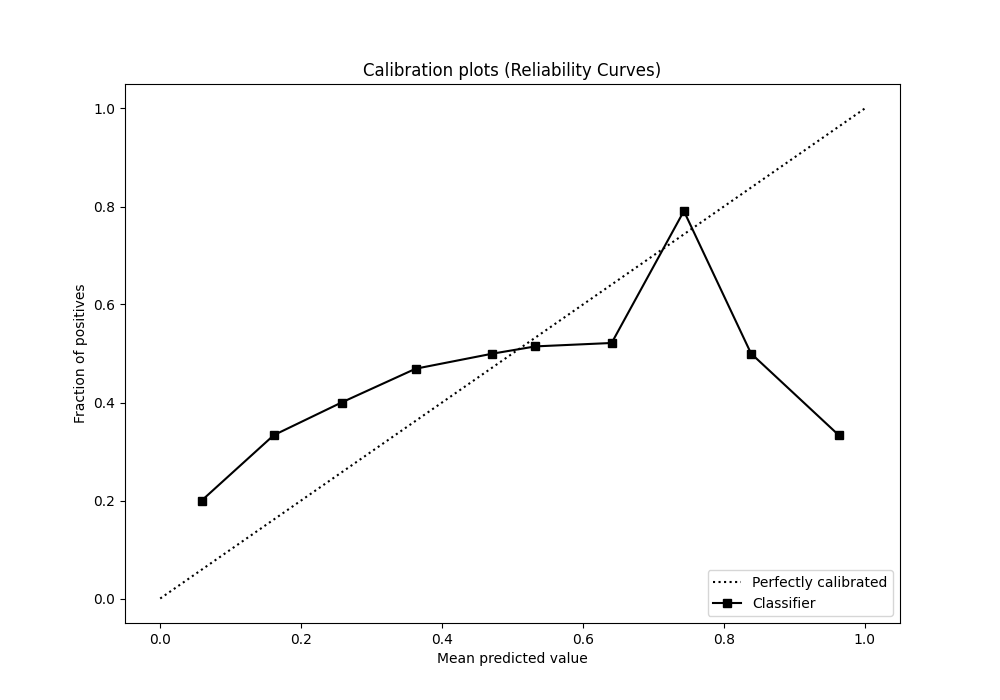
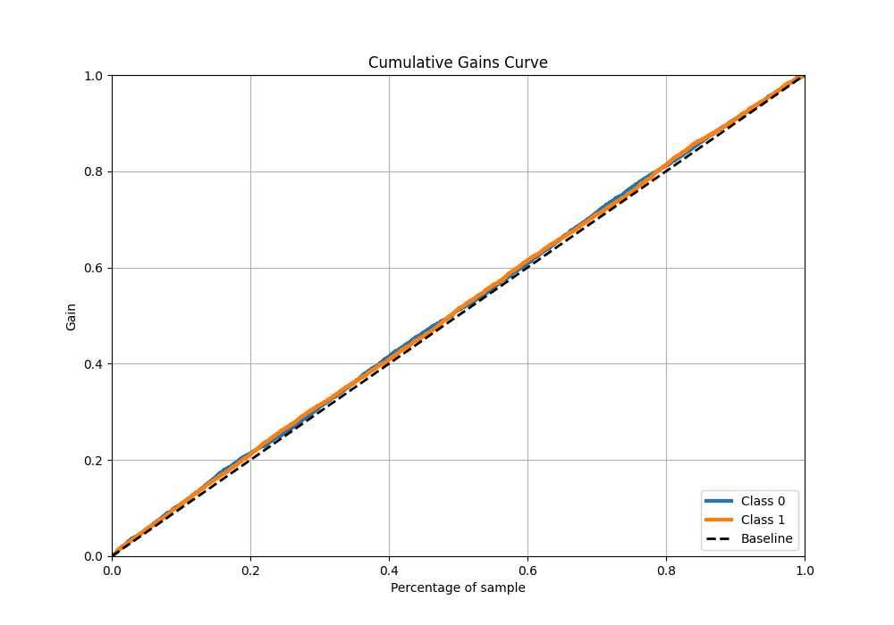
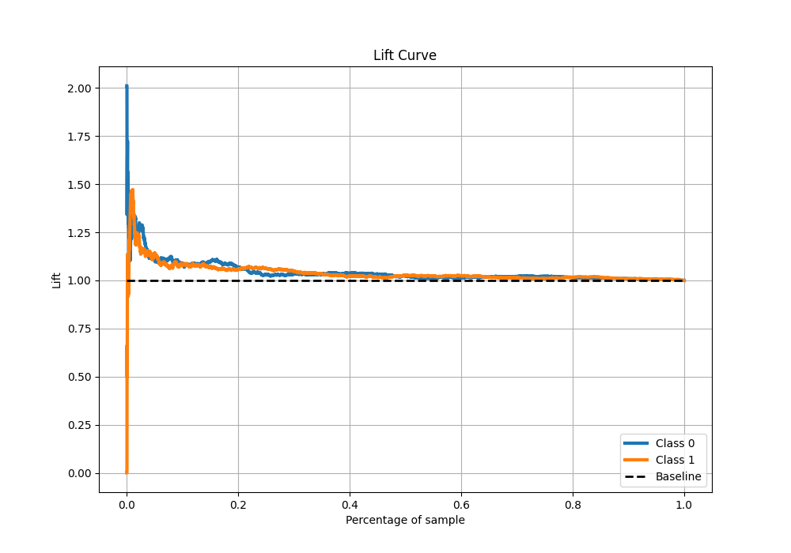

# Summary of 11_LightGBM

[<< Go back](../README.md)

## LightGBM
- **n_jobs**: -1
- **objective**: binary
- **num_leaves**: 15
- **learning_rate**: 0.05
- **feature_fraction**: 0.8
- **bagging_fraction**: 0.5
- **min_data_in_leaf**: 50
- **metric**: binary_logloss
- **custom_eval_metric_name**: None
- **explain_level**: 1

## Validation
 - **validation_type**: kfold
 - **k_folds**: 5
 - **shuffle**: True
 - **stratify**: True

## Optimized metric
logloss

## Training time

18.9 seconds

## Metric details
|           |     score |   threshold |
|:----------|----------:|------------:|
| logloss   | 0.691933  |  nan        |
| auc       | 0.520655  |  nan        |
| f1        | 0.669324  |    0.26259  |
| accuracy  | 0.519569  |    0.480874 |
| precision | 0.701754  |    0.595527 |
| recall    | 1         |    0.26259  |
| mcc       | 0.0476223 |    0.480874 |

## Metric details with threshold from accuracy metric
|           |     score |   threshold |
|:----------|----------:|------------:|
| logloss   | 0.691933  |  nan        |
| auc       | 0.520655  |  nan        |
| f1        | 0.641751  |    0.480874 |
| accuracy  | 0.519569  |    0.480874 |
| precision | 0.513462  |    0.480874 |
| recall    | 0.855498  |    0.480874 |
| mcc       | 0.0476223 |    0.480874 |

## Confusion matrix (at threshold=0.480874)
|              |   Predicted as 0 |   Predicted as 1 |
|:-------------|-----------------:|-----------------:|
| Labeled as 0 |              447 |             2042 |
| Labeled as 1 |              364 |             2155 |

## Learning curves

## Permutation-based Importance

## Confusion Matrix

## Normalized Confusion Matrix

## ROC Curve

## Kolmogorov-Smirnov Statistic

## Precision-Recall Curve

## Calibration Curve

## Cumulative Gains Curve

## Lift Curve

[<< Go back](../README.md)
